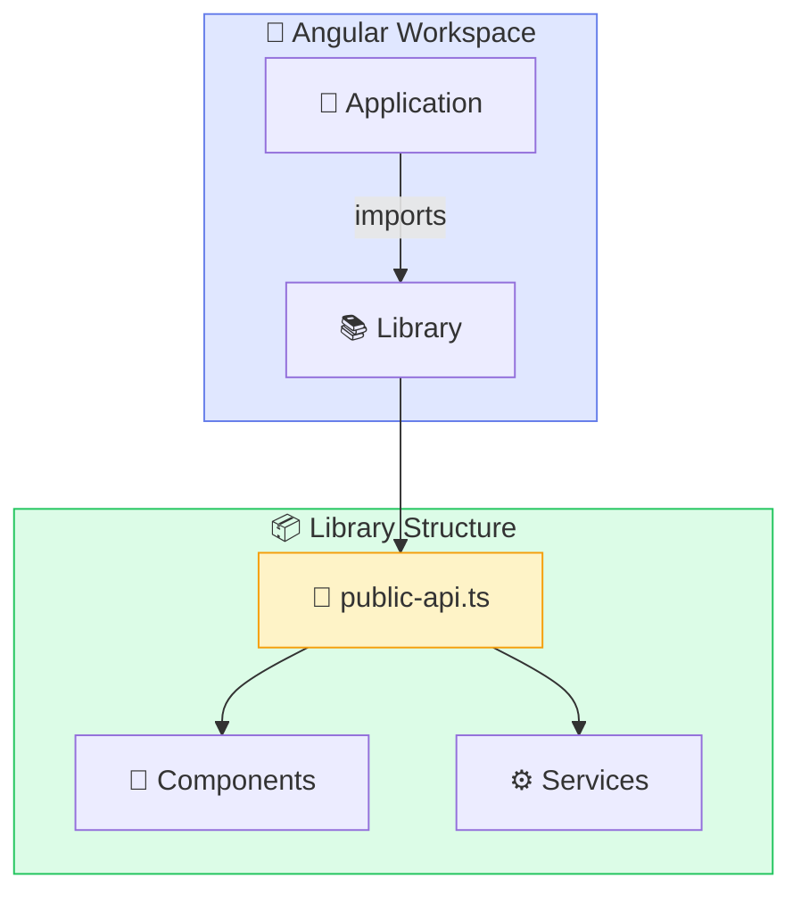
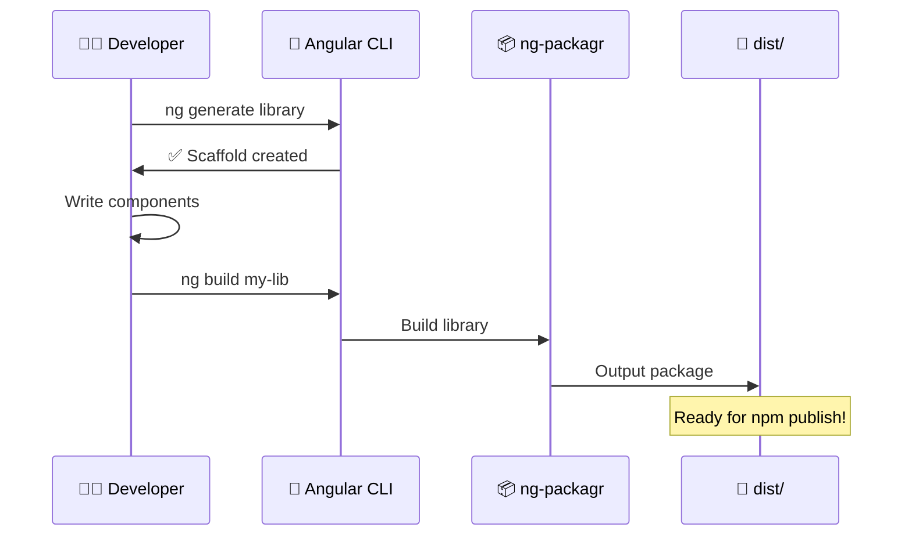
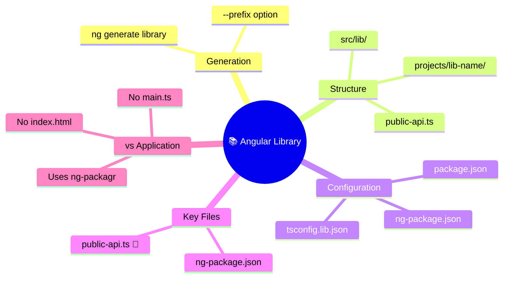

# 🛠️ Use Case 1: Angular Library Basics

> **💡 Lightbulb Moment**: A library is a **reusable package** with `public-api.ts` as its front door!

---

## 🔍 How It Works (The Concept)

An Angular library is a **shareable collection** of components, services, directives, and pipes packaged for distribution. Unlike applications, libraries:
- Cannot run standalone
- Are consumed by applications
- Use **peer dependencies** (consumers provide Angular)
- Export a **public API** defining what's accessible

### Default Behavior (No Library)
Copy-paste code between projects, leading to:
- ❌ Duplication
- ❌ Version inconsistencies
- ❌ No encapsulation

### Optimized Behavior (With Library)
Single source of truth, installed via npm:
- ✅ One codebase, many consumers
- ✅ Versioned releases
- ✅ Clean API boundaries



---

## 🚀 Step-by-Step Implementation Guide

### Step 1: Generate the Library

```bash
# 🛡️ CRITICAL: Run in workspace root
ng generate library my-ui-kit --prefix=ui
```

### Step 2: Understand the Generated Structure

```
projects/my-ui-kit/
├── src/
│   ├── lib/                    # Your library code
│   │   ├── my-ui-kit.component.ts
│   │   ├── my-ui-kit.service.ts
│   │   └── my-ui-kit.module.ts
│   └── public-api.ts           # 🔑 Entry point
├── ng-package.json             # ng-packagr config
├── package.json                # npm metadata
└── tsconfig.lib.json
```

### Step 3: Configure public-api.ts

```typescript
// 🔑 projects/my-ui-kit/src/public-api.ts
// 🛡️ CRITICAL: Only export what consumers should use!

export * from './lib/button/button.component';
export * from './lib/card/card.component';
export * from './lib/my-ui-kit.service';
```

### Step 4: Configure package.json

```json
{
  "name": "@myorg/my-ui-kit",      // Scoped name
  "version": "1.0.0",
  "peerDependencies": {
    "@angular/common": "^17.0.0",  // 🛡️ Consumer provides
    "@angular/core": "^17.0.0"
  }
}
```

### Step 5: Build the Library

```bash
ng build my-ui-kit
# Output: dist/my-ui-kit/
```



---

## 🐛 Common Pitfalls & Debugging

### ❌ Bad: Forgetting to Export

```typescript
// public-api.ts - BROKEN
export * from './lib/my-ui-kit.module';
// Missing: button component not exported!
```

**Result**: `Can't resolve '@myorg/my-ui-kit/button'`

### ✅ Good: Complete Exports

```typescript
// public-api.ts - WORKS
export * from './lib/my-ui-kit.module';
export * from './lib/button/button.component';  // 🛡️ Include all public items
export * from './lib/card/card.component';
```

### ❌ Bad: Regular Dependencies

```json
{
  "dependencies": {
    "@angular/core": "^17.0.0"  // ❌ Wrong! Causes duplicate Angular
  }
}
```

### ✅ Good: Peer Dependencies

```json
{
  "peerDependencies": {
    "@angular/core": "^17.0.0"  // ✅ Consumer provides Angular
  }
}
```

---

## ⚡ Performance & Architecture

### Performance Benefits
| Aspect | Impact |
|--------|--------|
| Tree-shaking | Only used exports are bundled |
| Lazy loading | Libraries can be code-split |
| Caching | npm caches dependencies |

### Architecture Fit

```
Enterprise Architecture:
├── @myorg/ui-kit          # Shared UI components
├── @myorg/data-access     # HTTP services, state
├── @myorg/utils           # Helper functions
└── Applications
    ├── customer-portal    # Consumes all libraries
    └── admin-dashboard    # Consumes all libraries
```

---

## 🌍 Real World Use Cases

1. **Design System**: Shared buttons, cards, modals across all company apps
2. **API Client**: Typed HTTP services for your backend
3. **Utilities**: Date formatting, validation, auth helpers

---

### 📦 Data Flow Summary (Visual Box Diagram)

```
┌─────────────────────────────────────────────────────────────┐
│  ANGULAR LIBRARY: SHAREABLE PACKAGE                         │
│                                                             │
│   LIBRARY STRUCTURE:                                        │
│   ┌───────────────────────────────────────────────────────┐ │
│   │ projects/my-ui-kit/                                   │ │
│   │ ├── src/                                              │ │
│   │ │   ├── lib/                   # Your code            │ │
│   │ │   │   ├── button.component.ts                       │ │
│   │ │   │   └── card.component.ts                         │ │
│   │ │   └── public-api.ts          # 🔑 Entry point       │ │
│   │ ├── package.json               # npm metadata         │ │
│   │ └── ng-package.json            # ng-packagr config    │ │
│   └───────────────────────────────────────────────────────┘ │
│                                                             │
│   PUBLIC-API.TS (the front door):                           │
│   ┌───────────────────────────────────────────────────────┐ │
│   │ export * from './lib/button/button.component';        │ │
│   │ export * from './lib/card/card.component';            │ │
│   │ // ONLY export what consumers should use!             │ │
│   └───────────────────────────────────────────────────────┘ │
│                                                             │
│   PEER DEPENDENCIES (consumer provides):                    │
│   ┌───────────────────────────────────────────────────────┐ │
│   │ "peerDependencies": {                                 │ │
│   │   "@angular/core": "^17.0.0"  // Not bundled, consumer provides│ │
│   │ }                                                     │ │
│   └───────────────────────────────────────────────────────┘ │
└─────────────────────────────────────────────────────────────┘
```

> **Key Takeaway**: `public-api.ts` = front door. Use `peerDependencies` to avoid duplicate Angular!

---

## 🧱 LEGO Box Analogy (Easy to Remember!)

Think of an Angular Library like a **LEGO box**:

| Concept | LEGO Analogy | Memory Trick |
|---------|-------------|--------------|
| **Library** | 📦 **LEGO Box**: A package containing reusable pieces | **"One box, many creations"** |
| **public-api.ts** | 🏷️ **Box Label**: Shows what's inside (visible to buyers) | **"The front door"** |
| **Components** | 🧱 **LEGO Bricks**: Individual reusable pieces | **"Build blocks"** |
| **Application** | 🏰 **Your Creation**: The castle YOU build using bricks | **"Final product"** |
| **peerDependencies** | 🔌 **"Batteries not included"**: Consumer provides Angular | **"You supply the power"** |

### 📖 Story to Remember:

> 🧱 **The LEGO Factory**
>
> Imagine LEGO (library creator) and kids (app developers):
>
> **Library Creator (LEGO Factory):**
> ```
> 1. Design new bricks (create components)
> 2. Put them in a box (build library)
> 3. Print the label (public-api.ts)
> 4. Ship to stores (npm publish)
> ```
>
> **App Developer (Kid building castle):**
> ```
> 1. Buy the LEGO box (npm install)
> 2. Open and read instructions (import components)
> 3. Build your castle (use in app)
> 4. Show your friends! (deploy)
> ```

### 🎯 Quick Reference:
```
📦 Library   = LEGO Box (reusable package)
🏷️ public-api = Box Label (what's available)
🧱 Component  = Individual Brick (reusable piece)
🏰 App        = Your Creation (uses the bricks)
```

---

## ❓ Interview & Concept Questions

| # | Question | Answer |
|---|----------|--------|
| 1 | What is public-api.ts? | Entry point that defines what the library exports |
| 2 | Why use peerDependencies? | Prevents duplicate Angular instances |
| 3 | How to generate a library? | `ng generate library my-lib` |
| 4 | Library vs Application? | Library can't run alone, outputs npm package |
| 5 | What is ng-packagr? | Tool that builds Angular libraries |

---

## 🧠 Mind Map


