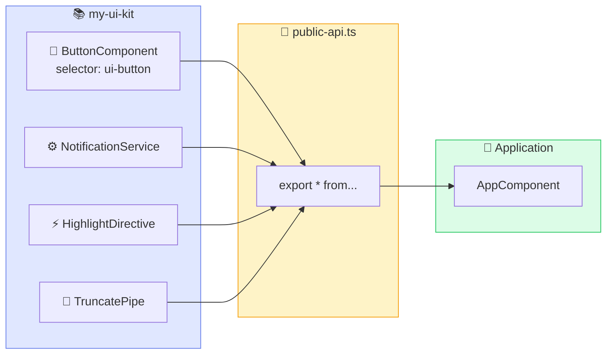
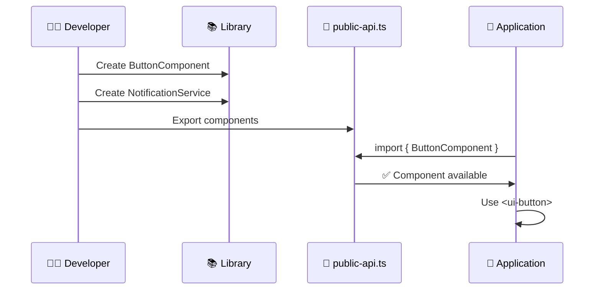
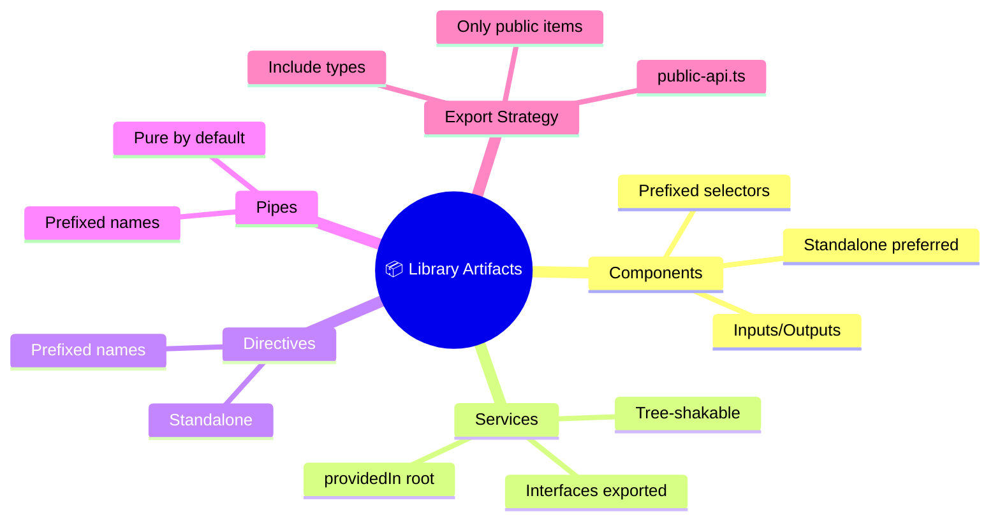

# 🧩 Use Case 2: Components & Services in Libraries

> **💡 Lightbulb Moment**: Library artifacts use **prefixes** to avoid naming conflicts!

---

## 🔍 How It Works (The Concept)

Library artifacts (components, services, directives, pipes) are created inside the library project and exported via `public-api.ts`. Consumers import these artifacts into their applications.

### Default Behavior (Ad-hoc Components)
- ❌ Copy-paste between projects
- ❌ Naming conflicts (`ButtonComponent` everywhere)
- ❌ No version control

### Optimized Behavior (Library Components)
- ✅ Single source, multiple consumers
- ✅ Prefixed selectors (`ui-button`)
- ✅ Versioned releases



---

## 🚀 Step-by-Step Implementation Guide

### Step 1: Generate Component in Library

```bash
# 🛡️ CRITICAL: Specify --project flag!
ng generate component button --project=my-ui-kit --standalone
```

### Step 2: Create Standalone Component

```typescript
// projects/my-ui-kit/src/lib/button/button.component.ts
import { Component, Input, Output, EventEmitter } from '@angular/core';
import { CommonModule } from '@angular/common';

@Component({
    selector: 'ui-button',  // 🛡️ CRITICAL: Library prefix!
    standalone: true,
    imports: [CommonModule],
    template: `
        <button 
            [class]="'btn btn-' + variant"
            [disabled]="disabled"
            (click)="onClick.emit($event)">
            <ng-content></ng-content>
        </button>
    `,
    styles: [`
        .btn { 
            padding: 0.5rem 1rem; 
            border: none;
            border-radius: 4px; 
            cursor: pointer;
            font-weight: 500;
        }
        .btn-primary { background: #667eea; color: white; }
        .btn-secondary { background: #e5e7eb; color: #374151; }
        .btn:disabled { opacity: 0.5; cursor: not-allowed; }
    `]
})
export class ButtonComponent {
    @Input() variant: 'primary' | 'secondary' = 'primary';
    @Input() disabled = false;
    @Output() onClick = new EventEmitter<MouseEvent>();
}
```

### Step 3: Create Tree-shakable Service

```typescript
// projects/my-ui-kit/src/lib/notification.service.ts
import { Injectable, signal } from '@angular/core';

export interface Notification {
    id: number;
    message: string;
    type: 'success' | 'error' | 'info';
}

@Injectable({
    providedIn: 'root'  // 🛡️ CRITICAL: Tree-shakable!
})
export class NotificationService {
    private _notifications = signal<Notification[]>([]);
    notifications = this._notifications.asReadonly();
    
    show(message: string, type: 'success' | 'error' | 'info' = 'info'): void {
        const notification: Notification = {
            id: Date.now(),
            message,
            type
        };
        this._notifications.update(n => [...n, notification]);
    }
    
    dismiss(id: number): void {
        this._notifications.update(n => n.filter(x => x.id !== id));
    }
}
```

### Step 4: Export in public-api.ts

```typescript
// 🛡️ CRITICAL: Only export public items!
export * from './lib/button/button.component';
export * from './lib/notification.service';
```



---

## 🐛 Common Pitfalls & Debugging

### ❌ Bad: No Prefix (Naming Conflict)

```typescript
@Component({
    selector: 'button',  // ❌ Conflicts with HTML button!
})
```

### ✅ Good: Library Prefix

```typescript
@Component({
    selector: 'ui-button',  // ✅ Unique, prefixed selector
})
```

### ❌ Bad: Not Exported

```typescript
// public-api.ts
export * from './lib/button/button.component';
// ❌ Missing: notification.service.ts
```

**Error**: `Cannot find module 'my-ui-kit' or its corresponding type declarations`

### ✅ Good: Complete Exports

```typescript
export * from './lib/button/button.component';
export * from './lib/notification.service';  // ✅ Included!
```

---

## ⚡ Performance & Architecture

### Tree-shaking Impact

| Pattern | Bundle Impact |
|---------|---------------|
| `providedIn: 'root'` | Service removed if unused |
| `standalone: true` | Component removed if unused |
| Module-based | Entire module included |

### Component Architecture

```
Smart/Dumb Pattern in Libraries:
├── Presentational Components (Library)  # Dumb, reusable
│   ├── ui-button
│   ├── ui-card
│   └── ui-modal
└── Container Components (Application)    # Smart, app-specific
    └── dashboard.component
```

---

## 🌍 Real World Use Cases

1. **UI Kit**: Buttons, cards, modals, form controls
2. **Chart Library**: Reusable data visualization components
3. **Auth Module**: Login forms, auth services, JWT interceptors

---

## 📝 The Analogy

> Think of library components like **IKEA furniture** 🛋️:
> - Each piece (component) has a **unique product code** (selector prefix)
> - Comes with **assembly instructions** (API documentation)
> - Can be used in **any room** (any application)
> - **One design, many customers** (one source, many consumers)

---

## ❓ Interview & Concept Questions

| # | Question | Answer |
|---|----------|--------|
| 1 | Why use selector prefixes? | Avoid conflicts with other libraries and HTML |
| 2 | Where to add service providers? | Use `providedIn: 'root'` for tree-shaking |
| 3 | Standalone vs Module? | Standalone = simpler, better tree-shaking |
| 4 | How to export types? | Add `export * from './models/...'` to public-api |
| 5 | What if component not working? | Check it's exported in public-api.ts |

---

## 🧠 Mind Map


