```mermaid
sequenceDiagram
    participant Dev as 👨‍💻 Developer
    participant Lib as 📚 Library
    participant API as 🔑 public-api.ts
    participant App as 📱 Application
    
    Dev->>Lib: Create ButtonComponent
    Dev->>Lib: Create NotificationService
    Dev->>API: Export components
    App->>API: import { ButtonComponent }
    API->>App: ✅ Component available
    App->>App: Use <ui-button>
```

# 🧩 Use Case 2: Components & Services in Libraries

> **💡 Lightbulb Moment**: Library artifacts use **prefixes** to avoid naming conflicts!

---

## 🔍 How It Works (The Concept)

Library artifacts (components, services, directives, pipes) are created inside the library project and exported via `public-api.ts`. Consumers import these artifacts into their applications.

### Default Behavior (Ad-hoc Components)
- ❌ Copy-paste between projects
- ❌ Naming conflicts (`ButtonComponent` everywhere)
- ❌ No version control

### Optimized Behavior (Library Components)
- ✅ Single source, multiple consumers
- ✅ Prefixed selectors (`ui-button`)
- ✅ Versioned releases

```mermaid
flowchart LR
    subgraph Library["📚 my-ui-kit"]
        direction TB
        BC["🔘 ButtonComponent<br/>selector: ui-button"]
        NS["⚙️ NotificationService"]
        HD["⚡ HighlightDirective"]
        TP["🔧 TruncatePipe"]
    end
    
    subgraph PublicAPI["🔑 public-api.ts"]
        Export["export * from..."]
    end
    
    subgraph Consumer["📱 Application"]
        App["AppComponent"]
    end
    
    BC --> Export
    NS --> Export
    HD --> Export
    TP --> Export
    Export --> App
    
    style Library fill:#e0e7ff,stroke:#667eea
    style PublicAPI fill:#fef3c7,stroke:#f59e0b
    style Consumer fill:#dcfce7,stroke:#22c55e
```



---

## 🚀 Step-by-Step Implementation Guide

### Step 1: Generate Component in Library

```bash
# 🛡️ CRITICAL: Specify --project flag!
ng generate component button --project=my-ui-kit --standalone
```

### Step 2: Create Standalone Component

```typescript
// projects/my-ui-kit/src/lib/button/button.component.ts
import { Component, Input, Output, EventEmitter } from '@angular/core';
import { CommonModule } from '@angular/common';

@Component({
    selector: 'ui-button',  // 🛡️ CRITICAL: Library prefix!
    standalone: true,
    imports: [CommonModule],
    template: `
        <button 
            [class]="'btn btn-' + variant"
            [disabled]="disabled"
            (click)="onClick.emit($event)">
            <ng-content></ng-content>
        </button>
    `,
    styles: [`
        .btn { 
            padding: 0.5rem 1rem; 
            border: none;
            border-radius: 4px; 
            cursor: pointer;
            font-weight: 500;
        }
        .btn-primary { background: #667eea; color: white; }
        .btn-secondary { background: #e5e7eb; color: #374151; }
        .btn:disabled { opacity: 0.5; cursor: not-allowed; }
    `]
})
export class ButtonComponent {
    @Input() variant: 'primary' | 'secondary' = 'primary';
    @Input() disabled = false;
    @Output() onClick = new EventEmitter<MouseEvent>();
}
```

### Step 3: Create Tree-shakable Service

```typescript
// projects/my-ui-kit/src/lib/notification.service.ts
import { Injectable, signal } from '@angular/core';

export interface Notification {
    id: number;
    message: string;
    type: 'success' | 'error' | 'info';
}

@Injectable({
    providedIn: 'root'  // 🛡️ CRITICAL: Tree-shakable!
})
export class NotificationService {
    private _notifications = signal<Notification[]>([]);
    notifications = this._notifications.asReadonly();
    
    show(message: string, type: 'success' | 'error' | 'info' = 'info'): void {
        const notification: Notification = {
            id: Date.now(),
            message,
            type
        };
        this._notifications.update(n => [...n, notification]);
    }
    
    dismiss(id: number): void {
        this._notifications.update(n => n.filter(x => x.id !== id));
    }
}
```

### Step 4: Export in public-api.ts

```typescript
// 🛡️ CRITICAL: Only export public items!
export * from './lib/button/button.component';
export * from './lib/notification.service';
```



---

## 🐛 Common Pitfalls & Debugging

### ❌ Bad: No Prefix (Naming Conflict)

```typescript
@Component({
    selector: 'button',  // ❌ Conflicts with HTML button!
})
```

### ✅ Good: Library Prefix

```typescript
@Component({
    selector: 'ui-button',  // ✅ Unique, prefixed selector
})
```

### ❌ Bad: Not Exported

```typescript
// public-api.ts
export * from './lib/button/button.component';
// ❌ Missing: notification.service.ts
```

**Error**: `Cannot find module 'my-ui-kit' or its corresponding type declarations`

### ✅ Good: Complete Exports

```typescript
export * from './lib/button/button.component';
export * from './lib/notification.service';  // ✅ Included!
```

---

## ⚡ Performance & Architecture

### Tree-shaking Impact

| Pattern | Bundle Impact |
|---------|---------------|
| `providedIn: 'root'` | Service removed if unused |
| `standalone: true` | Component removed if unused |
| Module-based | Entire module included |

### Component Architecture

```
Smart/Dumb Pattern in Libraries:
├── Presentational Components (Library)  # Dumb, reusable
│   ├── ui-button
│   ├── ui-card
│   └── ui-modal
└── Container Components (Application)    # Smart, app-specific
    └── dashboard.component
```

---

## 🌍 Real World Use Cases

1. **UI Kit**: Buttons, cards, modals, form controls
2. **Chart Library**: Reusable data visualization components
3. **Auth Module**: Login forms, auth services, JWT interceptors

---

### 📦 Data Flow Summary (Visual Box Diagram)

```
┌─────────────────────────────────────────────────────────────┐
│  LIBRARY COMPONENTS & SERVICES                              │
│                                                             │
│   COMPONENT:                                                │
│   ┌───────────────────────────────────────────────────────┐ │
│   │ @Component({                                          │ │
│   │   selector: 'ui-button',  // ⚠️ Use prefix!           │ │
│   │   standalone: true        // ✅ Tree-shakable         │ │
│   │ })                                                    │ │
│   └───────────────────────────────────────────────────────┘ │
│                                                             │
│   SERVICE:                                                  │
│   ┌───────────────────────────────────────────────────────┐ │
│   │ @Injectable({                                         │ │
│   │   providedIn: 'root'  // ✅ Tree-shakable singleton   │ │
│   │ })                                                    │ │
│   └───────────────────────────────────────────────────────┘ │
│                                                             │
│   EXPORT IN public-api.ts:                                  │
│   ┌───────────────────────────────────────────────────────┐ │
│   │ export * from './lib/button/button.component';        │ │
│   │ export * from './lib/notification.service';           │ │
│   │ // ⚠️ Must export to make available!                  │ │
│   └───────────────────────────────────────────────────────┘ │
└─────────────────────────────────────────────────────────────┘
```

> **Key Takeaway**: Use prefix for selectors (ui-button). Use `providedIn: 'root'` for services. Export in public-api.ts!

---

## 🛋️ IKEA Furniture Analogy (Easy to Remember!)

Think of library components like **IKEA furniture**:

| Concept | IKEA Analogy | Memory Trick |
|---------|-------------|--------------|
| **Component** | 🛋️ **Furniture Piece**: KALLAX shelf, BILLY bookcase | **"Ready-made piece"** |
| **Selector Prefix** | 🏷️ **Product Code**: KALLAX-5x5, not just "shelf" | **"Unique SKU"** |
| **Inputs/Outputs** | 📐 **Customization Options**: Color, size, with/without doors | **"Configure your piece"** |
| **Standalone** | 📦 **Self-contained**: Doesn't need other furniture to work | **"Works alone"** |
| **providedIn: 'root'** | 🌐 **One per store**: Single inventory system for all | **"Shared service"** |

### 📖 Story to Remember:

> 🏪 **The IKEA Store Visit**
>
> You're furnishing your apartment (building an app):
>
> **At IKEA (Library):**
> ```
> - Browse showroom → See available components
> - Check product code → Unique selector prefix (ui-button)
> - Pick color/size → Input properties
> - Get assembly guide → Component documentation
> ```
>
> **At Home (Your App):**
> ```
> - Import piece → import { ButtonComponent }
> - Place in room → Use in template
> - Customize → Set inputs
> - Done! → Working UI
> ```

### 🎯 Quick Reference:
```
🛋️ Component = Furniture piece (reusable UI element)
🏷️ Prefix    = Product code (unique identifier)
📐 Inputs    = Customization options (color, size)
📦 Standalone = Self-contained (no dependencies)
```

---

## ❓ Interview & Concept Questions

| # | Question | Answer |
|---|----------|--------|
| 1 | Why use selector prefixes? | Avoid conflicts with other libraries and HTML |
| 2 | Where to add service providers? | Use `providedIn: 'root'` for tree-shaking |
| 3 | Standalone vs Module? | Standalone = simpler, better tree-shaking |
| 4 | How to export types? | Add `export * from './models/...'` to public-api |
| 5 | What if component not working? | Check it's exported in public-api.ts |

---

## 🧠 Mind Map

```mermaid
mindmap
  root((📦 Library Artifacts))
    Components
      Standalone preferred
      Prefixed selectors
      Inputs/Outputs
    Services
      providedIn root
      Tree-shakable
      Interfaces exported
    Directives
      Prefixed names
      Standalone
    Pipes
      Pure by default
      Prefixed names
    Export Strategy
      public-api.ts
      Only public items
      Include types
```


