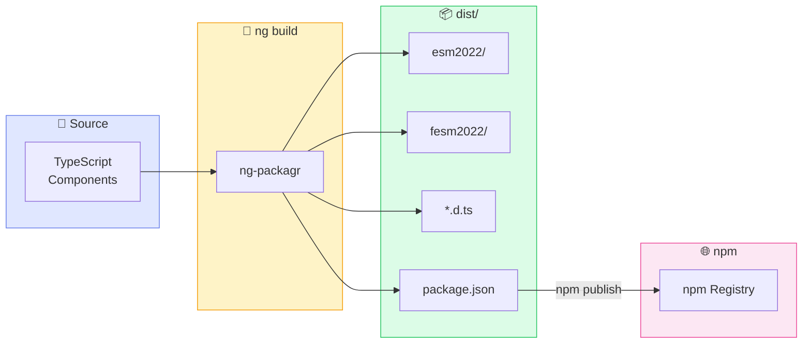
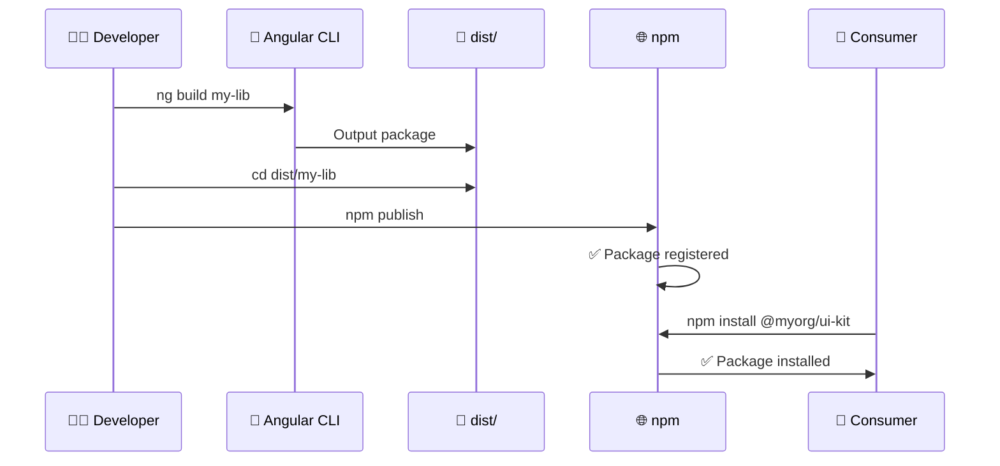
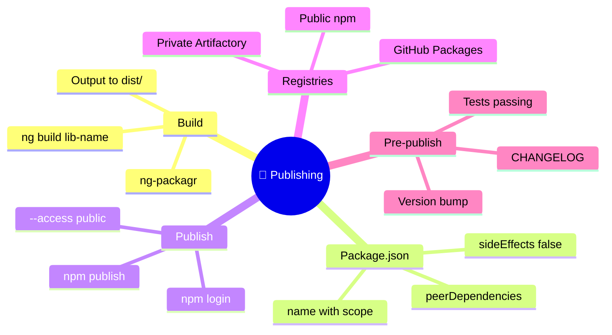

# 🚀 Use Case 3: Building & Publishing

> **💡 Lightbulb Moment**: `peerDependencies` = consumer provides Angular, preventing duplicates!

---

## 🔍 How It Works (The Concept)

Building transforms your TypeScript source into distributable packages. Publishing makes it available to others via npm or private registries.

### Default Behavior (No Build)
- ❌ Source TypeScript not usable
- ❌ No type definitions
- ❌ No optimization

### Optimized Behavior (Built Package)
- ✅ Multiple module formats (ESM, UMD)
- ✅ Type definitions (.d.ts)
- ✅ Tree-shakable



---

## 🚀 Step-by-Step Implementation Guide

### Step 1: Prepare package.json

```json
{
  "name": "@myorg/ui-kit",
  "version": "1.0.0",
  "peerDependencies": {
    "@angular/common": "^17.0.0 || ^18.0.0",  // 🛡️ CRITICAL
    "@angular/core": "^17.0.0 || ^18.0.0"
  },
  "sideEffects": false
}
```

### Step 2: Build the Library

```bash
# Production build
ng build my-ui-kit --configuration=production

# Watch mode (development)
ng build my-ui-kit --watch
```

### Step 3: Navigate to Output

```bash
cd dist/my-ui-kit
ls -la
```

### Step 4: Publish to npm

```bash
# Login (first time)
npm login

# Publish public package
npm publish --access public
```



---

## 🐛 Common Pitfalls & Debugging

### ❌ Bad: Angular as Dependency

```json
{
  "dependencies": {
    "@angular/core": "^17.0.0"  // ❌ Bundled with library!
  }
}
```

**Result**: Consumer has TWO Angular instances → "NullInjectorError"

### ✅ Good: Angular as Peer Dependency

```json
{
  "peerDependencies": {
    "@angular/core": "^17.0.0"  // ✅ Consumer provides
  }
}
```

### ❌ Bad: Forgot to Build

```bash
cd projects/my-ui-kit
npm publish  # ❌ Publishing source, not built package!
```

### ✅ Good: Build Then Publish

```bash
ng build my-ui-kit
cd dist/my-ui-kit  # ✅ Navigate to built output
npm publish
```

---

## ⚡ Performance & Architecture

### Bundle Formats

| Format | Purpose | Tree-shakable |
|--------|---------|---------------|
| esm2022 | Modern bundlers | ✅ Yes |
| fesm2022 | Flat ES modules | ✅ Yes |
| UMD | Script tag loading | ❌ No |

### sideEffects: false

```json
{
  "sideEffects": false  // 🌲 Enables aggressive tree-shaking
}
```

Without this, bundlers may not remove unused exports!

---

## 🌍 Real World Use Cases

1. **Open Source Library**: Publish to public npm
2. **Enterprise UI Kit**: Publish to private Artifactory
3. **Monorepo Packages**: Local linking with `npm link`

---

### 📦 Data Flow Summary (Visual Box Diagram)

```
┌─────────────────────────────────────────────────────────────┐
│  BUILDING & PUBLISHING: Source → dist → npm                │
│                                                             │
│   BUILD PROCESS:                                            │
│   ┌───────────────────────────────────────────────────────┐ │
│   │ ng build my-ui-kit --configuration=production         │ │
│   │              ↓                                        │ │
│   │ dist/my-ui-kit/                                       │ │
│   │ ├── esm2022/         # ES modules                     │ │
│   │ ├── fesm2022/        # Flat ES modules                │ │
│   │ ├── *.d.ts           # Type definitions               │ │
│   │ └── package.json     # Package metadata               │ │
│   └───────────────────────────────────────────────────────┘ │
│                                                             │
│   PACKAGE.JSON CRITICAL SETTINGS:                           │
│   ┌───────────────────────────────────────────────────────┐ │
│   │ "peerDependencies": {                                 │ │
│   │   "@angular/core": "^17.0.0"  // Consumer provides!   │ │
│   │ },                                                    │ │
│   │ "sideEffects": false  // Enable tree-shaking          │ │
│   └───────────────────────────────────────────────────────┘ │
│                                                             │
│   PUBLISH:                                                  │
│   ┌───────────────────────────────────────────────────────┐ │
│   │ cd dist/my-ui-kit  # ⚠️ Navigate to dist!             │ │
│   │ npm publish --access public                           │ │
│   └───────────────────────────────────────────────────────┘ │
└─────────────────────────────────────────────────────────────┘
```

> **Key Takeaway**: Build to dist/, then publish from dist/. Use peerDependencies to avoid duplicate Angular!

---

## 🎵 Music Album Analogy (Easy to Remember!)

Think of publishing a library like **releasing a music album**:

| Concept | Album Analogy | Memory Trick |
|---------|-------------|--------------|
| **ng build** | 🎙️ **Recording Session**: Turning your songs into final tracks | **"Mix the album"** |
| **dist/ folder** | 💿 **Master Recording**: The finished product ready for distribution | **"The gold master"** |
| **npm publish** | 🌐 **Release to Spotify/iTunes**: Make it available worldwide | **"Release day!"** |
| **peerDependencies** | 🎧 **"Headphones not included"**: Consumer provides the player | **"BYOP - Bring Your Own Player"** |
| **Version** | 📅 **Album Edition**: 1.0 Original, 2.0 Remastered | **"Edition number"** |

### 📖 Story to Remember:

> 🎤 **The Band's Album Release**
>
> Your band (library team) is releasing a new album:
>
> **Recording Phase (Development):**
> ```
> 1. Write songs      → Write components
> 2. Record in studio → ng build my-lib
> 3. Master the album → Output to dist/
> 4. Check quality    → Run tests
> ```
>
> **Distribution Phase (Publishing):**
> ```
> 1. Sign with label  → npm login
> 2. Release to stores→ npm publish
> 3. Fans download   → npm install @band/album
> 4. Play on their player → Consumer's Angular provides runtime
> ```

### 🎯 Quick Reference:
```
🎙️ ng build    = Recording session (create package)
💿 dist/       = Master tape (distributable output)
🌐 npm publish = Release to stores (make available)
🎧 peerDeps    = "Player not included" (consumer provides Angular)
```

---

## ❓ Interview & Concept Questions

| # | Question | Answer |
|---|----------|--------|
| 1 | Why use peerDependencies? | Prevents duplicate Angular in final bundle |
| 2 | What is ng-packagr? | Tool that builds Angular libraries |
| 3 | What's in dist/ after build? | ESM, types, package.json |
| 4 | How to publish scoped package? | `npm publish --access public` |
| 5 | What does sideEffects: false do? | Enables tree-shaking |

---

## 🧠 Mind Map


