```mermaid
sequenceDiagram
    participant App as 📱 Application
    participant NPM as 🌐 npm
    participant Lib as 📚 Library
    
    App->>NPM: npm install @myorg/ui-kit
    NPM->>App: ✅ Package downloaded
    App->>Lib: import { ButtonComponent }
    Lib->>App: ✅ Component available
    App->>App: Use <ui-button> in template
```

# 📥 Use Case 4: Consuming Libraries

> **💡 Lightbulb Moment**: With `standalone: true`, just **import the component directly** - no module needed!

---

## 🔍 How It Works (The Concept)

Consuming a library means installing it as a dependency and importing its exports into your application.

### Default Behavior (NgModule)
- Import entire module
- All components bundled
- Less tree-shaking

### Optimized Behavior (Standalone)
- Import individual components
- Better tree-shaking
- Simpler mental model

```mermaid
flowchart LR
    subgraph Registry["🌐 npm"]
        Lib["@myorg/ui-kit"]
    end
    
    subgraph App["📱 Application"]
        direction TB
        Install["npm install"]
        Import["import { ButtonComponent }"]
        Use["<ui-button>"]
    end
    
    Lib -->|"npm install"| Install
    Install --> Import
    Import --> Use
    
    style Registry fill:#fce7f3,stroke:#ec4899
    style App fill:#dcfce7,stroke:#22c55e
```



---

## 🚀 Step-by-Step Implementation Guide

### Step 1: Install the Library

```bash
npm install @myorg/ui-kit
```

### Step 2: Import in Standalone Component

```typescript
// app.component.ts
import { Component } from '@angular/core';
import { ButtonComponent, CardComponent } from '@myorg/ui-kit';  // 🛡️ CRITICAL

@Component({
    selector: 'app-root',
    standalone: true,
    imports: [ButtonComponent, CardComponent],  // 🛡️ Add to imports
    template: `
        <ui-card>
            <ui-button variant="primary">Click Me</ui-button>
        </ui-card>
    `
})
export class AppComponent {}
```

### Step 3: Use Library Services

```typescript
import { inject } from '@angular/core';
import { NotificationService } from '@myorg/ui-kit';

export class MyComponent {
    private notificationService = inject(NotificationService);
    
    notify() {
        this.notificationService.show('Success!', 'success');
    }
}
```



---

## 🐛 Common Pitfalls & Debugging

### ❌ Bad: Forgot to Import

```typescript
@Component({
    standalone: true,
    imports: [],  // ❌ Missing ButtonComponent!
    template: `<ui-button>Click</ui-button>`
})
```

**Error**: `'ui-button' is not a known element`

### ✅ Good: Component Imported

```typescript
@Component({
    standalone: true,
    imports: [ButtonComponent],  // ✅ Imported!
    template: `<ui-button>Click</ui-button>`
})
```

### ❌ Bad: Wrong Import Path

```typescript
import { ButtonComponent } from '@myorg/ui-kit/button';  // ❌ Wrong path
```

### ✅ Good: From Package Root

```typescript
import { ButtonComponent } from '@myorg/ui-kit';  // ✅ Correct
```

---

## ⚡ Performance & Architecture

### Tree-shaking Benefit

```typescript
// Only ButtonComponent is bundled, not the entire library
import { ButtonComponent } from '@myorg/ui-kit';
```

### Lazy Loading Libraries

```typescript
// routes.ts
{
    path: 'dashboard',
    loadComponent: () => import('./dashboard/dashboard.component')
        .then(m => m.DashboardComponent)
    // DashboardComponent imports library components
    // Library chunks are loaded lazily!
}
```

---

## 🌍 Real World Use Cases

1. **Company UI Kit**: Consistent buttons, cards across all apps
2. **Third-party Libraries**: Angular Material, PrimeNG
3. **Shared Data Services**: API clients, auth services

---

## 📝 The Analogy

> Consuming a library is like **ordering from a restaurant menu** 🍽️:
> - `npm install` = Looking at the menu
> - `import { ... }` = Placing your order
> - Using components = Enjoying the dishes
> - You don't need to know how to cook!

---

## ❓ Interview & Concept Questions

| # | Question | Answer |
|---|----------|--------|
| 1 | How to import standalone components? | Add to component's imports array |
| 2 | Why "unknown element" error? | Component not in imports array |
| 3 | How to use library services? | inject() or constructor injection |
| 4 | Standalone vs Module import? | Standalone = component-level, Module = module-level |
| 5 | How to configure library? | Use provider functions like provideUiKit() |

---

## 🧠 Mind Map

```mermaid
mindmap
  root((📥 Consuming))
    Install
      npm install
      npm link (dev)
    Import
      Standalone components
      NgModule import
      Services auto-available
    Use
      Component selectors
      Service injection
      Type imports
    Troubleshoot
      Unknown element
      Cannot find module
      NullInjectorError
```


