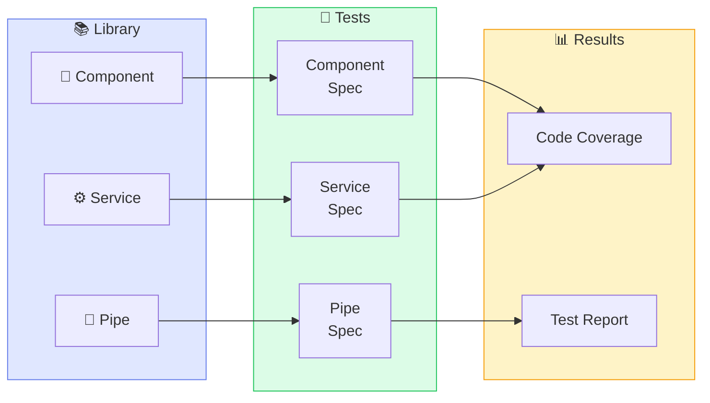
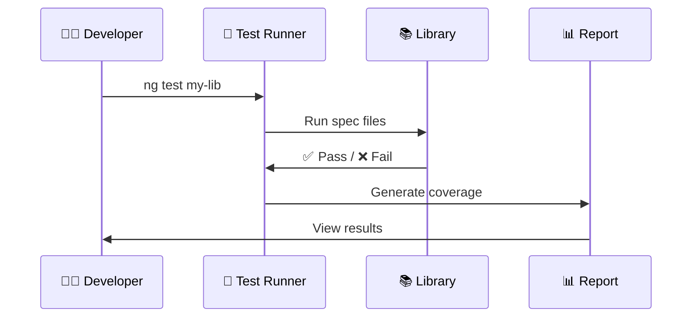
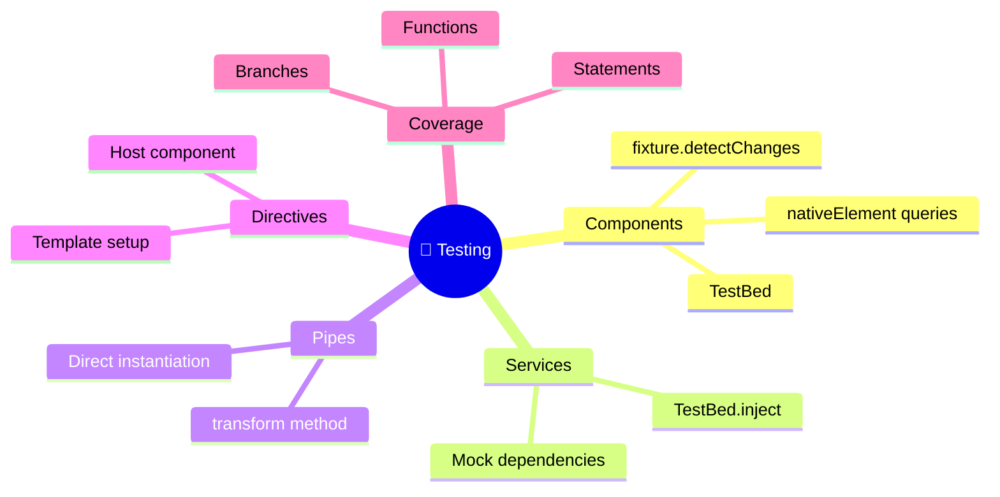

# 🧪 Use Case 5: Testing Libraries

> **💡 Lightbulb Moment**: Test library artifacts **in isolation** - they should work without the consumer app!

---

## 🔍 How It Works (The Concept)

Library testing ensures your components, services, and other artifacts work correctly before consumers use them.

### Default Behavior (Untested)
- ❌ Bugs discovered by consumers
- ❌ No regression protection
- ❌ Breaking changes go unnoticed

### Optimized Behavior (Tested)
- ✅ Bugs caught early
- ✅ Regression tests prevent breaks
- ✅ Confidence for releases



---

## 🚀 Step-by-Step Implementation Guide

### Step 1: Run Tests

```bash
ng test my-ui-kit --watch=false
```

### Step 2: Write Component Test

```typescript
// button.component.spec.ts
import { ComponentFixture, TestBed } from '@angular/core/testing';
import { ButtonComponent } from './button.component';

describe('ButtonComponent', () => {
    let fixture: ComponentFixture<ButtonComponent>;
    let component: ButtonComponent;

    beforeEach(async () => {
        await TestBed.configureTestingModule({
            imports: [ButtonComponent]  // 🛡️ CRITICAL: Standalone import
        }).compileComponents();
        
        fixture = TestBed.createComponent(ButtonComponent);
        component = fixture.componentInstance;
    });

    it('should create', () => {
        expect(component).toBeTruthy();
    });

    it('should emit click', () => {
        // 🛡️ CRITICAL: Spy on output
        spyOn(component.onClick, 'emit');
        fixture.nativeElement.querySelector('button').click();
        expect(component.onClick.emit).toHaveBeenCalled();
    });
});
```

### Step 3: Write Service Test

```typescript
// notification.service.spec.ts
describe('NotificationService', () => {
    let service: NotificationService;

    beforeEach(() => {
        TestBed.configureTestingModule({});
        service = TestBed.inject(NotificationService);
    });

    it('should add notification', () => {
        service.show('Test', 'info');
        expect(service.notifications().length).toBe(1);
    });
});
```



---

## 🐛 Common Pitfalls & Debugging

### ❌ Bad: Forgetting Imports

```typescript
TestBed.configureTestingModule({
    // ❌ Missing component import!
});
const fixture = TestBed.createComponent(ButtonComponent);
```

**Error**: `ButtonComponent is not known`

### ✅ Good: Import Standalone

```typescript
TestBed.configureTestingModule({
    imports: [ButtonComponent]  // ✅ Imported
});
```

### ❌ Bad: No Spy on Output

```typescript
button.click();
expect(component.onClick).toHaveBeenCalled();  // ❌ Won't work!
```

### ✅ Good: Spy First

```typescript
spyOn(component.onClick, 'emit');  // ✅ Create spy
button.click();
expect(component.onClick.emit).toHaveBeenCalled();
```

---

## ⚡ Performance & Architecture

### Testing Pyramid

| Level | Speed | Coverage |
|-------|-------|----------|
| Unit | ⚡ Fast | Individual units |
| Integration | 🚶 Medium | Component interactions |
| E2E | 🐢 Slow | Full application |

### Coverage Thresholds

```json
// karma.conf.js
coverageReporter: {
    check: {
        global: {
            statements: 80,
            branches: 75,
            functions: 80,
            lines: 80
        }
    }
}
```

---

## 🌍 Real World Use Cases

1. **CI/CD Pipeline**: Run tests on every PR
2. **Pre-publish Check**: Ensure no regressions before npm publish
3. **Refactoring Safety**: Tests catch unintended breaks

---

### 📦 Data Flow Summary (Visual Box Diagram)

```
┌─────────────────────────────────────────────────────────────┐
│  LIBRARY TESTING: QUALITY CONTROL                           │
│                                                             │
│   COMPONENT TEST:                                           │
│   ┌───────────────────────────────────────────────────────┐ │
│   │ TestBed.configureTestingModule({                      │ │
│   │   imports: [ButtonComponent]  // ⚠️ Standalone import │ │
│   │ });                                                   │ │
│   │ fixture = TestBed.createComponent(ButtonComponent);   │ │
│   │ component = fixture.componentInstance;                │ │
│   └───────────────────────────────────────────────────────┘ │
│                                                             │
│   SERVICE TEST:                                             │
│   ┌───────────────────────────────────────────────────────┐ │
│   │ service = TestBed.inject(NotificationService);        │ │
│   │ service.show('Test', 'info');                         │ │
│   │ expect(service.notifications().length).toBe(1);       │ │
│   └───────────────────────────────────────────────────────┘ │
│                                                             │
│   OUTPUT TEST:                                              │
│   ┌───────────────────────────────────────────────────────┐ │
│   │ spyOn(component.onClick, 'emit');  // ⚠️ Spy first!   │ │
│   │ button.click();                                       │ │
│   │ expect(component.onClick.emit).toHaveBeenCalled();    │ │
│   └───────────────────────────────────────────────────────┘ │
│                                                             │
│   RUN: ng test my-ui-kit --watch=false --code-coverage     │
└─────────────────────────────────────────────────────────────┘
```

> **Key Takeaway**: Test library in isolation! Import standalone components. spyOn() before triggering events. Run tests before publishing!

---

## 🏭 Factory Quality Control Analogy (Easy to Remember!)

Think of testing a library like **quality control in a factory**:

| Concept | Factory Analogy | Memory Trick |
|---------|----------------|--------------|
| **Unit Test** | 🔍 **Part Inspection**: Check each screw, each bolt individually | **"Test the parts"** |
| **Integration Test** | 🔧 **Assembly Check**: See if parts work together | **"Test the assembly"** |
| **Code Coverage** | 📊 **% of Factory Inspected**: How much of production was checked? | **"Inspection coverage"** |
| **Pass/Fail** | ✅ **Quality Stamp**: Approved for shipping or rejected | **"Stamp of approval"** |
| **CI/CD Testing** | 🤖 **Automated Inspector**: Robot checks every item on conveyor | **"Auto-inspect"** |

### 📖 Story to Remember:

> 🏭 **The Widget Factory**
>
> Your factory (library) produces widgets (components) for customers:
>
> **Quality Control Process:**
> ```
> 1. Part arrives      → Component created
> 2. Inspector checks  → Unit test runs
> 3. Assemble widgets  → Integration test
> 4. % inspected?      → Code coverage report
> 5. Stamp approved    → Tests pass ✅
> 6. Ship to customer  → npm publish
> ```
>
> **"Never ship before inspection!"** (Never publish untested)
> **"Automate the inspector!"** (Run tests in CI/CD)

### 🎯 Quick Reference:
```
🔍 Unit Test        = Inspect individual parts
🔧 Integration Test = Check if parts work together  
📊 Coverage         = % of factory inspected
✅ Pass/Fail        = Quality stamp (ship or reject)
```

---

## ❓ Interview & Concept Questions

| # | Question | Answer |
|---|----------|--------|
| 1 | How to test standalone component? | `imports: [Component]` in TestBed |
| 2 | How to test service? | `TestBed.inject(Service)` |
| 3 | How to test outputs? | `spyOn(output, 'emit')` |
| 4 | What's code coverage? | Percentage of code executed by tests |
| 5 | How to run in CI? | `--watch=false --browsers=ChromeHeadless` |

---

## 🧠 Mind Map


