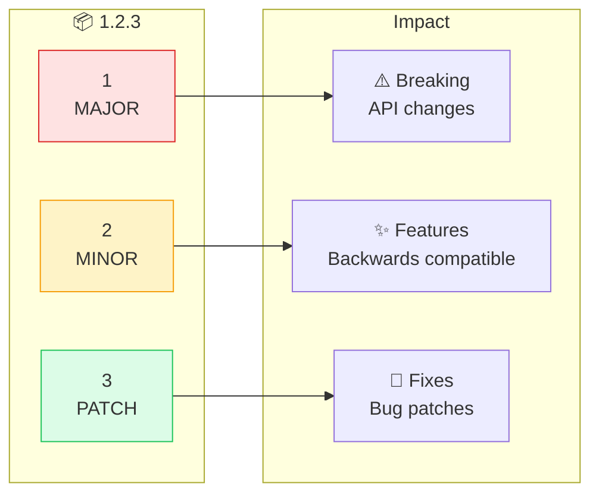
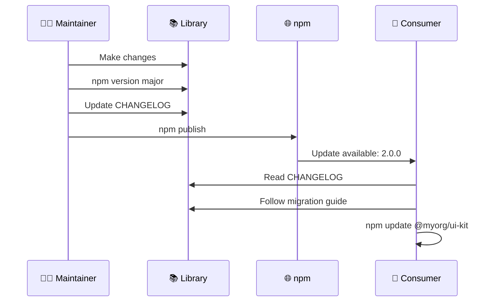
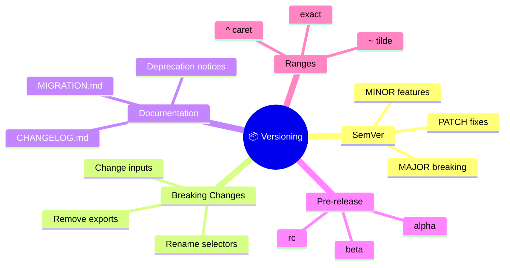

# 📦 Use Case 6: Versioning & Updates

> **💡 Lightbulb Moment**: MAJOR = breaking, MINOR = features, PATCH = fixes!

---

## 🔍 How It Works (The Concept)

Semantic Versioning (SemVer) communicates the nature of changes to consumers, helping them understand upgrade risks.

### Default Behavior (No Versioning)
- ❌ Consumers don't know what changed
- ❌ Updates break apps unexpectedly
- ❌ No upgrade path

### Optimized Behavior (SemVer)
- ✅ Clear communication of changes
- ✅ Consumers know when to expect breaks
- ✅ Migration guides for major versions



---

## 🚀 Step-by-Step Implementation Guide

### Step 1: Understand SemVer

| Bump | When | Consumer Action |
|------|------|-----------------|
| MAJOR | Breaking changes | Read migration guide |
| MINOR | New features | Safe to upgrade |
| PATCH | Bug fixes | Safe to upgrade |

### Step 2: Bump Version

```bash
# 🛡️ CRITICAL: Run in library's package.json directory
cd projects/my-ui-kit

# Patch: 1.0.0 → 1.0.1
npm version patch

# Minor: 1.0.0 → 1.1.0
npm version minor

# Major: 1.0.0 → 2.0.0
npm version major
```

### Step 3: Maintain CHANGELOG

```markdown
# CHANGELOG.md

## [2.0.0] - 2024-01-15

### ⚠️ BREAKING CHANGES
- Renamed `ui-btn` to `ui-button`  // 🛡️ Document all breaks!

### ✨ Features
- Added `ui-modal` component

### 🐛 Bug Fixes
- Fixed click event propagation
```

### Step 4: Create Migration Guide

```markdown
# MIGRATION.md

## v1.x → v2.x

### Selector Renamed
```diff
- <ui-btn>Click</ui-btn>
+ <ui-button>Click</ui-button>
```
```



---

## 🐛 Common Pitfalls & Debugging

### ❌ Bad: Breaking Change as Patch

```bash
# Renamed selector but only bumped patch
npm version patch  # ❌ Should be major!
```

**Result**: Consumers' apps break unexpectedly

### ✅ Good: Correct Version Bump

```bash
# Selector renamed = breaking change
npm version major  # ✅ Correct
```

### ❌ Bad: No Deprecation Warning

```typescript
// v1: Remove feature immediately
// ❌ Consumers have no time to migrate
```

### ✅ Good: Deprecation First

```typescript
// v1: Deprecate with warning
/** @deprecated Use ButtonComponent. Removed in v2. */
export class OldButton {}

// v2: Remove
```

---

## ⚡ Performance & Architecture

### Version Range Strategies

| Range | Meaning | Risk |
|-------|---------|------|
| `^1.2.3` | 1.2.3 to <2.0.0 | Low |
| `~1.2.3` | 1.2.3 to <1.3.0 | Very Low |
| `1.2.3` | Exactly 1.2.3 | None |
| `*` | Any version | High |

### Pre-release Versions

```
2.0.0-alpha.1  → Unstable, testing
2.0.0-beta.1   → Feature complete
2.0.0-rc.1     → Release candidate
2.0.0          → Stable release
```

---

## 🌍 Real World Use Cases

1. **Angular Itself**: Angular 17 → 18 (major with migration)
2. **Angular Material**: Follows Angular versions
3. **Enterprise Libraries**: Internal UI kits with controlled releases

---

## 📝 The Analogy

> Versioning is like **apartment building floors** 🏢:
> - **MAJOR** = Moving to a new building (expect big changes)
> - **MINOR** = New amenities on your floor (nice additions)
> - **PATCH** = Fixing a leaky faucet (small fixes)
> - **CHANGELOG** = Building newsletter announcing changes
> - **Migration guide** = Moving instructions

---

## ❓ Interview & Concept Questions

| # | Question | Answer |
|---|----------|--------|
| 1 | What is SemVer? | MAJOR.MINOR.PATCH versioning scheme |
| 2 | When to bump MAJOR? | Breaking API changes |
| 3 | What's a breaking change? | Removing/renaming public exports, inputs, selectors |
| 4 | Why deprecate before removing? | Give consumers time to migrate |
| 5 | What's ^1.2.3 mean? | Compatible with 1.x.x (not 2.0.0+) |

---

## 🧠 Mind Map


