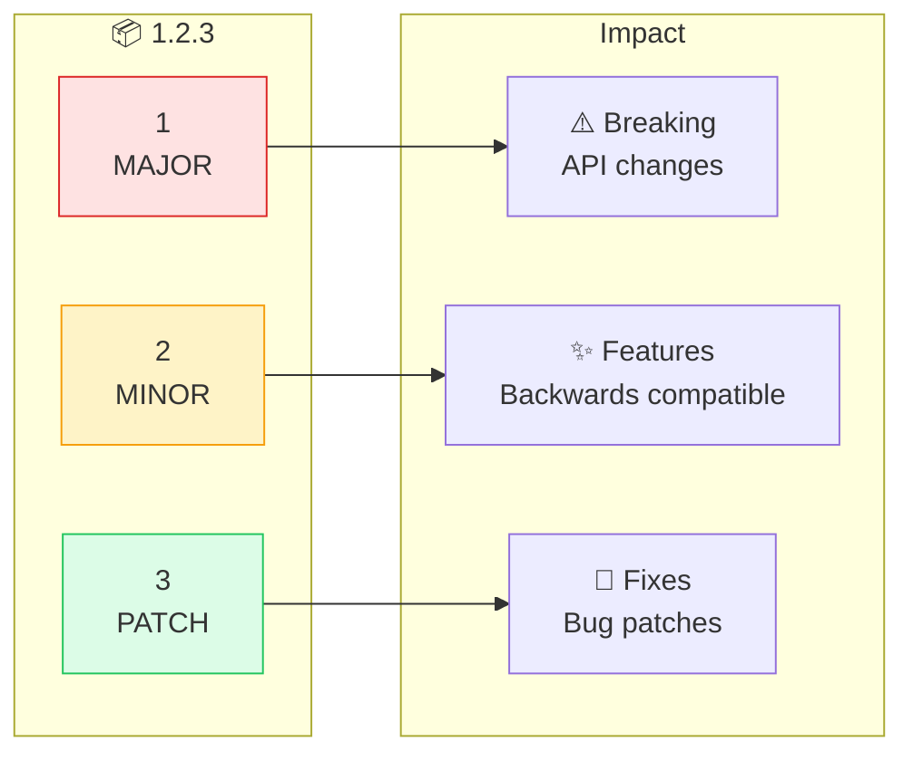
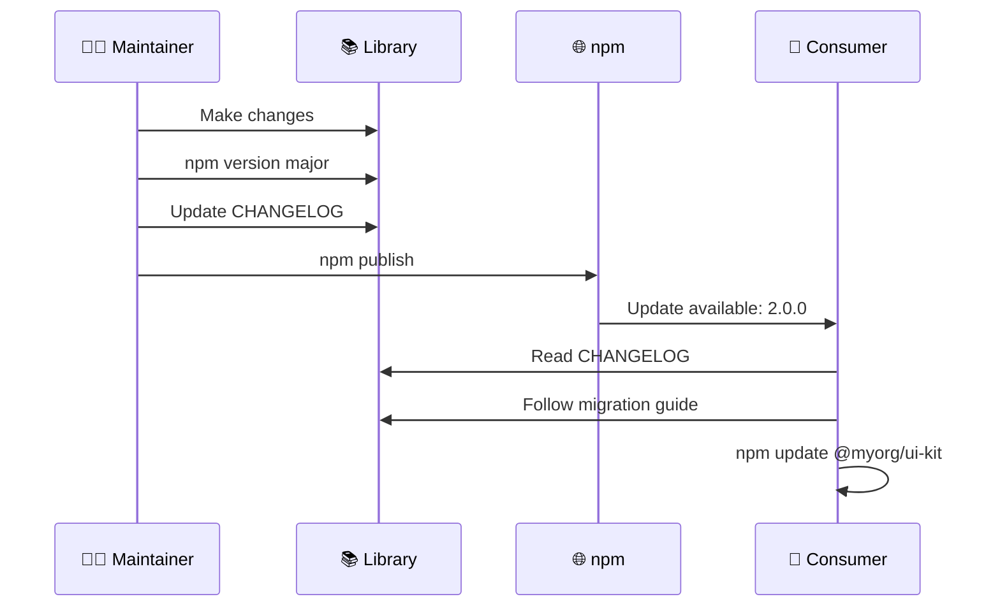
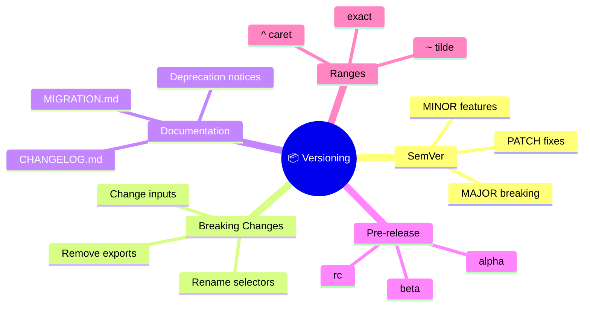

# 📦 Versioning & Updates

> **💡 Lightbulb Moment**: MAJOR = breaking, MINOR = features, PATCH = fixes!


## 📋 Table of Contents
- [🔍 How It Works (The Concept)](#how-it-works-the-concept)
  - [Default Behavior (No Versioning)](#default-behavior-no-versioning)
  - [Optimized Behavior (SemVer)](#optimized-behavior-semver)
- [🚀 Step-by-Step Implementation Guide](#step-by-step-implementation-guide)
  - [Step 1: Understand SemVer](#step-1-understand-semver)
  - [Step 2: Bump Version](#step-2-bump-version)
  - [Step 3: Maintain CHANGELOG](#step-3-maintain-changelog)
- [[2.0.0] - 2024-01-15](#200---2024-01-15)
  - [⚠️ BREAKING CHANGES](#breaking-changes)
  - [✨ Features](#features)
  - [🐛 Bug Fixes](#bug-fixes)
  - [Step 4: Create Migration Guide](#step-4-create-migration-guide)
- [v1.x → v2.x](#v1x--v2x)
  - [Selector Renamed](#selector-renamed)
- [🐛 Common Pitfalls & Debugging](#common-pitfalls--debugging)
  - [❌ Bad: Breaking Change as Patch](#bad-breaking-change-as-patch)
  - [✅ Good: Correct Version Bump](#good-correct-version-bump)
  - [❌ Bad: No Deprecation Warning](#bad-no-deprecation-warning)
  - [✅ Good: Deprecation First](#good-deprecation-first)
- [⚡ Performance & Architecture](#performance--architecture)
  - [Version Range Strategies](#version-range-strategies)
  - [Pre-release Versions](#pre-release-versions)
- [🌍 Real World Use Cases](#real-world-use-cases)
  - [📦 Data Flow Summary (Visual Box Diagram)](#data-flow-summary-visual-box-diagram)
- [🏢 Apartment Building Analogy (Easy to Remember!)](#apartment-building-analogy-easy-to-remember)
  - [📖 Story to Remember:](#story-to-remember)
  - [🎯 Quick Reference:](#quick-reference)
- [❓ Interview & Concept Questions](#interview--concept-questions)
- [🧠 Mind Map](#mind-map)

---
---

## 🔍 How It Works (The Concept)

Semantic Versioning (SemVer) communicates the nature of changes to consumers, helping them understand upgrade risks.

### Default Behavior (No Versioning)
- ❌ Consumers don't know what changed
- ❌ Updates break apps unexpectedly
- ❌ No upgrade path

### Optimized Behavior (SemVer)
- ✅ Clear communication of changes
- ✅ Consumers know when to expect breaks
- ✅ Migration guides for major versions



---

## 🚀 Step-by-Step Implementation Guide

### Step 1: Understand SemVer

| Bump | When | Consumer Action |
|------|------|-----------------|
| MAJOR | Breaking changes | Read migration guide |
| MINOR | New features | Safe to upgrade |
| PATCH | Bug fixes | Safe to upgrade |

### Step 2: Bump Version

```bash
# 🛡️ CRITICAL: Run in library's package.json directory
cd projects/my-ui-kit

# Patch: 1.0.0 → 1.0.1
npm version patch

# Minor: 1.0.0 → 1.1.0
npm version minor

# Major: 1.0.0 → 2.0.0
npm version major
```

### Step 3: Maintain CHANGELOG

```markdown
# CHANGELOG.md

## [2.0.0] - 2024-01-15

### ⚠️ BREAKING CHANGES
- Renamed `ui-btn` to `ui-button`  // 🛡️ Document all breaks!

### ✨ Features
- Added `ui-modal` component

### 🐛 Bug Fixes
- Fixed click event propagation
```

### Step 4: Create Migration Guide

```markdown
# MIGRATION.md

## v1.x → v2.x

### Selector Renamed
```diff
- <ui-btn>Click</ui-btn>
+ <ui-button>Click</ui-button>
```
```



---

## 🐛 Common Pitfalls & Debugging

### ❌ Bad: Breaking Change as Patch

```bash
# Renamed selector but only bumped patch
npm version patch  # ❌ Should be major!
```

**Result**: Consumers' apps break unexpectedly

### ✅ Good: Correct Version Bump

```bash
# Selector renamed = breaking change
npm version major  # ✅ Correct
```

### ❌ Bad: No Deprecation Warning

```typescript
// v1: Remove feature immediately
// ❌ Consumers have no time to migrate
```

### ✅ Good: Deprecation First

```typescript
// v1: Deprecate with warning
/** @deprecated Use ButtonComponent. Removed in v2. */
export class OldButton {}

// v2: Remove
```

---

## ⚡ Performance & Architecture

### Version Range Strategies

| Range | Meaning | Risk |
|-------|---------|------|
| `^1.2.3` | 1.2.3 to <2.0.0 | Low |
| `~1.2.3` | 1.2.3 to <1.3.0 | Very Low |
| `1.2.3` | Exactly 1.2.3 | None |
| `*` | Any version | High |

### Pre-release Versions

```
2.0.0-alpha.1  → Unstable, testing
2.0.0-beta.1   → Feature complete
2.0.0-rc.1     → Release candidate
2.0.0          → Stable release
```

---

## 🌍 Real World Use Cases

1. **Angular Itself**: Angular 17 → 18 (major with migration)
2. **Angular Material**: Follows Angular versions
3. **Enterprise Libraries**: Internal UI kits with controlled releases

---

### 📦 Data Flow Summary (Visual Box Diagram)

```
┌─────────────────────────────────────────────────────────────┐
│  SEMVER: MAJOR.MINOR.PATCH                                  │
│                                                             │
│   VERSION MEANING:                                          │
│   ┌───────────────────────────────────────────────────────┐ │
│   │   1.2.3 = MAJOR.MINOR.PATCH                           │ │
│   │                                                       │ │
│   │ MAJOR (1→2): Breaking changes (selector renamed)      │ │
│   │              → Consumer MUST update code              │ │
│   │                                                       │ │
│   │ MINOR (2→3): New features (new component added)       │ │
│   │              → Safe to upgrade                        │ │
│   │                                                       │ │
│   │ PATCH (3→4): Bug fixes (click handler fixed)          │ │
│   │              → Safe to upgrade                        │ │
│   └───────────────────────────────────────────────────────┘ │
│                                                             │
│   BUMP VERSION:                                             │
│   ┌───────────────────────────────────────────────────────┐ │
│   │ npm version patch  # 1.0.0 → 1.0.1                    │ │
│   │ npm version minor  # 1.0.0 → 1.1.0                    │ │
│   │ npm version major  # 1.0.0 → 2.0.0                    │ │
│   └───────────────────────────────────────────────────────┘ │
│                                                             │
│   ALWAYS: Write CHANGELOG.md + MIGRATION.md for MAJOR      │
│   DEPRECATE FIRST: @deprecated, then remove in next MAJOR  │
└─────────────────────────────────────────────────────────────┘
```

> **Key Takeaway**: MAJOR = breaking (read migration!), MINOR = new features (safe), PATCH = bug fixes (safe). Always deprecate before removing!

---

## 🏢 Apartment Building Analogy (Easy to Remember!)

Think of versioning like **apartment building floors**:

| Concept | Apartment Analogy | Memory Trick |
|---------|------------------|--------------|
| **MAJOR (2.0.0)** | 🏢 **Moving to New Building**: Different address, new layout | **"Major relocation"** |
| **MINOR (1.2.0)** | ✨ **New Amenities**: Pool added, gym upgraded (same apartment) | **"Nice additions"** |
| **PATCH (1.2.3)** | 🔧 **Fixing Faucet**: Small repair, nothing noticeable | **"Quick fix"** |
| **CHANGELOG** | 📰 **Building Newsletter**: "Here's what changed this month" | **"The announcement"** |
| **Migration Guide** | 📦 **Moving Instructions**: How to pack and relocate | **"The how-to guide"** |

### 📖 Story to Remember:

> 🏢 **The Version Apartments**
>
> You're a tenant (library consumer) in Version Apartments:
>
> **Types of Changes:**
> ```
> PATCH (1.0.1)  → Landlord fixed the faucet
>                  You: "Cool, didn't even notice" ✅
>
> MINOR (1.1.0)  → Building added a pool!
>                  You: "Awesome new feature!" ✅
>
> MAJOR (2.0.0)  → Moving to a new building
>                  You: "I need the moving guide..." 📋
> ```
>
> **Before major move**: Read the newsletter (CHANGELOG)
> **During major move**: Follow moving instructions (Migration Guide)

### 🎯 Quick Reference:
```
🏢 MAJOR = New building (breaking changes - read migration!)
✨ MINOR = New amenities (safe upgrade - new features)
🔧 PATCH = Fix the faucet (safe upgrade - bug fixes)
```

---

## ❓ Interview & Concept Questions

| # | Question | Answer |
|---|----------|--------|
| 1 | What is SemVer? | MAJOR.MINOR.PATCH versioning scheme |
| 2 | When to bump MAJOR? | Breaking API changes |
| 3 | What's a breaking change? | Removing/renaming public exports, inputs, selectors |
| 4 | Why deprecate before removing? | Give consumers time to migrate |
| 5 | What's ^1.2.3 mean? | Compatible with 1.x.x (not 2.0.0+) |

---

## 🧠 Mind Map


