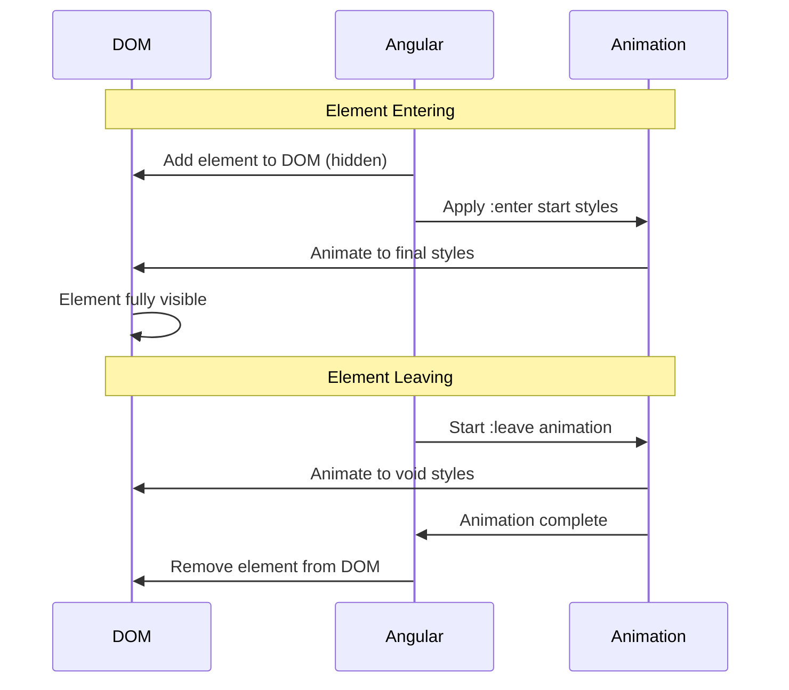
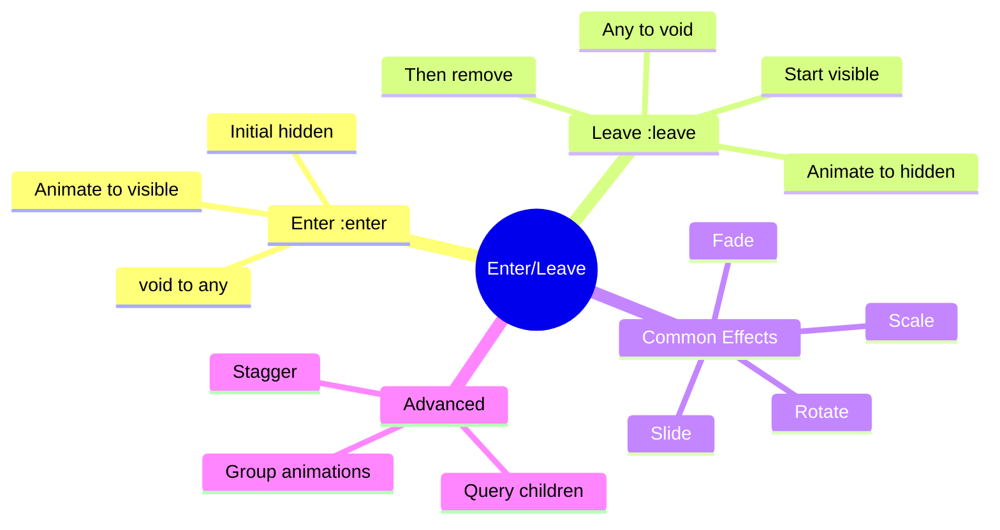

# 🚪 Enter/Leave Animations

> **💡 Goal**: Animate elements as they enter or leave the DOM using `:enter` and `:leave` aliases.


## 📋 Table of Contents
- [🏛️ What Problem Does It Solve?](#what-problem-does-it-solve)
  - [The "Popping" Problem](#the-popping-problem)
  - [The Enter/Leave Solution](#the-enterleave-solution)
- [🔬 Key Concepts](#key-concepts)
  - [Aliases Explained](#aliases-explained)
- [📊 Animation Flow Diagram](#animation-flow-diagram)
- [🚀 Implementation Examples](#implementation-examples)
  - [1. Basic Fade Enter/Leave](#1-basic-fade-enterleave)
  - [2. Slide from Direction](#2-slide-from-direction)
  - [3. Scale Animation](#3-scale-animation)
- [📦 Visual Box Diagram](#visual-box-diagram)
- [🐛 Common Pitfalls](#common-pitfalls)
  - [❌ Pitfall 1: Leave Animation Not Working](#pitfall-1-leave-animation-not-working)
  - [❌ Pitfall 2: Animation Triggers Multiple Times](#pitfall-2-animation-triggers-multiple-times)
- [🎯 Real-World Use Cases](#real-world-use-cases)
- [❓ Interview Questions](#interview-questions)
  - [Q1: What is the difference between `:enter` and `void => *`?](#q1-what-is-the-difference-between-enter-and-void)
  - [Q2: Why does the leave animation work even though the element is being removed?](#q2-why-does-the-leave-animation-work-even-though-the-element-is-being-removed)
  - [Q3: How do you animate multiple items entering with a delay between each?](#q3-how-do-you-animate-multiple-items-entering-with-a-delay-between-each)
  - [Q4: What happens if an element enters and leaves quickly before the enter animation finishes?](#q4-what-happens-if-an-element-enters-and-leaves-quickly-before-the-enter-animation-finishes)
- [🧠 Mind Map](#mind-map)
- [📻 Door Analogy (Easy to Remember!)](#door-analogy-easy-to-remember)
  - [Story:](#story)

---
---

## 🏛️ What Problem Does It Solve?

### The "Popping" Problem
Without animations:
- Elements appear/disappear instantly
- Users lose context of what changed
- UI feels jarring and unprofessional

### The Enter/Leave Solution
- **:enter** animates elements being added to DOM
- **:leave** animates elements being removed
- Users can track what's happening visually

---

## 🔬 Key Concepts

### Aliases Explained

| Alias | Equivalent | Meaning |
|-------|------------|---------|
| `:enter` | `void => *` | Element entering DOM |
| `:leave` | `* => void` | Element leaving DOM |
| `:increment` | Numeric increase | Counter going up |
| `:decrement` | Numeric decrease | Counter going down |

---

## 📊 Animation Flow Diagram



---

## 🚀 Implementation Examples

### 1. Basic Fade Enter/Leave

```typescript
trigger('fadeEnterLeave', [
    transition(':enter', [
        style({ opacity: 0 }),
        animate('300ms ease-out', style({ opacity: 1 }))
    ]),
    transition(':leave', [
        animate('300ms ease-in', style({ opacity: 0 }))
    ])
])
```

### 2. Slide from Direction

```typescript
trigger('slideInLeft', [
    transition(':enter', [
        style({ transform: 'translateX(-100%)', opacity: 0 }),
        animate('400ms ease-out', 
            style({ transform: 'translateX(0)', opacity: 1 }))
    ]),
    transition(':leave', [
        animate('400ms ease-in', 
            style({ transform: 'translateX(-100%)', opacity: 0 }))
    ])
])
```

### 3. Scale Animation

```typescript
trigger('scaleIn', [
    transition(':enter', [
        style({ transform: 'scale(0.5)', opacity: 0 }),
        animate('300ms cubic-bezier(0.4, 0, 0.2, 1)', 
            style({ transform: 'scale(1)', opacity: 1 }))
    ]),
    transition(':leave', [
        animate('200ms ease-in', 
            style({ transform: 'scale(0.5)', opacity: 0 }))
    ])
])
```

---

## 📦 Visual Box Diagram

```
┌─────────────────────────────────────────────────────────────┐
│  ENTER/LEAVE ANIMATION LIFECYCLE                            │
│                                                             │
│   :ENTER (void => *)                                        │
│   ┌───────────────────────────────────────────────────────┐ │
│   │  1. *ngIf becomes true                                │ │
│   │  2. Angular creates element (hidden with start style) │ │
│   │  3. Animation runs to end style                       │ │
│   │  4. Element fully visible                             │ │
│   └───────────────────────────────────────────────────────┘ │
│                                                             │
│   :LEAVE (* => void)                                        │
│   ┌───────────────────────────────────────────────────────┐ │
│   │  1. *ngIf becomes false                               │ │
│   │  2. Angular KEEPS element in DOM                       │ │
│   │  3. Animation runs to void style                      │ │
│   │  4. After animation: Element removed from DOM         │ │
│   └───────────────────────────────────────────────────────┘ │
│                                                             │
│   KEY INSIGHT: Leave animations work because Angular       │
│   waits for the animation to complete before removing!     │
└─────────────────────────────────────────────────────────────┘
```

---

## 🐛 Common Pitfalls

### ❌ Pitfall 1: Leave Animation Not Working

**Symptom:** Enter works, leave doesn't animate

**Cause:** Using `*ngIf` incorrectly or element removed too fast

**Fix:** Ensure the trigger is on the element with `*ngIf`:
```html
<!-- ✅ Correct -->
@if (show) {
    <div @fadeInOut>Content</div>
}

<!-- ❌ Wrong - animation on parent -->
<div @fadeInOut>
    @if (show) {
        <p>Content</p>
    }
</div>
```

### ❌ Pitfall 2: Animation Triggers Multiple Times

**Cause:** Change detection causing re-renders

**Fix:** Use `trackBy` with `*ngFor` or signals with `@for`:
```html
@for (item of items(); track item.id) {
    <div @fadeInOut>{{ item.name }}</div>
}
```

---

## 🎯 Real-World Use Cases

| Use Case | Animation | Effect |
|----------|-----------|--------|
| Toast Notifications | slideInRight | Slide in from edge |
| Modal Dialogs | scaleIn + fade | Grow from center |
| List Items | fadeEnterLeave | Smooth add/remove |
| Dropdown Menus | slideDown | Reveal options |
| Tooltips | fadeIn | Appear on hover |
| Card Deletion | slideOutLeft | Swipe to remove |

---

## ❓ Interview Questions

### Q1: What is the difference between `:enter` and `void => *`?
**A:** They are identical. `:enter` is an alias for `void => *`, meaning "element transitioning from not-in-DOM to in-DOM".

### Q2: Why does the leave animation work even though the element is being removed?
**A:** Angular waits for the animation to complete before actually removing the element from the DOM. This is handled by the animation renderer.

### Q3: How do you animate multiple items entering with a delay between each?
**A:** Use `query` with `stagger`:
```typescript
transition('* => *', [
    query(':enter', [
        style({ opacity: 0 }),
        stagger('100ms', [
            animate('300ms', style({ opacity: 1 }))
        ])
    ], { optional: true })
])
```

### Q4: What happens if an element enters and leaves quickly before the enter animation finishes?
**A:** Angular handles this gracefully - it will interrupt the enter animation and start the leave animation from the current state.

---

## 🧠 Mind Map



---

## 📻 Door Analogy (Easy to Remember!)

| Concept | Door Analogy | Memory Trick |
|---------|--------------|--------------|
| **void** | 🚫 Door doesn't exist | "Behind the wall" |
| **:enter** | 🚪 Door appears & opens | "Welcome!" |
| **:leave** | 🚪 Door closes & disappears | "Goodbye!" |
| **stagger** | 🚪🚪🚪 Doors open one by one | "Domino effect" |

### Story:
> 🚪 Imagine a magic hallway where doors can appear and disappear. When you need a room (**:enter**), a door materializes and swings open. When you're done (**:leave**), the door swings closed and fades into the wall. With **stagger**, multiple doors open in sequence like a wave!
