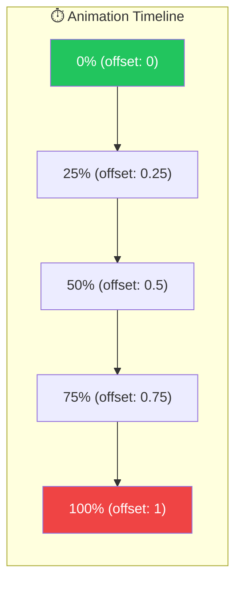
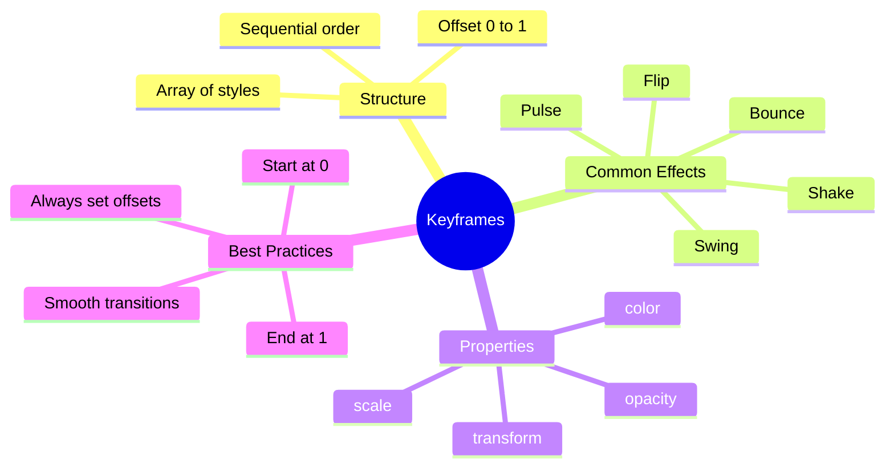

# 🎬 Keyframes Animations

> **💡 Goal**: Create complex multi-step animations using keyframes for precise control over animation sequences.


## 📋 Table of Contents
- [🏛️ What Problem Does It Solve?](#what-problem-does-it-solve)
  - [The "Linear Only" Problem](#the-linear-only-problem)
  - [The Keyframes Solution](#the-keyframes-solution)
- [🔬 Keyframes Explained](#keyframes-explained)
  - [Offset Values](#offset-values)
  - [Basic Syntax](#basic-syntax)
- [📊 Keyframes Flow Diagram](#keyframes-flow-diagram)
- [🚀 Common Keyframe Patterns](#common-keyframe-patterns)
  - [1. Bounce Effect](#1-bounce-effect)
  - [2. Shake Effect (Error Feedback)](#2-shake-effect-error-feedback)
  - [3. Pulse Effect (Attention)](#3-pulse-effect-attention)
  - [4. Color Transition](#4-color-transition)
- [📦 Visual Box Diagram](#visual-box-diagram)
- [🐛 Common Pitfalls](#common-pitfalls)
  - [❌ Pitfall 1: Missing Offset](#pitfall-1-missing-offset)
  - [❌ Pitfall 2: Offsets Not in Order](#pitfall-2-offsets-not-in-order)
  - [❌ Pitfall 3: Offset Range](#pitfall-3-offset-range)
- [🎯 Real-World Use Cases](#real-world-use-cases)
- [❓ Interview Questions](#interview-questions)
  - [Q1: What is the `offset` property in keyframes?](#q1-what-is-the-offset-property-in-keyframes)
  - [Q2: Can you skip offset values?](#q2-can-you-skip-offset-values)
  - [Q3: How do you create a bouncing ball effect?](#q3-how-do-you-create-a-bouncing-ball-effect)
  - [Q4: What's the difference between CSS keyframes and Angular keyframes?](#q4-whats-the-difference-between-css-keyframes-and-angular-keyframes)
- [🧠 Mind Map](#mind-map)
- [🎵 Music Analogy (Easy to Remember!)](#music-analogy-easy-to-remember)
  - [Story:](#story)

---
---

## 🏛️ What Problem Does It Solve?

### The "Linear Only" Problem
Simple transitions only go from A to B:
- Can't create bouncing effects
- No intermediate steps
- Limited visual expressiveness

### The Keyframes Solution
Keyframes allow:
- **Multiple steps** in a single animation
- **Precise timing** with offset values
- **Complex effects** like bounce, shake, pulse

---

## 🔬 Keyframes Explained

### Offset Values

| Offset | Percentage | Meaning |
|--------|------------|---------|
| 0 | 0% | Animation start |
| 0.25 | 25% | Quarter way |
| 0.5 | 50% | Halfway |
| 0.75 | 75% | Three-quarters |
| 1 | 100% | Animation end |

### Basic Syntax

```typescript
animate('1s', keyframes([
    style({ transform: 'translateY(0)', offset: 0 }),
    style({ transform: 'translateY(-50px)', offset: 0.5 }),
    style({ transform: 'translateY(0)', offset: 1 })
]))
```

---

## 📊 Keyframes Flow Diagram



---

## 🚀 Common Keyframe Patterns

### 1. Bounce Effect

```typescript
trigger('bounce', [
    transition(':enter', [
        animate('1s', keyframes([
            style({ transform: 'translateY(-100%)', opacity: 0, offset: 0 }),
            style({ transform: 'translateY(30px)', opacity: 1, offset: 0.5 }),
            style({ transform: 'translateY(-15px)', offset: 0.7 }),
            style({ transform: 'translateY(0)', offset: 1 })
        ]))
    ])
])
```

### 2. Shake Effect (Error Feedback)

```typescript
trigger('shake', [
    transition('* => shake', [
        animate('0.5s', keyframes([
            style({ transform: 'translateX(0)', offset: 0 }),
            style({ transform: 'translateX(-10px)', offset: 0.2 }),
            style({ transform: 'translateX(10px)', offset: 0.4 }),
            style({ transform: 'translateX(-10px)', offset: 0.6 }),
            style({ transform: 'translateX(0)', offset: 1 })
        ]))
    ])
])
```

### 3. Pulse Effect (Attention)

```typescript
trigger('pulse', [
    transition('* => pulse', [
        animate('0.8s', keyframes([
            style({ transform: 'scale(1)', offset: 0 }),
            style({ transform: 'scale(1.15)', offset: 0.5 }),
            style({ transform: 'scale(1)', offset: 1 })
        ]))
    ])
])
```

### 4. Color Transition

```typescript
trigger('rainbow', [
    transition('* => rainbow', [
        animate('2s', keyframes([
            style({ backgroundColor: '#ef4444', offset: 0 }),
            style({ backgroundColor: '#eab308', offset: 0.33 }),
            style({ backgroundColor: '#22c55e', offset: 0.66 }),
            style({ backgroundColor: '#3b82f6', offset: 1 })
        ]))
    ])
])
```

---

## 📦 Visual Box Diagram

```
┌─────────────────────────────────────────────────────────────┐
│  KEYFRAMES: MULTI-STEP ANIMATION                            │
│                                                             │
│   Timeline: 0%────25%────50%────75%────100%                 │
│                                                             │
│   BOUNCE EXAMPLE:                                           │
│   ┌─────────────────────────────────────────────────────┐   │
│   │  0%   → translateY(-100%)  opacity: 0  (start up)  │   │
│   │  50%  → translateY(30px)   opacity: 1  (overshoot) │   │
│   │  70%  → translateY(-15px)              (bounce up) │   │
│   │  100% → translateY(0)                  (settle)    │   │
│   └─────────────────────────────────────────────────────┘   │
│                                                             │
│   SHAKE EXAMPLE (for errors):                               │
│   ┌─────────────────────────────────────────────────────┐   │
│   │  0%   → X: 0         (center)                       │   │
│   │  20%  → X: -10px     (left)                         │   │
│   │  40%  → X: +10px     (right)                        │   │
│   │  60%  → X: -10px     (left)                         │   │
│   │  100% → X: 0         (center - settle)              │   │
│   └─────────────────────────────────────────────────────┘   │
└─────────────────────────────────────────────────────────────┘
```

---

## 🐛 Common Pitfalls

### ❌ Pitfall 1: Missing Offset

**Problem:** Angular can't determine timing
```typescript
// ❌ Bad - no offsets
keyframes([
    style({ opacity: 0 }),
    style({ opacity: 1 })
])
```

**Fix:** Always include offset values
```typescript
// ✅ Good - explicit offsets
keyframes([
    style({ opacity: 0, offset: 0 }),
    style({ opacity: 1, offset: 1 })
])
```

### ❌ Pitfall 2: Offsets Not in Order

**Problem:** Offsets must be sequential
```typescript
// ❌ Bad - wrong order
keyframes([
    style({ opacity: 0, offset: 0 }),
    style({ opacity: 0.5, offset: 0.8 }),  // Should come after 0.5
    style({ opacity: 1, offset: 0.5 })      // Wrong!
])
```

### ❌ Pitfall 3: Offset Range

**Problem:** Offset must be 0-1
```typescript
// ❌ Bad - percentage instead of decimal
style({ opacity: 0, offset: 50 })  // Wrong!

// ✅ Good - decimal
style({ opacity: 0, offset: 0.5 })
```

---

## 🎯 Real-World Use Cases

| Animation | Use Case | User Impact |
|-----------|----------|-------------|
| **Bounce** | Success messages | Celebration! |
| **Shake** | Form validation errors | "Try again" |
| **Pulse** | New notification badge | "Look here!" |
| **Flip** | Card reveal | Gamification |
| **Swing** | Pending/loading state | "Working..." |
| **Rainbow** | Achievement unlocked | Excitement! |

---

## ❓ Interview Questions

### Q1: What is the `offset` property in keyframes?
**A:** It's a decimal from 0 to 1 representing the percentage point in the animation timeline where that style should be applied. 0 = start, 0.5 = halfway, 1 = end.

### Q2: Can you skip offset values?
**A:** Yes, but Angular will auto-calculate them. Explicit offsets give you precise control and are recommended for complex animations.

### Q3: How do you create a bouncing ball effect?
**A:** Use keyframes with decreasing bounce heights:
```typescript
keyframes([
    style({ transform: 'translateY(0)', offset: 0 }),
    style({ transform: 'translateY(-100px)', offset: 0.2 }),
    style({ transform: 'translateY(0)', offset: 0.4 }),
    style({ transform: 'translateY(-50px)', offset: 0.6 }),
    style({ transform: 'translateY(0)', offset: 0.8 }),
    style({ transform: 'translateY(-25px)', offset: 0.9 }),
    style({ transform: 'translateY(0)', offset: 1 })
])
```

### Q4: What's the difference between CSS keyframes and Angular keyframes?
**A:** 
- CSS: `@keyframes` with percentages
- Angular: `keyframes([])` with offset decimals
- Angular keyframes are more dynamic and can use component state

---

## 🧠 Mind Map



---

## 🎵 Music Analogy (Easy to Remember!)

| Concept | Music Analogy | Memory Trick |
|---------|---------------|--------------|
| **keyframes** | 🎼 Musical score | "Notes over time" |
| **offset** | 🎵 Beat position | "When to play" |
| **style** | 🎹 Note/chord | "What to play" |
| **duration** | ⏱️ Song length | "How long" |

### Story:
> 🎼 Think of keyframes like a **music score**. Each **style** is a note, and the **offset** tells when to play it. The **duration** is the song length. A bounce animation is like a rhythm: 🎵 high → low → up → settle, just like a ball!
