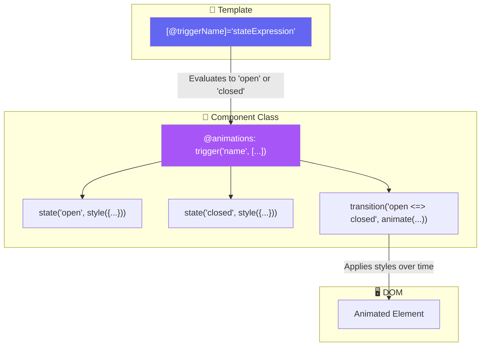
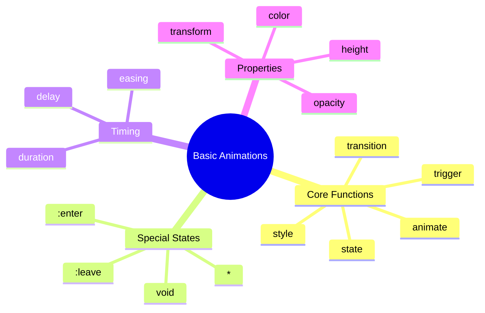

# 🎬 Use Case 1: Basic State Animations

> **💡 Goal**: Master the fundamentals of Angular animations using trigger, state, style, transition, and animate.

---

## 🏛️ What Problem Does It Solve?

### The "Static UI" Problem
Without animations, UI changes feel jarring and abrupt:
- Elements appear/disappear instantly
- State changes are hard to perceive
- User experience feels mechanical

### The Animation Solution
Angular animations provide:
- **Smooth transitions** between states
- **Visual feedback** for user actions
- **Professional UX** that delights users
- **Built-in performance** optimization

---

## 🔬 Deep Dive: Core Animation Concepts

### A. The Building Blocks

| Concept | Purpose | Example |
|---------|---------|---------|
| **trigger** | Names the animation | `trigger('fadeInOut', [...])` |
| **state** | Defines a style state | `state('open', style({...}))` |
| **style** | CSS properties to apply | `style({ opacity: 1 })` |
| **transition** | When/how to animate | `transition('open => closed', ...)` |
| **animate** | Duration & timing | `animate('300ms ease-in-out')` |

### B. Special States

| State | Meaning |
|-------|---------|
| `void` | Element not in DOM (entering/leaving) |
| `*` | Any state (wildcard) |
| `:enter` | Alias for `void => *` |
| `:leave` | Alias for `* => void` |

---

## 📊 Data Flow Diagram



---

## 📦 Visual Box Diagram

```
┌─────────────────────────────────────────────────────────────┐
│  ANGULAR ANIMATIONS: STATE-BASED APPROACH                   │
│                                                             │
│   ① DEFINE TRIGGER (in @Component)                         │
│   ┌───────────────────────────────────────────────────────┐ │
│   │ trigger('openClose', [                                │ │
│   │   state('open', style({ height: '200px' })),         │ │
│   │   state('closed', style({ height: '100px' })),       │ │
│   │   transition('open <=> closed', animate('300ms'))    │ │
│   │ ])                                                    │ │
│   └───────────────────────────────────────────────────────┘ │
│                      │                                      │
│                      ▼                                      │
│   ② BIND IN TEMPLATE                                        │
│   ┌───────────────────────────────────────────────────────┐ │
│   │ <div [@openClose]="isOpen ? 'open' : 'closed'">      │ │
│   │   Content here                                        │ │
│   │ </div>                                                │ │
│   └───────────────────────────────────────────────────────┘ │
│                      │                                      │
│                      ▼                                      │
│   ③ ANGULAR HANDLES THE REST                                │
│   ┌───────────────────────────────────────────────────────┐ │
│   │ • Detects state change                                │ │
│   │ • Calculates intermediate styles                      │ │
│   │ • Applies CSS transitions                             │ │
│   │ • Uses Web Animations API for performance             │ │
│   └───────────────────────────────────────────────────────┘ │
└─────────────────────────────────────────────────────────────┘
```

---

## 🚀 Step-by-Step Implementation

### Step 1: Import Animation Functions

```typescript
import {
    trigger,
    state,
    style,
    transition,
    animate
} from '@angular/animations';
```

### Step 2: Define the Animation Trigger

```typescript
@Component({
    animations: [
        trigger('fadeInOut', [
            // State when element is NOT in DOM
            state('void', style({ opacity: 0 })),
            // State when element IS in DOM
            state('*', style({ opacity: 1 })),
            // Animate between void and any state
            transition('void <=> *', animate('300ms ease-in-out'))
        ])
    ]
})
```

### Step 3: Apply to Template

```html
@if (isVisible()) {
    <div @fadeInOut>
        I will fade in and out!
    </div>
}
```

---

## 🐛 Common Pitfalls

### ❌ Pitfall 1: Missing BrowserAnimationsModule

**Error:** `Found the synthetic property @fadeInOut. Please include either...`

**Fix (Standalone):**
```typescript
// main.ts
import { provideAnimations } from '@angular/platform-browser/animations';

bootstrapApplication(AppComponent, {
    providers: [provideAnimations()]
});
```

**Fix (NgModule):**
```typescript
import { BrowserAnimationsModule } from '@angular/platform-browser/animations';

@NgModule({
    imports: [BrowserAnimationsModule]
})
```

### ❌ Pitfall 2: Wrong Transition Syntax

**Bad:**
```typescript
transition('open, closed', animate(...)) // ❌ Comma doesn't work
```

**Good:**
```typescript
transition('open => closed', animate(...))  // One direction
transition('open <=> closed', animate(...)) // Both directions
```

### ❌ Pitfall 3: Forgetting @ in Template

**Bad:**
```html
<div [fadeInOut]="state">  <!-- ❌ Wrong binding -->
```

**Good:**
```html
<div [@fadeInOut]="state"> <!-- ✅ Animation binding uses @ -->
```

---

## 🎭 Timing Functions Cheatsheet

| Timing | Effect | Use Case |
|--------|--------|----------|
| `ease` | Slow-fast-slow | General purpose |
| `ease-in` | Slow start | Elements entering |
| `ease-out` | Slow end | Elements leaving |
| `ease-in-out` | Slow both ends | Smooth toggles |
| `linear` | Constant speed | Loading bars |
| `cubic-bezier()` | Custom curve | Fine-tuned effects |

---

## ❓ Interview Questions

### Q1: What are the core animation functions in Angular?
**A:** `trigger`, `state`, `style`, `transition`, `animate`, `keyframes`, `group`, `query`, `stagger`, `animateChild`.

### Q2: What is the difference between `void` and `*` states?
**A:**
- `void`: Element is NOT attached to the DOM
- `*`: Any state (wildcard), matches when element IS in DOM

### Q3: How do you animate an element entering the DOM?
**A:** Use `:enter` alias or `void => *` transition:
```typescript
transition(':enter', [
    style({ opacity: 0 }),
    animate('300ms', style({ opacity: 1 }))
])
```

### Q4: Can you animate elements leaving the DOM?
**A:** Yes, use `:leave` alias or `* => void`:
```typescript
transition(':leave', [
    animate('300ms', style({ opacity: 0 }))
])
```

### Q5: What is the performance consideration for animations?
**A:** Angular uses the Web Animations API which runs in a separate thread, minimizing main thread blocking. Avoid animating properties that trigger layout (like `width`, `height` without `transform`).

---

## 🎯 Real-World Use Cases

1. **Dropdown Menus** - Fade/slide in options
2. **Modal Dialogs** - Scale + fade on open/close
3. **Toast Notifications** - Slide in from edge
4. **Loading States** - Fade content in/out
5. **Navigation** - Highlight active menu item
6. **Form Validation** - Shake on error
7. **Card Hover** - Lift effect on mouse enter

---

## 🧠 Mind Map



---

## 📻 Radio Analogy (Easy to Remember!)

| Concept | Radio Analogy | Memory Trick |
|---------|---------------|--------------|
| **trigger** | 📻 Radio station name | "Tune to this animation" |
| **state** | 🎵 Song playing | "Current style snapshot" |
| **transition** | 🔀 Crossfade | "How to blend songs" |
| **animate** | ⏱️ Fade duration | "How long the blend takes" |
| **void** | 🔇 Radio off | "Not playing (not in DOM)" |

### Story:
> 📻 Your component is a radio. Each **trigger** is a station. The **states** are songs. **Transitions** are crossfades between songs, and **animate** says how long the fade takes. When the radio is off (**void**), there's no sound (element not in DOM).
