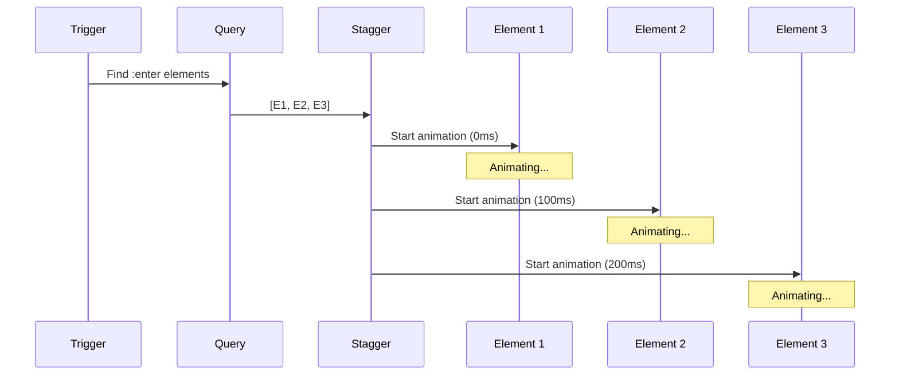
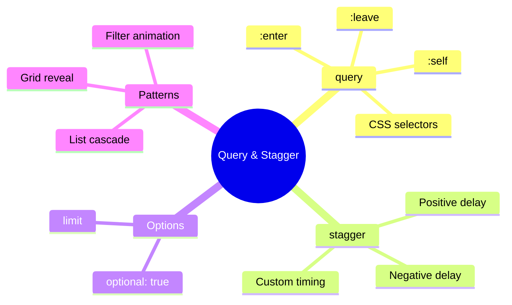

# 🎭 Use Case 4: Query & Stagger Animations

> **💡 Goal**: Animate multiple child elements with controlled timing and sequencing using query and stagger.

---

## 🏛️ What Problem Does It Solve?

### The "All at Once" Problem
Without stagger:
- All list items appear simultaneously
- No visual hierarchy or flow
- Users can't follow what's happening

### The Query & Stagger Solution
- **query()** - Select multiple child elements
- **stagger()** - Add delay between each animation
- Creates beautiful **cascade effects**

---

## 🔬 Core Concepts

### query() Function
Selects child elements to animate:

| Selector | Meaning |
|----------|---------|
| `:enter` | Elements being added |
| `:leave` | Elements being removed |
| `:self` | The host element |
| `.class` | Elements with CSS class |
| `element` | Elements by tag name |
| `@triggerName` | Elements with trigger |

### stagger() Function
Adds delay between each matched element:

```typescript
stagger('100ms', [
    animate('300ms', style({ opacity: 1 }))
])
```

---

## 📊 Stagger Flow Diagram



---

## 🚀 Implementation Patterns

### 1. Basic List Stagger

```typescript
trigger('listStagger', [
    transition('* => *', [
        query(':enter', [
            style({ opacity: 0, transform: 'translateX(-50px)' }),
            stagger('80ms', [
                animate('400ms ease-out', 
                    style({ opacity: 1, transform: 'translateX(0)' }))
            ])
        ], { optional: true })
    ])
])
```

### 2. Grid Stagger

```typescript
trigger('gridStagger', [
    transition('* => *', [
        query(':enter', [
            style({ opacity: 0, transform: 'scale(0.8)' }),
            stagger('100ms', [
                animate('300ms ease-out', 
                    style({ opacity: 1, transform: 'scale(1)' }))
            ])
        ], { optional: true })
    ])
])
```

### 3. Bi-directional Stagger

```typescript
// Items stagger from center outward
stagger('50ms', [...])  // Start to end
stagger('-50ms', [...]) // End to start
```

### 4. Query with CSS Selectors

```typescript
trigger('filterAnimation', [
    transition('* => *', [
        query('.active-card:enter', [
            style({ opacity: 0 }),
            stagger('50ms', [
                animate('300ms', style({ opacity: 1 }))
            ])
        ], { optional: true })
    ])
])
```

---

## 📦 Visual Box Diagram

```
┌─────────────────────────────────────────────────────────────┐
│  QUERY & STAGGER TIMELINE                                   │
│                                                             │
│   stagger('100ms', [...]) with 5 items:                    │
│                                                             │
│   Time:  0ms    100ms   200ms   300ms   400ms              │
│          │       │       │       │       │                  │
│   Item 1 ████████████████                                   │
│   Item 2         ████████████████                           │
│   Item 3                 ████████████████                   │
│   Item 4                         ████████████████           │
│   Item 5                                 ████████████████   │
│                                                             │
│   Each item starts 100ms after the previous one            │
│   Total cascade time: 400ms + animation duration           │
└─────────────────────────────────────────────────────────────┘
```

---

## 🐛 Common Pitfalls

### ❌ Pitfall 1: Missing `optional: true`

**Error:** `Error: Unable to process animations due to the following failed triggers`

**Cause:** Query finds no elements when list is empty

**Fix:**
```typescript
query(':enter', [...], { optional: true })
```

### ❌ Pitfall 2: Wrong Transition Binding

**Problem:** Animation doesn't trigger on list change

**Fix:** Bind to array length or a changing value:
```html
<!-- ✅ Triggers on length change -->
<div [@listAnimation]="items.length">

<!-- ❌ Won't trigger properly -->
<div [@listAnimation]>
```

### ❌ Pitfall 3: Styles Not Resetting

**Problem:** Elements stay in animated state

**Fix:** Set initial style then animate to final:
```typescript
query(':enter', [
    style({ opacity: 0 }),        // Initial state
    stagger('100ms', [
        animate('300ms', style({ opacity: 1 }))  // Final state
    ])
])
```

---

## 🎯 Real-World Use Cases

| Scenario | Animation | Effect |
|----------|-----------|--------|
| **Search Results** | Stagger fade-in | Results appear progressively |
| **Dashboard Cards** | Grid stagger | Cards cascade in |
| **Chat Messages** | List stagger | Messages slide in one by one |
| **Product Gallery** | Grid scale | Images pop in sequentially |
| **Menu Items** | Slide stagger | Options cascade down |
| **Notifications** | Stack stagger | Alerts stack up |

---

## ❓ Interview Questions

### Q1: What is the difference between `query()` and `stagger()`?
**A:** 
- `query()` selects elements to animate
- `stagger()` adds a delay between each selected element's animation

### Q2: Why use `{ optional: true }` with query?
**A:** Prevents errors when no elements match the selector (e.g., empty list). Without it, Angular throws an error if no elements are found.

### Q3: How do you reverse the stagger direction?
**A:** Use negative timing:
```typescript
stagger('-100ms', [...])  // Animates from last to first
```

### Q4: Can you animate both entering and leaving elements?
**A:** Yes, use separate queries:
```typescript
transition('* => *', [
    query(':enter', [...], { optional: true }),
    query(':leave', [...], { optional: true })
])
```

### Q5: How do you stagger in a grid pattern?
**A:** Elements are staggered in DOM order. For a more complex pattern, use `query()` with specific selectors for rows/columns.

---

## 🧠 Mind Map



---

## 🎬 Domino Analogy (Easy to Remember!)

| Concept | Domino Analogy | Memory Trick |
|---------|----------------|--------------|
| **query** | 🎯 Select which dominoes | "Pick the pieces" |
| **stagger** | ⏱️ Time between falls | "Delay between each" |
| **:enter** | 🆕 New dominoes added | "Fresh arrivals" |
| **:leave** | 👋 Dominoes removed | "Falling away" |
| **optional** | 🤷 It's OK if none | "No dominoes? No problem" |

### Story:
> 🎲 Imagine a row of dominoes. **query()** selects which dominoes to knock over. **stagger()** is the time between each domino falling. With `:enter`, new dominoes appear and fall one by one. With `{ optional: true }`, if there are no dominoes, nothing happens (no error!).
