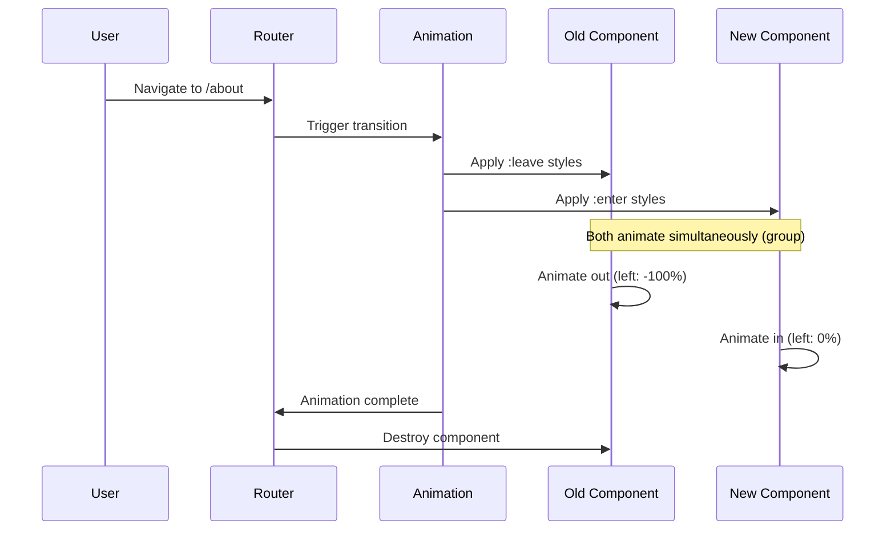
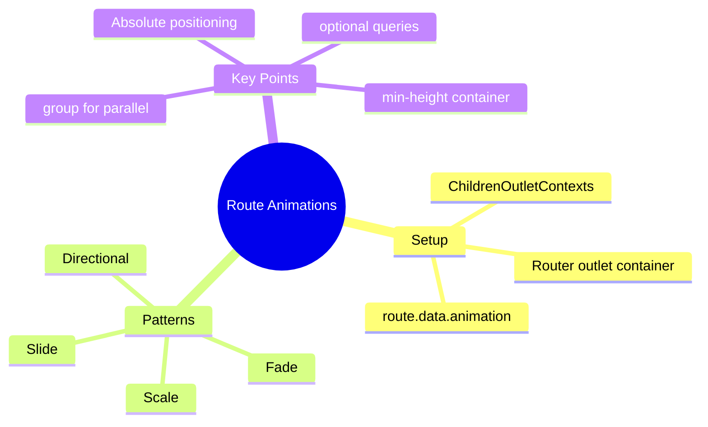

# 🛤️ Use Case 5: Route Animations

> **💡 Goal**: Create smooth page transitions when navigating between routes.

---

## 🏛️ What Problem Does It Solve?

### The "Jarring Navigation" Problem
Without route animations:
- Pages switch instantly
- Users lose sense of navigation direction
- Experience feels disconnected

### The Route Animation Solution
- **Smooth transitions** between pages
- **Visual continuity** during navigation
- **Direction awareness** (forward/back)
- **Professional UX** like native apps

---

## 🔬 Core Concepts

### Components Involved

| Component | Purpose |
|-----------|---------|
| `RouterOutlet` | Where routed components render |
| `ChildrenOutletContexts` | Access to outlet state |
| `route.data.animation` | Animation identifier per route |
| `@routeAnimations` | Trigger applied to outlet container |

---

## 📊 Route Animation Flow



---

## 🚀 Complete Implementation

### Step 1: Define Animation Trigger

```typescript
// animations.ts
import { trigger, transition, style, animate, query, group } from '@angular/animations';

export const slideInAnimation = trigger('routeAnimations', [
    transition('* <=> *', [
        // Set up positioning
        style({ position: 'relative' }),
        query(':enter, :leave', [
            style({
                position: 'absolute',
                top: 0,
                left: 0,
                width: '100%'
            })
        ], { optional: true }),
        
        // Initial state for entering component
        query(':enter', [
            style({ left: '100%', opacity: 0 })
        ], { optional: true }),
        
        // Animate both simultaneously
        group([
            query(':leave', [
                animate('300ms ease-out', 
                    style({ left: '-100%', opacity: 0 }))
            ], { optional: true }),
            query(':enter', [
                animate('300ms ease-out', 
                    style({ left: '0%', opacity: 1 }))
            ], { optional: true })
        ])
    ])
]);
```

### Step 2: Configure Routes with Animation Data

```typescript
// app.routes.ts
export const routes: Routes = [
    {
        path: 'home',
        component: HomeComponent,
        data: { animation: 'HomePage' }
    },
    {
        path: 'about',
        component: AboutComponent,
        data: { animation: 'AboutPage' }
    },
    {
        path: 'contact',
        component: ContactComponent,
        data: { animation: 'ContactPage' }
    }
];
```

### Step 3: Apply to App Component

```typescript
// app.component.ts
import { slideInAnimation } from './animations';

@Component({
    selector: 'app-root',
    standalone: true,
    imports: [RouterOutlet],
    animations: [slideInAnimation],
    template: `
        <main [@routeAnimations]="getRouteAnimationData()">
            <router-outlet></router-outlet>
        </main>
    `,
    styles: [`
        main {
            position: relative;
            min-height: 100vh;
            overflow: hidden;
        }
    `]
})
export class AppComponent {
    constructor(private contexts: ChildrenOutletContexts) {}

    getRouteAnimationData() {
        return this.contexts
            .getContext('primary')
            ?.route?.snapshot?.data?.['animation'];
    }
}
```

---

## 🎨 Animation Patterns

### 1. Slide Animation

```typescript
transition('* <=> *', [
    query(':enter', style({ transform: 'translateX(100%)' })),
    group([
        query(':leave', animate('300ms', style({ transform: 'translateX(-100%)' }))),
        query(':enter', animate('300ms', style({ transform: 'translateX(0)' })))
    ])
])
```

### 2. Fade Animation

```typescript
transition('* <=> *', [
    query(':enter', style({ opacity: 0 })),
    group([
        query(':leave', animate('200ms', style({ opacity: 0 }))),
        query(':enter', animate('200ms 100ms', style({ opacity: 1 })))
    ])
])
```

### 3. Scale Animation

```typescript
transition('* <=> *', [
    query(':enter', style({ transform: 'scale(0.9)', opacity: 0 })),
    group([
        query(':leave', animate('200ms', style({ transform: 'scale(1.1)', opacity: 0 }))),
        query(':enter', animate('300ms', style({ transform: 'scale(1)', opacity: 1 })))
    ])
])
```

### 4. Directional (Based on Route Order)

```typescript
// Forward navigation
transition(':increment', [
    query(':enter', style({ transform: 'translateX(100%)' })),
    // ... slides right to left
])

// Backward navigation
transition(':decrement', [
    query(':enter', style({ transform: 'translateX(-100%)' })),
    // ... slides left to right
])
```

---

## 📦 Visual Box Diagram

```
┌─────────────────────────────────────────────────────────────┐
│  ROUTE ANIMATION SETUP                                      │
│                                                             │
│   ROUTES CONFIGURATION:                                     │
│   ┌───────────────────────────────────────────────────────┐ │
│   │ { path: 'home', data: { animation: 'HomePage' } }    │ │
│   │ { path: 'about', data: { animation: 'AboutPage' } }  │ │
│   └───────────────────────────────────────────────────────┘ │
│                      │                                      │
│                      ▼                                      │
│   ANIMATION BINDING:                                        │
│   ┌───────────────────────────────────────────────────────┐ │
│   │ <main [@routeAnimations]="getRouteAnimationData()">  │ │
│   │   <router-outlet></router-outlet>                    │ │
│   │ </main>                                               │ │
│   └───────────────────────────────────────────────────────┘ │
│                      │                                      │
│                      ▼                                      │
│   DURING TRANSITION (both pages exist):                    │
│   ┌─────────────────────────────────────────────────────┐   │
│   │  ┌─────────────┐  ┌─────────────┐                   │   │
│   │  │  OLD PAGE   │→→│  NEW PAGE   │                   │   │
│   │  │  :leave     │  │  :enter     │                   │   │
│   │  │ (sliding out│  │ (sliding in)│                   │   │
│   │  └─────────────┘  └─────────────┘                   │   │
│   │  position: absolute (both)                          │   │
│   └─────────────────────────────────────────────────────┘   │
└─────────────────────────────────────────────────────────────┘
```

---

## 🐛 Common Pitfalls

### ❌ Pitfall 1: Height Collapse

**Problem:** Container collapses when both pages are absolute

**Fix:** Set min-height on container:
```css
main {
    position: relative;
    min-height: 100vh;
}
```

### ❌ Pitfall 2: Overflow Issues

**Problem:** Entering page visible outside container

**Fix:** Hide overflow during animation:
```css
main {
    overflow: hidden;
}
```

### ❌ Pitfall 3: Animation Not Triggering

**Cause:** Animation data not changing

**Fix:** Ensure each route has unique animation value or use the route path:
```typescript
getRouteAnimationData() {
    return this.route.snapshot.url.join('/');
}
```

---

## ❓ Interview Questions

### Q1: How do you access the current route's animation data?
**A:** Inject `ChildrenOutletContexts` and access via:
```typescript
this.contexts.getContext('primary')?.route?.snapshot?.data?.['animation']
```

### Q2: Why do entering and leaving components need absolute positioning?
**A:** So they can overlap during the transition. With normal flow, the entering component would push the leaving one down.

### Q3: What is the `group()` function for?
**A:** It runs animations in parallel. Without it, :leave would complete before :enter starts.

### Q4: How do you animate based on navigation direction?
**A:** Use `:increment` and `:decrement` transitions with numeric route data:
```typescript
{ path: 'step1', data: { animation: 1 } }
{ path: 'step2', data: { animation: 2 } }
```

---

## 🧠 Mind Map



---

## 🚂 Train Analogy

| Concept | Train Analogy |
|---------|---------------|
| **Router Outlet** | 🚉 Platform | "Where trains stop" |
| **Route Change** | 🚂 Train arriving | "New train coming" |
| **:leave** | 🚃 Departing train | "Old train leaving" |
| **:enter** | 🚃 Arriving train | "New train arriving" |
| **group()** | 🔄 Simultaneous | "Both move at once" |

### Story:
> 🚉 The router outlet is a train platform. When you navigate, the old train (**:leave**) departs while the new train (**:enter**) arrives. With **group()**, they pass each other smoothly. The platform (**container**) must have enough space for both trains during the transition!
