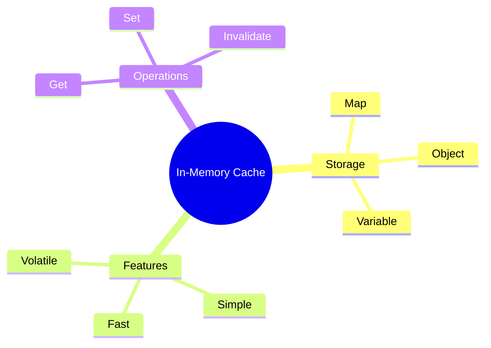

# 💾 In-Memory Caching

> **💡 Lightbulb Moment**: Store API responses in memory to avoid redundant HTTP calls!


## 📋 Table of Contents
- [1. 🔍 What is In-Memory Caching?](#1--what-is-in-memory-caching)
- [2. 📦 Understanding `Map` — The Cache Storage](#2--understanding-map--the-cache-storage)
  - [What is `Map`?](#what-is-map)
  - [`Map` Methods Used in Caching:](#map-methods-used-in-caching)
  - [Why `Map` Instead of Plain Object `{}`?](#why-map-instead-of-plain-object)
  - [Practical Example:](#practical-example)
  - [💡 Key Insight:](#key-insight)
- [3. 🚀 Pros and Cons](#3--pros-and-cons)
- [4. ❓ Interview Questions](#4--interview-questions)
  - [Basic Questions](#basic-questions)
    - [Q1: When use in-memory caching?](#q1-when-use-in-memory-caching)
    - [Q2: How to invalidate cache?](#q2-how-to-invalidate-cache)
  - [Scenario-Based Questions](#scenario-based-questions)
    - [Scenario: Cache with TTL](#scenario-cache-with-ttl)
  - [📦 Data Flow Summary (Visual Box Diagram)](#data-flow-summary-visual-box-diagram)
- [🧊 Refrigerator Analogy (Easy to Remember!)](#refrigerator-analogy-easy-to-remember)
  - [📖 Story to Remember:](#story-to-remember)
  - [🎯 Quick Reference:](#quick-reference)
- [🧠 Mind Map](#mind-map)

---
---

## 1. 🔍 What is In-Memory Caching?

Store HTTP responses in a variable/Map to reuse without making new requests.

```typescript
@Injectable({ providedIn: 'root' })
export class CachingService {
    private cache = new Map<string, any>();
    
    getData(url: string): Observable<any> {
        if (this.cache.has(url)) {
            return of(this.cache.get(url));
        }
        
        return this.http.get(url).pipe(
            tap(data => this.cache.set(url, data))
        );
    }
}
```

---

## 2. 📦 Understanding `Map` — The Cache Storage

The `Map` in the code is JavaScript's **built-in `Map` object** — a key-value data structure perfect for caching.

### What is `Map`?

```typescript
private cache = new Map<string, any>();
//                      ↑        ↑
//                   Key Type  Value Type
//                   (URL)     (API Response)
```

### `Map` Methods Used in Caching:

| Method | Purpose | Example |
|--------|---------|---------|
| `.has(key)` | Check if key exists | `cache.has('/api/users')` → `true/false` |
| `.get(key)` | Retrieve value by key | `cache.get('/api/users')` → `[{...}]` |
| `.set(key, value)` | Store key-value pair | `cache.set('/api/users', data)` |
| `.delete(key)` | Remove specific entry | `cache.delete('/api/users')` |
| `.clear()` | Remove all entries | `cache.clear()` |
| `.size` | Get number of entries | `cache.size` → `5` |

### Why `Map` Instead of Plain Object `{}`?

| `Map` | Plain Object `{}` |
|-------|------------------|
| Keys can be **any type** | Keys must be strings/symbols |
| Maintains **insertion order** | No guaranteed order (pre-ES2015) |
| Has `.size` property | Must manually count with `Object.keys().length` |
| Better for **frequent add/delete** | Slightly faster for simple lookups |
| Cleaner API (`.has()`, `.get()`) | Uses `in` operator or `hasOwnProperty` |
| **Iterable directly** | Need `Object.entries()` |

### Practical Example:

```typescript
const cache = new Map<string, any>();

// ✅ Store API response
cache.set('/api/users', [{ id: 1, name: 'John' }]);
cache.set('/api/products', [{ id: 101, name: 'Laptop' }]);

// ✅ Check before fetching
if (cache.has('/api/users')) {
    const users = cache.get('/api/users'); // ⚡ Instant! No HTTP call
}

// ✅ Check cache size
console.log(cache.size); // 2

// ✅ Iterate over cached items
cache.forEach((value, key) => {
    console.log(`${key}: ${JSON.stringify(value)}`);
});

// ✅ Clear specific entry
cache.delete('/api/users');

// ✅ Clear everything
cache.clear();
```

### 💡 Key Insight:

> Think of `Map` as a **dictionary** where you look up values by their URL "key" — just like looking up a word to find its definition! 📖

---

## 3. 🚀 Pros and Cons

| Pros | Cons |
|------|------|
| Simple | Lost on refresh |
| Fast | Memory usage |
| No dependencies | No expiration |

---

## 4. ❓ Interview Questions

### Basic Questions

#### Q1: When use in-memory caching?
**Answer:**
- Static reference data
- User session data
- Frequently accessed, rarely changing data

#### Q2: How to invalidate cache?
**Answer:**
```typescript
clearCache() { this.cache.clear(); }
invalidate(key: string) { this.cache.delete(key); }
```

---

### Scenario-Based Questions

#### Scenario: Cache with TTL
**Question:** Add expiration to cached items.

**Answer:**
```typescript
private cache = new Map<string, { data: any, expiry: number }>();

getData(url: string, ttlMs = 60000) {
    const cached = this.cache.get(url);
    if (cached && cached.expiry > Date.now()) {
        return of(cached.data);
    }
    return this.http.get(url).pipe(
        tap(data => this.cache.set(url, { data, expiry: Date.now() + ttlMs }))
    );
}
```

---

### 📦 Data Flow Summary (Visual Box Diagram)

```
┌─────────────────────────────────────────────────────────────┐
│  IN-MEMORY CACHING: STORE & REUSE                           │
│                                                             │
│   CACHE FLOW:                                               │
│   ┌───────────────────────────────────────────────────────┐ │
│   │ getData(url) {                                        │ │
│   │   if (cache.has(url)) {       // 1. Check cache       │ │
│   │     return of(cache.get(url)); // 2. Cache HIT ⚡     │ │
│   │   }                                                   │ │
│   │                                                       │ │
│   │   return http.get(url).pipe(   // 3. Cache MISS       │ │
│   │     tap(data => cache.set(url, data))  // 4. Store    │ │
│   │   );                                                  │ │
│   │ }                                                     │ │
│   └───────────────────────────────────────────────────────┘ │
│                                                             │
│   WITH TTL (expiration):                                    │
│   ┌───────────────────────────────────────────────────────┐ │
│   │ cache = Map<string, { data: any, expiry: number }>    │ │
│   │                                                       │ │
│   │ if (cached && cached.expiry > Date.now()) {           │ │
│   │   return of(cached.data);  // Still fresh ✅          │ │
│   │ }                                                     │ │
│   │ // Else: expired, fetch new data                      │ │
│   └───────────────────────────────────────────────────────┘ │
│                                                             │
│   INVALIDATION: cache.delete(key) or cache.clear()         │
└─────────────────────────────────────────────────────────────┘
```

> **Key Takeaway**: Check cache first (Map.has). Store on miss. Add TTL to prevent stale data!

---

## 🧊 Refrigerator Analogy (Easy to Remember!)

Think of in-memory caching like a **refrigerator**:

| Concept | Refrigerator Analogy | Memory Trick |
|---------|---------------------|--------------|
| **Cache** | 🧊 **Fridge**: Quick-access storage for frequent items | **"Keep nearby for quick access"** |
| **Cache Hit** | ✅ **Food already in fridge**: Grab and go, no cooking! | **"Already prepared!"** |
| **Cache Miss** | 🍳 **Fridge empty**: Must cook from scratch (API call) | **"Need to fetch"** |
| **TTL (Expiry)** | ⏰ **Expiration date**: Milk goes bad after 7 days | **"Good until..."** |
| **Invalidation** | 🗑️ **Throw out old food**: Clear when stale | **"Out with the old"** |

### 📖 Story to Remember:

> 🧊 **The Efficient Kitchen**
>
> You're cooking dinner and need ingredients:
>
> **Without Cache (no fridge):**
> ```
> Need milk → Walk to store → Buy milk → Use milk
> Need milk again → Walk to store AGAIN → Buy more milk
> Slow! 🐢
> ```
>
> **With Cache (fridge):**
> ```
> Need milk → Check fridge → "Got it!" → Use milk ⚡
> Need milk again → Check fridge → "Still got it!" → Use ⚡
> Fast! 🚀
> ```
>
> **But watch the expiration!** Old data is like spoiled milk. 🤢

### 🎯 Quick Reference:
```
🧊 Check fridge first = Check cache (Map.has())
✅ Food in fridge    = Return cached data (of(cachedData))
🍳 Fridge empty      = Make API call, store result
⏰ Check expiry      = Compare Date.now() with TTL
🗑️ Throw out         = cache.delete() or cache.clear()
```

---

## 🧠 Mind Map


