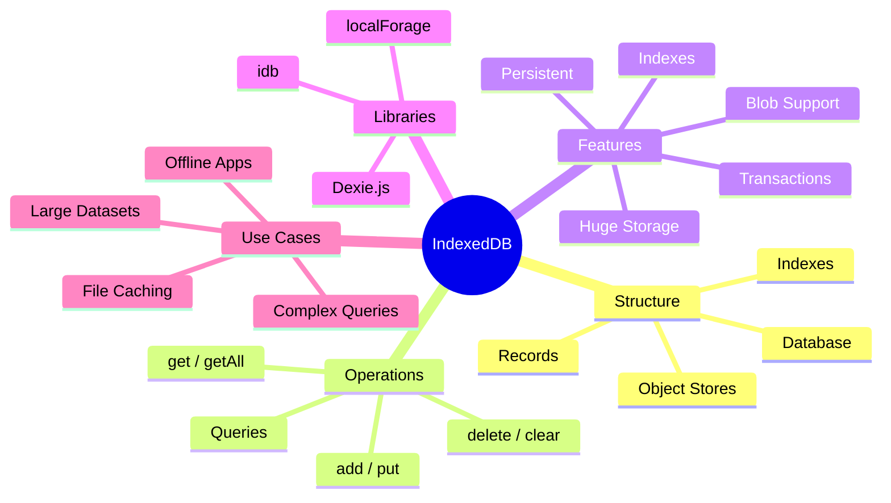

# 📦 IndexedDB Caching

> **💡 Lightbulb Moment**: IndexedDB is a full database in the browser - store gigabytes of data, work offline, and query with indexes!

---

## 1. 🔍 What is IndexedDB?

IndexedDB is a **low-level browser API** for storing large amounts of structured data. Unlike localStorage (5MB, strings only), IndexedDB can store:
- **Objects** (no JSON.stringify needed)
- **Files and Blobs** (images, PDFs, videos)
- **Gigabytes of data** (50%+ of available disk space)

```
┌─────────────────────────────────────────────────────────────────────┐
│  BROWSER STORAGE COMPARISON                                         │
│                                                                     │
│  ┌─────────────┬─────────────────┬─────────────────────────────────┐ │
│  │  Feature    │  localStorage   │  IndexedDB                      │ │
│  ├─────────────┼─────────────────┼─────────────────────────────────┤ │
│  │  Size Limit │  ~5 MB          │  50%+ of disk (gigabytes!)      │ │
│  │  Data Types │  Strings only   │  Objects, Blobs, Files          │ │
│  │  API Style  │  Sync (blocks)  │  Async (non-blocking)           │ │
│  │  Indexing   │  Key only       │  Multiple indexes               │ │
│  │  Queries    │  None           │  Range, compound queries        │ │
│  │  Transactions│ None           │  Full ACID transactions         │ │
│  └─────────────┴─────────────────┴─────────────────────────────────┘ │
└─────────────────────────────────────────────────────────────────────┘
```

---

## 2. 🧱 Core Concepts

### IndexedDB Structure

```
┌─────────────────────────────────────────────────────────────────────┐
│  IndexedDB STRUCTURE                                                │
│                                                                     │
│  Database: "MyAppDB"                                                │
│     │                                                               │
│     ├── Object Store: "users"  (like a table)                       │
│     │      ├── Index: "email" (for fast lookups)                    │
│     │      ├── Index: "createdAt" (for sorting)                     │
│     │      └── Records: [{id: 1, name: "John", email: "..."}]       │
│     │                                                               │
│     ├── Object Store: "products"                                    │
│     │      ├── Index: "category"                                    │
│     │      ├── Index: "price"                                       │
│     │      └── Records: [{id: 1, name: "Laptop", price: 999}]       │
│     │                                                               │
│     └── Object Store: "offlineQueue"                                │
│            └── Records: [{id: 1, action: "POST", data: {...}}]      │
└─────────────────────────────────────────────────────────────────────┘
```

### Key Terms

| Term | Definition | Analogy |
|------|------------|---------|
| **Database** | Container for all data | The filing cabinet |
| **Object Store** | Like a table (collection of records) | A drawer |
| **Record** | A single data object | A file/document |
| **Index** | Enables fast lookups by field | Alphabetical tabs |
| **Key Path** | The unique identifier field | File number |
| **Transaction** | Atomic read/write operation | Locked access |

---

## 3. 💻 Native IndexedDB API (Verbose!)

### Opening a Database

```typescript
// Native API is callback-based and verbose
const request = indexedDB.open('MyAppDB', 1);  // name, version

// Called when database is created or version increases
request.onupgradeneeded = (event: IDBVersionChangeEvent) => {
    const db = (event.target as IDBOpenDBRequest).result;
    
    // Create object stores (tables)
    if (!db.objectStoreNames.contains('users')) {
        const userStore = db.createObjectStore('users', { 
            keyPath: 'id',        // Primary key field
            autoIncrement: true   // Auto-generate IDs
        });
        
        // Create indexes for fast lookups
        userStore.createIndex('email', 'email', { unique: true });
        userStore.createIndex('createdAt', 'createdAt', { unique: false });
    }
};

request.onsuccess = (event) => {
    const db = (event.target as IDBOpenDBRequest).result;
    console.log('Database opened successfully');
};

request.onerror = (event) => {
    console.error('Database error:', (event.target as IDBOpenDBRequest).error);
};
```

### CRUD Operations (Native)

```typescript
// ADD a record
function addUser(db: IDBDatabase, user: User): Promise<number> {
    return new Promise((resolve, reject) => {
        const tx = db.transaction('users', 'readwrite');
        const store = tx.objectStore('users');
        const request = store.add(user);
        
        request.onsuccess = () => resolve(request.result as number);
        request.onerror = () => reject(request.error);
    });
}

// GET by primary key
function getUser(db: IDBDatabase, id: number): Promise<User | undefined> {
    return new Promise((resolve, reject) => {
        const tx = db.transaction('users', 'readonly');
        const store = tx.objectStore('users');
        const request = store.get(id);
        
        request.onsuccess = () => resolve(request.result);
        request.onerror = () => reject(request.error);
    });
}

// GET by index (email)
function getUserByEmail(db: IDBDatabase, email: string): Promise<User | undefined> {
    return new Promise((resolve, reject) => {
        const tx = db.transaction('users', 'readonly');
        const store = tx.objectStore('users');
        const index = store.index('email');
        const request = index.get(email);
        
        request.onsuccess = () => resolve(request.result);
        request.onerror = () => reject(request.error);
    });
}

// GET ALL records
function getAllUsers(db: IDBDatabase): Promise<User[]> {
    return new Promise((resolve, reject) => {
        const tx = db.transaction('users', 'readonly');
        const store = tx.objectStore('users');
        const request = store.getAll();
        
        request.onsuccess = () => resolve(request.result);
        request.onerror = () => reject(request.error);
    });
}

// UPDATE a record
function updateUser(db: IDBDatabase, user: User): Promise<void> {
    return new Promise((resolve, reject) => {
        const tx = db.transaction('users', 'readwrite');
        const store = tx.objectStore('users');
        const request = store.put(user);  // put = update or insert
        
        request.onsuccess = () => resolve();
        request.onerror = () => reject(request.error);
    });
}

// DELETE a record
function deleteUser(db: IDBDatabase, id: number): Promise<void> {
    return new Promise((resolve, reject) => {
        const tx = db.transaction('users', 'readwrite');
        const store = tx.objectStore('users');
        const request = store.delete(id);
        
        request.onsuccess = () => resolve();
        request.onerror = () => reject(request.error);
    });
}
```

---

## 4. 🚀 Dexie.js (Recommended Wrapper)

Native IndexedDB is verbose and callback-heavy. **Dexie.js** provides a much cleaner Promise-based API.

### Installation

```bash
npm install dexie
```

### Database Definition

```typescript
import Dexie, { Table } from 'dexie';

// Define interfaces
interface User {
    id?: number;        // Optional because auto-generated
    name: string;
    email: string;
    createdAt: Date;
}

interface Product {
    id?: number;
    name: string;
    category: string;
    price: number;
}

// Define database class
class AppDatabase extends Dexie {
    users!: Table<User, number>;      // Table<RecordType, PrimaryKeyType>
    products!: Table<Product, number>;
    
    constructor() {
        super('MyAppDB');  // Database name
        
        // Define schema
        this.version(1).stores({
            // 'field1, field2' = indexes
            // '++id' = auto-increment primary key
            // '&email' = unique index
            // 'createdAt' = regular index
            users: '++id, &email, createdAt',
            products: '++id, category, price'
        });
    }
}

// Create singleton instance
export const db = new AppDatabase();
```

### CRUD Operations (Dexie)

```typescript
// ADD
const userId = await db.users.add({
    name: 'John Doe',
    email: 'john@example.com',
    createdAt: new Date()
});

// GET by primary key
const user = await db.users.get(1);

// GET by index
const userByEmail = await db.users
    .where('email')
    .equals('john@example.com')
    .first();

// GET ALL
const allUsers = await db.users.toArray();

// UPDATE
await db.users.update(1, { name: 'John Smith' });

// Or replace entire record
await db.users.put({ id: 1, name: 'John Smith', email: 'john@example.com', createdAt: new Date() });

// DELETE
await db.users.delete(1);

// BULK operations
await db.users.bulkAdd([user1, user2, user3]);
await db.users.bulkPut([user1, user2]);  // Upsert
await db.users.bulkDelete([1, 2, 3]);

// CLEAR entire store
await db.users.clear();
```

### Advanced Queries (Dexie)

```typescript
// Range queries
const recentUsers = await db.users
    .where('createdAt')
    .above(new Date('2024-01-01'))
    .toArray();

// Between range
const priceRange = await db.products
    .where('price')
    .between(100, 500)
    .toArray();

// Multiple conditions
const filteredProducts = await db.products
    .where('category')
    .equals('Electronics')
    .and(p => p.price < 1000)
    .toArray();

// Ordering
const sortedUsers = await db.users
    .orderBy('createdAt')
    .reverse()
    .limit(10)
    .toArray();

// Count
const userCount = await db.users.count();

// First / Last
const firstUser = await db.users.orderBy('createdAt').first();
const lastUser = await db.users.orderBy('createdAt').last();
```

---

## 5. 🔄 Angular Service Implementation

### Complete IndexedDB Cache Service

```typescript
import { Injectable } from '@angular/core';
import Dexie, { Table } from 'dexie';

// Cache entry with TTL
interface CacheEntry<T = any> {
    key: string;
    data: T;
    expiry: number;
    createdAt: number;
}

class CacheDatabase extends Dexie {
    cache!: Table<CacheEntry, string>;
    
    constructor() {
        super('AppCacheDB');
        this.version(1).stores({
            cache: 'key, expiry'  // key = primary key
        });
    }
}

@Injectable({ providedIn: 'root' })
export class IndexedDbCacheService {
    private db = new CacheDatabase();
    
    /**
     * Store data with TTL
     */
    async set<T>(key: string, data: T, ttlSeconds: number = 3600): Promise<void> {
        const entry: CacheEntry<T> = {
            key,
            data,
            expiry: Date.now() + (ttlSeconds * 1000),
            createdAt: Date.now()
        };
        
        await this.db.cache.put(entry);  // put = upsert
    }
    
    /**
     * Get data (returns null if expired or not found)
     */
    async get<T>(key: string): Promise<T | null> {
        const entry = await this.db.cache.get(key);
        
        if (!entry) return null;
        
        // Check expiry
        if (Date.now() > entry.expiry) {
            await this.db.cache.delete(key);  // Auto-cleanup
            return null;
        }
        
        return entry.data as T;
    }
    
    /**
     * Check if key exists and is valid
     */
    async has(key: string): Promise<boolean> {
        return (await this.get(key)) !== null;
    }
    
    /**
     * Delete specific key
     */
    async delete(key: string): Promise<void> {
        await this.db.cache.delete(key);
    }
    
    /**
     * Clear all cache
     */
    async clear(): Promise<void> {
        await this.db.cache.clear();
    }
    
    /**
     * Clean up all expired entries
     */
    async cleanup(): Promise<number> {
        const now = Date.now();
        const expired = await this.db.cache
            .where('expiry')
            .below(now)
            .toArray();
        
        await this.db.cache.bulkDelete(expired.map(e => e.key));
        return expired.length;
    }
    
    /**
     * Get cache statistics
     */
    async getStats(): Promise<{ count: number; keys: string[] }> {
        const entries = await this.db.cache.toArray();
        return {
            count: entries.length,
            keys: entries.map(e => e.key)
        };
    }
}
```

### Using with HTTP Client

```typescript
@Injectable({ providedIn: 'root' })
export class ProductService {
    private cache = inject(IndexedDbCacheService);
    private http = inject(HttpClient);
    
    async getProducts(): Promise<Product[]> {
        const cacheKey = 'products';
        
        // Check cache first
        const cached = await this.cache.get<Product[]>(cacheKey);
        if (cached) {
            console.log('📦 Returning from IndexedDB cache');
            return cached;
        }
        
        // Fetch from API
        console.log('🌐 Fetching from API');
        const products = await firstValueFrom(
            this.http.get<Product[]>('/api/products')
        );
        
        // Store in cache (1 hour TTL)
        await this.cache.set(cacheKey, products, 3600);
        
        return products;
    }
    
    async invalidateCache(): Promise<void> {
        await this.cache.delete('products');
    }
}
```

### Offline-First Pattern

```typescript
@Injectable({ providedIn: 'root' })
export class OfflineFirstService {
    private cache = inject(IndexedDbCacheService);
    private http = inject(HttpClient);
    
    async getData<T>(url: string, ttlSeconds: number = 3600): Promise<T> {
        const cacheKey = `api:${url}`;
        
        // Always try cache first
        const cached = await this.cache.get<T>(cacheKey);
        
        // If online, fetch fresh data in background
        if (navigator.onLine) {
            this.http.get<T>(url).pipe(
                tap(async (data) => {
                    await this.cache.set(cacheKey, data, ttlSeconds);
                })
            ).subscribe();
        }
        
        // Return cached immediately (or wait for fetch if no cache)
        if (cached) {
            return cached;
        }
        
        // No cache - must wait for fetch
        const data = await firstValueFrom(this.http.get<T>(url));
        await this.cache.set(cacheKey, data, ttlSeconds);
        return data;
    }
}
```

---

## 6. 📦 Storing Files and Blobs

IndexedDB can store binary data directly:

```typescript
class MediaDatabase extends Dexie {
    images!: Table<{ id: string; blob: Blob; mimeType: string }, string>;
    
    constructor() {
        super('MediaDB');
        this.version(1).stores({
            images: 'id'
        });
    }
}

const mediaDb = new MediaDatabase();

// Store an image
async function cacheImage(url: string): Promise<void> {
    const response = await fetch(url);
    const blob = await response.blob();
    
    await mediaDb.images.put({
        id: url,
        blob,
        mimeType: response.headers.get('content-type') || 'image/png'
    });
}

// Get cached image as Object URL
async function getCachedImage(url: string): Promise<string | null> {
    const entry = await mediaDb.images.get(url);
    if (!entry) return null;
    
    return URL.createObjectURL(entry.blob);
}
```

---

## 7. 🚀 Pros and Cons

| ✅ Pros | ❌ Cons |
|---------|---------|
| **Huge storage** - Gigabytes of data | **Async only** - All operations return Promises |
| **Persists** - Survives refresh/restart | **Complex API** - Verbose without wrapper |
| **Structured** - Real database with indexes | **No SQL** - Different query syntax |
| **Files/Blobs** - Store binary data | **Version upgrades** - Must manage schema |
| **Transactions** - ACID compliance | **Browser support** - Minor differences |
| **Non-blocking** - Doesn't freeze UI | **Debugging** - Harder to inspect |

---

## 8. 📊 When to Use IndexedDB vs Others

| Use Case | Best Choice | Why |
|----------|-------------|-----|
| Small config data | localStorage | Simple, 5MB enough |
| Session data | sessionStorage | Cleared on close |
| API response caching | Memory/shareReplay | Fast, simple |
| Large datasets (1000+ records) | **IndexedDB** | No size limit |
| Offline-first app | **IndexedDB** | Persistent + structured |
| File/image caching | **IndexedDB** | Blob support |
| Complex queries | **IndexedDB** | Indexes + ranges |
| Sync across tabs | **IndexedDB** | Shared database |

---

## 9. ❓ Interview Questions

### Basic Questions

#### Q1: What is IndexedDB?
**Answer:**
IndexedDB is a low-level browser API for storing large amounts of structured data. Unlike localStorage (5MB, strings), IndexedDB supports objects, files, and gigabytes of storage with async operations and indexing.

#### Q2: IndexedDB vs localStorage?
**Answer:**
| localStorage | IndexedDB |
|--------------|-----------|
| 5MB limit | Gigabytes |
| Strings only | Any data type |
| Synchronous (blocks) | Async (non-blocking) |
| Key-only lookup | Indexes + queries |
| Simple API | Complex but powerful |

#### Q3: What is an Object Store?
**Answer:**
An Object Store is like a database table - a collection of records with a primary key. Each database can have multiple object stores, and each store can have indexes for fast lookups.

#### Q4: Why use Dexie.js?
**Answer:**
Native IndexedDB uses callbacks and is verbose. Dexie provides:
- Promise-based API
- TypeScript support
- Simpler queries
- Automatic version handling
- Better error handling

---

### Scenario-Based Questions

#### Scenario 1: Offline Queue
**Question:** Implement a queue that stores failed requests for retry when online.

**Answer:**
```typescript
class OfflineQueueDB extends Dexie {
    queue!: Table<{ id?: number; method: string; url: string; body: any; timestamp: number }, number>;
    
    constructor() {
        super('OfflineQueueDB');
        this.version(1).stores({
            queue: '++id, timestamp'
        });
    }
}

const queueDb = new OfflineQueueDB();

// Add to queue when offline
async function queueRequest(method: string, url: string, body: any) {
    await queueDb.queue.add({ method, url, body, timestamp: Date.now() });
}

// Process queue when online
async function processQueue() {
    const requests = await queueDb.queue.orderBy('timestamp').toArray();
    
    for (const req of requests) {
        await fetch(req.url, { method: req.method, body: JSON.stringify(req.body) });
        await queueDb.queue.delete(req.id!);
    }
}

// Listen for online event
window.addEventListener('online', processQueue);
```

#### Scenario 2: Image Cache with Size Limit
**Question:** Cache images but limit total size to 100MB.

**Answer:**
```typescript
async function cacheImageWithLimit(url: string, blob: Blob) {
    const MAX_SIZE = 100 * 1024 * 1024; // 100MB
    
    // Get current total size
    const all = await mediaDb.images.toArray();
    const currentSize = all.reduce((sum, img) => sum + img.blob.size, 0);
    
    // If adding this would exceed limit, remove oldest
    if (currentSize + blob.size > MAX_SIZE) {
        const oldest = all.sort((a, b) => a.timestamp - b.timestamp);
        let freed = 0;
        
        for (const img of oldest) {
            if (freed >= blob.size) break;
            await mediaDb.images.delete(img.id);
            freed += img.blob.size;
        }
    }
    
    await mediaDb.images.put({ id: url, blob, timestamp: Date.now() });
}
```

---

## 10. 🏦 Bank Vault Analogy

Think of IndexedDB like a **bank vault**:

| Concept | Bank Vault Analogy | Memory Trick |
|---------|-------------------|--------------|
| **IndexedDB** | 🏦 **The vault**: Secure, massive storage | **"Industrial strength"** |
| **Object Store** | 🗄️ **Safety deposit boxes**: Organized sections | **"Tables/collections"** |
| **Record** | 📦 **Box contents**: Your actual valuables | **"Your data"** |
| **Index** | 📑 **Box registry**: Quick lookup by owner name | **"Fast search"** |
| **Transaction** | 🔐 **Vault access session**: Locked while you work | **"Atomic operations"** |
| **Version** | 🏗️ **Vault renovation**: Change layout, add boxes | **"Schema migration"** |

### 📖 Story to Remember:

> 🏦 **The Bank Vault (IndexedDB)**
>
> You're storing valuables in a bank:
>
> **localStorage = Your Pocket** 👖
> ```
> - Small items only (5MB)
> - Easy access but limited
> - Emptied when you change clothes (clear data)
> ```
>
> **IndexedDB = Bank Vault** 🏦
> ```
> - Massive storage (gigabytes)
> - Organized into boxes (object stores)
> - Registry for quick lookups (indexes)
> - Secure transactions (ACID)
> - Survives anything (persistent)
> ```
>
> **When to use the vault?**
> - Storing thousands of items
> - Need to search by multiple criteria
> - Must survive power outages
> - Storing files and documents

---

## 11. 🧠 Mind Map



---

## 🎯 Quick Reference

```typescript
// Using Dexie.js

// Define database
class AppDB extends Dexie {
    users!: Table<User, number>;
    constructor() {
        super('MyDB');
        this.version(1).stores({ users: '++id, email' });
    }
}
const db = new AppDB();

// CRUD
await db.users.add({ name: 'John', email: 'john@example.com' });
const user = await db.users.get(1);
const all = await db.users.toArray();
await db.users.update(1, { name: 'Jane' });
await db.users.delete(1);

// Queries
await db.users.where('email').equals('john@example.com').first();
await db.users.orderBy('name').limit(10).toArray();
await db.users.where('id').above(5).toArray();

// Bulk
await db.users.bulkAdd([user1, user2]);
await db.users.clear();
```
