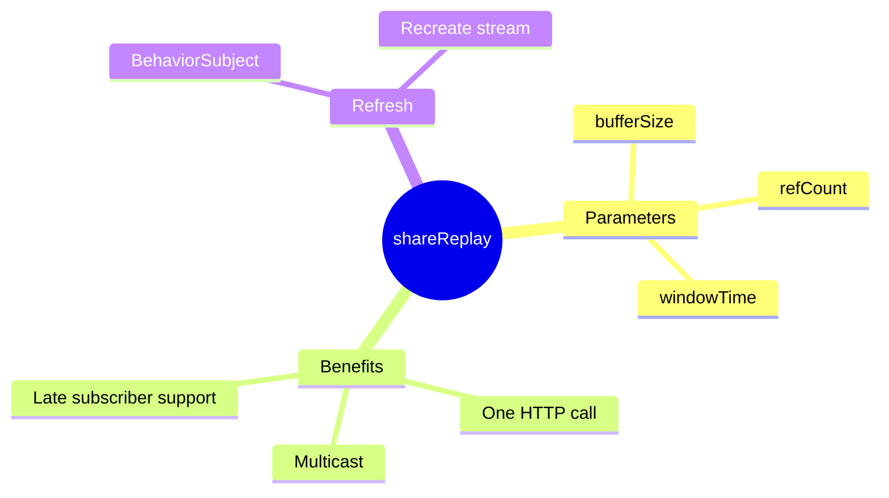

# 🔄 shareReplay Caching

> **💡 Lightbulb Moment**: shareReplay() makes an Observable multicasted AND cached - one HTTP call for many subscribers!


## 📋 Table of Contents
- [1. 🔍 What is shareReplay?](#1--what-is-sharereplay)
- [2. 🚀 How It Works](#2--how-it-works)
- [2.5 📦 Understanding Buffer Size: `shareReplay(N)`](#25--understanding-buffer-size-sharereplayn)
  - [What Does the Number Mean?](#what-does-the-number-mean)
  - [Visual Example with `shareReplay(2)`:](#visual-example-with-sharereplay2)
  - [Comparison Table:](#comparison-table)
  - [For HTTP Calls — Always Use `1`:](#for-http-calls--always-use-1)
  - [Practical Examples:](#practical-examples)
  - [Quick Reference:](#quick-reference)
- [3. 🧪 Deep Dive: How `share()` and `shareReplay()` Work Internally](#3--deep-dive-how-share-and-sharereplay-work-internally)
  - [The Problem: Cold Observables](#the-problem-cold-observables)
  - [The Solution: Multicasting](#the-solution-multicasting)
  - [🔹 How `share()` Works](#how-share-works)
  - [🔹 How `shareReplay()` Works](#how-sharereplay-works)
  - [🔹 Side-by-Side Comparison](#side-by-side-comparison)
  - [🔹 `shareReplay()` Configuration Options](#sharereplay-configuration-options)
  - [🔹 When to Use Which?](#when-to-use-which)
  - [🔹 Practical HTTP Caching Pattern](#practical-http-caching-pattern)
- [4. 📋 Practical Usage Guide](#4--practical-usage-guide)
  - [Basic Service Setup](#basic-service-setup)
  - [Using in Components](#using-in-components)
  - [Using Async Pipe (Recommended)](#using-async-pipe-recommended)
  - [Common Patterns](#common-patterns)
    - [Pattern 1: Config Service (Load Once, Use Everywhere)](#pattern-1-config-service-load-once-use-everywhere)
    - [Pattern 2: Refresh Cache on Demand](#pattern-2-refresh-cache-on-demand)
      - [🔬 Deep Dive: How Refresh Pattern Works](#deep-dive-how-refresh-pattern-works)
    - [Pattern 3: Cache with TTL (Auto-Expire)](#pattern-3-cache-with-ttl-auto-expire)
  - [⚠️ Common Mistakes to Avoid](#common-mistakes-to-avoid)
  - [🎯 Quick Reference Table](#quick-reference-table)
- [5. ❓ Interview Questions](#5--interview-questions)
  - [Basic Questions](#basic-questions)
    - [Q1: share() vs shareReplay()?](#q1-share-vs-sharereplay)
    - [Q2: How to refresh shareReplay cache?](#q2-how-to-refresh-sharereplay-cache)
  - [Scenario-Based Questions](#scenario-based-questions)
    - [Scenario: Config Service](#scenario-config-service)
  - [📦 Data Flow Summary (Visual Box Diagram)](#data-flow-summary-visual-box-diagram)
- [📹 YouTube Video Cache Analogy (Easy to Remember!)](#youtube-video-cache-analogy-easy-to-remember)
  - [📖 Story to Remember:](#story-to-remember)
  - [🎯 Quick Reference:](#quick-reference)
- [🧠 Mind Map](#mind-map)

---
---

## 1. 🔍 What is shareReplay?

Multicasts the Observable and replays the last N emissions to new subscribers.

```typescript
@Injectable({ providedIn: 'root' })
export class UserService {
    private user$ = this.http.get<User>('/api/user').pipe(
        shareReplay(1)  // Cache last emission
    );
    
    getUser() { return this.user$; }
}
```

---

## 2. 🚀 How It Works

```
First subscriber → HTTP call made → Response cached
Second subscriber → Uses cached response (no HTTP call!)
Third subscriber → Uses cached response (no HTTP call!)
```

---

## 2.5 📦 Understanding Buffer Size: `shareReplay(N)`

The number in `shareReplay(N)` is the **buffer size** — how many emissions to cache and replay to late subscribers.

### What Does the Number Mean?

```typescript
shareReplay(1)   // Cache last 1 value
shareReplay(2)   // Cache last 2 values
shareReplay(5)   // Cache last 5 values
```

### Visual Example with `shareReplay(2)`:

```typescript
const source$ = interval(1000).pipe(
    take(5),           // Emits: 0, 1, 2, 3, 4
    shareReplay(2)     // Buffer last 2 values
);
```

```
┌─────────────────────────────────────────────────────────────────────┐
│  shareReplay(2) - Buffer Size = 2                                  │
│                                                                     │
│  TIME:     0s     1s     2s     3s     4s                          │
│  SOURCE:   0      1      2      3      4                           │
│                                                                     │
│  Buffer after each emission:                                        │
│    After 0: [0]           ← 1 value buffered                       │
│    After 1: [0, 1]        ← 2 values buffered (max reached)        │
│    After 2: [1, 2]        ← Oldest (0) dropped, newest (2) added   │
│    After 3: [2, 3]        ← Oldest (1) dropped, newest (3) added   │
│    After 4: [3, 4]        ← Final buffer state                     │
│                                                                     │
│  ─────────────────────────────────────────────────────────────────  │
│                                                                     │
│  Subscriber A (joins at 0s):                                        │
│    Gets: 0 → 1 → 2 → 3 → 4 (all live)                              │
│                                                                     │
│  Subscriber B (joins at 3.5s):                                      │
│    Gets: 2, 3 (replayed from buffer) → then 4 (live)               │
│           └── Last 2 buffered values!                              │
└─────────────────────────────────────────────────────────────────────┘
```

### Comparison Table:

| `shareReplay(N)` | What Gets Replayed | Use Case |
|------------------|-------------------|----------|
| `shareReplay(1)` | Only the **last 1** value | HTTP calls, single emissions |
| `shareReplay(2)` | Last **2** values | Price history, before/after |
| `shareReplay(5)` | Last **5** values | Recent logs, chart data |
| `shareReplay(100)` | Last **100** values | Long history streams |

### For HTTP Calls — Always Use `1`:

```typescript
// HTTP returns ONE response, so buffer 1 is enough
const user$ = this.http.get('/api/user').pipe(
    shareReplay(1)  // ← HTTP only emits once anyway
);

// Using shareReplay(2) for HTTP is wasteful - only 1 emission exists!
```

### Practical Examples:

```typescript
// ✅ API Response (single emission)
user$ = this.http.get('/api/user').pipe(shareReplay(1));

// ✅ Stock prices (show last 2 for comparison)
prices$ = this.stockService.getPrices().pipe(shareReplay(2));

// ✅ Chat messages (show last 10 for context)
messages$ = this.chatService.getMessages().pipe(shareReplay(10));

// ✅ Sensor readings (show history)
readings$ = this.sensorService.getReadings().pipe(shareReplay(50));
```

### Quick Reference:

| Value | Best For |
|-------|----------|
| `shareReplay(1)` | HTTP calls, configs, single values |
| `shareReplay(2+)` | Streams where history matters (charts, logs, prices) |

---

## 3. 🧪 Deep Dive: How `share()` and `shareReplay()` Work Internally

### The Problem: Cold Observables

By default, HTTP Observables are **"cold"** — each subscription triggers a NEW execution:

```typescript
// ❌ COLD Observable - Each subscription = NEW HTTP call!
const user$ = this.http.get('/api/user');

user$.subscribe();  // HTTP call #1
user$.subscribe();  // HTTP call #2
user$.subscribe();  // HTTP call #3
// 😱 3 API calls for the same data!
```

### The Solution: Multicasting

Both `share()` and `shareReplay()` convert cold observables to **"hot"** by using a **Subject** internally.

---

### 🔹 How `share()` Works

`share()` = `multicast(() => new Subject()) + refCount()`

```typescript
const data$ = this.http.get('/api/data').pipe(
    share()  // Multicast using Subject
);
```

**Internal Mechanism:**

```
┌─────────────────────────────────────────────────────────────────┐
│  share() INTERNALS                                              │
│                                                                 │
│  ┌──────────────┐    ┌──────────────┐    ┌──────────────────┐  │
│  │ HTTP Source  │───▶│   Subject    │───▶│  Subscribers     │  │
│  │ (Cold)       │    │ (Multicast)  │    │  (Many)          │  │
│  └──────────────┘    └──────────────┘    └──────────────────┘  │
│                              │                                  │
│                    Acts as both:                                │
│                    - Observer (receives from source)            │
│                    - Observable (emits to subscribers)          │
└─────────────────────────────────────────────────────────────────┘
```

**Behavior:**

```typescript
const data$ = interval(1000).pipe(
    take(5),
    share()
);

// Time 0s: Subscriber A subscribes → Source starts
data$.subscribe(v => console.log('A:', v));  // A: 0, 1, 2...

// Time 2.5s: Subscriber B joins LATE
data$.subscribe(v => console.log('B:', v));  // B: 3, 4 (missed 0,1,2!)

// ⚠️ Late subscribers MISS past emissions!
```

**Key Points:**
| Aspect | `share()` Behavior |
|--------|-------------------|
| Uses internally | `Subject` |
| Replays past values | ❌ No |
| Late subscribers | Miss past emissions |
| Auto cleanup | ✅ Yes (refCount) |
| Best for | Live data streams |

---

### 🔹 How `shareReplay()` Works

`shareReplay(n)` = `multicast(() => new ReplaySubject(n)) + refCount`

```typescript
const data$ = this.http.get('/api/data').pipe(
    shareReplay(1)  // Multicast using ReplaySubject(1)
);
```

**Internal Mechanism:**

```
┌─────────────────────────────────────────────────────────────────┐
│  shareReplay(1) INTERNALS                                       │
│                                                                 │
│  ┌──────────────┐    ┌──────────────────┐    ┌──────────────┐  │
│  │ HTTP Source  │───▶│  ReplaySubject   │───▶│  Subscribers │  │
│  │ (Cold)       │    │  (Buffer: 1)     │    │  (Many)      │  │
│  └──────────────┘    └──────────────────┘    └──────────────┘  │
│                              │                                  │
│                    ┌─────────▼─────────┐                        │
│                    │ 📦 Buffer Cache   │                        │
│                    │ Stores last N     │                        │
│                    │ emissions         │                        │
│                    └───────────────────┘                        │
│                                                                 │
│  Late subscriber joins → Gets buffered value IMMEDIATELY!       │
└─────────────────────────────────────────────────────────────────┘
```

**Behavior:**

```typescript
const data$ = interval(1000).pipe(
    take(5),
    shareReplay(1)  // Buffer size = 1
);

// Time 0s: Subscriber A subscribes → Source starts
data$.subscribe(v => console.log('A:', v));  // A: 0, 1, 2, 3, 4

// Time 2.5s: Subscriber B joins LATE
data$.subscribe(v => console.log('B:', v));  // B: 2 (replayed!), 3, 4

// ✅ Late subscribers GET the last buffered value!
```

**Key Points:**
| Aspect | `shareReplay(1)` Behavior |
|--------|--------------------------|
| Uses internally | `ReplaySubject` |
| Replays past values | ✅ Yes (last N) |
| Late subscribers | Get cached value instantly |
| Auto cleanup | ⚠️ Only with `refCount: true` |
| Best for | API caching, config loading |

---

### 🔹 Side-by-Side Comparison

```
┌─────────────────────────────────────────────────────────────────┐
│  share() vs shareReplay(1) TIMELINE                             │
│                                                                 │
│  TIME:    0s      1s      2s      2.5s    3s      4s            │
│           │       │       │       │       │       │             │
│  SOURCE:  ├───0───├───1───├───2───│───────├───3───├───4──▶      │
│           │       │       │       │       │       │             │
│  ─────────┼───────┼───────┼───────┼───────┼───────┼─────────    │
│           │       │       │       │       │       │             │
│  share(): │       │       │       │       │       │             │
│  Sub A:   ○───0───○───1───○───2───│───────○───3───○───4         │
│  Sub B:   │       │       │    (joins)────○───3───○───4         │
│           │       │       │       ❌ Missed 0,1,2!              │
│  ─────────┼───────┼───────┼───────┼───────┼───────┼─────────    │
│           │       │       │       │       │       │             │
│  shareReplay(1):  │       │       │       │       │             │
│  Sub A:   ○───0───○───1───○───2───│───────○───3───○───4         │
│  Sub B:   │       │       │    (joins)                          │
│           │       │       │       ○──2 (replay!)──3───4         │
│           │       │       │       ✅ Got cached!                │
└─────────────────────────────────────────────────────────────────┘
```

---

### 🔹 `shareReplay()` Configuration Options

```typescript
shareReplay({
    bufferSize: 1,      // How many emissions to cache
    refCount: true,     // Auto-cleanup when no subscribers
    windowTime: 30000   // Optional: TTL in ms
})
```

| Option | Description | Default |
|--------|-------------|---------|
| `bufferSize` | Number of emissions to cache | Required |
| `refCount` | Auto-unsubscribe from source when all unsubscribe | `false` |
| `windowTime` | How long to keep cached values (ms) | `Infinity` |

**⚠️ Memory Warning:**

```typescript
// ❌ MEMORY LEAK RISK! (refCount defaults to false)
shareReplay(1)  

// ✅ SAFE - Source cleans up when all unsubscribe
shareReplay({ bufferSize: 1, refCount: true })
```

---

### 🔹 When to Use Which?

| Use Case | Operator | Why |
|----------|----------|-----|
| **API caching** | `shareReplay(1)` | Late components get cached data |
| **Config loading** | `shareReplay(1)` | Load once, use everywhere |
| **Live WebSocket** | `share()` | Only care about current/future data |
| **Real-time prices** | `share()` | Past prices irrelevant |
| **User session** | `shareReplay(1)` | New components need current user |

---

### 🔹 Practical HTTP Caching Pattern

```typescript
@Injectable({ providedIn: 'root' })
export class UserService {
    // ✅ Best practice: refCount + bufferSize
    private user$ = this.http.get<User>('/api/user').pipe(
        shareReplay({ bufferSize: 1, refCount: true })
    );

    constructor(private http: HttpClient) {}

    getUser(): Observable<User> {
        return this.user$;
    }
}
```

**What happens:**

```
Component A calls getUser()  →  HTTP call made, response cached
Component B calls getUser()  →  Returns cached response ⚡ (no HTTP!)
Component C calls getUser()  →  Returns cached response ⚡ (no HTTP!)

All components unsubscribe   →  refCount: true cleans up the source
```

---

## 4. 📋 Practical Usage Guide

### Basic Service Setup

```typescript
import { Injectable } from '@angular/core';
import { HttpClient } from '@angular/common/http';
import { Observable } from 'rxjs';
import { shareReplay } from 'rxjs/operators';

@Injectable({ providedIn: 'root' })
export class UserService {
    // ✅ Define cached Observable as a PROPERTY (not inside a method!)
    private user$ = this.http.get<User>('/api/user').pipe(
        shareReplay({ bufferSize: 1, refCount: true })
    );

    constructor(private http: HttpClient) {}

    // ✅ Return the SAME Observable to all callers
    getUser(): Observable<User> {
        return this.user$;
    }
}
```

---

### Using in Components

```typescript
// Component A - First to subscribe
@Component({
    selector: 'app-header',
    template: `
        @if (user$ | async; as user) {
            <span>Welcome, {{ user.name }}!</span>
        }
    `
})
export class HeaderComponent {
    user$ = inject(UserService).getUser();  // ← Triggers HTTP call
}

// Component B - Subscribes LATER (gets cached data!)
@Component({
    selector: 'app-profile',
    template: `
        @if (user$ | async; as user) {
            <h1>{{ user.name }}</h1>
            <p>{{ user.email }}</p>
        }
    `
})
export class ProfileComponent {
    user$ = inject(UserService).getUser();  // ← Gets cached! No HTTP call!
}

// Component C - Also gets cached data
@Component({
    selector: 'app-sidebar',
    template: ``
})
export class SidebarComponent {
    user$ = inject(UserService).getUser();  // ← Gets cached! No HTTP call!
}
```

---

### Using Async Pipe (Recommended)

```html
<!-- Angular 17+ with @if -->
@if (user$ | async; as user) {
    <div class="user-card">
        <h1>{{ user.name }}</h1>
        <p>{{ user.email }}</p>
    </div>
}

<!-- Or with *ngIf -->
<div *ngIf="user$ | async as user" class="user-card">
    <h1>{{ user.name }}</h1>
    <p>{{ user.email }}</p>
</div>
```

> **Why Async Pipe?** Angular handles subscribe/unsubscribe automatically. No memory leaks!

---

### Common Patterns

#### Pattern 1: Config Service (Load Once, Use Everywhere)

```typescript
@Injectable({ providedIn: 'root' })
export class ConfigService {
    private http = inject(HttpClient);

    // Loaded once, cached forever
    config$ = this.http.get<AppConfig>('/api/config').pipe(
        shareReplay({ bufferSize: 1, refCount: true })
    );
}

// Usage in any component:
config$ = inject(ConfigService).config$;
```

#### Pattern 2: Refresh Cache on Demand

```typescript
@Injectable({ providedIn: 'root' })
export class ProductService {
    private http = inject(HttpClient);
    private refreshTrigger$ = new BehaviorSubject<void>(undefined);

    products$ = this.refreshTrigger$.pipe(
        switchMap(() => this.http.get<Product[]>('/api/products')),
        shareReplay({ bufferSize: 1, refCount: true })
    );

    // Call this to force a fresh HTTP call
    refresh(): void {
        this.refreshTrigger$.next();
    }
}

// In component:
productService.refresh();  // Forces new API call
```

##### 🔬 Deep Dive: How Refresh Pattern Works

**The Problem:** `shareReplay` caches forever after first call:

```typescript
// ❌ This will NEVER fetch fresh data after first call
private user$ = this.http.get('/api/user').pipe(
    shareReplay({ bufferSize: 1, refCount: true })
);
```

**The Solution:** Use `BehaviorSubject` as a trigger:

```typescript
// 1️⃣ BehaviorSubject acts as a "trigger"
private refreshTrigger$ = new BehaviorSubject<void>(undefined);
//                        └── Emits immediately on subscribe

// 2️⃣ Products stream: triggered by refreshTrigger$
products$ = this.refreshTrigger$.pipe(
    switchMap(() => this.http.get<Product[]>('/api/products')),
    //        └── Every trigger emission = NEW HTTP call
    shareReplay({ bufferSize: 1, refCount: true })
);

// 3️⃣ Force refresh
refresh(): void {
    this.refreshTrigger$.next();  // ← Emit → triggers switchMap → NEW HTTP call!
}
```

**Execution Flow:**

```
┌─────────────────────────────────────────────────────────────────────┐
│  INITIAL LOAD (Component subscribes)                               │
│                                                                     │
│  1. Component subscribes to products$                               │
│       │                                                             │
│       ▼                                                             │
│  2. BehaviorSubject emits immediately (initial value: undefined)    │
│       │                                                             │
│       ▼                                                             │
│  3. switchMap receives emission → HTTP GET /api/products            │
│       │                                                             │
│       ▼                                                             │
│  4. Response cached by shareReplay                                  │
│       │                                                             │
│       ▼                                                             │
│  5. Component receives data ✅                                      │
└─────────────────────────────────────────────────────────────────────┘

┌─────────────────────────────────────────────────────────────────────┐
│  REFRESH (User clicks refresh)                                     │
│                                                                     │
│  1. User clicks → productService.refresh()                          │
│       │                                                             │
│       ▼                                                             │
│  2. refreshTrigger$.next() emits NEW value                          │
│       │                                                             │
│       ▼                                                             │
│  3. switchMap receives emission → NEW HTTP GET /api/products        │
│       │                    └── CANCELS any pending request          │
│       ▼                                                             │
│  4. shareReplay REPLACES cached value with fresh data               │
│       │                                                             │
│       ▼                                                             │
│  5. ALL subscribers receive fresh data ✅                           │
└─────────────────────────────────────────────────────────────────────┘
```

**Why `BehaviorSubject`?**

| Subject Type | Behavior | Why Use It? |
|--------------|----------|-------------|
| **BehaviorSubject** | Emits initial value immediately | ✅ Auto-fetches on first subscribe |
| **Subject** | Only emits future values | ❌ Requires manual first trigger |

**Why `switchMap`?**

```
switchMap = Cancel previous + Switch to new

User clicks refresh rapidly:
Click 1 → HTTP #1 starts...
Click 2 → HTTP #1 CANCELLED ❌, HTTP #2 starts...
Click 3 → HTTP #2 CANCELLED ❌, HTTP #3 completes ✅
```

**Complete Working Example:**

```typescript
// Service
@Injectable({ providedIn: 'root' })
export class ProductService {
    private http = inject(HttpClient);
    private refreshTrigger$ = new BehaviorSubject<void>(undefined);

    products$ = this.refreshTrigger$.pipe(
        switchMap(() => this.http.get<Product[]>('/api/products')),
        shareReplay({ bufferSize: 1, refCount: true })
    );

    refresh(): void {
        this.refreshTrigger$.next();
    }
}

// Component
@Component({
    template: `
        <button (click)="refresh()">🔄 Refresh</button>
        
        @for (product of products$ | async; track product.id) {
            <div>{{ product.name }} - {{ product.price }}</div>
        }
    `
})
export class ProductListComponent {
    private productService = inject(ProductService);
    products$ = this.productService.products$;

    refresh(): void {
        this.productService.refresh();
    }
}
```

#### Pattern 3: Cache with TTL (Auto-Expire)

```typescript
@Injectable({ providedIn: 'root' })
export class DataService {
    private http = inject(HttpClient);

    // Cache expires after 30 seconds
    data$ = this.http.get('/api/data').pipe(
        shareReplay({
            bufferSize: 1,
            refCount: true,
            windowTime: 30000  // 30 seconds TTL
        })
    );
}
```

---

### ⚠️ Common Mistakes to Avoid

```typescript
// ❌ WRONG: Creates NEW Observable on every call = NO CACHING!
getUser() {
    return this.http.get('/api/user').pipe(
        shareReplay(1)  // New pipe created each time!
    );
}

// ✅ CORRECT: Store as PROPERTY = Same Observable shared
private user$ = this.http.get('/api/user').pipe(
    shareReplay({ bufferSize: 1, refCount: true })
);

getUser() {
    return this.user$;  // Returns SAME Observable every time
}
```

```typescript
// ❌ WRONG: Missing refCount (memory leak risk!)
shareReplay(1)

// ✅ CORRECT: Always use refCount: true
shareReplay({ bufferSize: 1, refCount: true })
```

---

### 🎯 Quick Reference Table

| Task | Code |
|------|------|
| **Cache 1 value** | `shareReplay({ bufferSize: 1, refCount: true })` |
| **Cache 5 values** | `shareReplay({ bufferSize: 5, refCount: true })` |
| **Cache with 30s expiry** | `shareReplay({ bufferSize: 1, refCount: true, windowTime: 30000 })` |
| **Force refresh** | Use `BehaviorSubject` + `switchMap` pattern |
| **Clear cache** | Recreate the Observable or use refresh pattern |

---

## 5. ❓ Interview Questions

### Basic Questions

#### Q1: share() vs shareReplay()?
**Answer:**
| share() | shareReplay(1) |
|---------|---------------|
| No replay | Replays last value |
| Late subscribers miss | Late subscribers get cached |

#### Q2: How to refresh shareReplay cache?
**Answer:** Create new Observable:
```typescript
private userSubject = new BehaviorSubject<void>(undefined);

user$ = this.userSubject.pipe(
    switchMap(() => this.http.get<User>('/api/user')),
    shareReplay(1)
);

refresh() { this.userSubject.next(); }
```

---

### Scenario-Based Questions

#### Scenario: Config Service
**Question:** Load app config once, share everywhere.

**Answer:**
```typescript
@Injectable({ providedIn: 'root' })
export class ConfigService {
    config$ = this.http.get<Config>('/api/config').pipe(
        shareReplay({ bufferSize: 1, refCount: true })
    );
}
```

---

### 📦 Data Flow Summary (Visual Box Diagram)

```
┌─────────────────────────────────────────────────────────────┐
│  shareReplay(): MULTICAST + CACHE                           │
│                                                             │
│   WITHOUT shareReplay:                                      │
│   ┌───────────────────────────────────────────────────────┐ │
│   │ subscriber1.subscribe() → HTTP call #1                │ │
│   │ subscriber2.subscribe() → HTTP call #2                │ │
│   │ subscriber3.subscribe() → HTTP call #3                │ │
│   │ ❌ 3 API calls! Wasteful!                             │ │
│   └───────────────────────────────────────────────────────┘ │
│                                                             │
│   WITH shareReplay(1):                                      │
│   ┌───────────────────────────────────────────────────────┐ │
│   │ user$ = http.get('/api/user').pipe(                   │ │
│   │   shareReplay(1)  // Cache last emission              │ │
│   │ );                                                    │ │
│   │                                                       │ │
│   │ subscriber1.subscribe() → HTTP call, cache result     │ │
│   │ subscriber2.subscribe() → Returns cached! ⚡          │ │
│   │ subscriber3.subscribe() → Returns cached! ⚡          │ │
│   │ ✅ 1 API call! Efficient!                             │ │
│   └───────────────────────────────────────────────────────┘ │
│                                                             │
│   refCount: true → Cleanup when all unsubscribe            │
└─────────────────────────────────────────────────────────────┘
```

> **Key Takeaway**: shareReplay(1) = one HTTP call, many subscribers. Use refCount:true for auto cleanup!

---

## 📹 YouTube Video Cache Analogy (Easy to Remember!)

Think of shareReplay like **YouTube video buffering**:

| Concept | YouTube Analogy | Memory Trick |
|---------|----------------|--------------| 
| **shareReplay(1)** | 📹 **Buffered video**: First viewer buffers, others get instant | **"Buffer once, share forever"** |
| **First subscriber** | 👤 **First viewer**: Waits for video to load | **"Triggers the fetch"** |
| **Late subscribers** | 👥 **Late viewers**: Video already buffered, instant play! | **"Get cached result"** |
| **refCount: true** | 🔌 **Auto-pause**: If everyone leaves, stop buffering | **"Cleanup when unused"** |
| **No shareReplay** | 😰 **Re-buffer every time**: Each viewer reloads video! | **"Wasteful repeats"** |

### 📖 Story to Remember:

> 📹 **The YouTube Watch Party**
>
> You're hosting a watch party:
>
> **Without shareReplay:**
> ```
> Friend 1 clicks play → Video loads from server 🐢
> Friend 2 clicks play → Video loads AGAIN from server 🐢
> Friend 3 clicks play → Video loads AGAIN from server 🐢
> 3 API calls! Wasteful! 😰
> ```
>
> **With shareReplay(1):**
> ```
> Friend 1 clicks play → Video loads & buffers 📹
> Friend 2 clicks play → "Already buffered!" Instant! ⚡
> Friend 3 clicks play → "Already buffered!" Instant! ⚡
> 1 API call! Efficient! 🎉
> ```
>
> **Everyone watches the SAME buffered video!**

### 🎯 Quick Reference:
```
📹 shareReplay(1)   = Buffer last result for all viewers
👤 First subscriber = Triggers the actual API call
👥 Late subscribers = Get instant cached result
🔌 refCount: true   = Stop buffering when all leave
```

---

## 🧠 Mind Map


