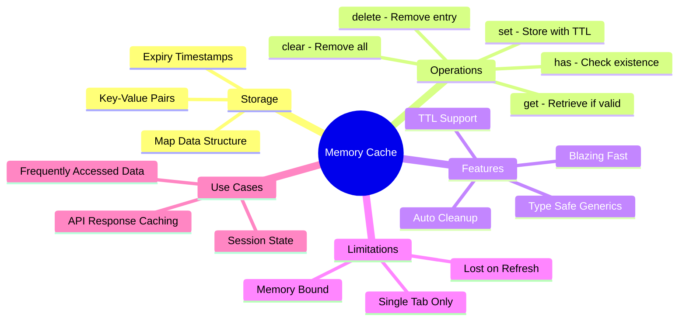

# 🧠 Memory Cache Service Guide

> **💡 Lightbulb Moment**: Store data in runtime memory using JavaScript's `Map` for blazing-fast access with automatic TTL expiration!

---

## 1. 🔍 What is Memory Cache?

Memory caching stores data directly in JavaScript runtime memory (RAM) using a `Map` data structure. Unlike `shareReplay` (RxJS operator), this is a **manual cache service** you control completely.

```typescript
@Injectable({ providedIn: 'root' })
export class MemoryCacheService {
    private cache = new Map<string, { data: any; expiry: number }>();
    //                  └── Key-Value store with expiration timestamp
}
```

---

## 2. 📦 Understanding the `Map` Data Structure

### What is `Map`?

JavaScript's `Map` is a key-value data structure optimized for frequent additions and deletions.

```typescript
private cache = new Map<string, { data: any; expiry: number }>();
//                      ↑                ↑           ↑
//                   Key Type      Cached Data   Expiration Time
```

### `Map` Methods Used:

| Method | Purpose | Example |
|--------|---------|---------|
| `.set(key, value)` | Store data | `cache.set('user-1', { data, expiry })` |
| `.get(key)` | Retrieve data | `cache.get('user-1')` → `{ data, expiry }` |
| `.has(key)` | Check if exists | `cache.has('user-1')` → `true/false` |
| `.delete(key)` | Remove entry | `cache.delete('user-1')` |
| `.clear()` | Remove all | `cache.clear()` |
| `.size` | Get count | `cache.size` → `5` |
| `.keys()` | Get all keys | `Array.from(cache.keys())` |

### Why `Map` Instead of Plain Object `{}`?

| `Map` | Plain Object `{}` |
|-------|-------------------|
| Keys can be **any type** | Keys must be strings |
| Maintains **insertion order** | No guaranteed order |
| Has `.size` property | Need `Object.keys().length` |
| **Better for frequent add/delete** | Optimized for static data |
| `.has()` method | `in` operator or `hasOwnProperty` |

---

## 3. 💻 Complete Implementation

### The Service

```typescript
import { Injectable } from '@angular/core';

@Injectable({ providedIn: 'root' })
export class MemoryCacheService {
    // Store: Map<key, { data, expiryTimestamp }>
    private cache = new Map<string, { data: any; expiry: number }>();

    /**
     * Store data with TTL (Time To Live)
     * @param key - Unique identifier
     * @param data - Data to cache
     * @param ttlSeconds - How long to keep (default: 5 minutes)
     */
    set<T>(key: string, data: T, ttlSeconds: number = 300): void {
        const expiry = Date.now() + (ttlSeconds * 1000);
        this.cache.set(key, { data, expiry });
    }

    /**
     * Retrieve data (returns null if expired or not found)
     */
    get<T>(key: string): T | null {
        const item = this.cache.get(key);
        
        // Not found
        if (!item) return null;

        // Expired - auto-delete and return null
        if (Date.now() > item.expiry) {
            this.cache.delete(key);
            return null;
        }

        return item.data as T;
    }

    /**
     * Check if key exists AND is not expired
     */
    has(key: string): boolean {
        return this.get(key) !== null;
    }

    /**
     * Remove specific entry
     */
    delete(key: string): void {
        this.cache.delete(key);
    }

    /**
     * Clear entire cache
     */
    clear(): void {
        this.cache.clear();
    }

    /**
     * Get cache statistics
     */
    getStats(): { size: number; keys: string[] } {
        return {
            size: this.cache.size,
            keys: Array.from(this.cache.keys())
        };
    }
}
```

---

## 4. 🔬 How It Works Step-by-Step

### Setting a Value

```
┌─────────────────────────────────────────────────────────────────────┐
│  cache.set('user-1', userData, 300)                                 │
│                                                                     │
│  Step 1: Calculate expiry timestamp                                 │
│     expiry = Date.now() + (300 * 1000)                              │
│            = 1705825200000 + 300000                                 │
│            = 1705825500000  ← 5 minutes from now                   │
│                                                                     │
│  Step 2: Store in Map                                               │
│     cache.set('user-1', {                                           │
│         data: { id: 1, name: 'John' },                              │
│         expiry: 1705825500000                                       │
│     })                                                              │
│                                                                     │
│  Result:                                                            │
│  ┌─────────────────────────────────────────────────────────────┐    │
│  │ Map: {                                                      │    │
│  │   'user-1' → { data: {...}, expiry: 1705825500000 }         │    │
│  │ }                                                           │    │
│  └─────────────────────────────────────────────────────────────┘    │
└─────────────────────────────────────────────────────────────────────┘
```

### Getting a Value

```
┌─────────────────────────────────────────────────────────────────────┐
│  cache.get('user-1')                                                │
│                                                                     │
│  Step 1: Retrieve from Map                                          │
│     item = cache.get('user-1')                                      │
│          = { data: {...}, expiry: 1705825500000 }                   │
│                                                                     │
│  Step 2: Check if expired                                           │
│     Date.now() = 1705825300000                                      │
│     item.expiry = 1705825500000                                     │
│                                                                     │
│     Is 1705825300000 > 1705825500000?                               │
│     NO → Data is still valid! ✅                                    │
│                                                                     │
│  Step 3: Return data                                                │
│     return item.data  → { id: 1, name: 'John' }                     │
└─────────────────────────────────────────────────────────────────────┘

┌─────────────────────────────────────────────────────────────────────┐
│  EXPIRED CASE:                                                      │
│                                                                     │
│     Date.now() = 1705825600000  (6 minutes later)                   │
│     item.expiry = 1705825500000                                     │
│                                                                     │
│     Is 1705825600000 > 1705825500000?                               │
│     YES → Data expired! ❌                                          │
│                                                                     │
│     → cache.delete('user-1')  // Auto-cleanup                       │
│     → return null                                                   │
└─────────────────────────────────────────────────────────────────────┘
```

---

## 5. 📋 Practical Usage Patterns

### Pattern 1: Basic HTTP Caching

```typescript
@Injectable({ providedIn: 'root' })
export class UserService {
    private cache = inject(MemoryCacheService);
    private http = inject(HttpClient);

    getUser(id: number): Observable<User> {
        const cacheKey = `user-${id}`;

        // 1. Check cache first
        const cached = this.cache.get<User>(cacheKey);
        if (cached) {
            return of(cached);  // ⚡ Return instantly!
        }

        // 2. Cache miss → fetch from API
        return this.http.get<User>(`/api/users/${id}`).pipe(
            tap(user => this.cache.set(cacheKey, user, 300))  // Cache for 5 min
        );
    }
}
```

### Pattern 2: Cache with Manual Invalidation

```typescript
@Injectable({ providedIn: 'root' })
export class ProductService {
    private cache = inject(MemoryCacheService);
    private http = inject(HttpClient);

    private readonly CACHE_KEY = 'products';

    getProducts(): Observable<Product[]> {
        const cached = this.cache.get<Product[]>(this.CACHE_KEY);
        if (cached) {
            return of(cached);
        }

        return this.http.get<Product[]>('/api/products').pipe(
            tap(products => this.cache.set(this.CACHE_KEY, products, 600))
        );
    }

    // Call after create/update/delete operations
    invalidateCache(): void {
        this.cache.delete(this.CACHE_KEY);
    }

    createProduct(product: Product): Observable<Product> {
        return this.http.post<Product>('/api/products', product).pipe(
            tap(() => this.invalidateCache())  // Clear cache after mutation
        );
    }
}
```

### Pattern 3: Cache with Different TTLs

```typescript
@Injectable({ providedIn: 'root' })
export class DataService {
    private cache = inject(MemoryCacheService);
    private http = inject(HttpClient);

    // Static config - cache for 1 hour
    getConfig(): Observable<Config> {
        return this.getCachedData('config', '/api/config', 3600);
    }

    // User data - cache for 5 minutes
    getUser(): Observable<User> {
        return this.getCachedData('user', '/api/user', 300);
    }

    // Real-time prices - cache for 10 seconds
    getPrices(): Observable<Price[]> {
        return this.getCachedData('prices', '/api/prices', 10);
    }

    private getCachedData<T>(key: string, url: string, ttl: number): Observable<T> {
        const cached = this.cache.get<T>(key);
        if (cached) return of(cached);

        return this.http.get<T>(url).pipe(
            tap(data => this.cache.set(key, data, ttl))
        );
    }
}
```

### Pattern 4: Cache Statistics & Monitoring

```typescript
@Component({
    template: `
        <div class="cache-monitor">
            <h3>📊 Cache Stats</h3>
            <p>Entries: {{ stats.size }}</p>
            <p>Keys: {{ stats.keys.join(', ') || 'empty' }}</p>
            <button (click)="clearCache()">🗑️ Clear All</button>
        </div>
    `
})
export class CacheMonitorComponent {
    private cache = inject(MemoryCacheService);
    stats = this.cache.getStats();

    clearCache(): void {
        this.cache.clear();
        this.stats = this.cache.getStats();
    }
}
```

---

## 6. 🚀 Memory Cache vs shareReplay

| Aspect | Memory Cache Service | shareReplay |
|--------|---------------------|-------------|
| **Type** | Manual service | RxJS operator |
| **Control** | Full control over cache | Automatic caching |
| **TTL** | ✅ Built-in expiration | ⚠️ Need `windowTime` |
| **Invalidation** | `cache.delete(key)` | Recreate Observable |
| **Key-based** | ✅ Cache by any key | ❌ Single Observable |
| **Multiple items** | ✅ Cache many items | ❌ One cached result |
| **Use case** | Multiple API endpoints | Single shared stream |

### When to Use Which?

| Scenario | Use |
|----------|-----|
| Cache multiple different API calls | **Memory Cache Service** |
| Cache single API shared by many components | **shareReplay** |
| Need manual invalidation | **Memory Cache Service** |
| Need different TTLs per item | **Memory Cache Service** |
| Simple multicast with replay | **shareReplay** |

---

## 7. 🚀 Pros and Cons

| ✅ Pros | ❌ Cons |
|---------|---------|
| **Blazing fast** - RAM access | **Lost on refresh** - not persistent |
| **Simple API** - get/set/delete | **Memory usage** - watch for leaks |
| **Full control** - manual TTL & invalidation | **Single tab** - not shared across tabs |
| **Type-safe** - generics support | **No sync** - manual cache management |
| **No dependencies** - pure TypeScript | |

---

## 8. ❓ Interview Questions

### Basic Questions

#### Q1: What is in-memory caching?
**Answer:**
In-memory caching stores data in JavaScript runtime memory (RAM) instead of making repeated API calls. Data is instantly accessible but lost on page refresh.

#### Q2: Why use `Map` instead of a plain object?
**Answer:**
- `Map` maintains insertion order
- Has `.size` property for count
- Better performance for frequent additions/deletions
- Cleaner API with `.has()`, `.get()`, `.set()`
- Keys can be any type (not just strings)

#### Q3: How does TTL (Time To Live) work?
**Answer:**
```typescript
// On SET: Store current time + TTL
const expiry = Date.now() + (ttlSeconds * 1000);
cache.set(key, { data, expiry });

// On GET: Check if current time > expiry
if (Date.now() > item.expiry) {
    cache.delete(key);  // Auto-cleanup
    return null;        // Treat as cache miss
}
```

#### Q4: How to handle cache invalidation?
**Answer:**
```typescript
// Delete specific key
cache.delete('user-1');

// Clear all cache
cache.clear();

// Invalidate after mutations
createProduct(p).pipe(
    tap(() => cache.delete('products'))
);
```

---

### Scenario-Based Questions

#### Scenario 1: Implement LRU Cache
**Question:** Modify the cache to remove least recently used items when size exceeds limit.

**Answer:**
```typescript
export class LRUCacheService {
    private cache = new Map<string, { data: any; expiry: number }>();
    private maxSize = 100;

    get<T>(key: string): T | null {
        const item = this.cache.get(key);
        if (!item) return null;

        // Move to end (most recently used)
        this.cache.delete(key);
        this.cache.set(key, item);

        return item.data as T;
    }

    set<T>(key: string, data: T, ttlSeconds: number): void {
        // Remove oldest if at capacity
        if (this.cache.size >= this.maxSize) {
            const oldestKey = this.cache.keys().next().value;
            this.cache.delete(oldestKey);
        }

        this.cache.set(key, { data, expiry: Date.now() + ttlSeconds * 1000 });
    }
}
```

#### Scenario 2: Cache with Refresh-Ahead
**Question:** Automatically refresh cache before it expires.

**Answer:**
```typescript
getData(key: string, fetchFn: () => Observable<any>, ttl: number): Observable<any> {
    const item = this.cache.get(key);
    
    if (item) {
        const timeRemaining = item.expiry - Date.now();
        const refreshThreshold = ttl * 1000 * 0.2;  // 20% of TTL
        
        // If less than 20% TTL remaining, refresh in background
        if (timeRemaining < refreshThreshold) {
            fetchFn().subscribe(data => this.cache.set(key, data, ttl));
        }
        
        return of(item.data);  // Return cached immediately
    }

    return fetchFn().pipe(
        tap(data => this.cache.set(key, data, ttl))
    );
}
```

---

## 9. 🧊 Refrigerator Analogy

Think of Memory Cache like a **mini-fridge** in your office:

| Concept | Mini-Fridge Analogy | Memory Trick |
|---------|--------------------|--------------| 
| **Cache** | 🧊 **Mini-fridge**: Quick access, limited space | **"Fast but temporary"** |
| **TTL** | ⏰ **Expiration date**: Milk goes bad in 5 days | **"Data spoils too"** |
| **Map.set()** | 🥛 **Put milk in fridge** | **"Store for later"** |
| **Map.get()** | 🔍 **Check if milk is there and fresh** | **"Check before using"** |
| **Map.delete()** | 🗑️ **Throw out old milk** | **"Clean up expired"** |
| **Page refresh** | 🔌 **Power outage**: Everything lost! | **"Not persistent"** |

### 📖 Story to Remember:

> 🧊 **The Office Mini-Fridge**
>
> You have a mini-fridge (memory cache) next to your desk:
>
> **Morning:**
> ```typescript
> cache.set('coffee-beans', freshBeans, 3600);  // Good for 1 hour
> ```
>
> **10 minutes later:**
> ```typescript
> cache.get('coffee-beans');  // ✅ Still fresh! Use them!
> ```
>
> **2 hours later:**
> ```typescript
> cache.get('coffee-beans');  // ❌ Expired! Returns null
> // Auto-deleted, must get fresh beans (API call)
> ```
>
> **Power outage (page refresh):**
> ```
> Everything in the fridge is gone! 💨
> Must restock from the store (API calls)
> ```

---

## 10. 🧠 Mind Map



---

## 🎯 Quick Reference

```typescript
// Initialize
private cache = inject(MemoryCacheService);

// Store for 5 minutes (300 seconds)
cache.set('key', data, 300);

// Retrieve (null if expired/missing)
const data = cache.get<MyType>('key');

// Check if exists and valid
if (cache.has('key')) { ... }

// Remove specific
cache.delete('key');

// Remove all
cache.clear();

// Get stats
const { size, keys } = cache.getStats();
```
