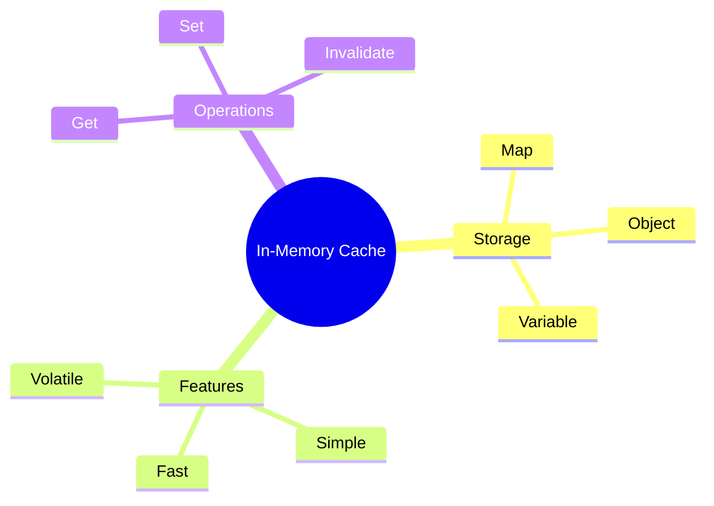

# 💾 Use Case 1: In-Memory Caching

> **💡 Lightbulb Moment**: Store API responses in memory to avoid redundant HTTP calls!

---

## 1. 🔍 What is In-Memory Caching?

Store HTTP responses in a variable/Map to reuse without making new requests.

```typescript
@Injectable({ providedIn: 'root' })
export class CachingService {
    private cache = new Map<string, any>();
    
    getData(url: string): Observable<any> {
        if (this.cache.has(url)) {
            return of(this.cache.get(url));
        }
        
        return this.http.get(url).pipe(
            tap(data => this.cache.set(url, data))
        );
    }
}
```

---

## 2. 🚀 Pros and Cons

| Pros | Cons |
|------|------|
| Simple | Lost on refresh |
| Fast | Memory usage |
| No dependencies | No expiration |

---

## 3. ❓ Interview Questions

### Basic Questions

#### Q1: When use in-memory caching?
**Answer:**
- Static reference data
- User session data
- Frequently accessed, rarely changing data

#### Q2: How to invalidate cache?
**Answer:**
```typescript
clearCache() { this.cache.clear(); }
invalidate(key: string) { this.cache.delete(key); }
```

---

### Scenario-Based Questions

#### Scenario: Cache with TTL
**Question:** Add expiration to cached items.

**Answer:**
```typescript
private cache = new Map<string, { data: any, expiry: number }>();

getData(url: string, ttlMs = 60000) {
    const cached = this.cache.get(url);
    if (cached && cached.expiry > Date.now()) {
        return of(cached.data);
    }
    return this.http.get(url).pipe(
        tap(data => this.cache.set(url, { data, expiry: Date.now() + ttlMs }))
    );
}
```

---

## 🧠 Mind Map


