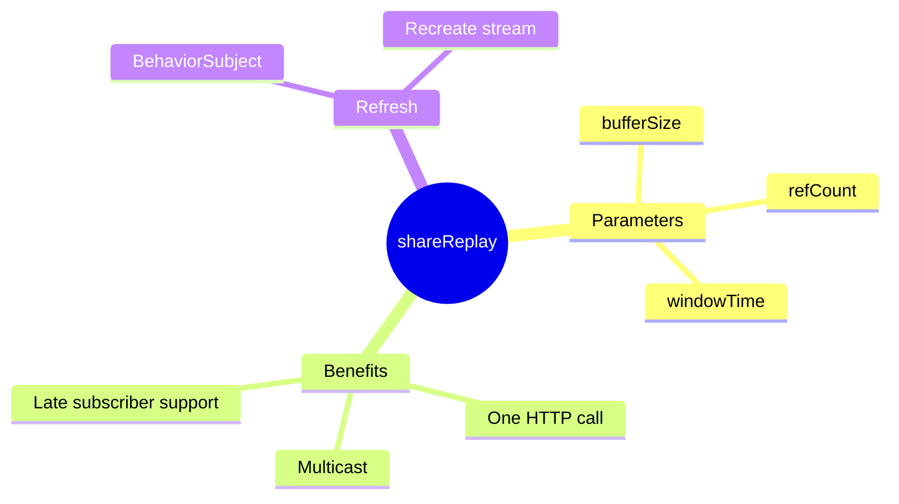

# 🔄 Use Case 2: shareReplay Caching

> **💡 Lightbulb Moment**: shareReplay() makes an Observable multicasted AND cached - one HTTP call for many subscribers!

---

## 1. 🔍 What is shareReplay?

Multicasts the Observable and replays the last N emissions to new subscribers.

```typescript
@Injectable({ providedIn: 'root' })
export class UserService {
    private user$ = this.http.get<User>('/api/user').pipe(
        shareReplay(1)  // Cache last emission
    );
    
    getUser() { return this.user$; }
}
```

---

## 2. 🚀 How It Works

```
First subscriber → HTTP call made → Response cached
Second subscriber → Uses cached response (no HTTP call!)
Third subscriber → Uses cached response (no HTTP call!)
```

---

## 3. ❓ Interview Questions

### Basic Questions

#### Q1: share() vs shareReplay()?
**Answer:**
| share() | shareReplay(1) |
|---------|---------------|
| No replay | Replays last value |
| Late subscribers miss | Late subscribers get cached |

#### Q2: How to refresh shareReplay cache?
**Answer:** Create new Observable:
```typescript
private userSubject = new BehaviorSubject<void>(undefined);

user$ = this.userSubject.pipe(
    switchMap(() => this.http.get<User>('/api/user')),
    shareReplay(1)
);

refresh() { this.userSubject.next(); }
```

---

### Scenario-Based Questions

#### Scenario: Config Service
**Question:** Load app config once, share everywhere.

**Answer:**
```typescript
@Injectable({ providedIn: 'root' })
export class ConfigService {
    config$ = this.http.get<Config>('/api/config').pipe(
        shareReplay({ bufferSize: 1, refCount: true })
    );
}
```

---

## 🧠 Mind Map


