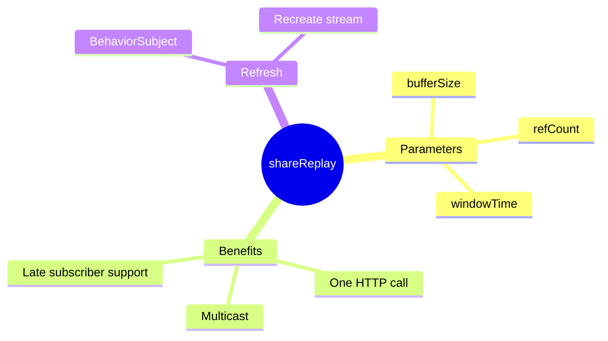

# 🔄 Use Case 2: shareReplay Caching

> **💡 Lightbulb Moment**: shareReplay() makes an Observable multicasted AND cached - one HTTP call for many subscribers!

---

## 1. 🔍 What is shareReplay?

Multicasts the Observable and replays the last N emissions to new subscribers.

```typescript
@Injectable({ providedIn: 'root' })
export class UserService {
    private user$ = this.http.get<User>('/api/user').pipe(
        shareReplay(1)  // Cache last emission
    );
    
    getUser() { return this.user$; }
}
```

---

## 2. 🚀 How It Works

```
First subscriber → HTTP call made → Response cached
Second subscriber → Uses cached response (no HTTP call!)
Third subscriber → Uses cached response (no HTTP call!)
```

---

## 3. ❓ Interview Questions

### Basic Questions

#### Q1: share() vs shareReplay()?
**Answer:**
| share() | shareReplay(1) |
|---------|---------------|
| No replay | Replays last value |
| Late subscribers miss | Late subscribers get cached |

#### Q2: How to refresh shareReplay cache?
**Answer:** Create new Observable:
```typescript
private userSubject = new BehaviorSubject<void>(undefined);

user$ = this.userSubject.pipe(
    switchMap(() => this.http.get<User>('/api/user')),
    shareReplay(1)
);

refresh() { this.userSubject.next(); }
```

---

### Scenario-Based Questions

#### Scenario: Config Service
**Question:** Load app config once, share everywhere.

**Answer:**
```typescript
@Injectable({ providedIn: 'root' })
export class ConfigService {
    config$ = this.http.get<Config>('/api/config').pipe(
        shareReplay({ bufferSize: 1, refCount: true })
    );
}
```

---

## 📹 YouTube Video Cache Analogy (Easy to Remember!)

Think of shareReplay like **YouTube video buffering**:

| Concept | YouTube Analogy | Memory Trick |
|---------|----------------|--------------| 
| **shareReplay(1)** | 📹 **Buffered video**: First viewer buffers, others get instant | **"Buffer once, share forever"** |
| **First subscriber** | 👤 **First viewer**: Waits for video to load | **"Triggers the fetch"** |
| **Late subscribers** | 👥 **Late viewers**: Video already buffered, instant play! | **"Get cached result"** |
| **refCount: true** | 🔌 **Auto-pause**: If everyone leaves, stop buffering | **"Cleanup when unused"** |
| **No shareReplay** | 😰 **Re-buffer every time**: Each viewer reloads video! | **"Wasteful repeats"** |

### 📖 Story to Remember:

> 📹 **The YouTube Watch Party**
>
> You're hosting a watch party:
>
> **Without shareReplay:**
> ```
> Friend 1 clicks play → Video loads from server 🐢
> Friend 2 clicks play → Video loads AGAIN from server 🐢
> Friend 3 clicks play → Video loads AGAIN from server 🐢
> 3 API calls! Wasteful! 😰
> ```
>
> **With shareReplay(1):**
> ```
> Friend 1 clicks play → Video loads & buffers 📹
> Friend 2 clicks play → "Already buffered!" Instant! ⚡
> Friend 3 clicks play → "Already buffered!" Instant! ⚡
> 1 API call! Efficient! 🎉
> ```
>
> **Everyone watches the SAME buffered video!**

### 🎯 Quick Reference:
```
📹 shareReplay(1)   = Buffer last result for all viewers
👤 First subscriber = Triggers the actual API call
👥 Late subscribers = Get instant cached result
🔌 refCount: true   = Stop buffering when all leave
```

---

## 🧠 Mind Map


