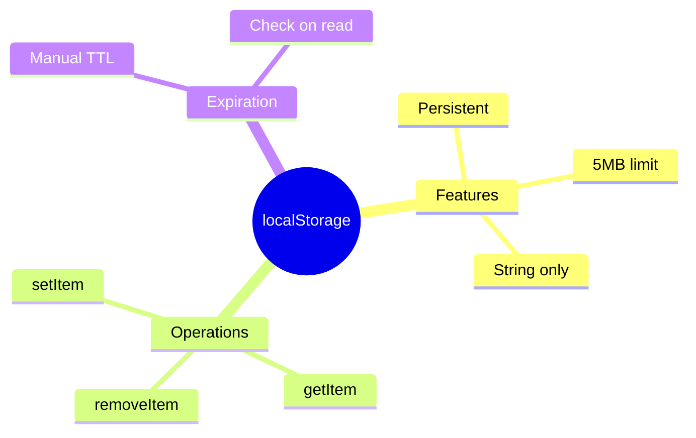

# 💽 Use Case 3: localStorage Caching

> **💡 Lightbulb Moment**: localStorage persists data across browser sessions - survives refresh and restarts!

---

## 1. 🔍 localStorage Caching

Store data in browser's localStorage for persistence.

```typescript
@Injectable({ providedIn: 'root' })
export class StorageService {
    private cacheKey = 'app_cache_';
    
    setCache<T>(key: string, data: T, ttlMinutes = 60) {
        const item = {
            data,
            expiry: Date.now() + ttlMinutes * 60 * 1000
        };
        localStorage.setItem(this.cacheKey + key, JSON.stringify(item));
    }
    
    getCache<T>(key: string): T | null {
        const item = localStorage.getItem(this.cacheKey + key);
        if (!item) return null;
        
        const parsed = JSON.parse(item);
        if (parsed.expiry < Date.now()) {
            localStorage.removeItem(this.cacheKey + key);
            return null;
        }
        return parsed.data;
    }
}
```

---

## 2. 🚀 Pros and Cons

| Pros | Cons |
|------|------|
| Survives refresh | Limited to 5MB |
| Persistent | Sync only |
| Simple API | String only (JSON) |

---

## 3. ❓ Interview Questions

### Basic Questions

#### Q1: localStorage vs sessionStorage?
**Answer:**
| localStorage | sessionStorage |
|--------------|----------------|
| Persists forever | Cleared on tab close |
| Shared across tabs | Tab-specific |

#### Q2: Security concerns?
**Answer:**
- Never store sensitive data (tokens, passwords)
- Vulnerable to XSS
- Accessible via JavaScript

---

### Scenario-Based Questions

#### Scenario: Offline-First Cache
**Question:** Return cached data immediately, then update from API.

**Answer:**
```typescript
getData(): Observable<Data> {
    const cached = this.storageService.getCache<Data>('myData');
    
    const api$ = this.http.get<Data>('/api/data').pipe(
        tap(data => this.storageService.setCache('myData', data))
    );
    
    return cached ? concat(of(cached), api$) : api$;
}
```

---

### 📦 Data Flow Summary (Visual Box Diagram)

```
┌─────────────────────────────────────────────────────────────┐
│  localStorage CACHING: PERSISTENT STORAGE                   │
│                                                             │
│   localStorage vs sessionStorage:                           │
│   ┌───────────────────────────────────────────────────────┐ │
│   │ localStorage:   Survives refresh, restarts, tabs      │ │
│   │ sessionStorage: Cleared when tab closes               │ │
│   └───────────────────────────────────────────────────────┘ │
│                                                             │
│   CACHING WITH TTL:                                         │
│   ┌───────────────────────────────────────────────────────┐ │
│   │ setCache(key, data, ttlMinutes) {                     │ │
│   │   const item = {                                      │ │
│   │     data,                                             │ │
│   │     expiry: Date.now() + ttlMinutes * 60 * 1000       │ │
│   │   };                                                  │ │
│   │   localStorage.setItem(key, JSON.stringify(item));    │ │
│   │ }                                                     │ │
│   │                                                       │ │
│   │ getCache(key) {                                       │ │
│   │   const item = localStorage.getItem(key);             │ │
│   │   if (!item) return null;                             │ │
│   │   const parsed = JSON.parse(item);                    │ │
│   │   if (parsed.expiry < Date.now()) return null; // Expired│ │
│   │   return parsed.data;                                 │ │
│   │ }                                                     │ │
│   └───────────────────────────────────────────────────────┘ │
│                                                             │
│   ⚠️ LIMITS: 5MB max, strings only (use JSON), sync only   │
│   🔒 SECURITY: Never store tokens/passwords (XSS vulnerable)│
└─────────────────────────────────────────────────────────────┘
```

> **Key Takeaway**: localStorage = persistent, sessionStorage = tab-only. Always add TTL and never store sensitive data!

---

## 🥫 Pantry Shelf Analogy (Easy to Remember!)

Think of localStorage like a **kitchen pantry**:

| Concept | Pantry Analogy | Memory Trick |
|---------|---------------|--------------| 
| **localStorage** | 🥫 **Pantry shelf**: Food stays until you throw it out | **"Persistent storage"** |
| **sessionStorage** | 🧊 **Ice bucket**: Melts when party ends | **"Tab-only"** |
| **5MB limit** | 📏 **Shelf space**: Can't fit everything | **"Size limit"** |
| **String only** | 🏷️ **Labels only**: Must describe items as text | **"JSON.stringify"** |
| **TTL/expiry** | 📅 **Expiration date**: Check before eating | **"Manual expiration"** |

### 📖 Story to Remember:

> 🥫 **The Kitchen Storage System**
>
> You're organizing your kitchen (browser storage):
>
> **Using the Pantry:**
> ```typescript
> // 🥫 Put food in pantry
> localStorage.setItem('user', JSON.stringify(userData));
> 
> // 🔍 Get food from pantry
> const user = JSON.parse(localStorage.getItem('user'));
> 
> // 🗑️ Take old food out
> localStorage.removeItem('user');
> ```
>
> **vs Ice Bucket (sessionStorage):**
> ```
> Pantry (localStorage):   Stays until you clean out
> Ice Bucket (session):    Melts when you close the tab
> ```
>
> **localStorage survives browser restarts!**

### 🎯 Quick Reference:
```
🥫 localStorage    = Pantry (survives restart)
🧊 sessionStorage  = Ice bucket (tab-only)
📏 5MB             = Shelf space limit
🏷️ String only     = Must use JSON
📅 TTL             = Check expiration manually
```

---

## 🧠 Mind Map


