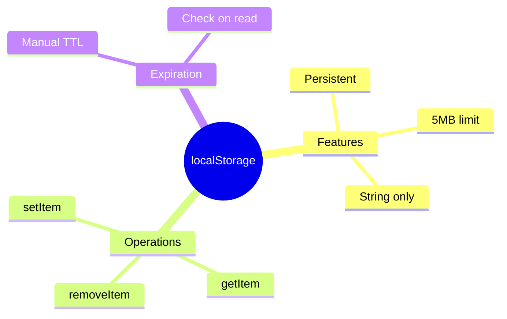

# 💽 Use Case 3: localStorage Caching

> **💡 Lightbulb Moment**: localStorage persists data across browser sessions - survives refresh and restarts!

---

## 1. 🔍 localStorage Caching

Store data in browser's localStorage for persistence.

```typescript
@Injectable({ providedIn: 'root' })
export class StorageService {
    private cacheKey = 'app_cache_';
    
    setCache<T>(key: string, data: T, ttlMinutes = 60) {
        const item = {
            data,
            expiry: Date.now() + ttlMinutes * 60 * 1000
        };
        localStorage.setItem(this.cacheKey + key, JSON.stringify(item));
    }
    
    getCache<T>(key: string): T | null {
        const item = localStorage.getItem(this.cacheKey + key);
        if (!item) return null;
        
        const parsed = JSON.parse(item);
        if (parsed.expiry < Date.now()) {
            localStorage.removeItem(this.cacheKey + key);
            return null;
        }
        return parsed.data;
    }
}
```

---

## 2. 🚀 Pros and Cons

| Pros | Cons |
|------|------|
| Survives refresh | Limited to 5MB |
| Persistent | Sync only |
| Simple API | String only (JSON) |

---

## 3. ❓ Interview Questions

### Basic Questions

#### Q1: localStorage vs sessionStorage?
**Answer:**
| localStorage | sessionStorage |
|--------------|----------------|
| Persists forever | Cleared on tab close |
| Shared across tabs | Tab-specific |

#### Q2: Security concerns?
**Answer:**
- Never store sensitive data (tokens, passwords)
- Vulnerable to XSS
- Accessible via JavaScript

---

### Scenario-Based Questions

#### Scenario: Offline-First Cache
**Question:** Return cached data immediately, then update from API.

**Answer:**
```typescript
getData(): Observable<Data> {
    const cached = this.storageService.getCache<Data>('myData');
    
    const api$ = this.http.get<Data>('/api/data').pipe(
        tap(data => this.storageService.setCache('myData', data))
    );
    
    return cached ? concat(of(cached), api$) : api$;
}
```

---

## 🧠 Mind Map


