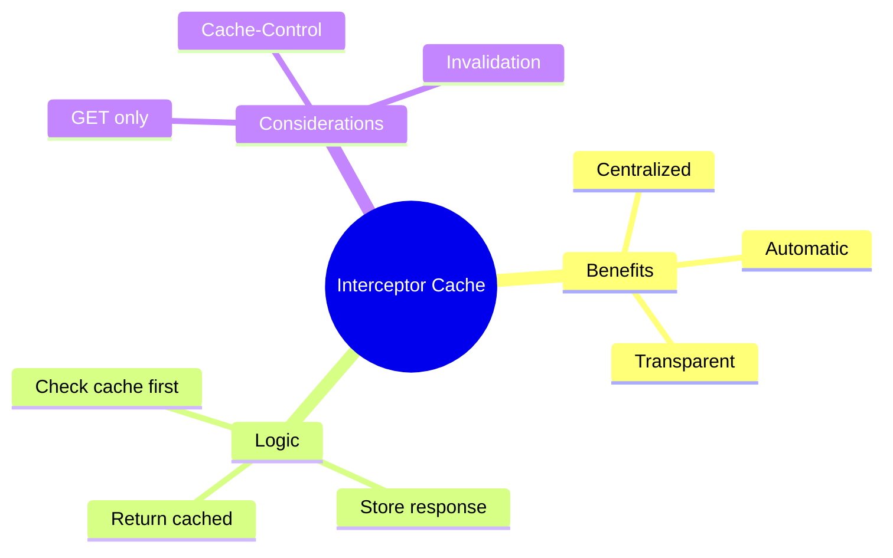

# 🔧 Use Case 4: HTTP Interceptor Caching

> **💡 Lightbulb Moment**: Intercept ALL HTTP requests and cache responses automatically!

---

## 1. 🔍 Caching Interceptor

```typescript
export const cachingInterceptor: HttpInterceptorFn = (req, next) => {
    // Only cache GET requests
    if (req.method !== 'GET') {
        return next(req);
    }
    
    const cache = inject(CacheService);
    const cached = cache.get(req.url);
    
    if (cached) {
        return of(cached);
    }
    
    return next(req).pipe(
        tap(response => {
            if (response instanceof HttpResponse) {
                cache.set(req.url, response);
            }
        })
    );
};
```

---

## 2. 🚀 Advanced: Selective Caching

```typescript
// Only cache specific URLs
const CACHEABLE_URLS = ['/api/config', '/api/categories'];

export const selectiveCachingInterceptor: HttpInterceptorFn = (req, next) => {
    if (!CACHEABLE_URLS.some(url => req.url.includes(url))) {
        return next(req);
    }
    // ... caching logic
};
```

---

## 3. ❓ Interview Questions

### Basic Questions

#### Q1: Why use interceptor for caching?
**Answer:**
- Centralized caching logic
- Automatic for all requests
- No changes to services needed

#### Q2: Why only cache GET requests?
**Answer:** POST/PUT/DELETE modify data - caching would return stale data and miss mutations.

---

### Scenario-Based Questions

#### Scenario: Cache with Headers
**Question:** Implement cache that respects Cache-Control headers.

**Answer:**
```typescript
tap(response => {
    const cacheControl = response.headers.get('Cache-Control');
    if (cacheControl?.includes('no-store')) return;
    
    const maxAge = /max-age=(\d+)/.exec(cacheControl)?.[1];
    const ttl = maxAge ? parseInt(maxAge) * 1000 : 60000;
    
    cache.set(req.url, response, ttl);
})
```

---

## 🚗 Highway Checkpoint Analogy (Easy to Remember!)

Think of interceptor caching like a **highway checkpoint**:

| Concept | Checkpoint Analogy | Memory Trick |
|---------|-------------------|--------------| 
| **Interceptor** | 🚧 **Checkpoint**: Every car must pass through | **"All requests"** |
| **Cache check** | 📋 **Check VIP list**: "Have we seen this plate?" | **"Cache lookup"** |
| **Cached response** | 🏎️ **VIP lane**: Known cars pass instantly | **"Return cached"** |
| **New request** | 🚶 **New visitor**: Must go through, add to list | **"Cache miss"** |
| **GET only** | 📥 **Read-only pass**: Deliveries (POST) can't use VIP | **"GET requests"** |

### 📖 Story to Remember:

> 🚗 **The VIP Highway**
>
> Your interceptor runs a checkpoint:
>
> **The Checkpoint Process:**
> ```typescript
> export const cachingInterceptor = (req, next) => {
>   // 📥 Only allow GET to use VIP lane
>   if (req.method !== 'GET') return next(req);
>   
>   // 📋 Check VIP list
>   const cached = cache.get(req.url);
>   if (cached) return of(cached);  // 🏎️ VIP lane!
>   
>   // 🚶 New visitor - process and remember
>   return next(req).pipe(
>     tap(res => cache.set(req.url, res))  // Add to VIP list
>   );
> };
> ```
>
> **VIPs skip the line, new cars get added!**

### 🎯 Quick Reference:
```
🚧 Interceptor    = Highway checkpoint
📋 Cache check    = Check VIP list
🏎️ Cached hit     = VIP lane (instant)
🚶 Cache miss     = Process and remember
📥 GET only       = Only reads can be VIP
```

---

## 🧠 Mind Map


