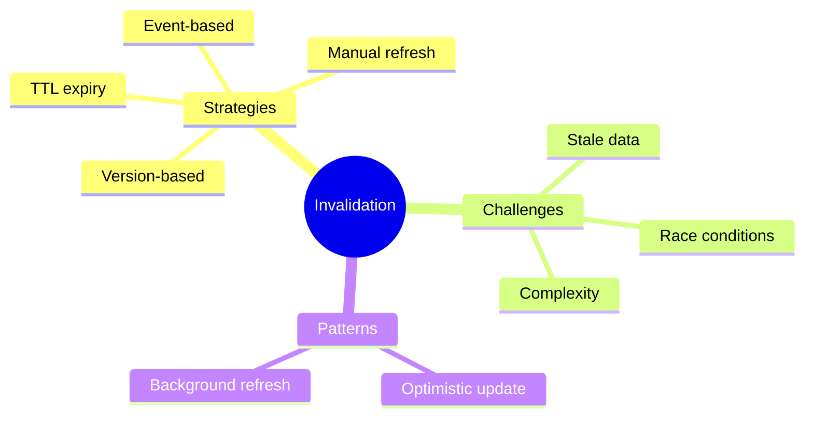

# ♻️ Use Case 5: Cache Invalidation

> **💡 Lightbulb Moment**: The hardest problem in caching is knowing WHEN to clear it!

---

## 1. 🔍 Cache Invalidation Strategies

### Time-Based (TTL)
```typescript
setCache(key: string, data: any, ttlMs = 60000) {
    this.cache.set(key, {
        data,
        expiry: Date.now() + ttlMs
    });
}
```

### Event-Based
```typescript
// Invalidate when data is modified
createUser(user: User) {
    return this.http.post('/api/users', user).pipe(
        tap(() => this.cache.delete('/api/users'))  // Invalidate list cache
    );
}
```

### Manual Refresh
```typescript
@Injectable({ providedIn: 'root' })
export class DataService {
    private refresh$ = new BehaviorSubject<void>(undefined);
    
    data$ = this.refresh$.pipe(
        switchMap(() => this.http.get('/api/data')),
        shareReplay(1)
    );
    
    refresh() { this.refresh$.next(); }
}
```

---

## 2. ❓ Interview Questions

### Basic Questions

#### Q1: What are cache invalidation strategies?
**Answer:**
1. **TTL** - Expire after time
2. **Event-based** - Clear on mutations
3. **Manual** - User triggers refresh
4. **Version-based** - Clear on app update

#### Q2: "Cache invalidation is one of the hardest problems" - why?
**Answer:**
- Stale data causes bugs
- Too aggressive = no caching benefit
- Race conditions between update and invalidate
- Distributed systems complexity

---

### Scenario-Based Questions

#### Scenario: Optimistic Update
**Question:** Update cache immediately, revert if API fails.

**Answer:**
```typescript
updateUser(user: User) {
    const previousUsers = this.cache.get('users');
    
    // Optimistic update
    this.cache.set('users', [...previousUsers.filter(u => u.id !== user.id), user]);
    
    return this.http.put(`/api/users/${user.id}`, user).pipe(
        catchError(err => {
            // Revert on failure
            this.cache.set('users', previousUsers);
            throw err;
        })
    );
}
```

---

## 🧠 Mind Map


