# 📦 Basic ng-content

> **💡 Lightbulb Moment**: ng-content is Angular's way of creating "slots" in components where parents can insert content!


## 📋 Table of Contents
- [1. 🔍 What is Content Projection?](#1--what-is-content-projection)
- [🔗 How Content Projection Works: Deep Dive](#how-content-projection-works-deep-dive)
  - [The Complete Flow](#the-complete-flow)
  - [Runtime Steps: What Happens When Angular Renders](#runtime-steps-what-happens-when-angular-renders)
  - [Step-by-Step Breakdown](#step-by-step-breakdown)
  - [Code Mapping: Your Implementation](#code-mapping-your-implementation)
  - [🔑 Key Rules](#key-rules)
  - [Visual: Before vs After](#visual-before-vs-after)
- [2. 🚀 Single Slot vs Multi-Slot](#2--single-slot-vs-multi-slot)
  - [Single Slot](#single-slot)
  - [Multi-Slot with Selectors](#multi-slot-with-selectors)
  - [📦 Data Flow Summary (Visual Box Diagram)](#data-flow-summary-visual-box-diagram)
- [3. ❓ Interview Questions](#3--interview-questions)
  - [Basic Questions](#basic-questions)
    - [Q1: What's the difference between @Input and ng-content?](#q1-whats-the-difference-between-input-and-ng-content)
    - [Q2: Does projected content belong to parent or child?](#q2-does-projected-content-belong-to-parent-or-child)
  - [Scenario-Based Questions](#scenario-based-questions)
    - [Scenario: Card Component](#scenario-card-component)
- [🖼️ Photo Frame Analogy (Easy to Remember!)](#photo-frame-analogy-easy-to-remember)
  - [📖 Story to Remember:](#story-to-remember)
  - [🎯 Quick Reference:](#quick-reference)
- [🧠 Mind Map](#mind-map)
- [🎯 What Problem Does This Solve?](#what-problem-does-this-solve)
  - [The Problem: Rigid Component Templates](#the-problem-rigid-component-templates)
  - [How Content Projection Solves This](#how-content-projection-solves-this)
- [📚 Key Concepts Explained](#key-concepts-explained)
  - [1. Basic Slot](#1-basic-slot)
  - [2. Multi-Slot with Selectors](#2-multi-slot-with-selectors)
  - [3. Selector Types](#3-selector-types)
- [🌍 Real-World Use Cases](#real-world-use-cases)
  - [1. Modal/Dialog Component](#1-modaldialog-component)
  - [2. Tab Component](#2-tab-component)
  - [3. Card Component Library](#3-card-component-library)
  - [4. Layout Wrapper](#4-layout-wrapper)
- [❓ Complete Interview Questions (25+)](#complete-interview-questions-25)
  - [Basic Conceptual Questions](#basic-conceptual-questions)
  - [Selector Questions](#selector-questions)
  - [Timing & Lifecycle Questions](#timing--lifecycle-questions)
  - [Scenario Questions](#scenario-questions)
  - [Advanced Questions](#advanced-questions)
  - [Best Practice Questions](#best-practice-questions)

---
---

## 1. 🔍 What is Content Projection?

Allows parent components to project content INTO child component templates.

```typescript
// Card component template
<div class="card">
    <ng-content></ng-content>  <!-- Content goes here -->
</div>

// Usage
<app-card>
    <h2>My Title</h2>
    <p>My content</p>
</app-card>
```

---

## 🔗 How Content Projection Works: Deep Dive

> [!IMPORTANT]
> Content Projection lets a **parent component** pass content **INTO** a **child component's template** using `<ng-content>`. The parent OWNS the content; the child just provides the SLOT.

### The Complete Flow

```mermaid
%%{init: {'theme': 'base', 'themeVariables': { 'primaryColor': '#8b5cf6', 'primaryTextColor': '#fff'}}}%%
flowchart LR
    subgraph Parent["👤 Parent Component"]
        P1["&lt;app-card&gt;<br/>  &lt;h3&gt;Title&lt;/h3&gt;<br/>  &lt;p&gt;Body&lt;/p&gt;<br/>&lt;/app-card&gt;"]
    end
    
    subgraph Child["📦 Child Component"]
        C1["&lt;div class='card'&gt;<br/>  &lt;ng-content&gt;&lt;/ng-content&gt;<br/>&lt;/div&gt;"]
    end
    
    subgraph Result["✅ Rendered DOM"]
        R1["&lt;div class='card'&gt;<br/>  &lt;h3&gt;Title&lt;/h3&gt;<br/>  &lt;p&gt;Body&lt;/p&gt;<br/>&lt;/div&gt;"]
    end
    
    Parent -->|"Content flows in"| Child
    Child -->|"ng-content replaced"| Result
    
    style Parent fill:#e0f2fe
    style Child fill:#fef3c7
    style Result fill:#dcfce7
```



### Runtime Steps: What Happens When Angular Renders


### Step-by-Step Breakdown

| Step | What Happens | Code |
|------|--------------|------|
| **1** | Angular parses parent template | `<app-card><h3>Title</h3></app-card>` |
| **2** | Finds `<app-card>` with content inside | Content = `<h3>Title</h3>` |
| **3** | Creates child component instance | `SimpleCardComponent` |
| **4** | Parses child template | `<div class="card"><ng-content></ng-content></div>` |
| **5** | Finds `<ng-content>` placeholder | This marks where content goes |
| **6** | **REPLACES** `<ng-content>` with parent's content | `<h3>Title</h3>` inserted |
| **7** | Final DOM rendered | `<div class="card"><h3>Title</h3></div>` |

### Code Mapping: Your Implementation

```typescript
// CHILD COMPONENT: Defines WHERE content goes
@Component({
    selector: 'app-simple-card',
    template: `
        <div class="card">
            <ng-content></ng-content>  // 👈 SLOT - placeholder
        </div>
    `,
})
export class SimpleCardComponent { }
```

```html
<!-- PARENT: Defines WHAT content is -->
<app-simple-card>
    <h3>Welcome!</h3>                               <!-- 👈 Goes INTO ng-content -->
    <p>This content is projected into the card.</p> <!-- 👈 This too -->
    <button>Learn More</button>                     <!-- 👈 And this -->
</app-simple-card>
```

### 🔑 Key Rules

| Rule | Explanation |
|------|-------------|
| **Parent OWNS the content** | Bindings, events, change detection belong to parent |
| **Child provides the SLOT** | Just defines where content appears |
| **Content is NOT cloned** | It's moved/projected, not duplicated |
| **Styles are isolated** | Child's encapsulated styles don't affect projected content |
| **Lifecycle is parent's** | `ngOnInit`, `ngOnDestroy` etc. fire in parent's context |

### Visual: Before vs After

```
BEFORE (Angular parses):
┌─────────────────────────────────────────────────┐
│ Parent Template:                                │
│   <app-simple-card>                             │
│       <h3>Welcome!</h3>      ← Content to project
│       <p>Body text</p>                          │
│   </app-simple-card>                            │
└─────────────────────────────────────────────────┘
                    +
┌─────────────────────────────────────────────────┐
│ Child Template:                                 │
│   <div class="card">                            │
│       <ng-content></ng-content>  ← Slot         │
│   </div>                                        │
└─────────────────────────────────────────────────┘
                    ↓
AFTER (DOM rendered):
┌─────────────────────────────────────────────────┐
│ Final DOM:                                      │
│   <div class="card">                            │
│       <h3>Welcome!</h3>      ← Projected!       │
│       <p>Body text</p>                          │
│   </div>                                        │
└─────────────────────────────────────────────────┘
```

> [!TIP]
> **Memory Trick**: Think of `<ng-content>` as a **mail slot** in a door. The parent (mailman) puts letters in, the child (house) just has the slot - they don't control WHAT comes through!

---

## 2. 🚀 Single Slot vs Multi-Slot

### Single Slot
```html
<ng-content></ng-content>
```

### Multi-Slot with Selectors
```html
<ng-content select="[header]"></ng-content>
<ng-content select="[body]"></ng-content>
<ng-content select="[footer]"></ng-content>
```

### 📦 Data Flow Summary (Visual Box Diagram)

```
┌─────────────────────────────────────────────────────────────┐
│  CONTENT PROJECTION: PARENT → CHILD SLOT                    │
│                                                             │
│   PARENT COMPONENT (Content Owner):                         │
│   ┌───────────────────────────────────────────────────────┐ │
│   │ <app-card>                                            │ │
│   │   <h2 card-header>My Title</h2>    ──┐ [header]       │ │
│   │   <p>This is body content</p>      ──┼─ [default]     │ │
│   │   <button card-footer>Save</button>──┘ [footer]       │ │
│   │ </app-card>                                           │ │
│   └───────────────────────────────────────────────────────┘ │
│                        │                                    │
│                        ▼ Content flows DOWN                 │
│                                                             │
│   CHILD COMPONENT (Slot Provider):                          │
│   ┌───────────────────────────────────────────────────────┐ │
│   │ <div class="card">                                    │ │
│   │                                                       │ │
│   │   ┌─────────────────────────────────────────────┐     │ │
│   │   │ <ng-content select="[card-header]">         │     │ │
│   │   │   → "My Title" appears here                 │     │ │
│   │   └─────────────────────────────────────────────┘     │ │
│   │                                                       │ │
│   │   ┌─────────────────────────────────────────────┐     │ │
│   │   │ <ng-content>  (default/catch-all)           │     │ │
│   │   │   → "This is body content" appears here     │     │ │
│   │   └─────────────────────────────────────────────┘     │ │
│   │                                                       │ │
│   │   ┌─────────────────────────────────────────────┐     │ │
│   │   │ <ng-content select="[card-footer]">         │     │ │
│   │   │   → "Save" button appears here              │     │ │
│   │   └─────────────────────────────────────────────┘     │ │
│   │                                                       │ │
│   │ </div>                                                │ │
│   └───────────────────────────────────────────────────────┘ │
│                                                             │
│   KEY: Parent OWNS content, Child provides SLOTS            │
└─────────────────────────────────────────────────────────────┘
```

> **Key Takeaway**: ng-content creates "slots" - parent decides WHAT goes in, child decides WHERE it goes. Parent owns the content's lifecycle!

---

## 3. ❓ Interview Questions

### Basic Questions

#### Q1: What's the difference between @Input and ng-content?
**Answer:**
| @Input() | ng-content |
|----------|------------|
| Data values | Template content |
| Component controls rendering | Parent controls rendering |
| Statically typed | Any content |

#### Q2: Does projected content belong to parent or child?
**Answer:** **Parent!** The parent maintains control, bindings, and lifecycle.

---

### Scenario-Based Questions

#### Scenario: Card Component
**Question:** Create a card with header, body, footer slots.

**Answer:**
```typescript
// Component
@Component({
    template: `
        <div class="card">
            <div class="header"><ng-content select="[card-header]"></ng-content></div>
            <div class="body"><ng-content></ng-content></div>
            <div class="footer"><ng-content select="[card-footer]"></ng-content></div>
        </div>
    `
})

// Usage
<app-card>
    <h2 card-header>Title</h2>
    <p>Main content</p>
    <button card-footer>Save</button>
</app-card>
```

---

## 🖼️ Photo Frame Analogy (Easy to Remember!)

Think of content projection like a **photo frame**:

| Concept | Photo Frame Analogy | Memory Trick |
|---------|--------------------|--------------| 
| **ng-content** | 🖼️ **Empty frame**: The wall slot waiting for YOUR photo | **"The slot"** |
| **Parent component** | 📸 **You (photo owner)**: You decide what photo goes in | **"Content owner"** |
| **Child component** | 🏠 **The frame holder**: Provides the slot, not the content | **"Slot provider"** |
| **Multi-slot** | 🖼️🖼️🖼️ **Multiple frames**: Header frame, main frame, footer frame | **"Multiple slots"** |
| **select="[attr]"** | 🏷️ **Frame labels**: "Family photos here", "Vacation here" | **"Labeled slots"** |

### 📖 Story to Remember:

> 🖼️ **The Photo Gallery**
>
> You buy a fancy multi-frame display (Card Component):
>
> **The Frame (Child Component):**
> ```html
> <div class="gallery">
>   <div class="header-slot"><ng-content select="[header]"></ng-content></div>
>   <div class="main-slot"><ng-content></ng-content></div>
>   <div class="footer-slot"><ng-content select="[footer]"></ng-content></div>
> </div>
> ```
>
> **You Choose What Goes In (Parent):**
> ```html
> <app-gallery>
>   <h2 header>My Vacation Photos</h2>   <!-- Goes to header slot -->
>                  <!-- Goes to main slot -->
>   <button footer>Next Album</button>    <!-- Goes to footer slot -->
> </app-gallery>
> ```
>
> **You own the photos (content). The frame just displays them!**

### 🎯 Quick Reference:
```
🖼️ <ng-content>           = Empty frame (single slot)
🖼️🖼️ select="[name]"      = Labeled frames (multi-slot)
📸 Parent provides        = You choose the photos
🏠 Child receives         = Frame displays them
```

---

## 🧠 Mind Map


---

## 🎯 What Problem Does This Solve?

### The Problem: Rigid Component Templates

**Without Content Projection (BAD):**
```typescript
// Every variation needs a new component or complex @Inputs!
@Component({...})
export class CardComponent {
    @Input() title!: string;
    @Input() body!: string;
    @Input() showFooter = false;
    @Input() footerText!: string;
    @Input() icon!: string;
    // More and more inputs...
    // How do you pass complex HTML? Buttons? Images?
}
```

**Problems:**
1. **Inflexible**: Can't pass complex HTML, only strings
2. **Input explosion**: Each customization needs new @Input
3. **Tight coupling**: Child controls all rendering
4. **No composition**: Can't nest components inside

### How Content Projection Solves This

**With ng-content (GOOD):**
```html
<!-- Parent decides WHAT content -->
<app-card>
    <h2 card-header>
         Custom Title with Image!
    </h2>
    <div>
        <p>Complex body with <strong>any HTML</strong></p>
        <app-nested-component></app-nested-component>
    </div>
    <button card-footer (click)="save()">Save</button>
</app-card>
```

| Problem | Content Projection Solution |
|---------|---------------------------|
| Inflexible | **Fully flexible**: Any HTML, components, bindings |
| Input explosion | **Zero inputs**: Content IS the input |
| Tight coupling | **Loose coupling**: Parent controls content |
| No composition | **Full composition**: Nest anything |

---

## 📚 Key Concepts Explained

### 1. Basic Slot

```html
<!-- Child template -->
<div class="wrapper">
    <ng-content></ng-content>
</div>

<!-- Parent usage -->
<app-wrapper>
    <p>This content goes into the slot!</p>
</app-wrapper>
```

---

### 2. Multi-Slot with Selectors

```html
<!-- Child with named slots -->
<header><ng-content select="[header]"></ng-content></header>
<main><ng-content></ng-content></main>
<footer><ng-content select="[footer]"></ng-content></footer>

<!-- Parent providing content -->
<app-layout>
    <div header>Header content</div>
    <p>Body goes to default slot</p>
    <button footer>Footer button</button>
</app-layout>
```

---

### 3. Selector Types

| Selector | Example | Matches |
|----------|---------|---------|
| Attribute | `select="[header]"` | `<div header>` |
| Element | `select="app-header"` | `<app-header>` |
| CSS Class | `select=".header"` | `<div class="header">` |
| Multiple | `select="[a],[b]"` | Either attribute |

---

## 🌍 Real-World Use Cases

### 1. Modal/Dialog Component
```html
<app-modal>
    <h2 modal-title>Confirm Delete</h2>
    <p>Are you sure you want to delete this item?</p>
    <button modal-actions (click)="delete()">Delete</button>
    <button modal-actions (click)="cancel()">Cancel</button>
</app-modal>
```

### 2. Tab Component
```html
<app-tabs>
    <app-tab title="Profile">Profile content...</app-tab>
    <app-tab title="Settings">Settings content...</app-tab>
    <app-tab title="Notifications">Notifications...</app-tab>
</app-tabs>
```

### 3. Card Component Library
```html
<app-card>
    
    <h3 card-title>Product Name</h3>
    <p card-description>Product description here...</p>
    <span card-price>$99.99</span>
    <button card-action>Add to Cart</button>
</app-card>
```

### 4. Layout Wrapper
```html
<app-page-layout>
    <app-sidebar sidebar>Navigation links...</app-sidebar>
    <div content>Main page content...</div>
    <footer page-footer>© 2024</footer>
</app-page-layout>
```

---

## ❓ Complete Interview Questions (25+)

### Basic Conceptual Questions

**Q3: What is content projection?**
> A: A way for parent components to pass template content into child component slots using `<ng-content>`.

**Q4: Who owns projected content - parent or child?**
> A: **Parent!** The parent maintains bindings, lifecycle, and control over projected content.

**Q5: What's the difference between @Input and ng-content?**
> A: @Input passes data values; ng-content passes template content (HTML, components).

**Q6: Can projected content include components?**
> A: Yes! You can project any Angular content including components, directives, and bindings.

---

### Selector Questions

**Q7: What selector types can ng-content use?**
> A: Attribute `[attr]`, element `app-*`, CSS class `.class`, or combinations.

**Q8: What happens to unmatched content?**
> A: It goes to the default `<ng-content>` slot (one without select attribute).

**Q9: Can you have multiple default slots?**
> A: No! Only one `<ng-content>` without selector. Additional ones won't render.

**Q10: How do you select by component type?**
> A: Use the element selector: `<ng-content select="app-header">`.

---

### Timing & Lifecycle Questions

**Q11: When is projected content available?**
> A: After `ngAfterContentInit` lifecycle hook.

**Q12: Can you access projected content in ngOnInit?**
> A: No! Use `ngAfterContentInit` or `ngAfterContentChecked`.

**Q13: How do you query projected content?**
> A: Use `@ContentChild` or `@ContentChildren` decorators.

---

### Scenario Questions

**Q14: Create a card with header/body/footer slots.**
> A:
> ```html
> <ng-content select="[card-header]"></ng-content>
> <ng-content></ng-content>
> <ng-content select="[card-footer]"></ng-content>
> ```

**Q15: How do you provide default content?**
> A: Content between ng-content tags (won't show if content provided):
> ```html
> <ng-content select="[header]">Default Header</ng-content>
> ```
> Note: This doesn't actually work in Angular - use ngIf with fallback instead.

**Q16: Project content conditionally based on type?**
> A: Use different selectors for different content types.

**Q17: Pass data from child to projected content?**
> A: Use `ngTemplateOutlet` with context, not basic `<ng-content>`.

---

### Advanced Questions

**Q18: What's the difference between ng-content and ngTemplateOutlet?**
> A:
> - ng-content: Static projection, no context passing
> - ngTemplateOutlet: Dynamic templates with context

**Q19: Can projected content be re-projected?**
> A: Yes, but the content still belongs to the original parent.

**Q20: How does change detection work with projected content?**
> A: Content is checked with the parent's change detection, not the child's.

**Q21: What is @ContentChild?**
> A: Decorator to query single projected element:
> ```typescript
> @ContentChild('header') headerElement!: ElementRef;
> ```

**Q22: What is @ContentChildren?**
> A: Decorator to query multiple projected elements as QueryList.

---

### Best Practice Questions

**Q23: When to use ng-content vs @Input?**
> A: ng-content for template/HTML content; @Input for data values.

**Q24: How do you document slot requirements?**
> A: Use JSDoc comments and clear selector names.

**Q25: Can projected content have its own styles?**
> A: Yes, styles from parent apply. Child can use ::ng-deep (deprecated) or global styles.

**Q26: What's ngProjectAs for?**
> A: Allows content to match a different selector:
> ```html
> <ng-container ngProjectAs="[header]">...</ng-container>
> ```

