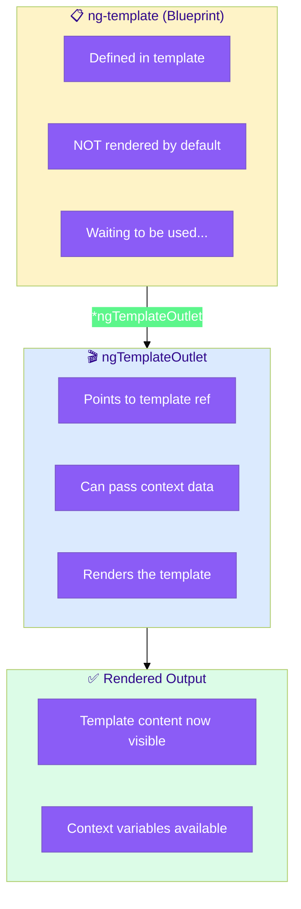
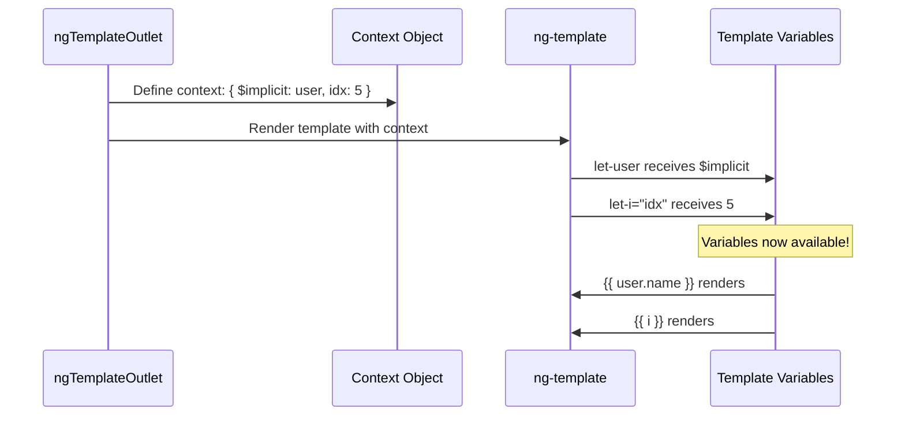
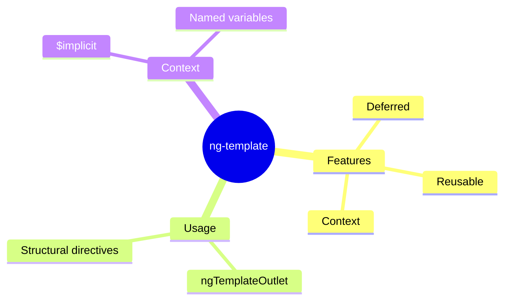

# 📋 ng-template

> **💡 Lightbulb Moment**: ng-template is content that doesn't render by default - you control WHEN it renders!


## 📋 Table of Contents
- [🔗 How ng-template Works: Deep Dive](#how-ng-template-works-deep-dive)
  - [The Deferred Rendering Flow](#the-deferred-rendering-flow)
  - [How Context Passing Works](#how-context-passing-works)
  - [Step-by-Step: Template with Context](#step-by-step-template-with-context)
  - [Code Mapping: Your Implementation](#code-mapping-your-implementation)
  - [Visual: Context Data Flow](#visual-context-data-flow)
  - [🔑 Key Differences: ng-template vs ng-container](#key-differences-ng-template-vs-ng-container)
- [1. 🔍 What is ng-template?](#1--what-is-ng-template)
- [2. 🚀 Common Use Cases](#2--common-use-cases)
  - [Conditional Templates](#conditional-templates)
  - [Template with Context](#template-with-context)
  - [📦 Data Flow Summary (Visual Box Diagram)](#data-flow-summary-visual-box-diagram)
- [3. ❓ Interview Questions](#3--interview-questions)
  - [Basic Questions](#basic-questions)
    - [Q1: ng-template vs ng-container?](#q1-ng-template-vs-ng-container)
- [🧠 Mind Map](#mind-map)

---
---

## 🔗 How ng-template Works: Deep Dive

> [!IMPORTANT]
> `ng-template` defines a **blueprint** that doesn't render until you explicitly instantiate it with `ngTemplateOutlet`. This gives you full control over WHEN and WHERE content appears.

### The Deferred Rendering Flow



### How Context Passing Works



### Step-by-Step: Template with Context

| Step | What Happens | Code |
|------|--------------|------|
| **1** | Define template with variables | `<ng-template #tpl let-user let-i="idx">` |
| **2** | Create outlet with context | `*ngTemplateOutlet="tpl; context: ctx"` |
| **3** | `$implicit` maps to default `let-var` | `{ $implicit: data }` → `let-user` |
| **4** | Named keys map to named vars | `{ idx: 5 }` → `let-i="idx"` |

### Code Mapping: Your Implementation

```html
<!-- STEP 1: Define the template (invisible until used) -->
<ng-template #userTemplate let-user let-idx="index">
    <div class="user-row">
        <span>{{ idx + 1 }}</span>
        <span>{{ user.name }}</span>
        <span>{{ user.role }}</span>
    </div>
</ng-template>

<!-- STEP 2: Render template for each user -->
@for (user of users; track user.id; let i = $index) {
    <ng-container *ngTemplateOutlet="userTemplate; context: { 
        $implicit: user,   <!-- Maps to let-user -->
        index: i           <!-- Maps to let-idx="index" -->
    }"></ng-container>
}
```

### Visual: Context Data Flow

```
OUTLET:                          TEMPLATE:
┌─────────────────────┐          ┌─────────────────────┐
│ context: {          │          │ <ng-template        │
│   $implicit: user ──┼──────────┼───► let-user        │
│   index: i ─────────┼──────────┼───► let-idx="index" │
│ }                   │          │ >                   │
└─────────────────────┘          │   {{ user.name }}   │
                                 │   {{ idx }}         │
                                 └─────────────────────┘
```

### 🔑 Key Differences: ng-template vs ng-container

| Feature | ng-template | ng-container |
|---------|-------------|--------------|
| **Renders by default?** | ❌ No | ✅ Yes |
| **Purpose** | Blueprint/deferred | Grouping element |
| **DOM element?** | No (removed) | No (removed) |
| **Context support?** | ✅ Yes (let-) | ❌ No |
| **Typical usage** | Conditional templates | Structural directives |

> [!TIP]
> **Memory Trick**: Think of `ng-template` as a **movie script** 🎬 - it exists but nothing happens until the director (ngTemplateOutlet) says "Action!"

---

## 1. 🔍 What is ng-template?

A template that doesn't render until explicitly instantiated.

```html
<!-- Doesn't render by default -->
<ng-template #myTemplate>
    <p>This won't appear until we use it!</p>
</ng-template>

<!-- Use with ngTemplateOutlet -->
<ng-container *ngTemplateOutlet="myTemplate"></ng-container>
```

---

## 2. 🚀 Common Use Cases

### Conditional Templates
```html
<ng-container *ngTemplateOutlet="isLoading ? loadingTpl : contentTpl">
</ng-container>

<ng-template #loadingTpl>Loading...</ng-template>
<ng-template #contentTpl>{{ data }}</ng-template>
```

### Template with Context
```html
<ng-container *ngTemplateOutlet="itemTpl; context: { $implicit: user }">
</ng-container>

<ng-template #itemTpl let-user>
    {{ user.name }}
</ng-template>
```

### 📦 Data Flow Summary (Visual Box Diagram)

```
┌─────────────────────────────────────────────────────────────┐
│  ng-template: DEFERRED RENDERING                            │
│                                                             │
│   TEMPLATE DEFINITION (Doesn't render yet!):                │
│   ┌───────────────────────────────────────────────────────┐ │
│   │ <ng-template #loadingTpl>                             │ │
│   │   <div class="spinner">Loading...</div>               │ │
│   │ </ng-template>                                        │ │
│   │                                                       │ │
│   │ 😴 Just sitting here, invisible, waiting...           │ │
│   └───────────────────────────────────────────────────────┘ │
│                                                             │
│   TRIGGER RENDERING (You decide when):                      │
│   ┌───────────────────────────────────────────────────────┐ │
│   │ <ng-container *ngTemplateOutlet="loadingTpl">         │ │
│   │ </ng-container>                                       │ │
│   │                                                       │ │
│   │ 🎬 "Action! Render the template NOW!"                 │ │
│   └───────────────────────────────────────────────────────┘ │
│                                                             │
│   WITH CONTEXT (Pass data to template):                     │
│   ┌───────────────────────────────────────────────────────┐ │
│   │ *ngTemplateOutlet="userTpl; context: { $implicit: u }"│ │
│   │                                         │             │ │
│   │                                         ▼             │ │
│   │ <ng-template #userTpl let-user>  ← receives 'u'       │ │
│   │   {{ user.name }}                                     │ │
│   │ </ng-template>                                        │ │
│   └───────────────────────────────────────────────────────┘ │
└─────────────────────────────────────────────────────────────┘
```

> **Key Takeaway**: ng-template = "blueprint" that doesn't render until you explicitly use ngTemplateOutlet. Perfect for conditional content!

---

## 3. ❓ Interview Questions

### Basic Questions

#### Q1: ng-template vs ng-container?
**Answer:**
| ng-template | ng-container |
|-------------|--------------|
| Deferred rendering | Immediate rendering |
| Must be triggered | Renders children |
| Template definition | Grouping element |

---

## 🧠 Mind Map


