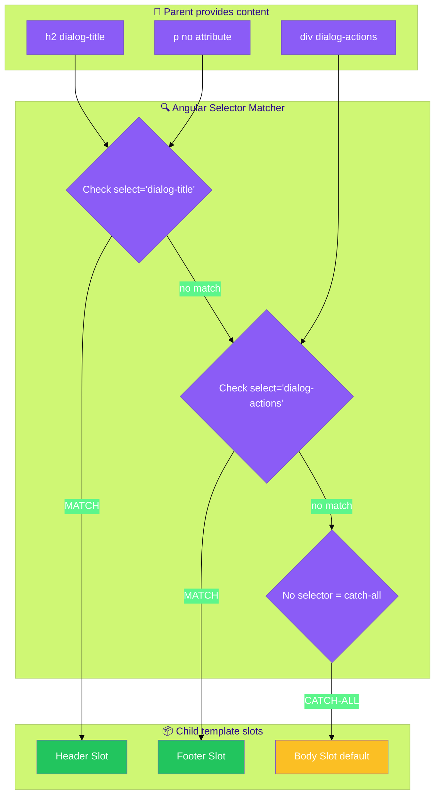
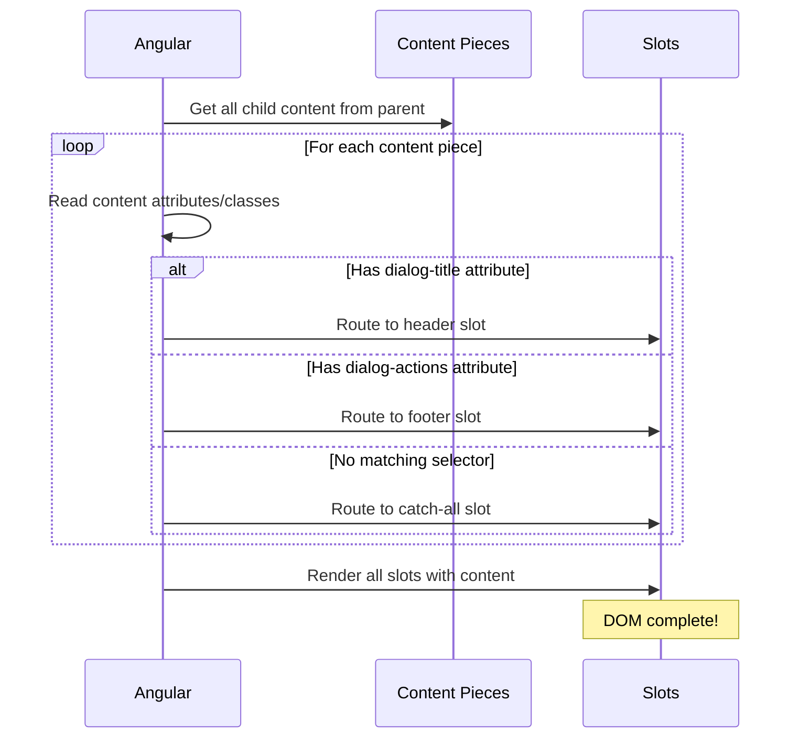
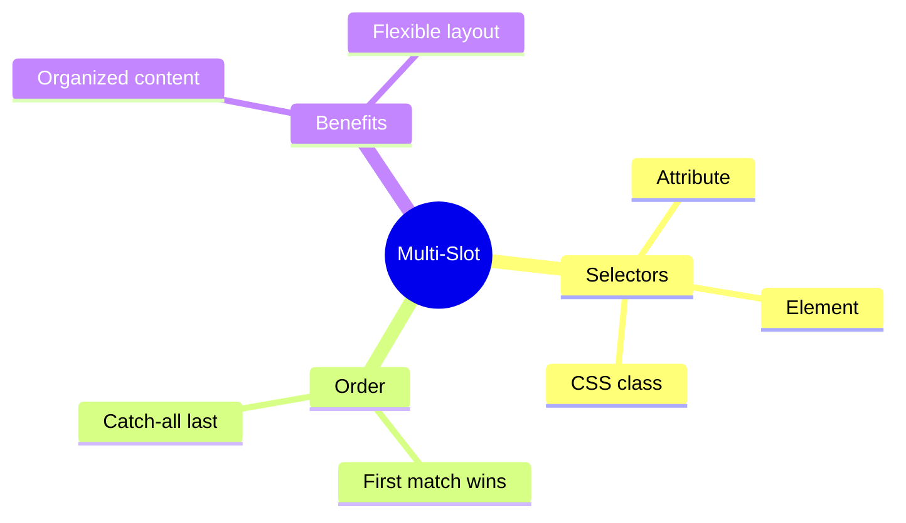

# 🎯 Multi-Slot Projection

> **💡 Lightbulb Moment**: Use select attribute to create multiple named slots for organized content!


## 📋 Table of Contents
- [🔗 How Multi-Slot Projection Works: Deep Dive](#how-multi-slot-projection-works-deep-dive)
  - [The Complete Selector Matching Flow](#the-complete-selector-matching-flow)
  - [Runtime: How Angular Matches Content](#runtime-how-angular-matches-content)
  - [Step-by-Step Matching Process](#step-by-step-matching-process)
  - [Code Mapping: Your Implementation](#code-mapping-your-implementation)
  - [🔑 Selector Types Reference](#selector-types-reference)
  - [Visual: Content Routing](#visual-content-routing)
- [1. 🔍 Selector Types](#1--selector-types)
- [2. 🚀 Complete Example](#2--complete-example)
  - [📦 Data Flow Summary (Visual Box Diagram)](#data-flow-summary-visual-box-diagram)
- [3. ❓ Interview Questions](#3--interview-questions)
  - [Basic Questions](#basic-questions)
    - [Q1: What happens to content that matches no selector?](#q1-what-happens-to-content-that-matches-no-selector)
    - [Q2: Can content match multiple slots?](#q2-can-content-match-multiple-slots)
- [📬 Mail Sorting Analogy (Easy to Remember!)](#mail-sorting-analogy-easy-to-remember)
  - [📖 Story to Remember:](#story-to-remember)
  - [🎯 Quick Reference:](#quick-reference)
- [🧠 Mind Map](#mind-map)
- [❓ Additional Interview Questions (20+)](#additional-interview-questions-20)
  - [Selector Questions](#selector-questions)
  - [Catch-All Questions](#catch-all-questions)
  - [Practical Questions](#practical-questions)
  - [Advanced Questions](#advanced-questions)
  - [Scenario Questions](#scenario-questions)
  - [Best Practice Questions](#best-practice-questions)

---
---

## 🔗 How Multi-Slot Projection Works: Deep Dive

> [!IMPORTANT]
> Multi-slot projection uses the `select` attribute to route different pieces of content to different slots. Angular matches content **once** - first match wins!

### The Complete Selector Matching Flow



### Runtime: How Angular Matches Content



### Step-by-Step Matching Process

| Step | Content | Checks | Result |
|------|---------|--------|--------|
| **1** | `<h2 dialog-title>` | Has `[dialog-title]`? ✅ | → Header slot |
| **2** | `<p>Are you sure?</p>` | Has `[dialog-title]`? ❌ | Continue... |
| | | Has `[dialog-actions]`? ❌ | Continue... |
| | | Catch-all exists? ✅ | → Body slot |
| **3** | `<div dialog-actions>` | Has `[dialog-actions]`? ✅ | → Footer slot |

### Code Mapping: Your Implementation

```typescript
// CHILD: MultiSlotCardComponent (defines slots)
@Component({
    selector: 'app-multi-slot-card',
    template: `
        <div class="card">
            <div class="card-header">
                <ng-content select="[card-header]"></ng-content>  👈 Slot 1
            </div>
            <div class="card-body">
                <ng-content select="[card-body]"></ng-content>    👈 Slot 2
            </div>
            <div class="card-footer">
                <ng-content select="[card-footer]"></ng-content>  👈 Slot 3
            </div>
        </div>
    `,
})
```

```html
<!-- PARENT: Routes content to slots via attributes -->
<app-multi-slot-card>
    <h3 card-header>🚀 Feature Card</h3>     <!-- → Goes to header slot -->
    <p card-body>This content goes into body</p>  <!-- → Goes to body slot -->
    <div card-footer>                         <!-- → Goes to footer slot -->
        <button>Action 1</button>
        <button>Action 2</button>
    </div>
</app-multi-slot-card>
```

### 🔑 Selector Types Reference

| Selector Type | Syntax | Example Match |
|---------------|--------|---------------|
| **Attribute** | `select="[header]"` | `<div header>` |
| **Element** | `select="app-header"` | `<app-header>` |
| **CSS Class** | `select=".header"` | `<div class="header">` |
| **Multiple** | `select="[a], [b]"` | Either `[a]` OR `[b]` |
| **Catch-all** | _(no select)_ | Everything unmatched |

### Visual: Content Routing

```
PARENT CONTENT:                      CHILD SLOTS:
┌─────────────────────┐              ┌─────────────────────┐
│ <h3 card-header>    │ ─────────┐   │ select="[card-header]"
│   🚀 Feature        │          └──►│   → "🚀 Feature"     │
└─────────────────────┘              ├─────────────────────┤
┌─────────────────────┐              │ select="[card-body]" │
│ <p card-body>       │ ────────────►│   → "body content"   │
│   body content      │              ├─────────────────────┤
└─────────────────────┘              │ select="[card-footer]"
┌─────────────────────┐              │   → buttons          │
│ <div card-footer>   │ ────────────►└─────────────────────┘
│   <button>Action</button>
└─────────────────────┘
```

> [!TIP]
> **Memory Trick**: Think of selectors as **mail sorting** - each piece of mail (content) gets routed to the labeled mailbox (slot) that matches its label (attribute)!

---

## 1. 🔍 Selector Types

```html
<!-- By attribute -->
<ng-content select="[header]"></ng-content>

<!-- By element -->
<ng-content select="app-header"></ng-content>

<!-- By CSS class -->
<ng-content select=".header-content"></ng-content>

<!-- Catch-all (no selector) -->
<ng-content></ng-content>
```

---

## 2. 🚀 Complete Example

```typescript
@Component({
    selector: 'app-dialog',
    template: `
        <div class="dialog">
            <header><ng-content select="[dialog-title]"></ng-content></header>
            <main><ng-content></ng-content></main>
            <footer><ng-content select="[dialog-actions]"></ng-content></footer>
        </div>
    `
})

// Usage
<app-dialog>
    <h2 dialog-title>Confirm</h2>
    <p>Are you sure?</p>
    <div dialog-actions>
        <button>Cancel</button>
        <button>OK</button>
    </div>
</app-dialog>
```


### 📦 Data Flow Summary (Visual Box Diagram)

```
┌─────────────────────────────────────────────────────────────┐
│  MULTI-SLOT: SELECTOR MATCHING                              │
│                                                             │
│   PARENT CONTENT:                                           │
│   ┌───────────────────────────────────────────────────────┐ │
│   │ <app-dialog>                                          │ │
│   │   <h2 dialog-title>Confirm</h2>         ← has [title] │ │
│   │   <p>Are you sure?</p>                  ← no attr     │ │
│   │   <div dialog-actions>                  ← has [actions]│ │
│   │     <button>Cancel</button>                           │ │
│   │     <button>OK</button>                               │ │
│   │   </div>                                              │ │
│   │ </app-dialog>                                         │ │
│   └───────────────────────────────────────────────────────┘ │
│                        │                                    │
│                        ▼                                    │
│   CHILD MATCHING PROCESS:                                   │
│   ┌───────────────────────────────────────────────────────┐ │
│   │                                                       │ │
│   │  Content: <h2 dialog-title>                           │ │
│   │     ↓                                                 │ │
│   │  Check: select="[dialog-title]" → ✅ MATCH!          │ │
│   │     → Goes to header slot                             │ │
│   │                                                       │ │
│   │  Content: <p>Are you sure?</p>                        │ │
│   │     ↓                                                 │ │
│   │  Check: select="[dialog-title]" → ❌                  │ │
│   │  Check: select="[dialog-actions]" → ❌                │ │
│   │  Check: <ng-content> (no selector) → ✅ CATCH-ALL     │ │
│   │     → Goes to body slot                               │ │
│   │                                                       │ │
│   │  Content: <div dialog-actions>                        │ │
│   │     ↓                                                 │ │
│   │  Check: select="[dialog-actions]" → ✅ MATCH!         │ │
│   │     → Goes to footer slot                             │ │
│   │                                                       │ │
│   └───────────────────────────────────────────────────────┘ │
│                                                             │
│   ORDER: Specific selectors first, catch-all last!          │
└─────────────────────────────────────────────────────────────┘
```

> **Key Takeaway**: Each content piece matches ONE selector (first match wins). Put catch-all `<ng-content>` without selector LAST!

---

## 3. ❓ Interview Questions

### Basic Questions

#### Q1: What happens to content that matches no selector?
**Answer:** It goes to the `<ng-content>` without a selector (the catch-all slot). If none exists, content is discarded.

#### Q2: Can content match multiple slots?
**Answer:** No! Content matches the FIRST matching selector only.

---

## 📬 Mail Sorting Analogy (Easy to Remember!)

Think of multi-slot projection like **sorting mail into different mailboxes**:

| Concept | Mail Analogy | Memory Trick |
|---------|-------------|--------------| 
| **Child component** | 📬 **Apartment mailroom**: Multiple labeled mailboxes | **"The sorter"** |
| **select="[header]"** | 📪 **Box A: "Bills only"**: Only accepts specific mail | **"Labeled slot"** |
| **select="[footer]"** | 📪 **Box B: "Magazines"**: Only accepts magazines | **"Another labeled slot"** |
| **No selector** | 📫 **General box**: Catches everything else | **"Catch-all"** |
| **Parent content** | ✉️ **Mail pieces**: Sorted into correct boxes | **"Your content"** |

### 📖 Story to Remember:

> 📬 **The Apartment Mailroom**
>
> Your component is an apartment with multiple mailboxes:
>
> **The Mailroom (Child Component):**
> ```html
> <div class="mailroom">
>   <div class="bills">
>     <ng-content select="[dialog-title]"></ng-content>  <!-- Bills box -->
>   </div>
>   <div class="general">
>     <ng-content></ng-content>  <!-- General mail -->
>   </div>
>   <div class="magazines">
>     <ng-content select="[dialog-actions]"></ng-content>  <!-- Magazine box -->
>   </div>
> </div>
> ```
>
> **The Mail (Parent Content):**
> ```html
> <app-dialog>
>   <h2 dialog-title>Bill</h2>       <!-- → Goes to bills box -->
>   <p>Random letter</p>              <!-- → Goes to general box -->
>   <button dialog-actions>OK</button> <!-- → Goes to magazines box -->
> </app-dialog>
> ```
>
> **Each piece of mail is sorted into the RIGHT mailbox!**

### 🎯 Quick Reference:
```
📬 Child template    = Mailroom with labeled boxes
📪 select="[attr]"   = Labeled mailbox (specific content)
📫 <ng-content>      = General mailbox (catch-all)
✉️ Parent content    = Mail pieces to be sorted
```

---

## 🧠 Mind Map



---

## ❓ Additional Interview Questions (20+)

### Selector Questions

**Q3: What are the different selector types for ng-content?**
> A: Attribute `[attr]`, element `app-component`, CSS class `.class`, and combinations.

**Q4: Can you use multiple selectors on one ng-content?**
> A: Yes, comma-separated: `select="[header], .title"` matches either.

**Q5: What's the priority when content matches multiple slots?**
> A: First matching ng-content in DOM order wins. Content only projects once.

**Q6: How do you project by component type?**
> A: Use element selector: `<ng-content select="app-header">`.

---

### Catch-All Questions

**Q7: What is the catch-all slot?**
> A: `<ng-content>` without a selector - receives all unmatched content.

**Q8: What happens to unmatched content without a catch-all?**
> A: It's discarded - never rendered.

**Q9: Where should the catch-all slot be placed?**
> A: Last in the template - after all specific selectors.

---

### Practical Questions

**Q10: Create a card with header, body, and footer slots.**
> A:
> ```html
> <ng-content select="[card-header]"></ng-content>
> <ng-content></ng-content>
> <ng-content select="[card-footer]"></ng-content>
> ```

**Q11: How does the parent provide content for a specific slot?**
> A: Add matching attribute/class/element: `<div card-header>Header</div>`.

**Q12: Can projected content include other components?**
> A: Yes - any Angular content (components, directives, bindings).

---

### Advanced Questions

**Q13: What's ngProjectAs for?**
> A: Allows content to match a different selector than its actual type:
> ```html
> <ng-container ngProjectAs="[header]">...</ng-container>
> ```

**Q14: Can you conditionally show ng-content slots?**
> A: No, ng-content is static. Use ngTemplateOutlet for conditional projection.

**Q15: How do you check if content was projected to a slot?**
> A: Use @ContentChild/Celildren to query, or CSS :empty selector.

**Q16: Can projected content be re-ordered?**
> A: No, ng-content projects in order matched. Use ngTemplateOutlet for reordering.

---

### Scenario Questions

**Q17: Modal with custom title, body, and action buttons.**
> A: Three slots: `[modal-title]`, default body, `[modal-actions]`.

**Q18: Tab component where each tab has different content.**
> A: Use `select="app-tab"` or `[tab]` to match tab content.

**Q19: Layout with sidebar and main content areas.**
> A: `select="[sidebar]"` and default slot for main content.

**Q20: Card with optional image slot.**
> A: Add `<ng-content select="[card-image]">` - empty if no image provided.

---

### Best Practice Questions

**Q21: What naming convention for slot attributes?**
> A: Use descriptive names: `[card-header]` not `[h]`. Use component prefix if needed.

**Q22: How do you document required slots?**
> A: JSDoc comments on component class or separate documentation.

