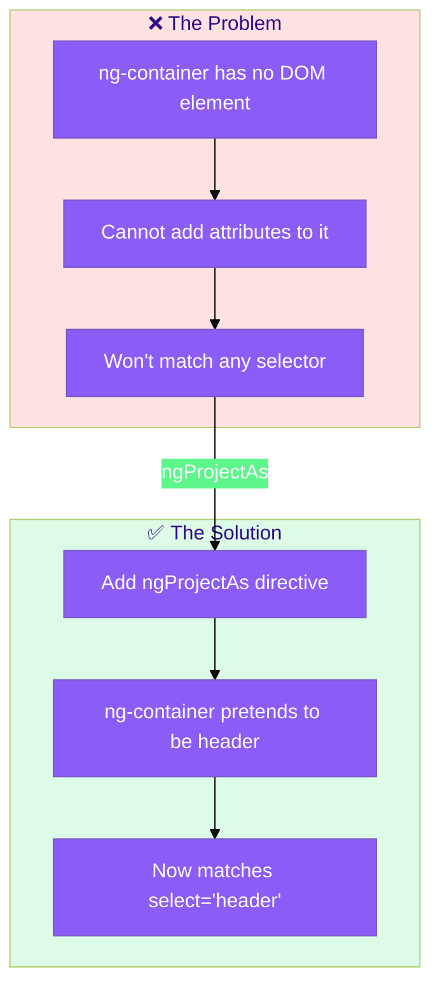
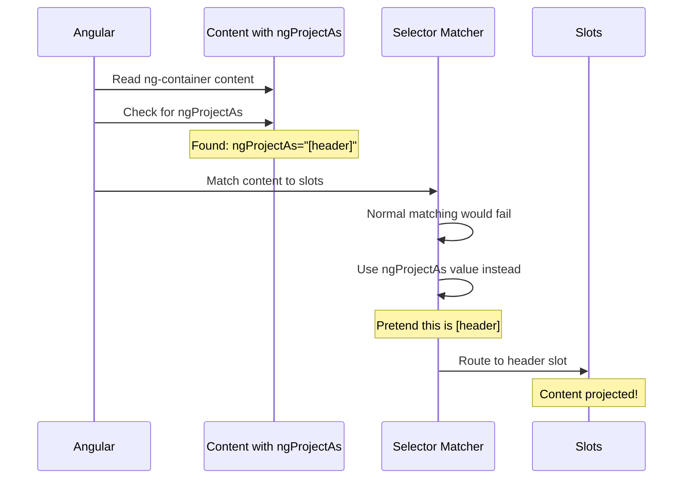
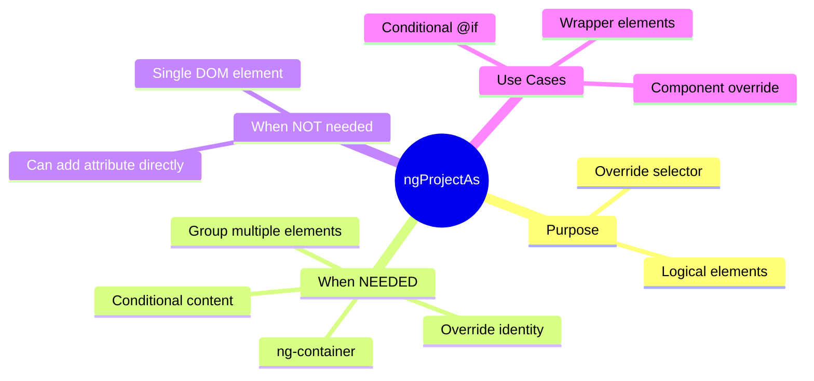

# 🔄 ngProjectAs

> **💡 Lightbulb Moment**: ngProjectAs lets content pretend to be a different element for slot matching!


## 📋 Table of Contents
- [📑 Index](#index)
- [1. 🔍 What Problem Does It Solve?](#1--what-problem-does-it-solve)
  - [The Problem: `ng-container` Can't Have Attributes!](#the-problem-ng-container-cant-have-attributes)
  - [The Solution: ngProjectAs = "Wear a Costume"](#the-solution-ngprojectas--wear-a-costume)
- [2. 🔗 How ngProjectAs Works: Deep Dive](#2--how-ngprojectas-works-deep-dive)
  - [The Problem & Solution Flow](#the-problem--solution-flow)
  - [How Angular Processes ngProjectAs](#how-angular-processes-ngprojectas)
  - [Step-by-Step: Without vs With ngProjectAs](#step-by-step-without-vs-with-ngprojectas)
  - [Code Mapping: Your Use Case](#code-mapping-your-use-case)
  - [Visual: The "Costume" Concept](#visual-the-costume-concept)
- [3. 🤔 ngProjectAs vs Direct Attribute - When Do You NEED It?](#3--ngprojectas-vs-direct-attribute---when-do-you-need-it)
  - [✅ Direct Attribute Works (No ngProjectAs Needed)](#direct-attribute-works-no-ngprojectas-needed)
  - [🎯 The 3 Cases Where ngProjectAs is REQUIRED](#the-3-cases-where-ngprojectas-is-required)
    - [Case 1: `ng-container` (No DOM Element!)](#case-1-ng-container-no-dom-element)
    - [Case 2: Group Multiple Elements as ONE Slot Match](#case-2-group-multiple-elements-as-one-slot-match)
    - [Case 3: Override Element's Natural Match](#case-3-override-elements-natural-match)
  - [📊 Decision Table](#decision-table)
  - [💡 Bottom Line](#bottom-line)
- [4. 🔑 Key Use Cases](#4--key-use-cases)
  - [📦 Data Flow Summary](#data-flow-summary)
- [5. 🎭 Costume Party Analogy](#5--costume-party-analogy)
  - [📖 Story to Remember:](#story-to-remember)
  - [🎯 Quick Reference:](#quick-reference)
- [6. 🧠 Mind Map](#6--mind-map)
- [7. ❓ Interview Questions (20+)](#7--interview-questions-20)
  - [Basic Questions](#basic-questions)
  - [Selector Matching Questions](#selector-matching-questions)
  - [Use Case Questions](#use-case-questions)
  - [Scenario Questions](#scenario-questions)
  - [Advanced Questions](#advanced-questions)
  - [Comparison Questions](#comparison-questions)

---
---

## 📑 Index

1. [What Problem Does It Solve?](#1--what-problem-does-it-solve)
2. [How ngProjectAs Works: Deep Dive](#2--how-ngprojectas-works-deep-dive)
3. [ngProjectAs vs Direct Attribute](#3--ngprojectas-vs-direct-attribute---when-do-you-need-it)
4. [Key Use Cases](#4--key-use-cases)
5. [Costume Party Analogy](#5--costume-party-analogy)
6. [Mind Map](#6--mind-map)
7. [Interview Questions (20+)](#7--interview-questions-20)

---

## 1. 🔍 What Problem Does It Solve?

### The Problem: `ng-container` Can't Have Attributes!

```html
<!-- ❌ PROBLEM: ng-container has NO DOM element -->
<app-card>
    <ng-container>
        @if (showTitle) { <h2>{{ title }}</h2> }
    </ng-container>
</app-card>

<!-- Child expects: <ng-content select="[header]"> -->
<!-- But ng-container can't have [header] attribute! -->
<!-- Content won't match ANY slot! -->
```

### The Solution: ngProjectAs = "Wear a Costume"

```html
<!-- ✅ SOLUTION: Tell Angular to treat it AS IF it were [header] -->
<app-card>
    <ng-container ngProjectAs="[header]">
        @if (showTitle) { <h2>{{ title }}</h2> }
    </ng-container>
</app-card>

<!-- Now it matches select="[header]" slot! -->
```

---

## 2. 🔗 How ngProjectAs Works: Deep Dive

> [!IMPORTANT]
> `ngProjectAs` allows content to **override its selector identity** for content projection. Essential when using `ng-container` or when you need to match a slot without adding attributes to elements.

### The Problem & Solution Flow



### How Angular Processes ngProjectAs



### Step-by-Step: Without vs With ngProjectAs

| Scenario | Code | Matches `select="[header]"`? |
|----------|------|------------------------------|
| **Element with attribute** | `<div header>Title</div>` | ✅ Yes |
| **ng-container (no ngProjectAs)** | `<ng-container>Title</ng-container>` | ❌ No |
| **ng-container WITH ngProjectAs** | `<ng-container ngProjectAs="[header]">Title</ng-container>` | ✅ Yes! |

### Code Mapping: Your Use Case

```typescript
// CHILD: Expects [header] attribute
@Component({
    template: `
        <div class="card">
            <div class="header">
                <ng-content select="[header]"></ng-content>  👈 Expects [header]
            </div>
        </div>
    `,
})
```

```html
<!-- WITHOUT ngProjectAs - FAILS! -->
<app-card>
    <ng-container>                     <!-- ❌ No attribute, no match! -->
        @if (showTitle) { <h2>{{ title }}</h2> }
    </ng-container>
</app-card>

<!-- WITH ngProjectAs - WORKS! -->
<app-card>
    <ng-container ngProjectAs="[header]">  <!-- ✅ "I'm pretending to be [header]!" -->
        @if (showTitle) { <h2>{{ title }}</h2> }
    </ng-container>
</app-card>
```

### Visual: The "Costume" Concept

```
WITHOUT ngProjectAs:
┌─────────────────────┐         ┌─────────────────────┐
│ ng-container        │         │ select="[header]"   │
│   (invisible)       │ ───❌──►│   "No match!"       │
│   No attributes     │         │                     │
└─────────────────────┘         └─────────────────────┘

WITH ngProjectAs:
┌─────────────────────┐         ┌─────────────────────┐
│ ng-container        │         │ select="[header]"   │
│ ngProjectAs="[header]"  ✅──►│   "Match found!"    │
│ "I'm dressed as header!" │    │                     │
└─────────────────────┘         └─────────────────────┘
```

---

## 3. 🤔 ngProjectAs vs Direct Attribute - When Do You NEED It?

> [!IMPORTANT]
> In MOST cases, you can just add the attribute directly! `ngProjectAs` is only needed for specific edge cases.

### ✅ Direct Attribute Works (No ngProjectAs Needed)

```html
<!-- Just add the attribute - simple and clean! -->
<div header>Title here</div>
<h2 header>Another title</h2>
<span card-footer>Footer text</span>
```

### 🎯 The 3 Cases Where ngProjectAs is REQUIRED

#### Case 1: `ng-container` (No DOM Element!)

```html
<!-- ❌ ng-container has NO DOM, can't add attributes! -->
<ng-container>
    @if (showTitle) { <h2>{{ title }}</h2> }
</ng-container>

<!-- ✅ ngProjectAs to the rescue! -->
<ng-container ngProjectAs="[header]">
    @if (showTitle) { <h2>{{ title }}</h2> }
</ng-container>
```

#### Case 2: Group Multiple Elements as ONE Slot Match

```html
<!-- ❌ Adding [header] to each is verbose and error-prone -->
<app-card>
    <h2 header>Title</h2>
    <p header>Subtitle</p>  <!-- Easy to forget! -->
</app-card>

<!-- ✅ Wrap in ng-container - BOTH go together -->
<app-card>
    <ng-container ngProjectAs="[header]">
        <h2>Title</h2>
        <p>Subtitle</p>
        <!-- Both projected as ONE unit -->
    </ng-container>
</app-card>
```

#### Case 3: Override Element's Natural Match

```html
<!-- Force <app-footer> to match [header] slot! -->
<app-card>
    <app-footer ngProjectAs="[header]"></app-footer>
</app-card>
```

### 📊 Decision Table

| Scenario | Direct Attribute | ngProjectAs Needed? |
|----------|------------------|---------------------|
| `<div header>` | ✅ Works! | ❌ No |
| `<h2 header>` | ✅ Works! | ❌ No |
| `<ng-container>` | ❌ Can't add attr! | ✅ **YES** |
| Group multiple elements | ❌ Verbose, error-prone | ✅ **YES** |
| Override element type | ❌ Doesn't match | ✅ **YES** |
| Conditional content `@if` | ❌ Can't wrap directly | ✅ **YES** |

### 💡 Bottom Line

```
90% of the time: Just use <div header> - it works!
10% of the time: You NEED ngProjectAs for edge cases:
  → ng-container (no DOM element)
  → Grouping multiple elements
  → Conditional blocks (@if, @for)
  → Overriding what something "pretends" to be
```

---

## 4. 🔑 Key Use Cases

| Use Case | Why Needed | Example |
|----------|------------|---------|
| **Conditional content** | Can't add attr to `@if` | `<ng-container ngProjectAs="[x]">@if...</ng-container>` |
| **Multiple elements as one** | Wrap group in container | `<ng-container ngProjectAs="[x]">A B C</ng-container>` |
| **Override element type** | Make div match component slot | `<div ngProjectAs="app-header">` |

### 📦 Data Flow Summary

```
┌─────────────────────────────────────────────────────────────┐
│  ngProjectAs: OVERRIDE SELECTOR MATCHING                    │
│                                                             │
│   THE PROBLEM:                                              │
│   ┌───────────────────────────────────────────────────────┐ │
│   │ Child expects: <ng-content select="[header]">         │ │
│   │                                                       │ │
│   │ Parent has ng-container (no DOM element):             │ │
│   │ <ng-container>                                        │ │
│   │   @if (showTitle) { <h2>{{ title }}</h2> }            │ │
│   │ </ng-container>                                       │ │
│   │                                                       │ │
│   │ ❌ ng-container can't have [header] attribute!        │ │
│   │ ❌ Content won't match the slot!                      │ │
│   └───────────────────────────────────────────────────────┘ │
│                                                             │
│   THE SOLUTION: ngProjectAs                                 │
│   ┌───────────────────────────────────────────────────────┐ │
│   │ <ng-container ngProjectAs="[header]">                 │ │
│   │   @if (showTitle) { <h2>{{ title }}</h2> }            │ │
│   │ </ng-container>                                       │ │
│   │                                                       │ │
│   │ ✅ "I'm pretending to be [header]!"                   │ │
│   │ ✅ Now it matches select="[header]" slot!             │ │
│   └───────────────────────────────────────────────────────┘ │
└─────────────────────────────────────────────────────────────┘
```

---

## 5. 🎭 Costume Party Analogy

Think of ngProjectAs like **wearing a costume**:

| Concept | Costume Analogy | Memory Trick |
|---------|----------------|--------------| 
| **ngProjectAs** | 🎭 **Costume**: "I'm dressed as a header!" | **"Pretend to be"** |
| **select="[header]"** | 🎟️ **VIP entrance**: "Only headers allowed" | **"Matching rule"** |
| **ng-container** | 👻 **Invisible person**: Exists but no body | **"No DOM element"** |
| **Override selector** | 🥸 **Disguise**: Ninja dressed as chef | **"Change identity"** |

### 📖 Story to Remember:

> 🎭 **The Exclusive Costume Party**
>
> Your component is a party with dress codes:
>
> **The Problem:**
> ```html
> <!-- Party only admits people wearing [header] tag -->
> <ng-content select="[header]"></ng-content>
> 
> <!-- ng-container is invisible - has no costume! -->
> <ng-container>
>   <h1>I want in!</h1>
> </ng-container>
> <!-- ❌ Can't enter! No costume! -->
> ```
>
> **The Solution:**
> ```html
> <!-- Put on a [header] costume! -->
> <ng-container ngProjectAs="[header]">
>   <h1>Now I have a costume!</h1>
> </ng-container>
> <!-- ✅ Can enter! Dressed as header! -->
> ```
>
> **ngProjectAs = putting on a costume to match the dress code!**

### 🎯 Quick Reference:
```
🎭 ngProjectAs      = Wear a costume (match selector)
🎟️ select="[x]"    = Dress code (VIP entrance rule)
👻 ng-container     = Invisible guest (no DOM)
🥸 Override         = Disguise as different type
```

---

## 6. 🧠 Mind Map



---

## 7. ❓ Interview Questions (20+)

### Basic Questions

**Q1: Why can't you put [header] on ng-container directly?**
> A: ng-container is purely logical - it's removed from DOM. ngProjectAs allows it to participate in content projection matching.

**Q2: Can you use ngProjectAs on any element?**
> A: Yes! It overrides the natural selector for content projection purposes.

**Q3: What is the syntax for ngProjectAs?**
> A: `ngProjectAs="selector"` where selector matches the ng-content select.

**Q4: Why does ng-container need ngProjectAs?**
> A: ng-container has no DOM element, so can't have attributes for selector matching.

**Q5: Does ngProjectAs change the actual DOM structure?**
> A: No, it only affects how content projection matching works.

---

### Selector Matching Questions

**Q6: Can ngProjectAs match element selectors?**
> A: Yes: `ngProjectAs="app-header"` matches `select="app-header"`.

**Q7: Can ngProjectAs match class selectors?**
> A: Yes: `ngProjectAs=".header"` matches `select=".header"`.

**Q8: What if ngProjectAs doesn't match any slot?**
> A: Content goes to catch-all slot (no selector) or is discarded.

---

### Use Case Questions

**Q9: Project conditional content to a specific slot.**
> A:
> ```html
> <ng-container ngProjectAs="[header]">
>   @if (showHeader) { <h1>Title</h1> }
> </ng-container>
> ```

**Q10: Project multiple elements as one slot match.**
> A: Wrap in ng-container with ngProjectAs - all children project together.

**Q11: When should you use ngProjectAs vs direct attribute?**
> A: Use direct attribute (`<div header>`) when possible. Use ngProjectAs only when:
> - Element is ng-container (no DOM)
> - Grouping multiple elements
> - Overriding element's natural match

---

### Scenario Questions

**Q12: Card with optional conditional header.**
> A: Use ng-container with ngProjectAs="[card-header]" wrapping @if block.

**Q13: Tab content that's conditionally shown.**
> A: Wrap conditionally rendered content in ng-container with ngProjectAs.

**Q14: Form fields projected into form layout slots.**
> A: Each field wrapped in ng-container with appropriate ngProjectAs.

---

### Advanced Questions

**Q15: Can ngProjectAs be dynamic (use binding)?**
> A: No, ngProjectAs value must be static string at compile time.

**Q16: Does ngProjectAs work with structural directives?**
> A: Use ng-container: `<ng-container ngProjectAs="[x]">` wrapping *ngFor, etc.

**Q17: Order of priority: ngProjectAs or actual element?**
> A: ngProjectAs overrides natural selector matching completely.

**Q18: Can you use ngProjectAs on components?**
> A: Yes, but it overrides how the component is matched for projection.

---

### Comparison Questions

**Q19: ngProjectAs vs ngTemplateOutlet?**
> A: ngProjectAs is for static projection; ngTemplateOutlet for dynamic rendering.

**Q20: When to use ngProjectAs vs adding attribute directly?**
> A: Use ngProjectAs when you can't add attribute (ng-container) or need to override. Otherwise, just add the attribute directly - it's simpler!

