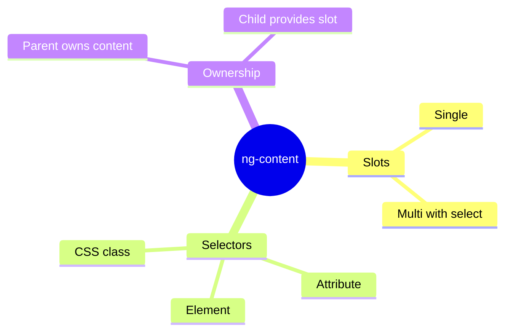

# 📦 Use Case 1: Basic ng-content

> **💡 Lightbulb Moment**: ng-content is Angular's way of creating "slots" in components where parents can insert content!

---

## 1. 🔍 What is Content Projection?

Allows parent components to project content INTO child component templates.

```typescript
// Card component template
<div class="card">
    <ng-content></ng-content>  <!-- Content goes here -->
</div>

// Usage
<app-card>
    <h2>My Title</h2>
    <p>My content</p>
</app-card>
```

---

## 2. 🚀 Single Slot vs Multi-Slot

### Single Slot
```html
<ng-content></ng-content>
```

### Multi-Slot with Selectors
```html
<ng-content select="[header]"></ng-content>
<ng-content select="[body]"></ng-content>
<ng-content select="[footer]"></ng-content>
```

---

## 3. ❓ Interview Questions

### Basic Questions

#### Q1: What's the difference between @Input and ng-content?
**Answer:**
| @Input() | ng-content |
|----------|------------|
| Data values | Template content |
| Component controls rendering | Parent controls rendering |
| Statically typed | Any content |

#### Q2: Does projected content belong to parent or child?
**Answer:** **Parent!** The parent maintains control, bindings, and lifecycle.

---

### Scenario-Based Questions

#### Scenario: Card Component
**Question:** Create a card with header, body, footer slots.

**Answer:**
```typescript
// Component
@Component({
    template: `
        <div class="card">
            <div class="header"><ng-content select="[card-header]"></ng-content></div>
            <div class="body"><ng-content></ng-content></div>
            <div class="footer"><ng-content select="[card-footer]"></ng-content></div>
        </div>
    `
})

// Usage
<app-card>
    <h2 card-header>Title</h2>
    <p>Main content</p>
    <button card-footer>Save</button>
</app-card>
```

---

## 🧠 Mind Map


