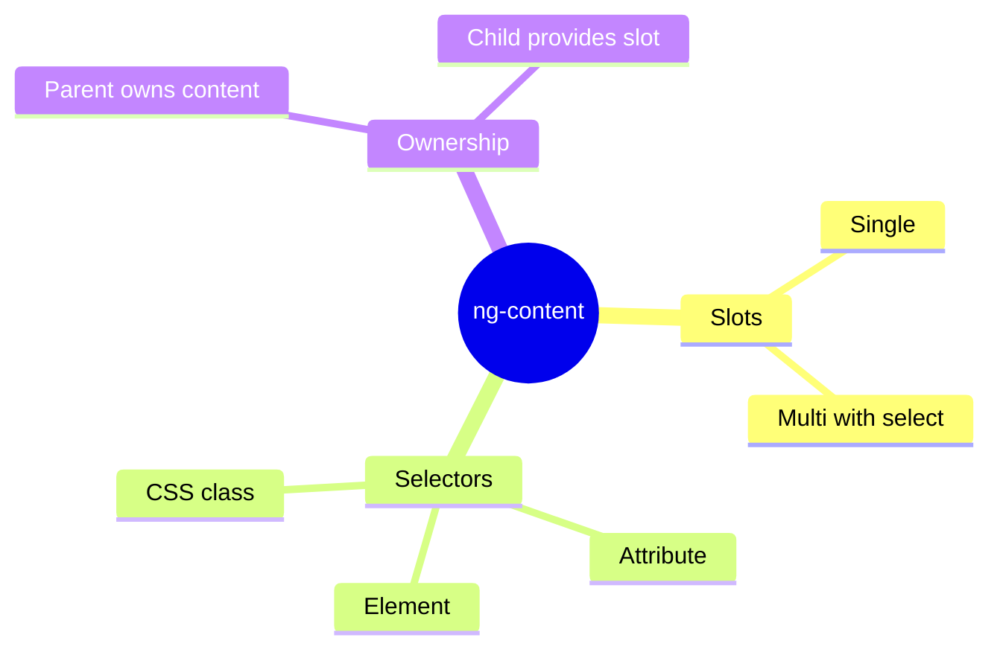

# 📦 Use Case 1: Basic ng-content

> **💡 Lightbulb Moment**: ng-content is Angular's way of creating "slots" in components where parents can insert content!

---

## 1. 🔍 What is Content Projection?

Allows parent components to project content INTO child component templates.

```typescript
// Card component template
<div class="card">
    <ng-content></ng-content>  <!-- Content goes here -->
</div>

// Usage
<app-card>
    <h2>My Title</h2>
    <p>My content</p>
</app-card>
```

---

## 2. 🚀 Single Slot vs Multi-Slot

### Single Slot
```html
<ng-content></ng-content>
```

### Multi-Slot with Selectors
```html
<ng-content select="[header]"></ng-content>
<ng-content select="[body]"></ng-content>
<ng-content select="[footer]"></ng-content>
```

### 📦 Data Flow Summary (Visual Box Diagram)

```
┌─────────────────────────────────────────────────────────────┐
│  CONTENT PROJECTION: PARENT → CHILD SLOT                    │
│                                                             │
│   PARENT COMPONENT (Content Owner):                         │
│   ┌───────────────────────────────────────────────────────┐ │
│   │ <app-card>                                            │ │
│   │   <h2 card-header>My Title</h2>    ──┐ [header]       │ │
│   │   <p>This is body content</p>      ──┼─ [default]     │ │
│   │   <button card-footer>Save</button>──┘ [footer]       │ │
│   │ </app-card>                                           │ │
│   └───────────────────────────────────────────────────────┘ │
│                        │                                    │
│                        ▼ Content flows DOWN                 │
│                                                             │
│   CHILD COMPONENT (Slot Provider):                          │
│   ┌───────────────────────────────────────────────────────┐ │
│   │ <div class="card">                                    │ │
│   │                                                       │ │
│   │   ┌─────────────────────────────────────────────┐     │ │
│   │   │ <ng-content select="[card-header]">         │     │ │
│   │   │   → "My Title" appears here                 │     │ │
│   │   └─────────────────────────────────────────────┘     │ │
│   │                                                       │ │
│   │   ┌─────────────────────────────────────────────┐     │ │
│   │   │ <ng-content>  (default/catch-all)           │     │ │
│   │   │   → "This is body content" appears here     │     │ │
│   │   └─────────────────────────────────────────────┘     │ │
│   │                                                       │ │
│   │   ┌─────────────────────────────────────────────┐     │ │
│   │   │ <ng-content select="[card-footer]">         │     │ │
│   │   │   → "Save" button appears here              │     │ │
│   │   └─────────────────────────────────────────────┘     │ │
│   │                                                       │ │
│   │ </div>                                                │ │
│   └───────────────────────────────────────────────────────┘ │
│                                                             │
│   KEY: Parent OWNS content, Child provides SLOTS            │
└─────────────────────────────────────────────────────────────┘
```

> **Key Takeaway**: ng-content creates "slots" - parent decides WHAT goes in, child decides WHERE it goes. Parent owns the content's lifecycle!

---

## 3. ❓ Interview Questions

### Basic Questions

#### Q1: What's the difference between @Input and ng-content?
**Answer:**
| @Input() | ng-content |
|----------|------------|
| Data values | Template content |
| Component controls rendering | Parent controls rendering |
| Statically typed | Any content |

#### Q2: Does projected content belong to parent or child?
**Answer:** **Parent!** The parent maintains control, bindings, and lifecycle.

---

### Scenario-Based Questions

#### Scenario: Card Component
**Question:** Create a card with header, body, footer slots.

**Answer:**
```typescript
// Component
@Component({
    template: `
        <div class="card">
            <div class="header"><ng-content select="[card-header]"></ng-content></div>
            <div class="body"><ng-content></ng-content></div>
            <div class="footer"><ng-content select="[card-footer]"></ng-content></div>
        </div>
    `
})

// Usage
<app-card>
    <h2 card-header>Title</h2>
    <p>Main content</p>
    <button card-footer>Save</button>
</app-card>
```

---

## 🖼️ Photo Frame Analogy (Easy to Remember!)

Think of content projection like a **photo frame**:

| Concept | Photo Frame Analogy | Memory Trick |
|---------|--------------------|--------------| 
| **ng-content** | 🖼️ **Empty frame**: The wall slot waiting for YOUR photo | **"The slot"** |
| **Parent component** | 📸 **You (photo owner)**: You decide what photo goes in | **"Content owner"** |
| **Child component** | 🏠 **The frame holder**: Provides the slot, not the content | **"Slot provider"** |
| **Multi-slot** | 🖼️🖼️🖼️ **Multiple frames**: Header frame, main frame, footer frame | **"Multiple slots"** |
| **select="[attr]"** | 🏷️ **Frame labels**: "Family photos here", "Vacation here" | **"Labeled slots"** |

### 📖 Story to Remember:

> 🖼️ **The Photo Gallery**
>
> You buy a fancy multi-frame display (Card Component):
>
> **The Frame (Child Component):**
> ```html
> <div class="gallery">
>   <div class="header-slot"><ng-content select="[header]"></ng-content></div>
>   <div class="main-slot"><ng-content></ng-content></div>
>   <div class="footer-slot"><ng-content select="[footer]"></ng-content></div>
> </div>
> ```
>
> **You Choose What Goes In (Parent):**
> ```html
> <app-gallery>
>   <h2 header>My Vacation Photos</h2>   <!-- Goes to header slot -->
>                  <!-- Goes to main slot -->
>   <button footer>Next Album</button>    <!-- Goes to footer slot -->
> </app-gallery>
> ```
>
> **You own the photos (content). The frame just displays them!**

### 🎯 Quick Reference:
```
🖼️ <ng-content>           = Empty frame (single slot)
🖼️🖼️ select="[name]"      = Labeled frames (multi-slot)
📸 Parent provides        = You choose the photos
🏠 Child receives         = Frame displays them
```

---

## 🧠 Mind Map


