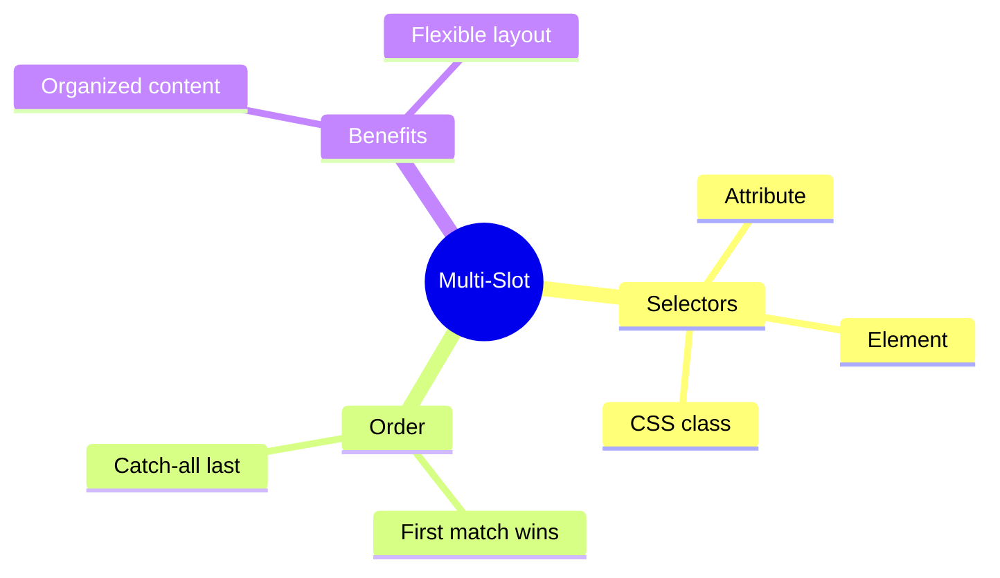

# 🎯 Use Case 2: Multi-Slot Projection

> **💡 Lightbulb Moment**: Use select attribute to create multiple named slots for organized content!

---

## 1. 🔍 Selector Types

```html
<!-- By attribute -->
<ng-content select="[header]"></ng-content>

<!-- By element -->
<ng-content select="app-header"></ng-content>

<!-- By CSS class -->
<ng-content select=".header-content"></ng-content>

<!-- Catch-all (no selector) -->
<ng-content></ng-content>
```

---

## 2. 🚀 Complete Example

```typescript
@Component({
    selector: 'app-dialog',
    template: `
        <div class="dialog">
            <header><ng-content select="[dialog-title]"></ng-content></header>
            <main><ng-content></ng-content></main>
            <footer><ng-content select="[dialog-actions]"></ng-content></footer>
        </div>
    `
})

// Usage
<app-dialog>
    <h2 dialog-title>Confirm</h2>
    <p>Are you sure?</p>
    <div dialog-actions>
        <button>Cancel</button>
        <button>OK</button>
    </div>
</app-dialog>
```

---

## 3. ❓ Interview Questions

### Basic Questions

#### Q1: What happens to content that matches no selector?
**Answer:** It goes to the `<ng-content>` without a selector (the catch-all slot). If none exists, content is discarded.

#### Q2: Can content match multiple slots?
**Answer:** No! Content matches the FIRST matching selector only.

---

## 🧠 Mind Map


