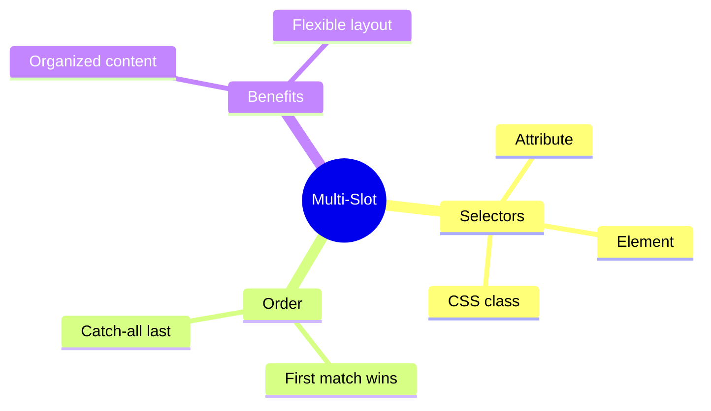

# 🎯 Use Case 2: Multi-Slot Projection

> **💡 Lightbulb Moment**: Use select attribute to create multiple named slots for organized content!

---

## 1. 🔍 Selector Types

```html
<!-- By attribute -->
<ng-content select="[header]"></ng-content>

<!-- By element -->
<ng-content select="app-header"></ng-content>

<!-- By CSS class -->
<ng-content select=".header-content"></ng-content>

<!-- Catch-all (no selector) -->
<ng-content></ng-content>
```

---

## 2. 🚀 Complete Example

```typescript
@Component({
    selector: 'app-dialog',
    template: `
        <div class="dialog">
            <header><ng-content select="[dialog-title]"></ng-content></header>
            <main><ng-content></ng-content></main>
            <footer><ng-content select="[dialog-actions]"></ng-content></footer>
        </div>
    `
})

// Usage
<app-dialog>
    <h2 dialog-title>Confirm</h2>
    <p>Are you sure?</p>
    <div dialog-actions>
        <button>Cancel</button>
        <button>OK</button>
    </div>
</app-dialog>
```

---

## 3. ❓ Interview Questions

### Basic Questions

#### Q1: What happens to content that matches no selector?
**Answer:** It goes to the `<ng-content>` without a selector (the catch-all slot). If none exists, content is discarded.

#### Q2: Can content match multiple slots?
**Answer:** No! Content matches the FIRST matching selector only.

---

## 📬 Mail Sorting Analogy (Easy to Remember!)

Think of multi-slot projection like **sorting mail into different mailboxes**:

| Concept | Mail Analogy | Memory Trick |
|---------|-------------|--------------| 
| **Child component** | 📬 **Apartment mailroom**: Multiple labeled mailboxes | **"The sorter"** |
| **select="[header]"** | 📪 **Box A: "Bills only"**: Only accepts specific mail | **"Labeled slot"** |
| **select="[footer]"** | 📪 **Box B: "Magazines"**: Only accepts magazines | **"Another labeled slot"** |
| **No selector** | 📫 **General box**: Catches everything else | **"Catch-all"** |
| **Parent content** | ✉️ **Mail pieces**: Sorted into correct boxes | **"Your content"** |

### 📖 Story to Remember:

> 📬 **The Apartment Mailroom**
>
> Your component is an apartment with multiple mailboxes:
>
> **The Mailroom (Child Component):**
> ```html
> <div class="mailroom">
>   <div class="bills">
>     <ng-content select="[dialog-title]"></ng-content>  <!-- Bills box -->
>   </div>
>   <div class="general">
>     <ng-content></ng-content>  <!-- General mail -->
>   </div>
>   <div class="magazines">
>     <ng-content select="[dialog-actions]"></ng-content>  <!-- Magazine box -->
>   </div>
> </div>
> ```
>
> **The Mail (Parent Content):**
> ```html
> <app-dialog>
>   <h2 dialog-title>Bill</h2>       <!-- → Goes to bills box -->
>   <p>Random letter</p>              <!-- → Goes to general box -->
>   <button dialog-actions>OK</button> <!-- → Goes to magazines box -->
> </app-dialog>
> ```
>
> **Each piece of mail is sorted into the RIGHT mailbox!**

### 🎯 Quick Reference:
```
📬 Child template    = Mailroom with labeled boxes
📪 select="[attr]"   = Labeled mailbox (specific content)
📫 <ng-content>      = General mailbox (catch-all)
✉️ Parent content    = Mail pieces to be sorted
```

---

## 🧠 Mind Map


