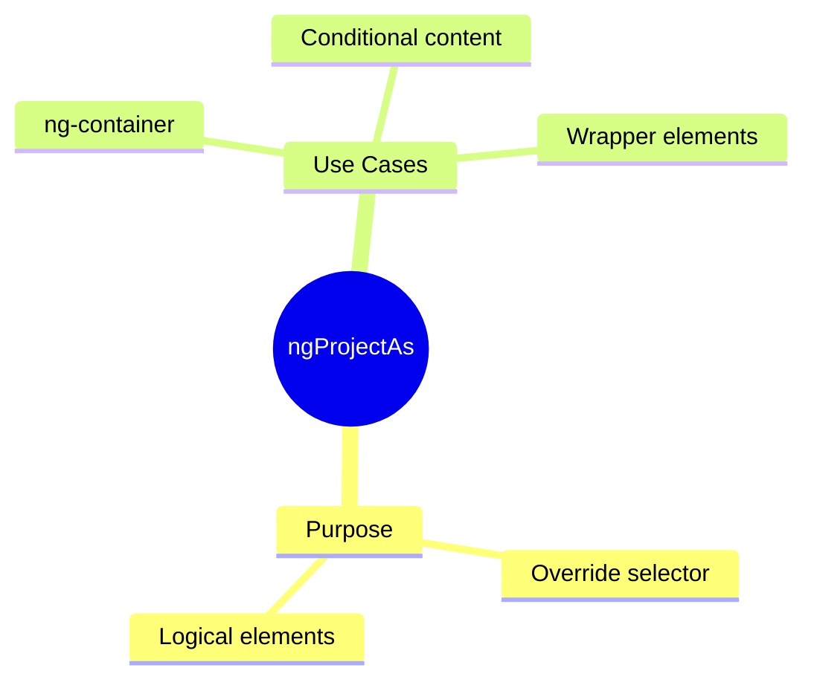

# 🔄 Use Case 3: ngProjectAs

> **💡 Lightbulb Moment**: ngProjectAs lets content pretend to be a different element for slot matching!

---

## 1. 🔍 What is ngProjectAs?

Allows content to match a different selector than its actual type.

```html
<!-- Slot expects [header] attribute -->
<ng-content select="[header]"></ng-content>

<!-- Use ngProjectAs to project ng-container as [header] -->
<app-card>
    <ng-container ngProjectAs="[header]">
        @if (showTitle) { <h2>{{ title }}</h2> }
    </ng-container>
</app-card>
```

---

## 2. 🚀 When to Use

- Project conditional content with *ngIf
- Wrap multiple elements as one slot
- Project ng-container into slots

---

## 3. ❓ Interview Questions

### Basic Questions

#### Q1: Why can't you put [header] on ng-container directly?
**Answer:** ng-container is purely logical - it's removed from DOM. ngProjectAs allows it to participate in content projection matching.

#### Q2: Can you use ngProjectAs on any element?
**Answer:** Yes! It overrides the natural selector for content projection purposes.

---

## 🧠 Mind Map


