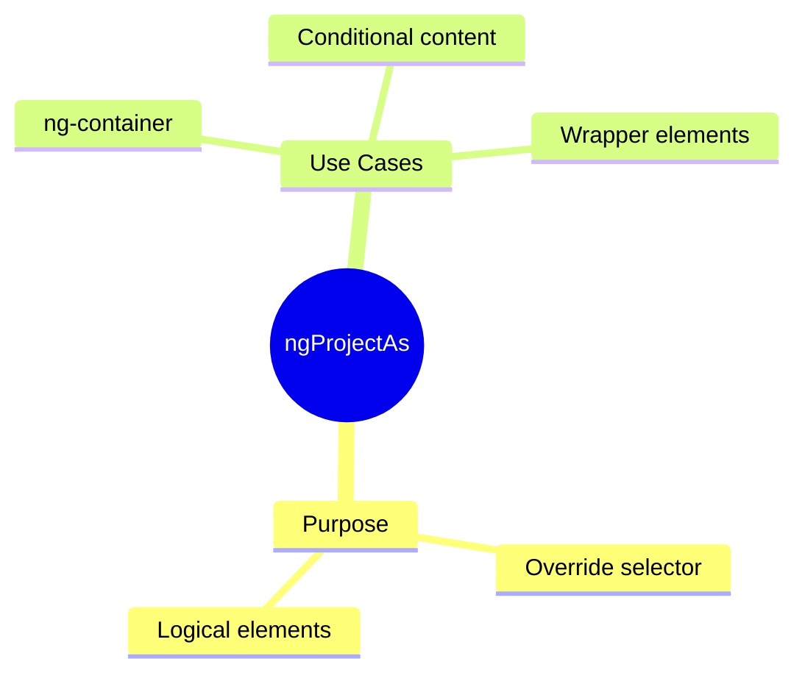

# 🔄 Use Case 3: ngProjectAs

> **💡 Lightbulb Moment**: ngProjectAs lets content pretend to be a different element for slot matching!

---

## 1. 🔍 What is ngProjectAs?

Allows content to match a different selector than its actual type.

```html
<!-- Slot expects [header] attribute -->
<ng-content select="[header]"></ng-content>

<!-- Use ngProjectAs to project ng-container as [header] -->
<app-card>
    <ng-container ngProjectAs="[header]">
        @if (showTitle) { <h2>{{ title }}</h2> }
    </ng-container>
</app-card>
```

---

## 2. 🚀 When to Use

- Project conditional content with *ngIf
- Wrap multiple elements as one slot
- Project ng-container into slots

### 📦 Data Flow Summary (Visual Box Diagram)

```
┌─────────────────────────────────────────────────────────────┐
│  ngProjectAs: OVERRIDE SELECTOR MATCHING                    │
│                                                             │
│   THE PROBLEM:                                              │
│   ┌───────────────────────────────────────────────────────┐ │
│   │ Child expects: <ng-content select="[header]">         │ │
│   │                                                       │ │
│   │ Parent has ng-container (no DOM element):             │ │
│   │ <ng-container>                                        │ │
│   │   @if (showTitle) { <h2>{{ title }}</h2> }            │ │
│   │ </ng-container>                                       │ │
│   │                                                       │ │
│   │ ❌ ng-container can't have [header] attribute!        │ │
│   │ ❌ Content won't match the slot!                      │ │
│   └───────────────────────────────────────────────────────┘ │
│                                                             │
│   THE SOLUTION: ngProjectAs                                 │
│   ┌───────────────────────────────────────────────────────┐ │
│   │ <ng-container ngProjectAs="[header]">                 │ │
│   │   @if (showTitle) { <h2>{{ title }}</h2> }            │ │
│   │ </ng-container>                                       │ │
│   │                                                       │ │
│   │ ✅ "I'm pretending to be [header]!"                   │ │
│   │ ✅ Now it matches select="[header]" slot!             │ │
│   └───────────────────────────────────────────────────────┘ │
│                                                             │
│   MATCHING OVERRIDE:                                        │
│   ┌───────────────────────────────────────────────────────┐ │
│   │ Before: <ng-container> → No selector → catch-all only │ │
│   │                                                       │ │
│   │ After:  <ng-container ngProjectAs="[header]">         │ │
│   │            │                                          │ │
│   │            ▼                                          │ │
│   │         Matches select="[header]" → ✅                │ │
│   └───────────────────────────────────────────────────────┘ │
└─────────────────────────────────────────────────────────────┘
```

> **Key Takeaway**: ngProjectAs = "wear a costume" to match a selector. Essential for projecting ng-container or conditional content!

---

## 3. ❓ Interview Questions

### Basic Questions

#### Q1: Why can't you put [header] on ng-container directly?
**Answer:** ng-container is purely logical - it's removed from DOM. ngProjectAs allows it to participate in content projection matching.

#### Q2: Can you use ngProjectAs on any element?
**Answer:** Yes! It overrides the natural selector for content projection purposes.

---

## 🎭 Costume Party Analogy (Easy to Remember!)

Think of ngProjectAs like **wearing a costume**:

| Concept | Costume Analogy | Memory Trick |
|---------|----------------|--------------| 
| **ngProjectAs** | 🎭 **Costume**: "I'm dressed as a header!" | **"Pretend to be"** |
| **select="[header]"** | 🎟️ **VIP entrance**: "Only headers allowed" | **"Matching rule"** |
| **ng-container** | 👻 **Invisible person**: Exists but no body | **"No DOM element"** |
| **Override selector** | 🥸 **Disguise**: Ninja dressed as chef | **"Change identity"** |

### 📖 Story to Remember:

> 🎭 **The Exclusive Costume Party**
>
> Your component is a party with dress codes:
>
> **The Problem:**
> ```html
> <!-- Party only admits people wearing [header] tag -->
> <ng-content select="[header]"></ng-content>
> 
> <!-- ng-container is invisible - has no costume! -->
> <ng-container>
>   <h1>I want in!</h1>
> </ng-container>
> <!-- ❌ Can't enter! No costume! -->
> ```
>
> **The Solution:**
> ```html
> <!-- Put on a [header] costume! -->
> <ng-container ngProjectAs="[header]">
>   <h1>Now I have a costume!</h1>
> </ng-container>
> <!-- ✅ Can enter! Dressed as header! -->
> ```
>
> **ngProjectAs = putting on a costume to match the dress code!**

### 🎯 Quick Reference:
```
🎭 ngProjectAs      = Wear a costume (match selector)
🎟️ select="[x]"    = Dress code (VIP entrance rule)
👻 ng-container     = Invisible guest (no DOM)
🥸 Override         = Disguise as different type
```

---

## 🧠 Mind Map



---

## ❓ Additional Interview Questions (20+)

### Basic Questions

**Q3: What is the syntax for ngProjectAs?**
> A: `ngProjectAs="selector"` where selector matches the ng-content select.

**Q4: Why does ng-container need ngProjectAs?**
> A: ng-container has no DOM element, so can't have attributes for selector matching.

**Q5: Does ngProjectAs change the actual DOM structure?**
> A: No, it only affects how content projection matching works.

---

### Selector Matching Questions

**Q6: Can ngProjectAs match element selectors?**
> A: Yes: `ngProjectAs="app-header"` matches `select="app-header"`.

**Q7: Can ngProjectAs match class selectors?**
> A: Yes: `ngProjectAs=".header"` matches `select=".header"`.

**Q8: What if ngProjectAs doesn't match any slot?**
> A: Content goes to catch-all slot (no selector) or is discarded.

---

### Use Case Questions

**Q9: Project conditional content to a specific slot.**
> A:
> ```html
> <ng-container ngProjectAs="[header]">
>   @if (showHeader) { <h1>Title</h1> }
> </ng-container>
> ```

**Q10: Project multiple elements as one slot match.**
> A: Wrap in ng-container with ngProjectAs - all children project together.

**Q11: Project ng-template content to a slot.**
> A: Render template with ngTemplateOutlet inside ng-container with ngProjectAs.

---

### Scenario Questions

**Q12: Card with optional conditional header.**
> A: Use ng-container with ngProjectAs="[card-header]" wrapping @if block.

**Q13: Tab content that's conditionally shown.**
> A: Wrap conditionally rendered content in ng-container with ngProjectAs.

**Q14: Form fields projected into form layout slots.**
> A: Each field wrapped in ng-container with appropriate ngProjectAs.

---

### Advanced Questions

**Q15: Can ngProjectAs be dynamic (use binding)?**
> A: No, ngProjectAs value must be static string at compile time.

**Q16: Does ngProjectAs work with structural directives?**
> A: Use ng-container: `<ng-container ngProjectAs="[x]">` wrapping *ngFor, etc.

**Q17: Order of priority: ngProjectAs or actual element?**
> A: ngProjectAs overrides natural selector matching completely.

**Q18: Can you use ngProjectAs on components?**
> A: Yes, but it overrides how the component is matched for projection.

---

### Comparison Questions

**Q19: ngProjectAs vs ngTemplateOutlet?**
> A: ngProjectAs is for static projection; ngTemplateOutlet for dynamic rendering.

**Q20: When to use ngProjectAs vs adding attribute directly?**
> A: Use ngProjectAs when you can't add attribute (ng-container) or need to override.

