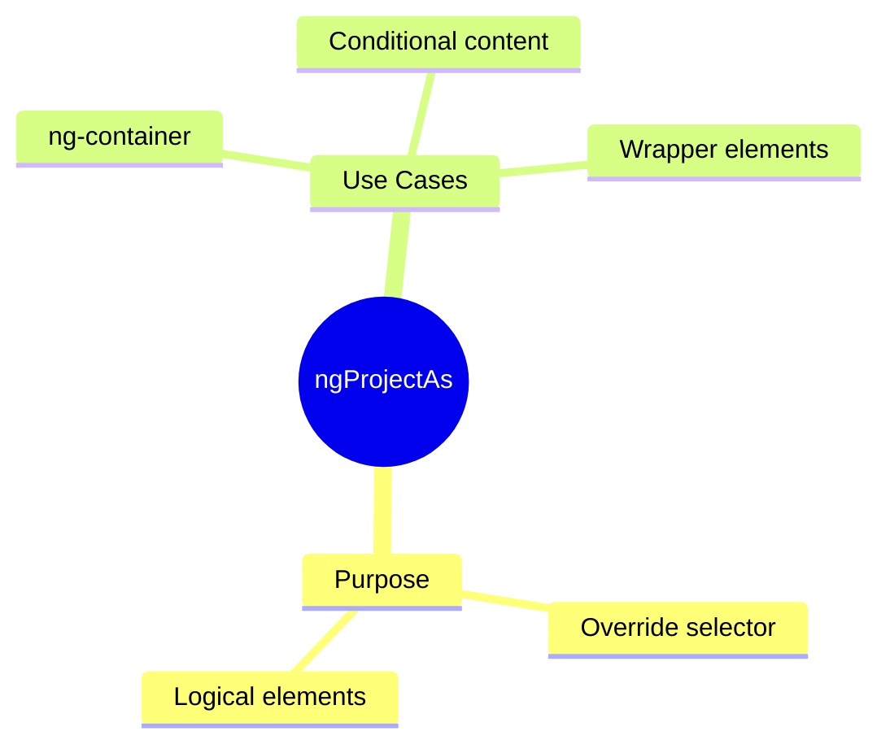

# 🔄 Use Case 3: ngProjectAs

> **💡 Lightbulb Moment**: ngProjectAs lets content pretend to be a different element for slot matching!

---

## 1. 🔍 What is ngProjectAs?

Allows content to match a different selector than its actual type.

```html
<!-- Slot expects [header] attribute -->
<ng-content select="[header]"></ng-content>

<!-- Use ngProjectAs to project ng-container as [header] -->
<app-card>
    <ng-container ngProjectAs="[header]">
        @if (showTitle) { <h2>{{ title }}</h2> }
    </ng-container>
</app-card>
```

---

## 2. 🚀 When to Use

- Project conditional content with *ngIf
- Wrap multiple elements as one slot
- Project ng-container into slots

---

## 3. ❓ Interview Questions

### Basic Questions

#### Q1: Why can't you put [header] on ng-container directly?
**Answer:** ng-container is purely logical - it's removed from DOM. ngProjectAs allows it to participate in content projection matching.

#### Q2: Can you use ngProjectAs on any element?
**Answer:** Yes! It overrides the natural selector for content projection purposes.

---

## 🎭 Costume Party Analogy (Easy to Remember!)

Think of ngProjectAs like **wearing a costume**:

| Concept | Costume Analogy | Memory Trick |
|---------|----------------|--------------| 
| **ngProjectAs** | 🎭 **Costume**: "I'm dressed as a header!" | **"Pretend to be"** |
| **select="[header]"** | 🎟️ **VIP entrance**: "Only headers allowed" | **"Matching rule"** |
| **ng-container** | 👻 **Invisible person**: Exists but no body | **"No DOM element"** |
| **Override selector** | 🥸 **Disguise**: Ninja dressed as chef | **"Change identity"** |

### 📖 Story to Remember:

> 🎭 **The Exclusive Costume Party**
>
> Your component is a party with dress codes:
>
> **The Problem:**
> ```html
> <!-- Party only admits people wearing [header] tag -->
> <ng-content select="[header]"></ng-content>
> 
> <!-- ng-container is invisible - has no costume! -->
> <ng-container>
>   <h1>I want in!</h1>
> </ng-container>
> <!-- ❌ Can't enter! No costume! -->
> ```
>
> **The Solution:**
> ```html
> <!-- Put on a [header] costume! -->
> <ng-container ngProjectAs="[header]">
>   <h1>Now I have a costume!</h1>
> </ng-container>
> <!-- ✅ Can enter! Dressed as header! -->
> ```
>
> **ngProjectAs = putting on a costume to match the dress code!**

### 🎯 Quick Reference:
```
🎭 ngProjectAs      = Wear a costume (match selector)
🎟️ select="[x]"    = Dress code (VIP entrance rule)
👻 ng-container     = Invisible guest (no DOM)
🥸 Override         = Disguise as different type
```

---

## 🧠 Mind Map


