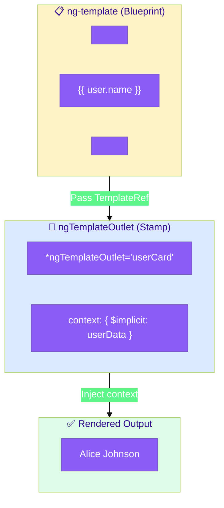
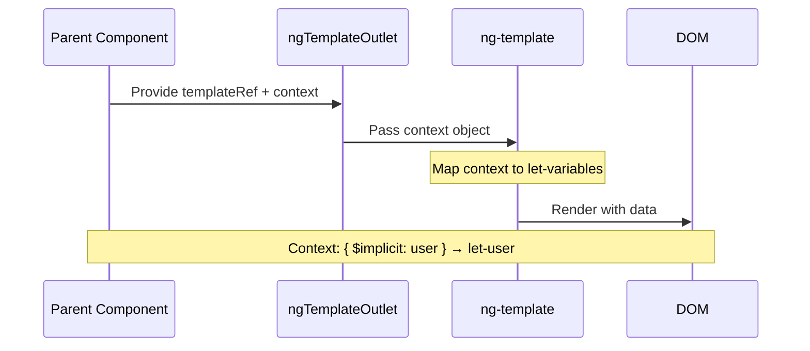
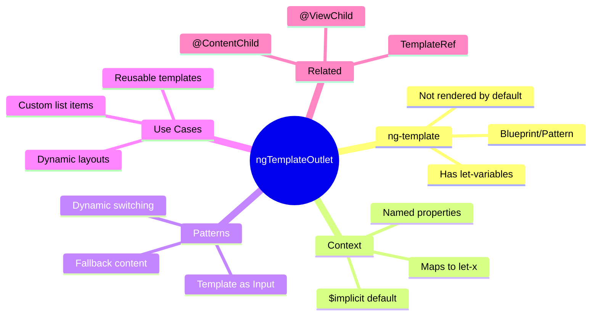

# 📋 Use Case 3: ngTemplateOutlet & Template Context

> **💡 Lightbulb Moment**: ngTemplateOutlet "stamps" a template blueprint wherever you need it, passing custom data via context!

---

## 📑 Index

1. [What Problem Does It Solve?](#1--what-problem-does-it-solve)
2. [How ngTemplateOutlet Works: Deep Dive](#2--how-ngtemplateoutlet-works-deep-dive)
3. [Context Binding Rules](#3--context-binding-rules)
4. [Key Patterns](#4--key-patterns)
5. [Cookie Cutter Analogy](#5--cookie-cutter-analogy)
6. [Mind Map](#6--mind-map)
7. [Interview Questions (20+)](#7--interview-questions-20)

---

## 1. 🔍 What Problem Does It Solve?

### The Problem: Repeated Template Logic

```typescript
// ❌ BAD: Duplicating same template structure everywhere
@Component({
    template: `
        <div class="card">
            <h3>{{ user1.name }}</h3>
            <p>{{ user1.role }}</p>
        </div>
        <div class="card">
            <h3>{{ user2.name }}</h3>
            <p>{{ user2.role }}</p>
        </div>
        <div class="card">
            <h3>{{ user3.name }}</h3>
            <p>{{ user3.role }}</p>
        </div>
        <!-- Repeated 100 times... 😱 -->
    `
})
```

### The Solution: Define Once, Stamp Many Times

```typescript
// ✅ GOOD: Define template once, stamp with different data
@Component({
    template: `
        <!-- 📋 BLUEPRINT: Define once -->
        <ng-template #userCard let-user>
            <div class="card">
                <h3>{{ user.name }}</h3>
                <p>{{ user.role }}</p>
            </div>
        </ng-template>
        
        <!-- 🎯 STAMP: Use many times with different data -->
        <ng-container *ngTemplateOutlet="userCard; context: { $implicit: user1 }"></ng-container>
        <ng-container *ngTemplateOutlet="userCard; context: { $implicit: user2 }"></ng-container>
        <ng-container *ngTemplateOutlet="userCard; context: { $implicit: user3 }"></ng-container>
    `
})
```

---

## 2. 🔗 How ngTemplateOutlet Works: Deep Dive

> [!IMPORTANT]
> `ngTemplateOutlet` takes a **TemplateRef** (blueprint) and renders it at the current location, optionally passing **context data** to the template.

### The Blueprint + Stamp Flow



### Sequence: How Data Flows to Template



### Step-by-Step Breakdown

| Step | What Happens | Code |
|------|-------------|------|
| 1️⃣ Define Blueprint | Create ng-template with variables | `<ng-template #tpl let-item>` |
| 2️⃣ Reference Template | Point ngTemplateOutlet to it | `*ngTemplateOutlet="tpl"` |
| 3️⃣ Pass Context | Provide data for variables | `context: { $implicit: data }` |
| 4️⃣ Map to Variables | $implicit → let-item | Template receives `item` |
| 5️⃣ Render | Template outputs with data | `{{ item.name }}` shows |

---

## 3. 🔑 Context Binding Rules

### How Context Maps to Template Variables

```
┌─────────────────────────────────────────────────────────────────────┐
│  CONTEXT OBJECT                    TEMPLATE DECLARATION             │
│  ─────────────────                 ────────────────────             │
│                                                                     │
│  context: {                        <ng-template                     │
│      $implicit: user,          →      let-user                     │
│      index: 5,                 →      let-i="index"                │
│      isFirst: true             →      let-first="isFirst"          │
│  }                                 >                                │
│                                                                     │
│  $implicit is SPECIAL:                                              │
│    • Maps to ANY let-variable WITHOUT ="..."                        │
│    • Only ONE $implicit per context                                 │
│                                                                     │
│  Named properties:                                                  │
│    • Must match exactly: index → let-x="index"                     │
│    • Can have multiple named properties                             │
└─────────────────────────────────────────────────────────────────────┘
```

### Quick Reference Table

| Context Property | Template Variable | Notes |
|-----------------|-------------------|-------|
| `$implicit: value` | `let-x` | Default/implicit binding |
| `myProp: value` | `let-x="myProp"` | Named binding |
| `index: 5` | `let-i="index"` | Common for loops |
| `first: true` | `let-isFirst="first"` | Loop metadata |

### Code Example

```html
<!-- Template with multiple context variables -->
<ng-template #itemTemplate let-item let-idx="index" let-isLast="last">
    <div [class.last]="isLast">
        {{ idx + 1 }}. {{ item.name }}
    </div>
</ng-template>

<!-- Using the template with context -->
@for (item of items; track item.id; let i = $index; let last = $last) {
    <ng-container *ngTemplateOutlet="itemTemplate; context: {
        $implicit: item,
        index: i,
        last: last
    }"></ng-container>
}
```

---

## 4. 🎯 Key Patterns

### Pattern 1: Dynamic Template Switching

Switch between different templates based on condition:

```typescript
@Component({
    template: `
        <!-- Define multiple templates -->
        <ng-template #listView>📋 List layout...</ng-template>
        <ng-template #gridView>📊 Grid layout...</ng-template>
        <ng-template #cardView>🃏 Card layout...</ng-template>
        
        <!-- Switch based on currentView -->
        <ng-container *ngTemplateOutlet="getTemplate()"></ng-container>
    `
})
export class DemoComponent {
    currentView = 'list';
    
    @ViewChild('listView') listTpl: TemplateRef<any>;
    @ViewChild('gridView') gridTpl: TemplateRef<any>;
    @ViewChild('cardView') cardTpl: TemplateRef<any>;
    
    getTemplate() {
        switch (this.currentView) {
            case 'list': return this.listTpl;
            case 'grid': return this.gridTpl;
            case 'card': return this.cardTpl;
        }
    }
}
```

### Pattern 2: Template as Input (Customizable Components)

Let parent customize how child renders items:

```typescript
// CHILD: Generic list, parent controls appearance
@Component({
    selector: 'app-data-list',
    template: `
        @for (item of items; track item.id) {
            <ng-container *ngTemplateOutlet="itemTemplate; context: { $implicit: item }">
            </ng-container>
        }
    `
})
export class DataListComponent {
    @Input() items: any[] = [];
    @ContentChild('itemTemplate') itemTemplate: TemplateRef<any>;
}

// PARENT: Custom template for each item
<app-data-list [items]="users">
    <ng-template #itemTemplate let-user>
        <div class="my-custom-card">{{ user.name }}</div>
    </ng-template>
</app-data-list>
```

### Pattern 3: Fallback/Default Content

Show default if no template provided:

```typescript
@Component({
    template: `
        @if (customTemplate) {
            <ng-container *ngTemplateOutlet="customTemplate"></ng-container>
        } @else {
            <div class="default">Default content here</div>
        }
    `
})
export class SmartComponent {
    @ContentChild('customTemplate') customTemplate?: TemplateRef<any>;
}
```

---

## 5. 🍪 Cookie Cutter Analogy

Think of ngTemplateOutlet like **baking cookies with cookie cutters**:

| Concept | Cookie Making | Angular |
|---------|--------------|---------|
| **ng-template** | 🍪 **Cookie cutter** (shape) | Blueprint/pattern |
| **ngTemplateOutlet** | 🫳 **Press cutter into dough** | Stamp template |
| **context** | 🎨 **Frosting colors** | Data for each stamp |
| **$implicit** | ⭐ **Default frosting** | Main data variable |
| **named context** | 🔵🔴 **Specific colors** | Additional variables |

### 📖 Story to Remember:

> 🍪 **The Cookie Factory**
>
> You're running a cookie factory:
>
> **Step 1: Make the cookie cutter (ng-template)**
> ```html
> <ng-template #starCookie let-color let-size="size">
>     ⭐ A {{ size }} {{ color }} star cookie!
> </ng-template>
> ```
>
> **Step 2: Stamp cookies (ngTemplateOutlet)**
> ```html
> <!-- Red small star -->
> <ng-container *ngTemplateOutlet="starCookie; context: { 
>     $implicit: 'red', 
>     size: 'small' 
> }"></ng-container>
>
> <!-- Blue large star -->
> <ng-container *ngTemplateOutlet="starCookie; context: { 
>     $implicit: 'blue', 
>     size: 'large' 
> }"></ng-container>
> ```
>
> **Result:**
> ```
> ⭐ A small red star cookie!
> ⭐ A large blue star cookie!
> ```
>
> **Same cutter, different cookies! That's ngTemplateOutlet!**

### 🎯 Quick Reference:
```
🍪 ng-template        = Cookie cutter (reusable shape)
🫳 ngTemplateOutlet   = Press to stamp
🎨 context            = Decoration data
⭐ $implicit          = Default decoration
🔵 named props        = Specific decorations
```

---

## 6. 🧠 Mind Map



---

## 7. ❓ Interview Questions (20+)

### Basic Questions

**Q1: What is ng-template?**
> A: A template element that doesn't render by default. It's a "blueprint" waiting to be instantiated.

**Q2: What is ngTemplateOutlet?**
> A: A directive that renders an ng-template at the current location, optionally with context data.

**Q3: Does ng-template content appear in DOM by default?**
> A: No! ng-template content is NOT rendered until you explicitly use ngTemplateOutlet or structural directives.

**Q4: What is $implicit in context?**
> A: The default value that maps to a `let-variable` (without `="name"`).

**Q5: How do you pass multiple values to a template?**
> A: Use context object: `context: { $implicit: main, extra: other }`

---

### Context Binding Questions

**Q6: Map this context to template variables:**
```typescript
context: { $implicit: user, index: 5, active: true }
```
> A:
> ```html
> <ng-template let-user let-i="index" let-isActive="active">
>     {{ user.name }} #{{ i }} Active: {{ isActive }}
> </ng-template>
> ```

**Q7: Can you have multiple $implicit values?**
> A: No! Only one $implicit per context. Use named properties for additional values.

**Q8: What happens if context property doesn't match template variable?**
> A: The template variable will be undefined.

---

### Pattern Questions

**Q9: How do you accept a template from parent component?**
> A:
> ```typescript
> @ContentChild('myTemplate') customTemplate: TemplateRef<any>;
> ```

**Q10: How do you reference a template in your own component?**
> A:
> ```typescript
> @ViewChild('myTemplate') myTemplate: TemplateRef<any>;
> ```

**Q11: Implement template-based fallback content.**
> A:
> ```html
> @if (customTemplate) {
>     <ng-container *ngTemplateOutlet="customTemplate"></ng-container>
> } @else {
>     <div>Default content</div>
> }
> ```

---

### Dynamic Template Questions

**Q12: Switch between templates based on condition.**
> A:
> ```html
> <ng-container *ngTemplateOutlet="isGrid ? gridTpl : listTpl"></ng-container>
> ```

**Q13: Use template in *ngFor-like loop.**
> A:
> ```html
> @for (item of items; track item.id; let i = $index) {
>     <ng-container *ngTemplateOutlet="itemTpl; context: { $implicit: item, index: i }">
>     </ng-container>
> }
> ```

---

### Comparison Questions

**Q14: ng-template vs ng-container - what's the difference?**
> A:
> - **ng-template**: Blueprint, NOT rendered by default
> - **ng-container**: Grouping element, ALWAYS renders (but invisible in DOM)

**Q15: @ViewChild vs @ContentChild for templates?**
> A:
> - **@ViewChild**: Templates in YOUR component's template
> - **@ContentChild**: Templates PROJECTED from parent

**Q16: ngTemplateOutlet vs *ngIf/*ngFor?**
> A: ngTemplateOutlet gives YOU control over when/where to render. *ngIf/*ngFor are structural directives that use ng-template internally.

---

### Advanced Questions

**Q17: Can you nest ngTemplateOutlet calls?**
> A: Yes! Template can contain another ngTemplateOutlet.

**Q18: How do you type TemplateRef generically?**
> A: `TemplateRef<MyContextType>` where MyContextType defines the context shape.

**Q19: Can you use ngTemplateOutlet without context?**
> A: Yes: `*ngTemplateOutlet="myTemplate"` - no context needed if template doesn't use variables.

**Q20: What's the performance benefit of ng-template?**
> A: Content isn't in DOM until needed. Good for conditionally rendered heavy content.

---

### Scenario Questions

**Q21: Create a customizable table where parent defines cell template.**
> A:
> ```typescript
> // Child
> @ContentChild('cellTemplate') cellTpl: TemplateRef<any>;
> 
> // In child template
> @for (row of data) {
>     @for (cell of row) {
>         <ng-container *ngTemplateOutlet="cellTpl; context: { $implicit: cell }">
>         </ng-container>
>     }
> }
> 
> // Parent usage
> <app-table [data]="myData">
>     <ng-template #cellTemplate let-cell>
>         <td class="custom">{{ cell }}</td>
>     </ng-template>
> </app-table>
> ```

**Q22: Implement view mode switcher (list/grid/card).**
> A: Use @ViewChild for each template, getTemplate() method to return based on current mode, ngTemplateOutlet to render.

