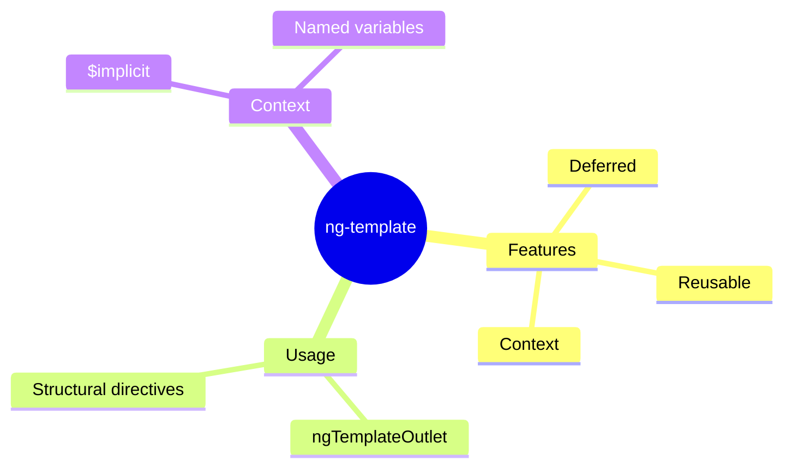

# 📋 Use Case 4: ng-template

> **💡 Lightbulb Moment**: ng-template is content that doesn't render by default - you control WHEN it renders!

---

## 1. 🔍 What is ng-template?

A template that doesn't render until explicitly instantiated.

```html
<!-- Doesn't render by default -->
<ng-template #myTemplate>
    <p>This won't appear until we use it!</p>
</ng-template>

<!-- Use with ngTemplateOutlet -->
<ng-container *ngTemplateOutlet="myTemplate"></ng-container>
```

---

## 2. 🚀 Common Use Cases

### Conditional Templates
```html
<ng-container *ngTemplateOutlet="isLoading ? loadingTpl : contentTpl">
</ng-container>

<ng-template #loadingTpl>Loading...</ng-template>
<ng-template #contentTpl>{{ data }}</ng-template>
```

### Template with Context
```html
<ng-container *ngTemplateOutlet="itemTpl; context: { $implicit: user }">
</ng-container>

<ng-template #itemTpl let-user>
    {{ user.name }}
</ng-template>
```

### 📦 Data Flow Summary (Visual Box Diagram)

```
┌─────────────────────────────────────────────────────────────┐
│  ng-template: DEFERRED RENDERING                            │
│                                                             │
│   TEMPLATE DEFINITION (Doesn't render yet!):                │
│   ┌───────────────────────────────────────────────────────┐ │
│   │ <ng-template #loadingTpl>                             │ │
│   │   <div class="spinner">Loading...</div>               │ │
│   │ </ng-template>                                        │ │
│   │                                                       │ │
│   │ 😴 Just sitting here, invisible, waiting...           │ │
│   └───────────────────────────────────────────────────────┘ │
│                                                             │
│   TRIGGER RENDERING (You decide when):                      │
│   ┌───────────────────────────────────────────────────────┐ │
│   │ <ng-container *ngTemplateOutlet="loadingTpl">         │ │
│   │ </ng-container>                                       │ │
│   │                                                       │ │
│   │ 🎬 "Action! Render the template NOW!"                 │ │
│   └───────────────────────────────────────────────────────┘ │
│                                                             │
│   WITH CONTEXT (Pass data to template):                     │
│   ┌───────────────────────────────────────────────────────┐ │
│   │ *ngTemplateOutlet="userTpl; context: { $implicit: u }"│ │
│   │                                         │             │ │
│   │                                         ▼             │ │
│   │ <ng-template #userTpl let-user>  ← receives 'u'       │ │
│   │   {{ user.name }}                                     │ │
│   │ </ng-template>                                        │ │
│   └───────────────────────────────────────────────────────┘ │
└─────────────────────────────────────────────────────────────┘
```

> **Key Takeaway**: ng-template = "blueprint" that doesn't render until you explicitly use ngTemplateOutlet. Perfect for conditional content!

---

## 3. ❓ Interview Questions

### Basic Questions

#### Q1: ng-template vs ng-container?
**Answer:**
| ng-template | ng-container |
|-------------|--------------|
| Deferred rendering | Immediate rendering |
| Must be triggered | Renders children |
| Template definition | Grouping element |

---

## 🧠 Mind Map


