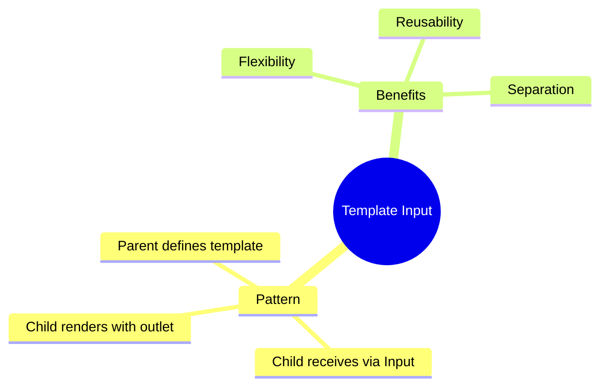

# 📤 Use Case 5: Template as Input

> **💡 Lightbulb Moment**: Pass templates as @Input() for ultimate flexibility in component customization!

---

## 1. 🔍 Template Input Pattern

Child component receives template from parent and renders it.

```typescript
// Child component
@Component({
    template: `
        @for (item of items; track item.id) {
            <ng-container *ngTemplateOutlet="itemTemplate; context: { $implicit: item }">
            </ng-container>
        }
    `
})
export class ListComponent {
    @Input() items: any[] = [];
    @Input() itemTemplate!: TemplateRef<any>;
}

// Parent usage
<app-list [items]="users" [itemTemplate]="userTpl">
</app-list>

<ng-template #userTpl let-user>
    <div class="user-card">{{ user.name }}</div>
</ng-template>
```

---

## 2. 🚀 Benefits

- Parent controls rendering
- Child handles logic/iteration
- Maximum flexibility

---

## 3. ❓ Interview Questions

### Basic Questions

#### Q1: Why use template inputs vs ng-content?
**Answer:**
| Template Input | ng-content |
|----------------|------------|
| Dynamic (can change) | Static |
| Child controls where/when | Parent provides all |
| Good for lists/tables | Good for layout |

---

## 🧠 Mind Map


