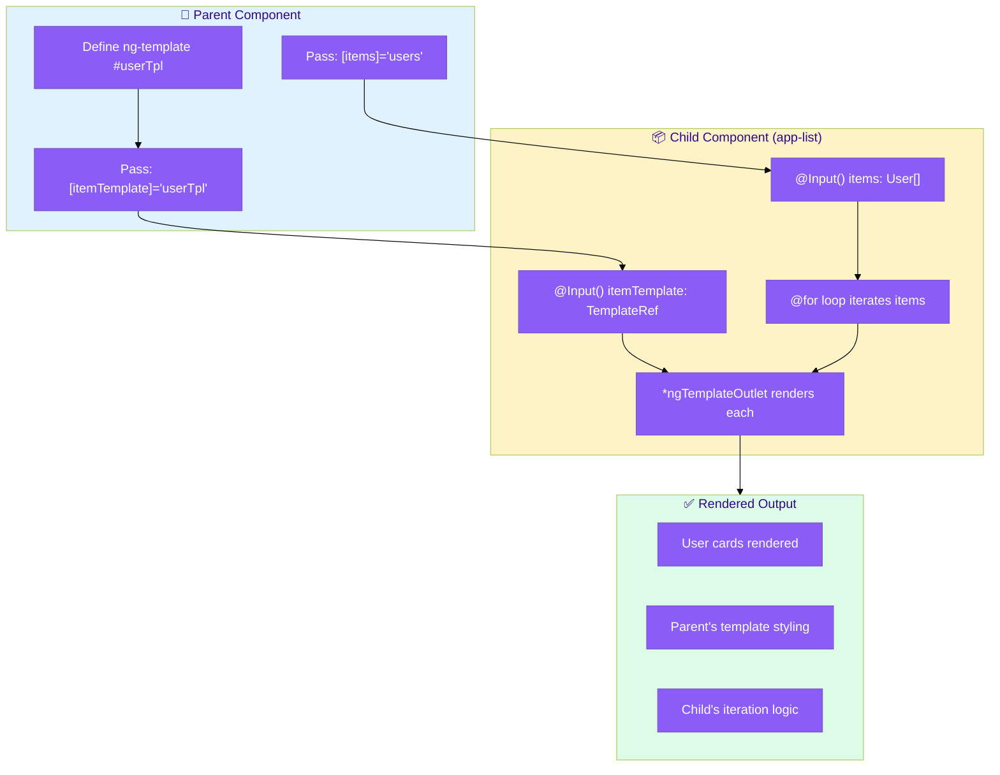
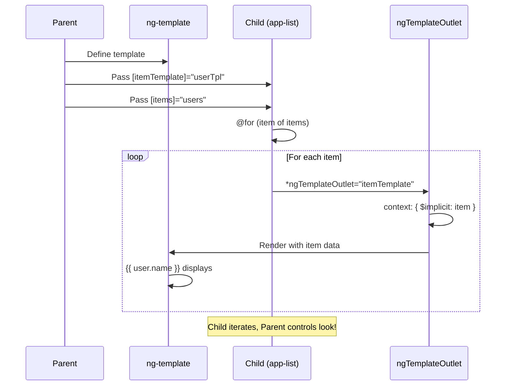
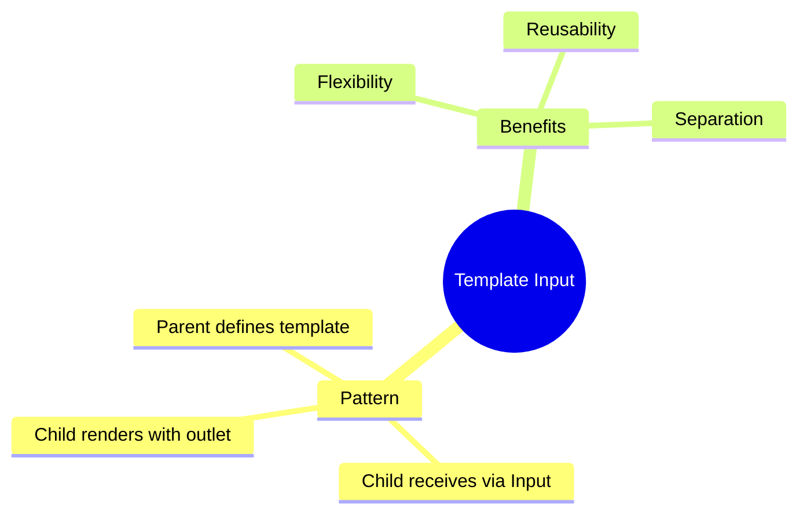

# 📤 Use Case 5: Template as Input

> **💡 Lightbulb Moment**: Pass templates as @Input() for ultimate flexibility in component customization!

---

## 🔗 How Template as Input Works: Deep Dive

> [!IMPORTANT]
> This pattern combines `ng-template` with `@Input()` to let the **parent control presentation** while the **child handles logic**. Perfect for reusable list/table components!

### The Complete Flow



### How Data and Template Flow Together



### Step-by-Step Breakdown

| Step | Parent Does | Child Does |
|------|-------------|------------|
| **1** | Defines `<ng-template #userTpl>` | Declares `@Input() itemTemplate` |
| **2** | Passes `[itemTemplate]="userTpl"` | Receives template reference |
| **3** | Passes `[items]="users"` | `@for` loops through items |
| **4** | Template defines `let-user` | Passes item via `$implicit` |
| **5** | Template renders user card | `ngTemplateOutlet` renders |

### Code Mapping: Complete Implementation

```typescript
// CHILD: Handles iteration logic
@Component({
    selector: 'app-list',
    template: `
        <ul class="list">
            @for (item of items; track item.id) {
                <li>
                    <ng-container *ngTemplateOutlet="itemTemplate; 
                        context: { $implicit: item, index: $index }">
                    </ng-container>
                </li>
            }
        </ul>
    `
})
export class ListComponent {
    @Input() items: any[] = [];
    @Input() itemTemplate!: TemplateRef<any>;  // 👈 Receives template
}
```

```html
<!-- PARENT: Controls presentation -->
<ng-template #userTpl let-user let-i="index">
    <div class="user-card">
        <span class="number">{{ i + 1 }}</span>
        <h3>{{ user.name }}</h3>
        <p>{{ user.email }}</p>
    </div>
</ng-template>

<app-list [items]="users" [itemTemplate]="userTpl"></app-list>
```

### Visual: Two Different Templates, Same Component

```
SAME CHILD COMPONENT, DIFFERENT TEMPLATES:

Template A (Cards):                Template B (Rows):
┌─────────────────┐               ┌─────────────────┐
│ 🎨 User Card    │               │ 📋 Table Row    │
│ ┌─────────────┐ │               │ ┌─────────────┐ │
│ │ 👤 John     │ │               │ │ John | Dev  │ │
│ │ john@e.com  │ │               │ │ jane@e.com  │ │
│ └─────────────┘ │               │ └─────────────┘ │
└─────────────────┘               └─────────────────┘

Both use <app-list> - Parent decides the look!
```

### 🔑 When to Use Each Pattern

| Pattern | Use When |
|---------|----------|
| **ng-content** | Fixed layout slots (header/body/footer) |
| **Template Input** | Dynamic/reusable lists, tables, grids |
| **@ContentChild** | Query projected content |

> [!TIP]
> **Memory Trick**: Think of it like a **print shop contract** 🖨️ - Parent provides the design (template), Child handles the printing (iteration)!

---

## 1. 🔍 Template Input Pattern

Child component receives template from parent and renders it.

```typescript
// Child component
@Component({
    template: `
        @for (item of items; track item.id) {
            <ng-container *ngTemplateOutlet="itemTemplate; context: { $implicit: item }">
            </ng-container>
        }
    `
})
export class ListComponent {
    @Input() items: any[] = [];
    @Input() itemTemplate!: TemplateRef<any>;
}

// Parent usage
<app-list [items]="users" [itemTemplate]="userTpl">
</app-list>

<ng-template #userTpl let-user>
    <div class="user-card">{{ user.name }}</div>
</ng-template>
```

---

## 2. 🚀 Benefits

- Parent controls rendering
- Child handles logic/iteration
- Maximum flexibility

### 📦 Data Flow Summary (Visual Box Diagram)

```
┌─────────────────────────────────────────────────────────────┐
│  TEMPLATE AS INPUT: PARENT → CHILD TEMPLATE PASSING         │
│                                                             │
│   PARENT COMPONENT:                                         │
│   ┌───────────────────────────────────────────────────────┐ │
│   │ <!-- Define how each item should look -->             │ │
│   │ <ng-template #userTpl let-user>                       │ │
│   │   <div class="user-card">                             │ │
│   │     <h3>{{ user.name }}</h3>                          │ │
│   │     <p>{{ user.email }}</p>                           │ │
│   │   </div>                                              │ │
│   │ </ng-template>                                        │ │
│   │                                                       │ │
│   │ <!-- Pass template to child component -->             │ │
│   │ <app-list [items]="users" [itemTemplate]="userTpl">   │ │
│   │ </app-list>                                           │ │
│   └───────────────────────────────────────────────────────┘ │
│                        │                                    │
│                        │ Template passed as @Input          │
│                        ▼                                    │
│   CHILD COMPONENT (app-list):                               │
│   ┌───────────────────────────────────────────────────────┐ │
│   │ @Input() items: User[] = [];                          │ │
│   │ @Input() itemTemplate!: TemplateRef<any>;             │ │
│   │                                                       │ │
│   │ Template:                                             │ │
│   │ @for (item of items; track item.id) {                 │ │
│   │   <ng-container *ngTemplateOutlet="itemTemplate;      │ │
│   │                  context: { $implicit: item }">       │ │
│   │   </ng-container>                                     │ │
│   │ }                                                     │ │
│   │                                                       │ │
│   │ Child iterates, Parent controls appearance!           │ │
│   └───────────────────────────────────────────────────────┘ │
└─────────────────────────────────────────────────────────────┘
```

> **Key Takeaway**: Template as @Input = separation of concerns. Child handles logic (iteration), Parent controls presentation (template)!

---

## 3. ❓ Interview Questions

### Basic Questions

#### Q1: Why use template inputs vs ng-content?
**Answer:**
| Template Input | ng-content |
|----------------|------------|
| Dynamic (can change) | Static |
| Child controls where/when | Parent provides all |
| Good for lists/tables | Good for layout |

---

## 🧠 Mind Map


