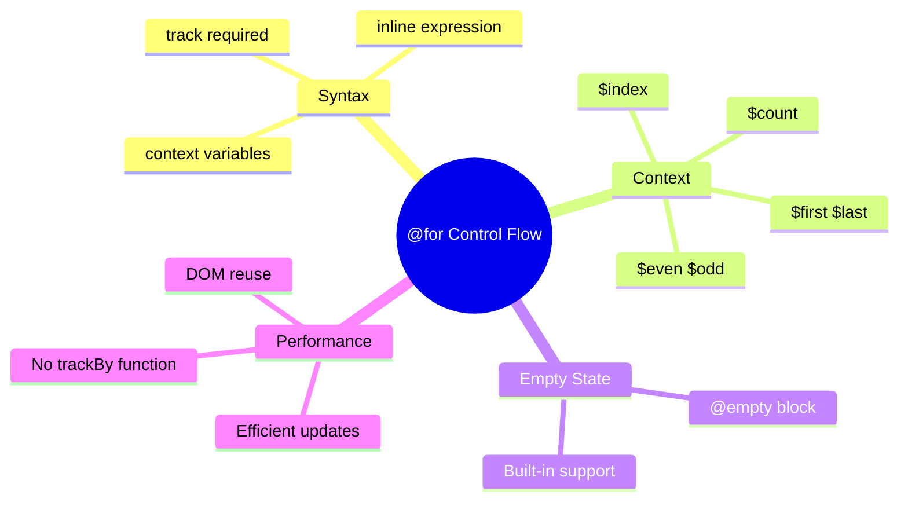

# 🔄 @for Loop Rendering

> **💡 Goal**: Master Angular 17+ built-in control flow for iteration with optimized tracking.


## 📋 Table of Contents
- [🏛️ What Problem Does It Solve?](#what-problem-does-it-solve)
  - [The Old Way (*ngFor)](#the-old-way-ngfor)
  - [The New Way (@for)](#the-new-way-for)
- [🔬 Syntax Reference](#syntax-reference)
  - [Basic @for with track](#basic-for-with-track)
  - [track is REQUIRED](#track-is-required)
  - [Context Variables](#context-variables)
  - [@empty Block](#empty-block)
- [📊 Context Variables Table](#context-variables-table)
- [📦 Visual Comparison](#visual-comparison)
- [🐛 Common Pitfalls](#common-pitfalls)
  - [❌ Pitfall 1: Missing track](#pitfall-1-missing-track)
  - [❌ Pitfall 2: Bad track Expression](#pitfall-2-bad-track-expression)
  - [❌ Pitfall 3: Non-unique Track Values](#pitfall-3-non-unique-track-values)
- [🎯 Real-World Examples](#real-world-examples)
  - [Product Listing](#product-listing)
  - [Table Rows with Zebra Stripes](#table-rows-with-zebra-stripes)
  - [Nested Loops](#nested-loops)
- [❓ Interview Questions](#interview-questions)
  - [Q1: Why is track required in @for?](#q1-why-is-track-required-in-for)
  - [Q2: What should you track by?](#q2-what-should-you-track-by)
  - [Q3: What's the advantage over *ngFor's trackBy?](#q3-whats-the-advantage-over-ngfors-trackby)
  - [Q4: How do you handle empty collections?](#q4-how-do-you-handle-empty-collections)
- [🧠 Mind Map](#mind-map)
- [🎢 Roller Coaster Analogy](#roller-coaster-analogy)
  - [Story:](#story)

---
---

## 🏛️ What Problem Does It Solve?

### The Old Way (*ngFor)
```html
<li *ngFor="let item of items; let i = index; let first = first; trackBy: trackByFn">
  {{ i }}: {{ item.name }}
</li>
```

**Issues:**
- trackBy function required separately
- Verbose syntax for context variables
- No built-in empty state

### The New Way (@for)
```html
@for (item of items; track item.id) {
  <li>{{ $index }}: {{ item.name }}</li>
} @empty {
  <li>No items</li>
}
```

**Benefits:**
- ✅ **Required track** - Forces optimization
- ✅ **Inline expression** - No separate function
- ✅ **Built-in @empty** - Handle empty collections
- ✅ **Implicit context** - $index, $first, $last, etc.

---

## 🔬 Syntax Reference

### Basic @for with track

```html
@for (item of items; track item.id) {
  <div>{{ item.name }}</div>
}
```

### track is REQUIRED

```html
<!-- ✅ Track by unique ID (best) -->
@for (item of items; track item.id) { }

<!-- ✅ Track by item itself (primitives) -->
@for (name of names; track name) { }

<!-- ✅ Track by index (last resort) -->
@for (item of items; track $index) { }
```

### Context Variables

```html
@for (item of items; track item.id; let i = $index, c = $count) {
  <div>
    Item {{ i + 1 }} of {{ c }}
    @if ($first) { (First!) }
    @if ($last) { (Last!) }
  </div>
}
```

### @empty Block

```html
@for (item of items; track item.id) {
  <div>{{ item.name }}</div>
} @empty {
  <div>No items to display</div>
}
```

---

## 📊 Context Variables Table

| Variable | Type | Description |
|----------|------|-------------|
| `$index` | number | 0-based index of current item |
| `$count` | number | Total number of items |
| `$first` | boolean | True if first item |
| `$last` | boolean | True if last item |
| `$even` | boolean | True if index is even |
| `$odd` | boolean | True if index is odd |

---

## 📦 Visual Comparison

```
┌─────────────────────────────────────────────────────────────┐
│  OLD WAY (*ngFor)                                           │
│                                                             │
│  <ul>                                                       │
│    <li *ngFor="let item of items;                          │
│                let i = index;                               │
│                let first = first;                           │
│                let last = last;                             │
│                trackBy: trackByFn">                         │
│      {{ i }}: {{ item.name }}                              │
│    </li>                                                   │
│  </ul>                                                     │
│                                                             │
│  // In component:                                           │
│  trackByFn(index: number, item: Item): number {             │
│    return item.id;                                         │
│  }                                                         │
└─────────────────────────────────────────────────────────────┘

┌─────────────────────────────────────────────────────────────┐
│  NEW WAY (@for)                                             │
│                                                             │
│  <ul>                                                       │
│    @for (item of items; track item.id) {                   │
│      <li>                                                   │
│        {{ $index }}: {{ item.name }}                       │
│        @if ($first) { First! }                             │
│        @if ($last) { Last! }                               │
│      </li>                                                 │
│    } @empty {                                              │
│      <li>No items</li>                                     │
│    }                                                       │
│  </ul>                                                     │
│                                                             │
│  ✅ No trackBy function needed!                             │
│  ✅ Built-in @empty block!                                  │
│  ✅ Implicit context variables!                             │
└─────────────────────────────────────────────────────────────┘
```

---

## 🐛 Common Pitfalls

### ❌ Pitfall 1: Missing track

```html
<!-- ❌ Error - track is required! -->
@for (item of items) {
  <div>{{ item.name }}</div>
}

<!-- ✅ Correct -->
@for (item of items; track item.id) {
  <div>{{ item.name }}</div>
}
```

### ❌ Pitfall 2: Bad track Expression

```html
<!-- ❌ BAD - tracking by index loses DOM reuse benefits -->
@for (item of items; track $index) { }

<!-- ✅ GOOD - track by unique identifier -->
@for (item of items; track item.id) { }
```

### ❌ Pitfall 3: Non-unique Track Values

```html
<!-- ❌ BAD - duplicate names cause issues -->
@for (item of items; track item.name) { }

<!-- ✅ GOOD - IDs are unique -->
@for (item of items; track item.id) { }
```

---

## 🎯 Real-World Examples

### Product Listing

```html
@for (product of products(); track product.id) {
  <app-product-card 
    [product]="product"
    (addToCart)="onAddToCart($event)" />
} @empty {
  <app-empty-state message="No products found" />
}
```

### Table Rows with Zebra Stripes

```html
<tbody>
  @for (row of tableData(); track row.id) {
    <tr [class.even]="$even" [class.odd]="$odd">
      <td>{{ $index + 1 }}</td>
      <td>{{ row.name }}</td>
      <td>{{ row.value }}</td>
    </tr>
  }
</tbody>
```

### Nested Loops

```html
@for (category of categories(); track category.id) {
  <div class="category">
    <h3>{{ category.name }}</h3>
    @for (item of category.items; track item.id) {
      <div class="item">{{ item.name }}</div>
    } @empty {
      <div>No items in this category</div>
    }
  </div>
}
```

---

## ❓ Interview Questions

### Q1: Why is track required in @for?
**A:** Track enables Angular to efficiently update the DOM by identifying which items changed, were added, or removed. Without it, Angular would recreate all DOM elements on every change.

### Q2: What should you track by?
**A:** Track by a unique, stable identifier (usually `id`). Avoid tracking by index unless the list never changes order.

### Q3: What's the advantage over *ngFor's trackBy?
**A:** The track expression is inline and required, eliminating the need for a separate function in the component. It also ensures developers don't forget optimization.

### Q4: How do you handle empty collections?
**A:** Use the @empty block:
```html
@for (item of items; track item.id) {
  ...
} @empty {
  <p>No items</p>
}
```

---

## 🧠 Mind Map



---

## 🎢 Roller Coaster Analogy

| Concept | Roller Coaster | Memory Trick |
|---------|----------------|--------------|
| `@for` | 🎢 The ride | "Loop through items" |
| `track` | 🎫 Seat number | "Unique identifier" |
| `$index` | 📍 Position in line | "Where you are" |
| `$first/$last` | 🚪 Entry/Exit | "Beginning and end" |
| `@empty` | 🚫 Ride closed | "Nothing to loop" |

### Story:
> 🎢 Imagine a roller coaster with numbered seats (**track**). As people get on, they're assigned seats by order (**$index**). The first person gets a special hat (**$first**), the last gets a flag (**$last**). If no one shows up, the ride is closed (**@empty**)!
