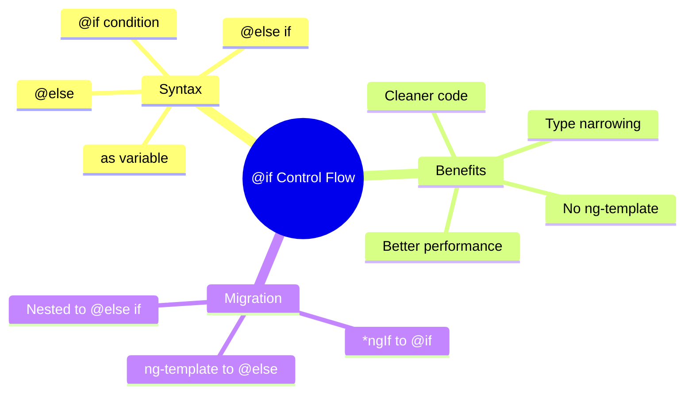

# 🎯 Use Case 1: @if Conditional Rendering

> **💡 Goal**: Master Angular 17+ built-in control flow for conditional rendering.

---

## 🏛️ What Problem Does It Solve?

### The Old Way (*ngIf)
```html
<!-- Required ng-template for else -->
<div *ngIf="isLoggedIn; else loginTmpl">Welcome!</div>
<ng-template #loginTmpl>Please log in</ng-template>

<!-- Confusing syntax for else-if -->
<ng-container *ngIf="status === 'loading'; else checkError">Loading...</ng-container>
<ng-template #checkError>
  <ng-container *ngIf="status === 'error'; else checkSuccess">Error!</ng-container>
</ng-template>
<ng-template #checkSuccess>Success!</ng-template>
```

### The New Way (@if)
```html
@if (isLoggedIn) {
  <div>Welcome!</div>
} @else {
  <div>Please log in</div>
}

@if (status === 'loading') {
  <div>Loading...</div>
} @else if (status === 'error') {
  <div>Error!</div>
} @else {
  <div>Success!</div>
}
```

**Benefits:**
- ✅ Cleaner syntax
- ✅ Built-in else-if support
- ✅ No ng-template needed
- ✅ Better performance (type narrowing)

---

## 🔬 Syntax Reference

### Basic @if

```html
@if (condition) {
  <content-when-true />
}
```

### @if with @else

```html
@if (condition) {
  <content-when-true />
} @else {
  <content-when-false />
}
```

### @if with @else if

```html
@if (conditionA) {
  <content-a />
} @else if (conditionB) {
  <content-b />
} @else if (conditionC) {
  <content-c />
} @else {
  <default-content />
}
```

### @if with Variable Declaration (as)

```html
@if (user(); as u) {
  <div>{{ u.name }} - {{ u.email }}</div>
} @else {
  <div>No user</div>
}
```

---

## 📊 Migration Diagram

```mermaid
flowchart LR
    subgraph Old["Old Syntax"]
        ngIf["*ngIf"]
        ngTemplate["ng-template"]
        ngContainer["ng-container"]
    end
    
    subgraph New["New Syntax"]
        atIf["&#64;if"]
        atElse["&#64;else"]
        atElseIf["&#64;else if"]
    end
    
    ngIf --> atIf
    ngTemplate --> atElse
    ngContainer --> atElseIf
    
    style atIf fill:#22c55e,color:#fff
    style atElse fill:#22c55e,color:#fff
    style atElseIf fill:#22c55e,color:#fff
```



---

## 📦 Visual Comparison

```
┌─────────────────────────────────────────────────────────────┐
│  OLD WAY (*ngIf + ng-template)                              │
│                                                             │
│  <div *ngIf="user; else noUser">                           │
│    Welcome {{ user.name }}!                                │
│  </div>                                                    │
│  <ng-template #noUser>                                     │
│    <div>Please log in</div>                                │
│  </ng-template>                                            │
│                                                             │
│  Problems:                                                  │
│  • Else requires separate ng-template                      │
│  • Template reference needed (#noUser)                     │
│  • No else-if support                                      │
└─────────────────────────────────────────────────────────────┘

┌─────────────────────────────────────────────────────────────┐
│  NEW WAY (@if blocks)                                       │
│                                                             │
│  @if (user; as u) {                                        │
│    <div>Welcome {{ u.name }}!</div>                        │
│  } @else {                                                 │
│    <div>Please log in</div>                                │
│  }                                                         │
│                                                             │
│  Benefits:                                                  │
│  ✅ Inline else block                                       │
│  ✅ Variable declaration with 'as'                          │
│  ✅ Built-in else-if support                                │
│  ✅ Type narrowing in blocks                                │
└─────────────────────────────────────────────────────────────┘
```

---

## 🐛 Common Pitfalls

### ❌ Pitfall 1: Missing Curly Braces

```html
<!-- ❌ Wrong - missing braces -->
@if (condition)
  <div>Content</div>

<!-- ✅ Correct -->
@if (condition) {
  <div>Content</div>
}
```

### ❌ Pitfall 2: Using Old Syntax in New Block

```html
<!-- ❌ Don't mix syntaxes -->
@if (items) {
  <div *ngFor="let item of items">...</div>
}

<!-- ✅ Use new syntax throughout -->
@if (items) {
  @for (item of items; track item.id) {
    <div>...</div>
  }
}
```

### ❌ Pitfall 3: Semicolon After Condition

```html
<!-- ❌ Wrong - no semicolon after condition -->
@if (condition); {
  <div>Content</div>
}

<!-- ✅ Correct -->
@if (condition) {
  <div>Content</div>
}
```

---

## 🎯 Real-World Examples

### Loading States

```html
@if (isLoading()) {
  <app-spinner />
} @else if (error()) {
  <app-error [message]="error()" />
} @else if (data(); as d) {
  <app-content [data]="d" />
} @else {
  <app-empty-state />
}
```

### Authentication

```html
@if (authService.isAuthenticated(); as user) {
  <app-user-menu [user]="user" />
} @else {
  <app-login-button />
}
```

### Feature Flags

```html
@if (featureFlags.isEnabled('new-dashboard')) {
  <app-new-dashboard />
} @else {
  <app-legacy-dashboard />
}
```

---

## ❓ Interview Questions

### Q1: What is the difference between *ngIf and @if?
**A:** `@if` is Angular 17+'s built-in control flow syntax. It's cleaner, has native else-if support, doesn't require ng-template for else blocks, and has better performance due to type narrowing.

### Q2: How do you declare a variable in @if?
**A:** Use the `as` keyword:
```html
@if (observable$ | async; as data) {
  {{ data.value }}
}
```

### Q3: Can you use @if without @else?
**A:** Yes, @else is optional:
```html
@if (showBanner()) {
  <app-banner />
}
```

### Q4: What is type narrowing in @if?
**A:** TypeScript narrows the type inside the block. If you check `if (user)`, TypeScript knows `user` is not null inside the block, providing better type safety.

---

## 🧠 Mind Map



---

## 🚦 Traffic Light Analogy

| Syntax | Traffic Light | Memory Trick |
|--------|---------------|--------------|
| `@if` | 🟢 Green | "Go if true" |
| `@else` | 🔴 Red | "Stop, do this instead" |
| `@else if` | 🟡 Yellow | "Wait, check another condition" |
| `as` | 🏷️ Label | "Name it for easy reference" |

### Story:
> 🚦 Think of @if like a traffic light. **@if** is green - proceed if true. **@else if** is yellow - check another condition. **@else** is red - stop here and do the fallback. The **as** keyword is like putting a label on your lane!
