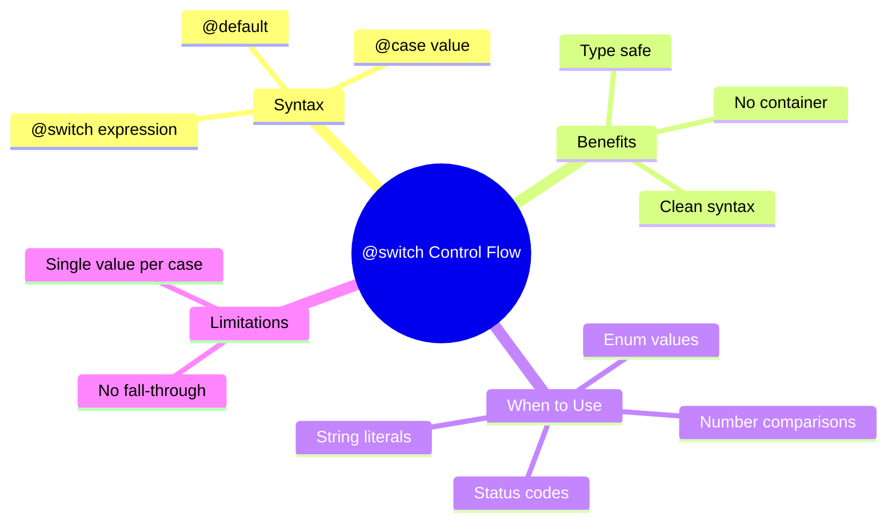

# 🔀 Use Case 3: @switch Multi-Condition

> **💡 Goal**: Master Angular 17+ built-in control flow for switch statements.

---

## 🏛️ What Problem Does It Solve?

### The Old Way (*ngSwitch)
```html
<div [ngSwitch]="status">
  <div *ngSwitchCase="'loading'">Loading...</div>
  <div *ngSwitchCase="'success'">Success!</div>
  <div *ngSwitchCase="'error'">Error!</div>
  <div *ngSwitchDefault>Unknown</div>
</div>
```

**Issues:**
- Requires container element with `[ngSwitch]`
- Verbose directive syntax
- Not type-safe

### The New Way (@switch)
```html
@switch (status) {
  @case ('loading') { <div>Loading...</div> }
  @case ('success') { <div>Success!</div> }
  @case ('error') { <div>Error!</div> }
  @default { <div>Unknown</div> }
}
```

**Benefits:**
- ✅ No container element needed
- ✅ Cleaner syntax
- ✅ Better type checking
- ✅ More readable

---

## 🔬 Syntax Reference

### Basic @switch

```html
@switch (expression) {
  @case (value1) {
    <content-for-value1 />
  }
  @case (value2) {
    <content-for-value2 />
  }
  @default {
    <fallback-content />
  }
}
```

### With Type Literals

```html
@switch (userType) {
  @case ('admin') {
    <admin-dashboard />
  }
  @case ('editor') {
    <editor-panel />
  }
  @case ('viewer') {
    <viewer-panel />
  }
}
```

### With Numbers

```html
@switch (step) {
  @case (1) { <step-one /> }
  @case (2) { <step-two /> }
  @case (3) { <step-three /> }
  @default { <step-complete /> }
}
```

---

## 📊 Comparison Table

| Aspect | Old (*ngSwitch) | New (@switch) |
|--------|----------------|---------------|
| Container | Required `[ngSwitch]` | Not needed |
| Syntax | Directive-based | Block-based |
| Multiple values per case | No | No |
| Fall-through | No | No |
| Default | `*ngSwitchDefault` | `@default` |
| Type safety | Limited | Better |

---

## 📦 Visual Comparison

```
┌─────────────────────────────────────────────────────────────┐
│  OLD WAY (*ngSwitch)                                        │
│                                                             │
│  <div [ngSwitch]="status">                                 │
│    <div *ngSwitchCase="'loading'">                         │
│      Loading...                                            │
│    </div>                                                  │
│    <div *ngSwitchCase="'success'">                         │
│      Success!                                              │
│    </div>                                                  │
│    <div *ngSwitchCase="'error'">                           │
│      Error occurred                                        │
│    </div>                                                  │
│    <div *ngSwitchDefault>                                  │
│      Unknown status                                        │
│    </div>                                                  │
│  </div>                                                    │
│                                                             │
│  Problems:                                                  │
│  • Container element required                              │
│  • Verbose syntax                                          │
│  • Mixed [] and * attributes                               │
└─────────────────────────────────────────────────────────────┘

┌─────────────────────────────────────────────────────────────┐
│  NEW WAY (@switch)                                          │
│                                                             │
│  @switch (status) {                                        │
│    @case ('loading') {                                     │
│      <div>Loading...</div>                                 │
│    }                                                       │
│    @case ('success') {                                     │
│      <div>Success!</div>                                   │
│    }                                                       │
│    @case ('error') {                                       │
│      <div>Error occurred</div>                             │
│    }                                                       │
│    @default {                                              │
│      <div>Unknown status</div>                             │
│    }                                                       │
│  }                                                         │
│                                                             │
│  ✅ No container needed                                     │
│  ✅ Clean block syntax                                      │
│  ✅ Consistent with @if and @for                            │
└─────────────────────────────────────────────────────────────┘
```

---

## 🐛 Common Pitfalls

### ❌ Pitfall 1: Missing Parentheses

```html
<!-- ❌ Wrong - missing parentheses around expression -->
@switch status {
  ...
}

<!-- ✅ Correct -->
@switch (status) {
  ...
}
```

### ❌ Pitfall 2: Wrong Case Syntax

```html
<!-- ❌ Wrong - using quotes incorrectly -->
@case "loading" { ... }

<!-- ✅ Correct - parentheses with quotes -->
@case ('loading') { ... }
```

### ❌ Pitfall 3: Trying Fall-Through

```html
<!-- ❌ Not supported - no fall-through -->
@case ('a')
@case ('b') {
  <div>A or B</div>
}

<!-- ✅ Use @if for multiple conditions -->
@if (value === 'a' || value === 'b') {
  <div>A or B</div>
}
```

---

## 🎯 Real-World Examples

### HTTP Status Display

```html
@switch (httpStatus) {
  @case (200) { <div class="success">✅ OK</div> }
  @case (201) { <div class="success">✅ Created</div> }
  @case (400) { <div class="error">❌ Bad Request</div> }
  @case (401) { <div class="error">🔐 Unauthorized</div> }
  @case (404) { <div class="error">🔍 Not Found</div> }
  @case (500) { <div class="error">💥 Server Error</div> }
  @default { <div class="info">Status: {{ httpStatus }}</div> }
}
```

### Theme Switcher

```html
@switch (theme()) {
  @case ('light') {
    <div class="light-theme">☀️ Light Mode</div>
  }
  @case ('dark') {
    <div class="dark-theme">🌙 Dark Mode</div>
  }
  @case ('system') {
    <div class="system-theme">💻 System Default</div>
  }
}
```

### Wizard Steps

```html
@switch (currentStep()) {
  @case (1) { <app-personal-info (next)="nextStep()" /> }
  @case (2) { <app-address-info (next)="nextStep()" (back)="prevStep()" /> }
  @case (3) { <app-payment-info (next)="nextStep()" (back)="prevStep()" /> }
  @case (4) { <app-review (submit)="onSubmit()" (back)="prevStep()" /> }
  @default { <app-complete /> }
}
```

---

## ❓ Interview Questions

### Q1: When should you use @switch vs @if/@else if?
**A:** Use `@switch` when comparing a single expression against multiple discrete values (like enums or string literals). Use `@if/@else if` for complex boolean conditions or range checks.

### Q2: Does @switch support fall-through like JavaScript switch?
**A:** No, Angular's `@switch` does not support fall-through. Each `@case` is independent. For multiple values mapping to the same output, use `@if` with OR conditions.

### Q3: Is @default required?
**A:** No, `@default` is optional. If no case matches and there's no default, nothing is rendered.

### Q4: Can you use expressions in @case?
**A:** Yes, but the expression is evaluated once and compared strictly (===):
```html
@case (someSignal()) { ... }
@case (1 + 1) { ... }  // evaluates to 2
```

---

## 🧠 Mind Map



---

## 🚂 Train Station Analogy

| Concept | Train Station | Memory Trick |
|---------|---------------|--------------|
| `@switch` | 🚉 Station | "Check destination" |
| `@case` | 🚂 Platform | "Go here if match" |
| `@default` | 🚌 Bus stop | "No train? Take bus" |
| Expression | 🎫 Ticket | "Where are you going?" |

### Story:
> 🚉 You arrive at a train station (**@switch**) with a ticket (**expression**). You check which platform matches your destination. Platform 1 (**@case**) for London, Platform 2 for Paris, Platform 3 for Berlin. If no platform matches, you go to the bus stop (**@default**)!
