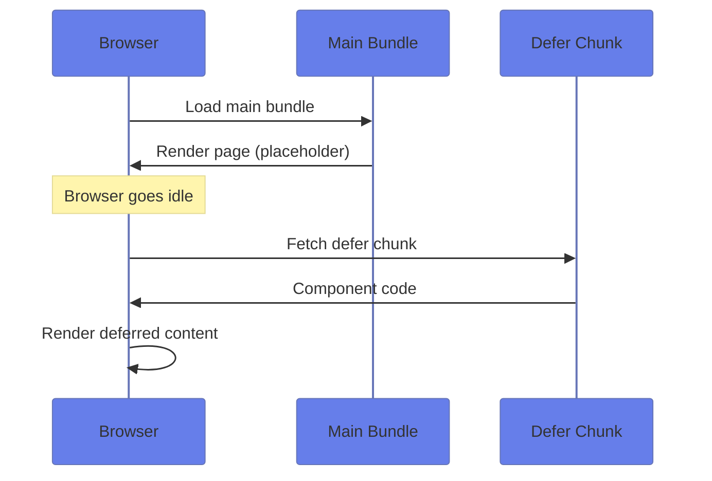
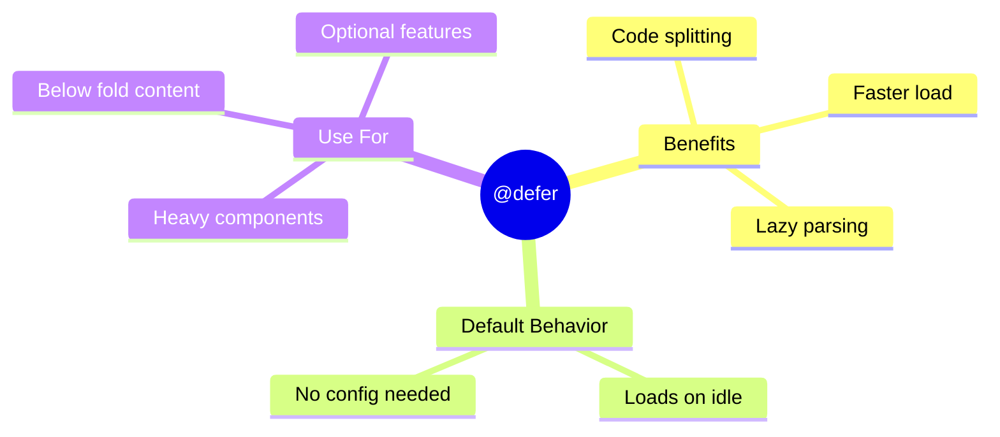

# 📦 Basic @defer

> **💡 Lightbulb Moment**: `@defer` automatically code-splits your template. Heavy components load separately!


## 📋 Table of Contents
- [1. 🔍 How It Works](#1--how-it-works)
- [2. 🚀 Basic Syntax](#2--basic-syntax)
- [3. ⚡ Performance Impact](#3--performance-impact)
  - [📦 Data Flow Summary (Visual Box Diagram)](#data-flow-summary-visual-box-diagram)
- [📺 Netflix Loading Analogy (Easy to Remember!)](#netflix-loading-analogy-easy-to-remember)
  - [📖 Story to Remember:](#story-to-remember)
  - [🎯 Quick Reference:](#quick-reference)
- [🧠 Mind Map](#mind-map)
- [🎯 What Problem Does This Solve?](#what-problem-does-this-solve)
  - [The Problem: Large Initial Bundle](#the-problem-large-initial-bundle)
  - [How @defer Solves This](#how-defer-solves-this)
- [📚 Key Concepts Explained](#key-concepts-explained)
  - [1. Trigger Types](#1-trigger-types)
  - [2. Block Types](#2-block-types)
- [🌍 Real-World Use Cases](#real-world-use-cases)
  - [1. Dashboard with Charts](#1-dashboard-with-charts)
  - [2. Comments Section](#2-comments-section)
  - [3. Modal/Dialog Content](#3-modaldialog-content)
- [❓ Complete Interview Questions (25+)](#complete-interview-questions-25)
  - [Basic Conceptual Questions](#basic-conceptual-questions)
  - [Trigger Questions](#trigger-questions)
  - [Block Questions](#block-questions)
  - [Performance Questions](#performance-questions)
  - [Scenario Questions](#scenario-questions)
  - [Advanced Questions](#advanced-questions)

---
---

## 1. 🔍 How It Works



---

## 2. 🚀 Basic Syntax

```typescript
@defer {
    <heavy-component />
}
```

That's it! Angular automatically:
- Creates a separate JS chunk
- Loads when browser is idle
- Renders once loaded

---

## 3. ⚡ Performance Impact

| Without @defer | With @defer |
|----------------|-------------|
| All code in main bundle | Separate chunks |
| Slower initial load | Faster initial load |
| Everything parsed upfront | Lazy parsed |

---

### 📦 Data Flow Summary (Visual Box Diagram)

```
┌─────────────────────────────────────────────────────────────┐
│  @defer: LAZY LOADING IN TEMPLATE                           │
│                                                             │
│   INITIAL PAGE LOAD:                                        │
│   ┌───────────────────────────────────────────────────────┐ │
│   │ Main Bundle loads (quick!)                            │ │
│   │                                                       │ │
│   │ @defer {                                              │ │
│   │   <heavy-component />  ← NOT loaded yet              │ │
│   │ } @placeholder {                                     │ │
│   │   <p>Loading...</p>    ← Shows THIS instead          │ │
│   │ }                                                     │ │
│   └───────────────────────────────────────────────────────┘ │
│                      │                                      │
│                      │ Browser goes idle...                 │
│                      ▼                                      │
│   LAZY LOAD TRIGGER:                                        │
│   ┌───────────────────────────────────────────────────────┐ │
│   │ on idle        → Load when browser is idle (default)  │ │
│   │ on viewport    → Load when scrolled into view         │ │
│   │ on interaction → Load when user clicks/hovers         │ │
│   │ on timer(2s)   → Load after 2 seconds                 │ │
│   └───────────────────────────────────────────────────────┘ │
│                      │                                      │
│                      │ Separate JS chunk loads              │
│                      ▼                                      │
│   FINAL RENDER:                                             │
│   ┌───────────────────────────────────────────────────────┐ │
│   │ <heavy-component /> ← Now fully rendered! ✅          │ │
│   └───────────────────────────────────────────────────────┘ │
└─────────────────────────────────────────────────────────────┘
```

> **Key Takeaway**: @defer = automatic code-splitting. Show placeholder first, lazy-load heavy content later!

---

## 📺 Netflix Loading Analogy (Easy to Remember!)

Think of @defer like **Netflix streaming**:

| Concept | Netflix Analogy | Memory Trick |
|---------|----------------|--------------| 
| **Main Bundle** | 🎬 **First scene**: Starts playing immediately | **"Show something fast"** |
| **Defer Block** | ⏳ **Rest of episode**: Buffers in background | **"Load while they watch"** |
| **@placeholder** | 🔄 **Loading animation**: "Buffering..." shown first | **"Meanwhile, show this"** |
| **@loading** | ⏱️ **Actually loading**: Fetching the chunks | **"Getting the goods"** |
| **on viewport** | 👀 **You scrolled there**: Load when you're about to see it | **"Just in time"** |

### 📖 Story to Remember:

> 📺 **The Smart TV**
>
> Netflix doesn't load the ENTIRE show before starting:
>
> **Old Way (no defer):**
> ```
> Load entire 2-hour movie
> Wait... wait... wait...
> Finally starts playing after 2 minutes 😴
> ```
>
> **Netflix Way (@defer):**
> ```
> Load first 5 minutes → Start playing IMMEDIATELY! 🎉
> While watching → Buffer rest in background
> Never notice loading → Seamless experience
> ```
>
> **@defer is your app's "smart buffering"!**

### 🎯 Quick Reference:
```
🎬 Main Bundle     = First scene (critical content)
⏳ @defer          = Load later (non-critical content)
🔄 @placeholder    = "Loading..." (shown while waiting)
👀 on viewport     = Load when scrolled into view
⏱️ on timer(2s)    = Load after 2 seconds
🖱️ on interaction  = Load when user clicks
```

---

## 🧠 Mind Map



---

## 🎯 What Problem Does This Solve?

### The Problem: Large Initial Bundle

**Without @defer (BAD):**
```typescript
// All components in one bundle!
@Component({
    template: `
        <header/>
        <hero-section/>
        <heavy-chart-component/>    <!-- 500KB! -->
        <data-table/>               <!-- 300KB! -->
        <comments-section/>         <!-- 200KB! -->
        <footer/>
    `
})
```

**Problems:**
1. **Slow initial load**: 1MB+ bundle before anything renders
2. **Blocks render**: User sees blank screen while parsing
3. **Wasted bandwidth**: Loading below-fold content upfront
4. **Poor Core Web Vitals**: Bad LCP, TTI metrics

### How @defer Solves This

**With @defer (GOOD):**
```typescript
@Component({
    template: `
        <header/>
        <hero-section/>  <!-- Renders immediately! -->
        
        @defer (on viewport) {
            <heavy-chart-component/>  <!-- Loads when visible -->
        } @placeholder {
            <chart-skeleton/>
        }
        
        @defer (on idle) {
            <data-table/>  <!-- Loads when browser is idle -->
        }
    `
})
```

| Problem | @defer Solution |
|---------|----------------|
| Large bundle | **Automatic code-splitting** |
| Slow initial load | **Prioritizes critical content** |
| Wasted bandwidth | **Loads on demand** |
| Blocks render | **Shows placeholder immediately** |

---

## 📚 Key Concepts Explained

### 1. Trigger Types

| Trigger | Syntax | When Loads |
|---------|--------|------------|
| idle | `@defer (on idle)` | Browser is idle (default) |
| viewport | `@defer (on viewport)` | Scrolled into view |
| interaction | `@defer (on interaction)` | User clicks/hovers |
| hover | `@defer (on hover)` | Mouse hovers |
| timer | `@defer (on timer(2s))` | After delay |
| immediate | `@defer (on immediate)` | Right away (still code-split) |

### 2. Block Types

```html
@defer (on viewport) {
    <!-- Main content - rendered when loaded -->
    <heavy-component/>
} @placeholder {
    <!-- Shown before loading starts -->
    <skeleton-loader/>
} @loading (minimum 500ms) {
    <!-- Shown while loading -->
    <spinner/>
} @error {
    <!-- Shown if loading fails -->
    <error-message/>
}
```

---

## 🌍 Real-World Use Cases

### 1. Dashboard with Charts
```html
@defer (on viewport) {
    <analytics-chart [data]="chartData"/>
} @placeholder {
    <div class="chart-skeleton"></div>
}
```

### 2. Comments Section
```html
@defer (on interaction; on timer(5s)) {
    <comments-section [postId]="post.id"/>
} @placeholder {
    <button>Load Comments</button>
}
```

### 3. Modal/Dialog Content
```html
@defer (on interaction) {
    <settings-modal/>
} @placeholder {
    <button>Open Settings</button>
}
```

---

## ❓ Complete Interview Questions (25+)

### Basic Conceptual Questions

**Q1: What is @defer and what problem does it solve?**
> A: @defer is Angular's declarative lazy loading at the template level. It automatically code-splits deferred content into separate chunks, reducing initial bundle size and improving load performance.

**Q2: How does @defer differ from lazy-loaded routes?**
> A: Lazy routes work at the module/route level. @defer works at the component level within a template, giving finer control over what loads when.

**Q3: What happens if no trigger is specified?**
> A: Default is `on idle` - content loads when the browser's main thread is idle.

**Q4: Does @defer work with standalone components?**
> A: Yes! @defer works with both standalone and NgModule-based components.

---

### Trigger Questions

**Q5: Name all available @defer triggers.**
> A: `on idle`, `on viewport`, `on interaction`, `on hover`, `on timer(ms)`, `on immediate`, `when condition`, `prefetch on`.

**Q6: What's the difference between `on viewport` and `on idle`?**
> A: `on viewport` loads when element scrolls into view. `on idle` loads when browser is not busy (regardless of visibility).

**Q7: How do you combine triggers?**
> A: Use semicolons: `@defer (on hover; on timer(3s))` - loads when EITHER triggers first.

**Q8: What does `when` do?**
> A: `when` is a condition-based trigger: `@defer (when showChart)` loads when expression is true.

---

### Block Questions

**Q9: What blocks are available in @defer?**
> A: `@defer` (main), `@placeholder`, `@loading`, `@error`.

**Q10: What's the difference between @placeholder and @loading?**
> A: `@placeholder` shows before loading starts. `@loading` shows during the fetch.

**Q11: How do you ensure loading spinner shows for minimum time?**
> A: `@loading (minimum 500ms)` prevents flicker for fast loads.

**Q12: How do you add a delay before showing loading?**
> A: `@loading (after 200ms)` only shows if loading takes longer than 200ms.

---

### Performance Questions

**Q13: Does @defer reduce total JavaScript downloaded?**
> A: Not total, but it reduces INITIAL load. Deferred code loads later.

**Q14: What's prefetch and when to use it?**
> A: `@defer (prefetch on idle)` pre-fetches during idle but doesn't execute until triggered. Good for predictable user paths.

**Q15: How does @defer affect Core Web Vitals?**
> A: Improves LCP (Largest Contentful Paint) and TTI (Time to Interactive) by deferring non-critical content.

---

### Scenario Questions

**Q16: Lazy-load a chart that's below the fold.**
> A: 
> ```html
> @defer (on viewport) {
>     <chart-component/>
> } @placeholder {
>     <chart-skeleton/>
> }
> ```

**Q17: Load comments when user clicks "Show Comments".**
> A:
> ```html
> @defer (on interaction) {
>     <comments-section/>
> } @placeholder {
>     <button>Show Comments</button>
> }
> ```

**Q18: Preload a modal for faster opening.**
> A:
> ```html
> @defer (on interaction; prefetch on idle) {
>     <settings-modal/>
> } @placeholder {
>     <button>Settings</button>
> }
> ```

**Q19: Show error state if chunk fails to load.**
> A:
> ```html
> @defer {
>     <heavy-component/>
> } @error {
>     <div>Failed to load. <button>Retry</button></div>
> }
> ```

---

### Advanced Questions

**Q20: Can deferred content access parent component data?**
> A: Yes! Deferred blocks have access to their parent component's properties.

**Q21: How does @defer affect change detection?**
> A: Deferred content participates in change detection once loaded.

**Q22: What's the minimum Angular version for @defer?**
> A: Angular 17 introduced @defer as part of the new control flow.

**Q23: Can you nest @defer blocks?**
> A: Yes, you can nest @defer blocks for granular loading.

**Q24: How do you test @defer blocks?**
> A: Use `TestBed.deferBlockBehavior()` to control defer behavior in tests.

**Q25: What's the difference between @defer and dynamic imports?**
> A: @defer is declarative (in template). Dynamic imports are imperative (in TypeScript). @defer handles rendering lifecycle.

