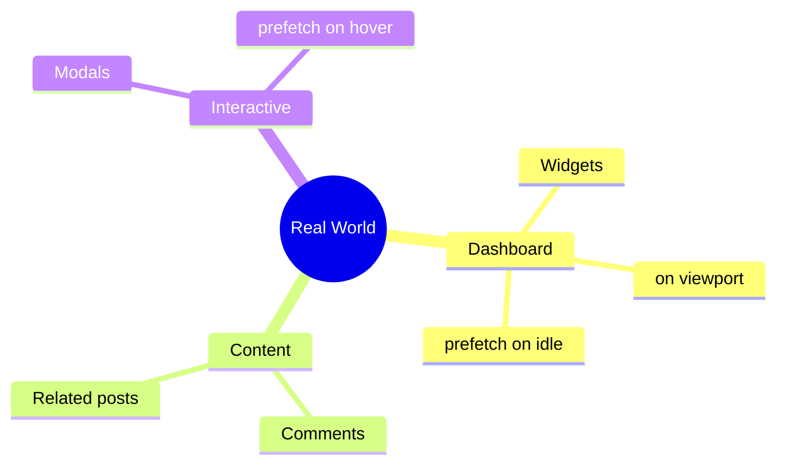

# 🌍 Real-world Patterns

> **💡 Lightbulb Moment**: Combine @defer patterns for production-ready lazy loading!


## 📋 Table of Contents
- [Common Patterns](#common-patterns)
  - [Dashboard Widgets](#dashboard-widgets)
  - [Comments Section](#comments-section)
  - [Heavy Modal](#heavy-modal)
- [Best Practices Checklist](#best-practices-checklist)
  - [📦 Data Flow Summary (Visual Box Diagram)](#data-flow-summary-visual-box-diagram)
- [🧠 Mind Map](#mind-map)

---
---

## Common Patterns

### Dashboard Widgets
```typescript
@defer (on viewport; prefetch on idle) {
    <analytics-widget />
} @placeholder {
    <skeleton-loader />
}
```

### Comments Section
```typescript
@defer (on viewport) {
    <comments [(data)]="comments" />
}
```

### Heavy Modal
```typescript
@defer (on interaction; prefetch on hover) {
    <heavy-modal />
}
```

---

## Best Practices Checklist

- ✅ Use `on viewport` for below-fold
- ✅ Add `prefetch on idle` for likely content  
- ✅ Use `minimum` on @loading (prevent flicker)
- ✅ Provide skeleton @placeholder
- ✅ Handle @error states

---

### 📦 Data Flow Summary (Visual Box Diagram)

```
┌─────────────────────────────────────────────────────────────┐
│  REAL-WORLD @defer PATTERNS                                 │
│                                                             │
│   DASHBOARD PATTERN:                                        │
│   ┌───────────────────────────────────────────────────────┐ │
│   │ @defer (on viewport; prefetch on idle) {              │ │
│   │   <analytics-widget />                                │ │
│   │ } @placeholder { <skeleton-loader /> }                │ │
│   │                                                       │ │
│   │ • Prefetch during idle (likely needed)                │ │
│   │ • Render when scrolled into view                      │ │
│   │ • Show skeleton while loading                         │ │
│   └───────────────────────────────────────────────────────┘ │
│                                                             │
│   MODAL PATTERN:                                            │
│   ┌───────────────────────────────────────────────────────┐ │
│   │ @defer (on interaction; prefetch on hover) {          │ │
│   │   <heavy-modal />                                     │ │
│   │ }                                                     │ │
│   │                                                       │ │
│   │ • Prefetch when user hovers button                    │ │
│   │ • Load fully when they click                          │ │
│   └───────────────────────────────────────────────────────┘ │
│                                                             │
│   COMPLETE EXAMPLE:                                         │
│   ┌───────────────────────────────────────────────────────┐ │
│   │ @defer (on viewport; prefetch on idle) {              │ │
│   │   <comments />                                        │ │
│   │ } @placeholder (minimum 200ms) {                      │ │
│   │   <skeleton />                                        │ │
│   │ } @loading (after 100ms; minimum 500ms) {             │ │
│   │   <spinner />                                         │ │
│   │ } @error {                                            │ │
│   │   <retry-button />                                    │ │
│   │ }                                                     │ │
│   └───────────────────────────────────────────────────────┘ │
└─────────────────────────────────────────────────────────────┘
```

> **Key Takeaway**: Combine trigger + prefetch + loading states for production-ready lazy loading!

---

## 🧠 Mind Map


