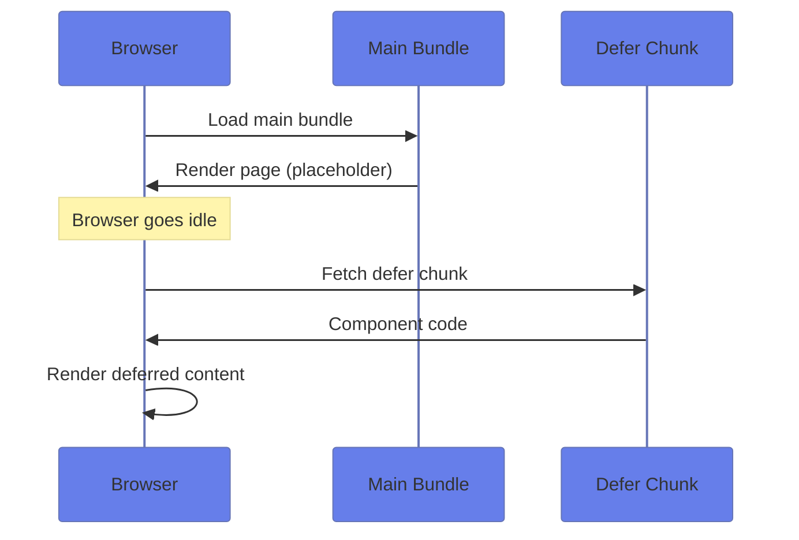
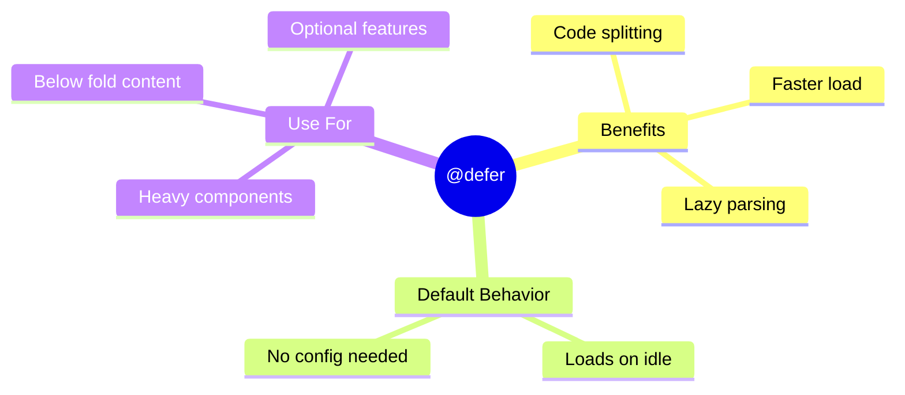

# 📦 Use Case 1: Basic @defer

> **💡 Lightbulb Moment**: `@defer` automatically code-splits your template. Heavy components load separately!

---

## 1. 🔍 How It Works



---

## 2. 🚀 Basic Syntax

```typescript
@defer {
    <heavy-component />
}
```

That's it! Angular automatically:
- Creates a separate JS chunk
- Loads when browser is idle
- Renders once loaded

---

## 3. ⚡ Performance Impact

| Without @defer | With @defer |
|----------------|-------------|
| All code in main bundle | Separate chunks |
| Slower initial load | Faster initial load |
| Everything parsed upfront | Lazy parsed |

---

## 🧠 Mind Map


