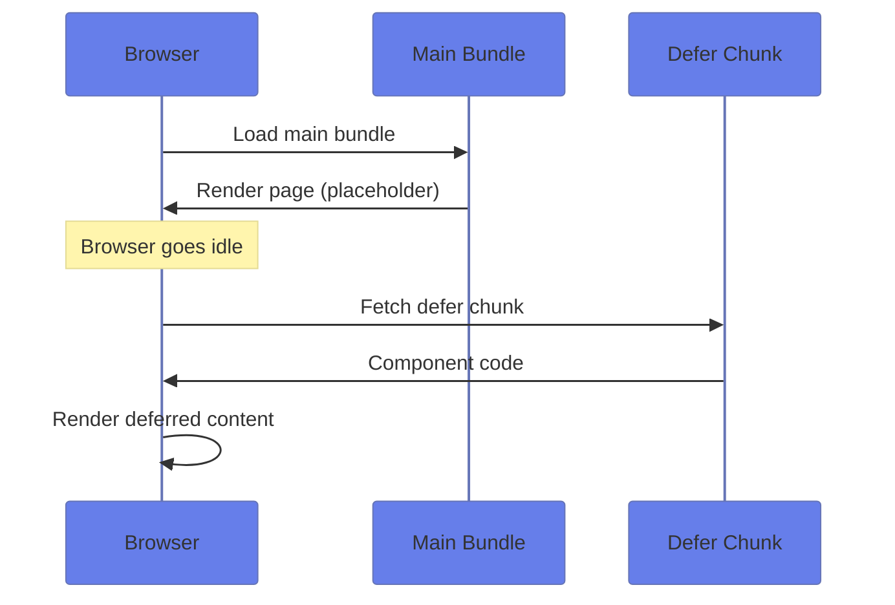
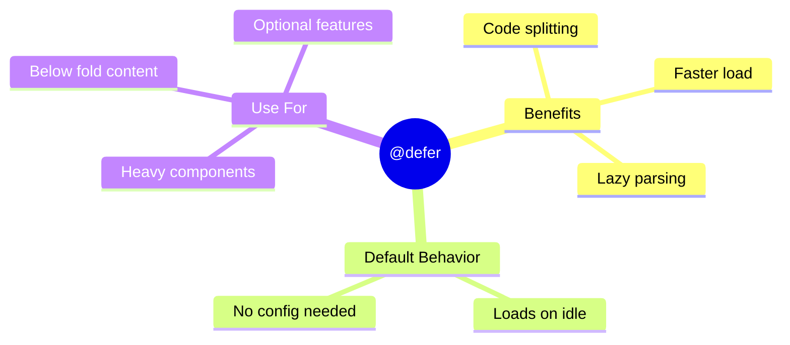

# 📦 Use Case 1: Basic @defer

> **💡 Lightbulb Moment**: `@defer` automatically code-splits your template. Heavy components load separately!

---

## 1. 🔍 How It Works



---

## 2. 🚀 Basic Syntax

```typescript
@defer {
    <heavy-component />
}
```

That's it! Angular automatically:
- Creates a separate JS chunk
- Loads when browser is idle
- Renders once loaded

---

## 3. ⚡ Performance Impact

| Without @defer | With @defer |
|----------------|-------------|
| All code in main bundle | Separate chunks |
| Slower initial load | Faster initial load |
| Everything parsed upfront | Lazy parsed |

---

### 📦 Data Flow Summary (Visual Box Diagram)

```
┌─────────────────────────────────────────────────────────────┐
│  @defer: LAZY LOADING IN TEMPLATE                           │
│                                                             │
│   INITIAL PAGE LOAD:                                        │
│   ┌───────────────────────────────────────────────────────┐ │
│   │ Main Bundle loads (quick!)                            │ │
│   │                                                       │ │
│   │ @defer {                                              │ │
│   │   <heavy-component />  ← NOT loaded yet              │ │
│   │ } @placeholder {                                     │ │
│   │   <p>Loading...</p>    ← Shows THIS instead          │ │
│   │ }                                                     │ │
│   └───────────────────────────────────────────────────────┘ │
│                      │                                      │
│                      │ Browser goes idle...                 │
│                      ▼                                      │
│   LAZY LOAD TRIGGER:                                        │
│   ┌───────────────────────────────────────────────────────┐ │
│   │ on idle        → Load when browser is idle (default)  │ │
│   │ on viewport    → Load when scrolled into view         │ │
│   │ on interaction → Load when user clicks/hovers         │ │
│   │ on timer(2s)   → Load after 2 seconds                 │ │
│   └───────────────────────────────────────────────────────┘ │
│                      │                                      │
│                      │ Separate JS chunk loads              │
│                      ▼                                      │
│   FINAL RENDER:                                             │
│   ┌───────────────────────────────────────────────────────┐ │
│   │ <heavy-component /> ← Now fully rendered! ✅          │ │
│   └───────────────────────────────────────────────────────┘ │
└─────────────────────────────────────────────────────────────┘
```

> **Key Takeaway**: @defer = automatic code-splitting. Show placeholder first, lazy-load heavy content later!

---

## 📺 Netflix Loading Analogy (Easy to Remember!)

Think of @defer like **Netflix streaming**:

| Concept | Netflix Analogy | Memory Trick |
|---------|----------------|--------------| 
| **Main Bundle** | 🎬 **First scene**: Starts playing immediately | **"Show something fast"** |
| **Defer Block** | ⏳ **Rest of episode**: Buffers in background | **"Load while they watch"** |
| **@placeholder** | 🔄 **Loading animation**: "Buffering..." shown first | **"Meanwhile, show this"** |
| **@loading** | ⏱️ **Actually loading**: Fetching the chunks | **"Getting the goods"** |
| **on viewport** | 👀 **You scrolled there**: Load when you're about to see it | **"Just in time"** |

### 📖 Story to Remember:

> 📺 **The Smart TV**
>
> Netflix doesn't load the ENTIRE show before starting:
>
> **Old Way (no defer):**
> ```
> Load entire 2-hour movie
> Wait... wait... wait...
> Finally starts playing after 2 minutes 😴
> ```
>
> **Netflix Way (@defer):**
> ```
> Load first 5 minutes → Start playing IMMEDIATELY! 🎉
> While watching → Buffer rest in background
> Never notice loading → Seamless experience
> ```
>
> **@defer is your app's "smart buffering"!**

### 🎯 Quick Reference:
```
🎬 Main Bundle     = First scene (critical content)
⏳ @defer          = Load later (non-critical content)
🔄 @placeholder    = "Loading..." (shown while waiting)
👀 on viewport     = Load when scrolled into view
⏱️ on timer(2s)    = Load after 2 seconds
🖱️ on interaction  = Load when user clicks
```

---

## 🧠 Mind Map


