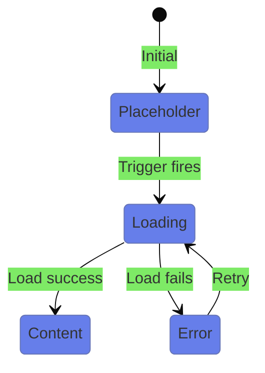
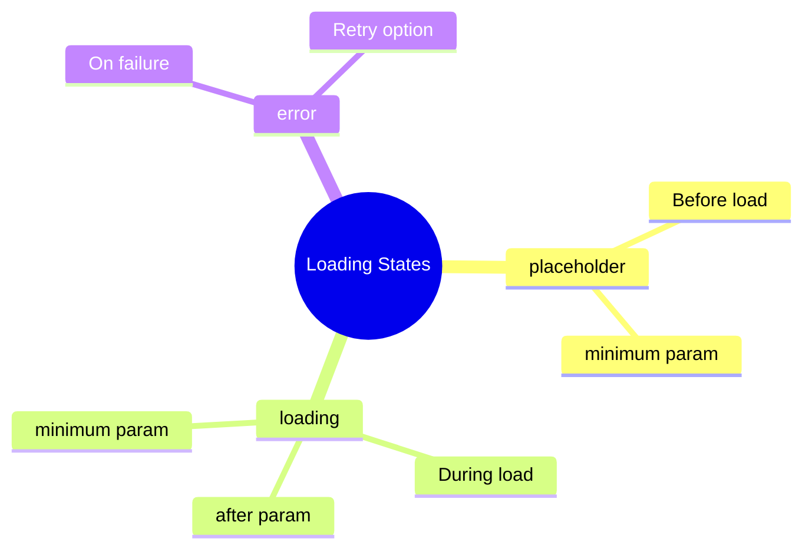

# ⏳ Use Case 2: Loading States

> **💡 Lightbulb Moment**: Use `@placeholder`, `@loading`, and `@error` to provide smooth UX during content loading!

---

## 1. 📊 State Flow



---

## 2. Block Reference

| Block | Purpose | Timing |
|-------|---------|--------|
| `@placeholder` | Before loading starts | `minimum` |
| `@loading` | During loading | `after`, `minimum` |
| `@error` | If loading fails | - |

---

## 3. Timing Parameters

```typescript
// Prevent flickering
@loading (minimum 500ms) { ... }

// Don't show for fast loads
@loading (after 100ms) { ... }

// Both combined
@loading (after 100ms; minimum 500ms) { ... }
```

---

### 📦 Data Flow Summary (Visual Box Diagram)

```
┌─────────────────────────────────────────────────────────────┐
│  @defer LOADING STATES: THE USER EXPERIENCE                 │
│                                                             │
│   STATE FLOW:                                               │
│   ┌───────────────────────────────────────────────────────┐ │
│   │ ① @placeholder                                        │ │
│   │    "Content will appear here soon..."                 │ │
│   │    (minimum 2s) ← Shown for at least 2 seconds        │ │
│   └───────────────────────────────────────────────────────┘ │
│                      │                                      │
│                      │ Trigger fires (on viewport, etc.)    │
│                      ▼                                      │
│   ┌───────────────────────────────────────────────────────┐ │
│   │ ② @loading (after 100ms; minimum 500ms)               │ │
│   │    <spinner />                                        │ │
│   │                                                       │ │
│   │    after 100ms  → Don't show for fast loads           │ │
│   │    minimum 500ms → Once shown, show at least 500ms    │ │
│   └───────────────────────────────────────────────────────┘ │
│                      │                                      │
│           ┌──────────┴──────────┐                           │
│           ▼                     ▼                           │
│   ┌─────────────────────┐ ┌───────────────────────────────┐ │
│   │ ③ SUCCESS           │ │ ③ @error                      │ │
│   │ <actual-component/> │ │ "Failed to load. Retry?"      │ │
│   │ ✅ Content displays │ │ ❌ Handle gracefully           │ │
│   └─────────────────────┘ └───────────────────────────────┘ │
└─────────────────────────────────────────────────────────────┘
```

> **Key Takeaway**: Use `after` to skip spinners for fast loads, `minimum` to prevent flickering. Handle errors gracefully!

---

## 🛗 Elevator Analogy (Easy to Remember!)

Think of loading states like **waiting for an elevator**:

| Block | Elevator Analogy | Memory Trick |
|-------|------------------|--------------| 
| **@placeholder** | 🚶 **Waiting area**: "Stand here until elevator arrives" | **"What to show initially"** |
| **@loading** | ⏳ **Doors opening animation**: "Elevator arriving..." | **"What to show while loading"** |
| **@error** | ❌ **Out of order sign**: "Elevator broken!" | **"What to show on failure"** |
| **minimum** | ⏱️ **"Hold doors"**: Keep doors open at least 2 seconds | **"Prevent flicker"** |
| **after** | ⏰ **"Don't rush"**: Only show spinner after 100ms | **"Skip for fast loads"** |

### 📖 Story to Remember:

> 🛗 **The Smart Elevator**
>
> You're building an elevator experience for users:
>
> **The Waiting Experience:**
> ```html
> @defer (on viewport) {
>   <heavy-component />
> } 
> @placeholder {
>   <!-- Waiting area with "Please wait" sign -->
>   <p>Content loading soon...</p>
> }
> @loading (after 100ms; minimum 500ms) {
>   <!-- Show spinner, but not for fast rides! -->
>   <spinner />
> }
> @error {
>   <!-- Elevator broken! -->
>   <p>Failed to load. Try again?</p>
> }
> ```
>
> **Why timing matters:**
> ```
> Fast load (< 100ms)  → Skip spinner! Goes straight to content ⚡
> Medium load          → Show spinner for at least 500ms (no flicker)
> Failed load          → Show error with retry option ❌
> ```

### 🎯 Quick Reference:
```
🚶 @placeholder  = Waiting area (before loading starts)
⏳ @loading      = "Elevator arriving" spinner
❌ @error        = Out of order sign
⏱️ minimum       = Keep showing at least X time
⏰ after         = Only show after waiting X time
```

---

## 🧠 Mind Map



---

## ❓ Complete Interview Questions (20+)

### Block Questions

**Q1: What's the difference between @placeholder and @loading?**
> A: @placeholder shows before loading starts; @loading shows during active loading.

**Q2: When is @error block shown?**
> A: When the chunk fails to load (network error, 404, etc.).

**Q3: Are all blocks required?**
> A: No, only @defer is required. Others are optional.

**Q4: What's the default if no @placeholder is provided?**
> A: Nothing shows until content loads.

---

### Timing Questions

**Q5: What does `minimum` parameter do?**
> A: Ensures the block shows for at least that duration (prevents flicker).

**Q6: What does `after` parameter do?**
> A: Delays showing the block until after specified time (skips fast loads).

**Q7: Can you combine `after` and `minimum`?**
> A: Yes: `@loading (after 100ms; minimum 500ms)`.

**Q8: Why use `after 100ms`?**
> A: Prevents brief spinner flash for fast loads.

---

### UX Questions

**Q9: How do you prevent loading spinner flicker?**
> A: Use `@loading (minimum 500ms)` to show for at least 500ms.

**Q10: How do you handle retry on error?**
> A: Add a button in @error block that triggers reload.

**Q11: What makes a good placeholder?**
> A: Skeleton UI matching content shape, not just spinners.

**Q12: When to use placeholder vs loading?**
> A: Placeholder for waiting; loading for active fetch indicator.

---

### Scenario Questions

**Q13: Show skeleton loader before load, spinner during load.**
> A:
> ```html
> @defer {  } 
> @placeholder { <skeleton/> } 
> @loading { <spinner/> }
> ```

**Q14: Show spinner only if loading takes more than 200ms.**
> A: `@loading (after 200ms) { <spinner/> }`

**Q15: Show error with retry button.**
> A:
> ```html
> @error { 
>   <button (click)="reload()">Retry</button> 
> }
> ```

**Q16: Keep placeholder for at least 1 second.**
> A: `@placeholder (minimum 1s) { ... }`

---

### Advanced Questions

**Q17: Can @placeholder contain interactive elements?**
> A: Yes, it's regular Angular template content.

**Q18: Does @loading have access to load progress?**
> A: No, it's just a state indicator. Use custom loading for progress.

**Q19: What happens on slow network?**
> A: @loading shows until complete or error occurs.

**Q20: Can you nest @defer inside @error for retry?**
> A: No, but you can trigger component reload via method.

