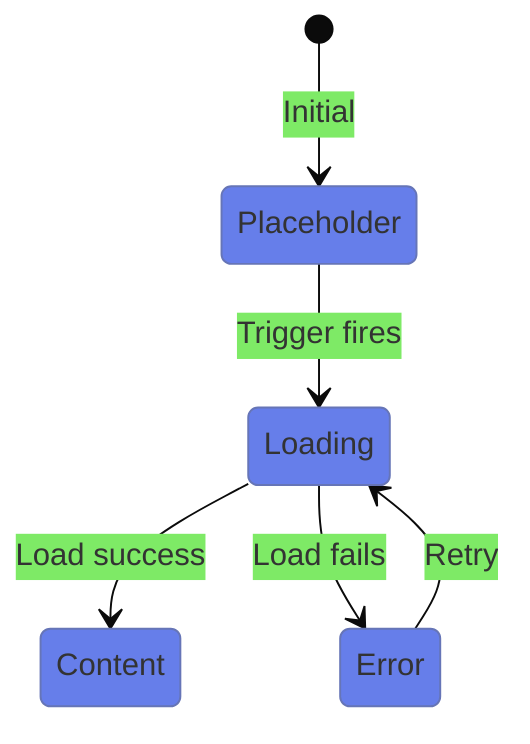
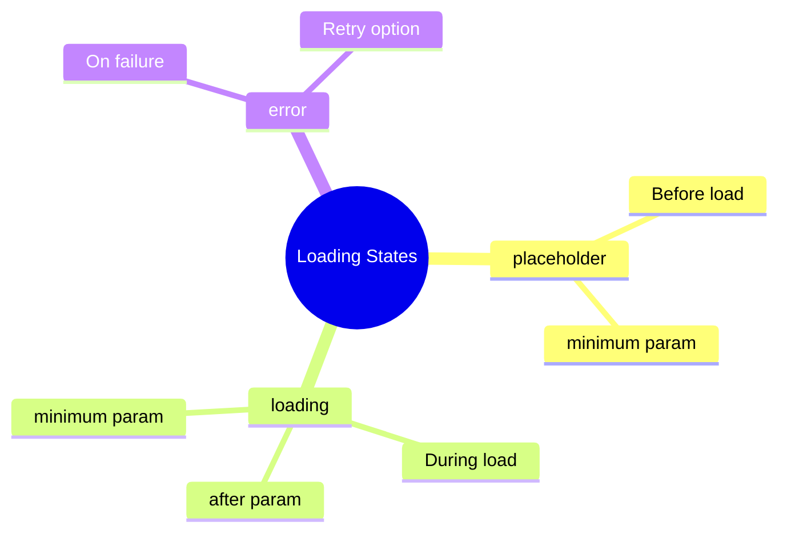

# ⏳ Use Case 2: Loading States

> **💡 Lightbulb Moment**: Use `@placeholder`, `@loading`, and `@error` to provide smooth UX during content loading!

---

## 1. 📊 State Flow



---

## 2. Block Reference

| Block | Purpose | Timing |
|-------|---------|--------|
| `@placeholder` | Before loading starts | `minimum` |
| `@loading` | During loading | `after`, `minimum` |
| `@error` | If loading fails | - |

---

## 3. Timing Parameters

```typescript
// Prevent flickering
@loading (minimum 500ms) { ... }

// Don't show for fast loads
@loading (after 100ms) { ... }

// Both combined
@loading (after 100ms; minimum 500ms) { ... }
```

---

## 🛗 Elevator Analogy (Easy to Remember!)

Think of loading states like **waiting for an elevator**:

| Block | Elevator Analogy | Memory Trick |
|-------|------------------|--------------| 
| **@placeholder** | 🚶 **Waiting area**: "Stand here until elevator arrives" | **"What to show initially"** |
| **@loading** | ⏳ **Doors opening animation**: "Elevator arriving..." | **"What to show while loading"** |
| **@error** | ❌ **Out of order sign**: "Elevator broken!" | **"What to show on failure"** |
| **minimum** | ⏱️ **"Hold doors"**: Keep doors open at least 2 seconds | **"Prevent flicker"** |
| **after** | ⏰ **"Don't rush"**: Only show spinner after 100ms | **"Skip for fast loads"** |

### 📖 Story to Remember:

> 🛗 **The Smart Elevator**
>
> You're building an elevator experience for users:
>
> **The Waiting Experience:**
> ```html
> @defer (on viewport) {
>   <heavy-component />
> } 
> @placeholder {
>   <!-- Waiting area with "Please wait" sign -->
>   <p>Content loading soon...</p>
> }
> @loading (after 100ms; minimum 500ms) {
>   <!-- Show spinner, but not for fast rides! -->
>   <spinner />
> }
> @error {
>   <!-- Elevator broken! -->
>   <p>Failed to load. Try again?</p>
> }
> ```
>
> **Why timing matters:**
> ```
> Fast load (< 100ms)  → Skip spinner! Goes straight to content ⚡
> Medium load          → Show spinner for at least 500ms (no flicker)
> Failed load          → Show error with retry option ❌
> ```

### 🎯 Quick Reference:
```
🚶 @placeholder  = Waiting area (before loading starts)
⏳ @loading      = "Elevator arriving" spinner
❌ @error        = Out of order sign
⏱️ minimum       = Keep showing at least X time
⏰ after         = Only show after waiting X time
```

---

## 🧠 Mind Map


