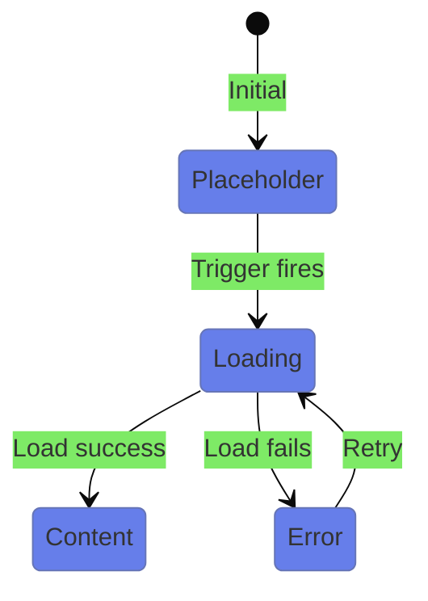
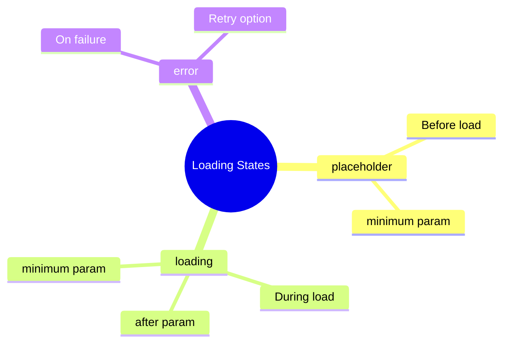

# ⏳ Use Case 2: Loading States

> **💡 Lightbulb Moment**: Use `@placeholder`, `@loading`, and `@error` to provide smooth UX during content loading!

---

## 1. 📊 State Flow



---

## 2. Block Reference

| Block | Purpose | Timing |
|-------|---------|--------|
| `@placeholder` | Before loading starts | `minimum` |
| `@loading` | During loading | `after`, `minimum` |
| `@error` | If loading fails | - |

---

## 3. Timing Parameters

```typescript
// Prevent flickering
@loading (minimum 500ms) { ... }

// Don't show for fast loads
@loading (after 100ms) { ... }

// Both combined
@loading (after 100ms; minimum 500ms) { ... }
```

---

## 🧠 Mind Map


