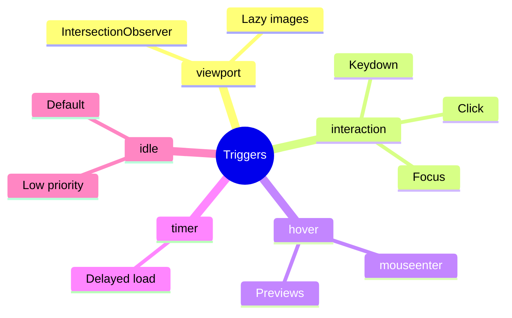

# 🎯 Use Case 3: Trigger Conditions

> **💡 Lightbulb Moment**: Different triggers for different needs - `on viewport` for lazy images, `on hover` for previews!

---

## Trigger Types

| Trigger | API | Best For |
|---------|-----|----------|
| `on viewport` | IntersectionObserver | Below-fold content |
| `on interaction` | click/focus/keydown | Expandable panels |
| `on hover` | mouseenter | Tooltips, previews |
| `on idle` | requestIdleCallback | Default (low priority) |
| `on timer(Xms)` | setTimeout | Delayed loading |
| `on immediate` | None | Code split only |

---

## Syntax Examples

```typescript
// Viewport
@defer (on viewport) { ... }

// Interaction with reference
@defer (on interaction(myButton)) { ... }

// Timer
@defer (on timer(2s)) { ... }

// Multiple triggers
@defer (on hover; on timer(5s)) { ... }
```

---

## 🧠 Mind Map


